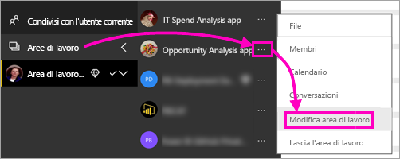
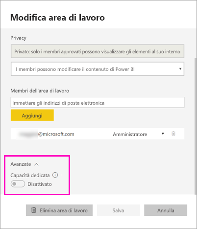
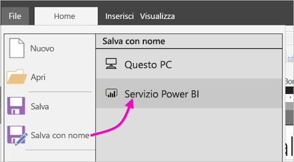
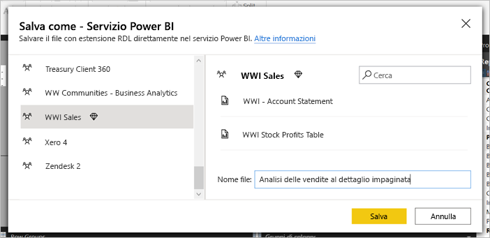
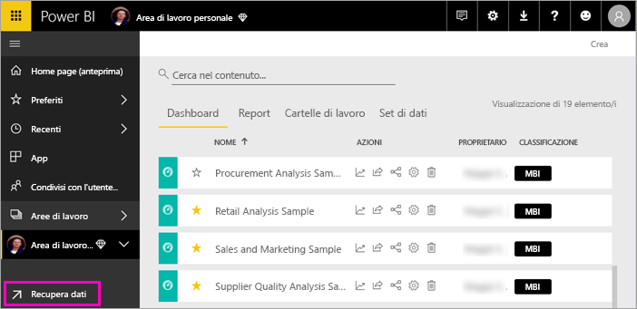
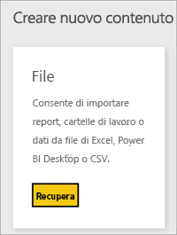
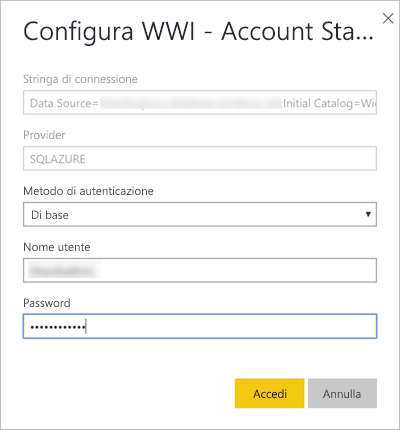

# Pubblicare un report impaginato nel servizio Power BI

Questo articolo illustra come pubblicare un report impaginato nel servizio Power BI caricandolo dal computer locale. È possibile caricare report impaginati nell'Area di lavoro personale o in qualsiasi altra area di lavoro se l'area di lavoro è assegnata a una capacità Premium. Cercare l'icona a forma di diamante  accanto al nome dell'area di lavoro. 

Se l'origine dati del report è in locale, è necessario creare un gateway dopo aver caricato il report. Vedere la sezione [Creare un gateway](#create-a-gateway) più avanti in questo articolo.

## Aggiungere un'area di lavoro a una capacità Premium

Se accanto al nome dell'area di lavoro non è presente l'icona a forma di diamante  , è necessario aggiungere l'area di lavoro a una capacità Premium. 

1. Selezionare **Aree di lavoro**, selezionare i puntini di sospensione ( **...** ) accanto al nome dell'area di lavoro e quindi scegliere **Modifica area di lavoro**.

    

1. Nella finestra di dialogo **Modifica area di lavoro** espandere **Avanzate** e quindi far scorrere **Capacità dedicata** su **On**.

    

   È possibile che questa impostazione non sia modificabile. In questo caso, contattare l'amministratore delle capacità di Power BI Premium per ottenere i diritti di assegnazione necessari per poter aggiungere l'area di lavoro a una capacità Premium.

## Pubblicare un report impaginato da Report Builder

1. Creare un report impaginato in Generatore Report e salvarlo nel computer locale.

1. Dal menu **File** di Report Builder scegliere **Salva con nome**.

    

    Se non è ancora stato eseguito l'accesso a Power BI, eseguirlo ora oppure creare un account. Nell'angolo in alto a destra di Report Builder selezionare **Accedi** e completare i passaggi.

2. Nell'elenco delle aree di lavoro a sinistra selezionare un'area di lavoro con l'icona a forma di diamante  accanto al nome. Digitare un nome nella casella **Nome file** > **Salva**. 

    

4. Aprire il servizio Power BI in un browser e passare all'area di lavoro Premium in cui è stato pubblicato il report impaginato. Il report verrà visualizzato nella scheda **Report**.

    

5. Selezionare il report impaginato per aprirlo nel servizio Power BI. Se nel report sono presenti parametri, è necessario selezionarli prima di poter visualizzare il report.

    

6. Se l'origine dati del report è locale, leggere le informazioni nella sezione [Creare un gateway](#create-a-gateway) in questo articolo per accedere all'origine dati.

## Caricare un report impaginato dal servizio Power BI

È anche possibile partire dal servizio Power BI e caricare un report impaginato.

1. Creare un report impaginato in Generatore Report e salvarlo nel computer locale.

1. Aprire il servizio Power BI in un browser e passare all'area di lavoro Premium in cui si vuole pubblicare il report. Osservare l'icona a forma di diamante  accanto al nome. 

1. Selezionare **Recupera dati**.

    

1. Nella casella **File** selezionare **Recupera**.

    

1. Selezionare **File locale** > passare al report impaginato > **Apri**.

    

1. Selezionare **Continua** > **Modifica credenziali**.

    

1. Configurare le credenziali > **Accedi**.

    

   Il report verrà visualizzato nella scheda **Report**.

    

1. Selezionarlo per aprirlo nel servizio Power BI. Se nel report sono presenti parametri, è necessario selezionarli prima di poter visualizzare il report.
 
    

6. Se l'origine dati del report è locale, leggere le informazioni nella sezione [Creare un gateway](#create-a-gateway) in questo articolo per accedere all'origine dati.

## Creare un gateway

Come qualsiasi altro report di Power BI, se l'origine dati del report è in locale, è necessario creare o connettersi a un gateway per accedere ai dati.

1. Accanto al nome del report selezionare **Gestisci**.

   

1. Per informazioni dettagliate e i passaggi successivi, vedere l'articolo sul servizio Power BI [Informazioni sul gateway dati locale](../connect-data/service-gateway-onprem.md).

## Passaggi successivi

- [Visualizzare un report impaginato nel servizio Power BI](../consumer/paginated-reports-view-power-bi-service.md)
- [Che cosa sono i report impaginati in Power BI Premium?](paginated-reports-report-builder-power-bi.md)
- [Esercitazione: Incorporare report impaginati di Power BI in un'applicazione per i clienti](../developer/embedded/embed-paginated-reports-customers.md)
