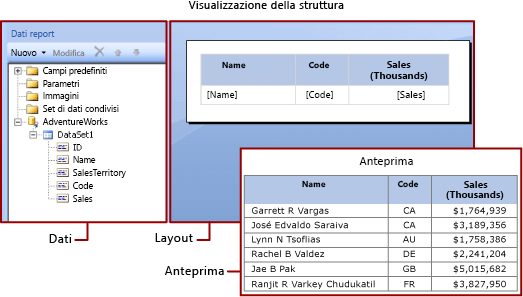

# Espressioni in Generatore report di Power BI
  Nei report impaginati di Power BI Report Builder le espressioni vengono ampiamente usate per recuperare, calcolare, visualizzare, raggruppare, ordinare, filtrare, parametrizzare e formattare i dati. 
  
  Molti elementi del report possono essere impostati su un'espressione. Le espressioni consentono di controllare il contenuto, la progettazione e l'interattività del report. Le espressioni sono scritte in Microsoft Visual Basic, vengono salvate nella definizione del report e vengono valutate dal componente Elaborazione report quando si esegue il report.  
  
 A differenza di applicazioni quali Microsoft Office Excel, in cui i dati vengono usati direttamente all'interno di un foglio di lavoro, in un report si usano espressioni, che rappresentano segnaposto per i dati. Per visualizzare i dati effettivi che derivano dalle espressioni valutate, è necessario visualizzare in anteprima il report. Quando si esegue il report, il componente Elaborazione report valuta ogni espressione man mano che combina i dati e gli elementi di layout del report, ad esempio tabelle e grafici.  
  
 Quando si progetta un report, le espressioni per molti elementi del report vengono impostate automaticamente. Quando, ad esempio, si trascina un campo dal riquadro dei dati in una cella della tabella nell'area di progettazione report, il valore della casella di testo viene impostato su un'espressione semplice per il campo. Nella figura seguente, il riquadro Dati report visualizza i campi del set di dati ID, Name, SalesTerritory, Code e Sales. Alla tabella sono stati aggiunti tre campi: [Name], [Code] e [Sales]. La notazione [Name] nell'area di progettazione rappresenta l'espressione sottostante `=Fields!Name.Value`.  
  

  
 Quando si visualizza in anteprima il report, il componente Elaborazione report combina l'area dati della tabella con i dati effettivi recuperati tramite la connessione dati e visualizza nella tabella una riga per ogni riga nel set di risultati.  
  
 Per immettere espressioni manualmente, selezionare un elemento nell'area di progettazione e impostare le proprietà dell'elemento tramite i menu di scelta rapida e le finestre di dialogo disponibili. Quando in un elenco a discesa è presente il pulsante ***(fx)*** o il valore `<Expression>`, è possibile impostare la proprietà su un'espressione. 
  
##   Informazioni sulle espressioni semplici e complesse  
 Le espressioni iniziano con un segno di uguale (=) e sono scritte in Microsoft Visual Basic. Le espressioni possono includere una combinazione di costanti, operatori e riferimenti a valori predefiniti (campi, raccolte e funzioni) e a codice esterno o personalizzato.  
  
 È possibile usare espressioni per specificare il valore di molte proprietà degli elementi del report. Le proprietà più comuni sono valori di caselle di testo e testo segnaposto. In genere, se una casella di testo contiene una sola espressione, quest'ultima corrisponde al valore della proprietà della casella di testo. Se una casella di testo contiene più espressioni, ogni espressione corrisponde al valore del testo segnaposto nella casella di testo.  
  
 Per impostazione predefinita, le espressioni vengono visualizzate nell'area di progettazione del report come *semplici* o *complesse*.  
  
-   **Semplice** Un'espressione semplice contiene un riferimento a un singolo elemento di una raccolta predefinita, ad esempio un campo del set di dati, un parametro o un campo predefinito. Nell'area di progettazione, un'espressione semplice viene visualizzata tra parentesi quadre. `[FieldName]`, ad esempio, corrisponde all'espressione sottostante `=Fields!FieldName.Value`. Le espressioni semplici vengono create automaticamente quando si crea il layout del report e si trascinano elementi dal riquadro Dati report nell'area di progettazione. Per altre informazioni sui simboli che rappresentano raccolte predefinite diverse, vedere [Informazioni sui simboli prefisso in espressioni semplici](#DisplayText).  
  
-   **Complessa** Un'espressione complessa contiene riferimenti a più riferimenti, operatori e chiamate di funzione predefiniti. Un'espressione complessa viene visualizzata come <\<Espr>> quando il valore dell'espressione include più riferimenti semplici. Per visualizzare l'espressione, passare il puntatore del mouse su di essa e usare la descrizione comando. Per modificare l'espressione, aprirla nella finestra di dialogo **Espressione**.  
  
 La figura seguente illustra espressioni semplici e complesse di tipo comune sia per caselle di testo che per testo segnaposto.  
  
 
  
 Per visualizzare valori di esempio anziché testo per le espressioni, formattare la casella di testo o il testo segnaposto. La figura seguente illustra l'area di progettazione report dopo il passaggio di questa alla visualizzazione di valori di esempio:  
  
  

##  Informazioni sui simboli di prefisso in espressioni semplici  

Le espressioni semplici usano simboli per indicare se il riferimento è a un campo, a un parametro, a una raccolta predefinita o alla raccolta ReportItems. La tabella seguente illustra alcuni esempi di testo visualizzato e testo di espressione:  
  
|Elemento|Esempio di testo visualizzato|Esempio di testo di espressione|  
|----------|--------------------------|-----------------------------|  
|Campi di set di dati|`[Sales]`   `[SUM(Sales)]`   `[FIRST(Store)]`|`=Fields!Sales.Value`   `=Sum(Fields!Sales.Value)`   `=First(Fields!Store.Value)`|  
|Parametri di report|`[@Param]`   `[@Param.Label]`|`=Parameters!Param.Value`   `=Parameters!Param.Label`|  
|Campi predefiniti|`[&ReportName]`|`=Globals!ReportName.Value`|  
|Caratteri letterali usati per il testo visualizzato|`\[Sales\]`|`[Sales]`|  
  
##   Scrittura di espressioni complesse  
 Le espressioni possono includere riferimenti a funzioni, operatori, costanti, campi, parametri, elementi di raccolte predefinite e codice o assembly personalizzati incorporati.  
  
 La tabella seguente elenca i tipi di riferimenti che è possibile includere in un'espressione:  
  
|Riferimenti|Description|Esempio|  
|----------------|-----------------|-------------|  
|Costanti|Descrive le costanti a cui è possibile accedere in modo interattivo per le proprietà che richiedono valori costanti, ad esempio i colori dei caratteri.|`="Blue"`|  
|Operators|Descrive gli operatori che è possibile usare per combinare riferimenti in un'espressione. L'operatore **&** , ad esempio, può essere usato per la concatenazione di stringhe.|`="The report ran at: " & Globals!ExecutionTime & "."`|  
|Raccolte predefinite|Descrive le raccolte predefinite che è possibile includere in un'espressione, ad esempio `Fields`, `Parameters` e `Variables`.|`=Fields!Sales.Value`   `=Parameters!Store.Value`   `=Variables!MyCalculation.Value`|  
|Report e funzioni di aggregazione predefiniti|Descrive le funzioni predefinite, ad esempio `Sum` o `Previous`, a cui è possibile accedere da un'espressione.|`=Previous(Sum(Fields!Sales.Value))`|  
|Riferimenti a codice e ad assembly personalizzati in espressioni di Generatore report |Descrive come accedere alle classi CLR predefinite `xref:System.Math` e `xref:System.Convert`, ad altre classi CLR, alle funzioni di libreria runtime di Visual Basic o a metodi di un assembly esterno.   Descrive come accedere a codice personalizzato incorporato nel report o compilato e installato dall'utente come assembly personalizzato sia nel client di report che server di report.|`=Sum(Fields!Sales.Value)`   `=CDate(Fields!SalesDate.Value)`   `=DateAdd("d",3,Fields!BirthDate.Value)`   `=Code.ToUSD(Fields!StandardCost.Value)`|  
   
##   Convalida delle espressioni  
 Quando si crea un'espressione per una proprietà specifica di un elemento del report, i riferimenti che è possibile includere nell'espressione dipendono dai valori che la proprietà dell'elemento del report può accettare e dall'ambito in cui la proprietà viene valutata, ad esempio:  
  
-   Per impostazione predefinita, l'espressione [Sum] calcola la somma dei dati presenti nell'ambito al momento della valutazione dell'espressione. Per una cella di tabella, l'ambito dipende dall'appartenenza a gruppi di righe e colonne. 
  
-   Per il valore della proprietà Font, il valore deve restituire il nome di un tipo di carattere.  
  
-   La sintassi dell'espressione viene convalidata in fase di progettazione. La convalida dell'ambito dell'espressione viene eseguita quando si pubblica il report. Per i tipi di convalida che dipendono da dati effettivi, gli errori possono essere rilevati solo in fase di esecuzione. Alcune di queste espressioni generano #Errore come messaggio di errore nel report visualizzabile. 

## Passaggi successivi

- [Che cosa sono i report impaginati in Power BI Premium?](paginated-reports-report-builder-power-bi.md)
