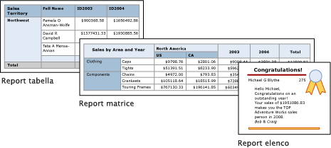

# Tabelle, matrici ed elenchi nel Generatore report di Power BI
 Nel Generatore report le tabelle, le matrici e gli elenchi sono *aree dati* che visualizzano i dati del report impaginato in celle suddivise in righe e colonne. Le celle contengono in genere dati di testo, ad esempio testo, date e numeri ma possono contenere anche misuratori, grafici o elementi del report, ad esempio immagini. Tabelle, matrici ed elenchi vengono spesso definiti collettivamente come aree dati *Tablix*.  
  
 I modelli di tabella, matrice ed elenco vengono compilati nell'area dati Tablix che è una griglia flessibile che visualizza i dati nelle celle. Nei modelli di tabella e matrice le celle sono disposte in righe e colonne. Poiché i modelli sono varianti dell'area dati Tablix generica sottostante, è possibile visualizzare i dati combinando formati di modelli e modificare la tabella, la matrice o l'elenco per includere le caratteristiche di un'altra area dati durante lo sviluppo del report. Ad esempio, se si aggiunge una tabella e si scopre che non risponde alle proprie esigenze, è possibile aggiungere gruppi di colonne per convertire la tabella in una matrice.  
  
 Le aree dati della tabella e della matrice possono visualizzare relazioni di dati complesse includendo tabelle nidificate, matrici, elenchi, grafici e misuratori. Tabelle e matrici hanno un layout tabulare e i dati provengono da un singolo set di dati basato su una singola origine dati. La differenza principale tra tabelle e matrici risiede nel fatto che le tabelle possono includere solo gruppi di righe mentre le matrici includono gruppi di righe e gruppi di colonne.  
  
 Gli elenchi sono leggermente diversi. Supportano un layout libero che può includere più tabelle peer o matrici, ognuna con dati di un set di dati diverso. È anche possibile usare gli elenchi per i moduli, ad esempio le fatture.  
  
 Le figure seguenti illustrano report semplici con una tabella, una matrice o un elenco.  

  
##   Tabelle  
 Usare una tabella per visualizzare i dati dettaglio, organizzare i dati in gruppi di righe o eseguire entrambe le operazioni. Il modello Tabella contiene tre colonne con una riga di intestazione di tabella e una riga di dettagli per i dati. La figura seguente illustra il modello di tabella iniziale selezionato nell'area di progettazione:  

  
 È possibile raggruppare i dati per singolo campo, per più campi o scrivendo un'espressione personalizzata. È possibile creare gruppi nidificati o gruppi indipendenti adiacenti e visualizzare i valori aggregati per i dati raggruppati oppure aggiungere totali ai gruppi. Ad esempio, se la tabella contiene un gruppo di righe denominato **Categoria**, è possibile aggiungere un subtotale per ogni gruppo nonché un totale complessivo per il report. Per migliorare l'aspetto della tabella ed evidenziare i dati desiderati, è possibile unire le celle e applicare la formattazione ai dati e alle intestazioni di tabella.  
  
 È possibile nascondere inizialmente i dati dettaglio o i dati raggruppati e includere interruttori drilldown per consentire agli utenti di scegliere in modo interattivo la quantità di dati da visualizzare.  
  
##   Matrici  
 Usare una matrice per visualizzare riepiloghi di dati aggregati, raggruppati in righe e colonne, simili a una tabella pivot o a campi incrociati. Il numero di righe e colonne per i gruppi è determinato dal numero di valori univoci per ogni gruppo di righe e colonne. La figura seguente illustra il modello di tabella iniziale selezionato nell'area di progettazione:  

 
 È possibile raggruppare i dati per più campi o espressioni in gruppi di righe e colonne. In fase di esecuzione, quando vengono combinati i dati del report e le aree dati, la matrice si espande orizzontalmente e verticalmente nella pagina man mano che vengono aggiunte le colonne per i gruppi di colonne e le righe per i gruppi di righe. Le celle della matrice visualizzano valori aggregati che hanno come ambito l'intersezione dei gruppi di righe e colonne a cui appartiene la cella. Ad esempio, se la matrice include un gruppo di righe (Categoria) e due gruppi di colonne (Territorio e Anno) che visualizzano il totale vendite, il report visualizza due celle con i totali vendite per ogni valore del gruppo Categoria. L'ambito delle celle sono le due intersezioni: Category e Territory e Category e Year. La matrice può includere gruppi nidificati e adiacenti. I gruppi nidificati hanno una relazione padre-figlio e i gruppi adiacenti hanno una relazione peer. È possibile aggiungere subtotali per tutti i livelli di gruppi di righe e colonne nidificati all'interno della matrice.  
  
 Per rendere più leggibili i dati della matrice ed evidenziare i dati desiderati, è possibile unire le celle o dividerle orizzontalmente e verticalmente e applicare la formattazione ai dati e alle intestazioni dei gruppi.  
  
 È anche possibile includere interruttori drilldown che nascondono inizialmente i dati dettaglio; l'utente può quindi fare clic sugli interruttori per visualizzare più o meno dettagli in base alle esigenze.  
  
##   Elenchi  
 Usare un elenco per creare un layout in formato libero. Poiché il layout griglia non impone alcuna limitazione, è possibile posizionare i campi liberamente all'interno dell'elenco. È possibile usare un elenco per progettare un modulo per la visualizzazione di numerosi campi del set di dati o come contenitore per la visualizzazione di più aree dati affiancate per i dati raggruppati. Ad esempio, è possibile definire un gruppo per un elenco, aggiungere una tabella, un grafico e un'immagine e visualizzare i valori in formato tabella e grafico per ogni valore di gruppo, come si farebbe per un record dipendente o paziente.  

  
##   Preparazione dei dati  
 Le aree dati di tabelle, matrici ed elenchi visualizzano i dati di un set di dati. È possibile preparare i dati nella query che recupera i dati per il set di dati o impostando le proprietà nella tabella, nella matrice o nell'elenco.  
  
 I linguaggi di query, ad esempio Transact-SQL, usati per recuperare i dati per i set di dati dei report possono preparare i dati applicando filtri per includere solo un subset dei dati, sostituendo i valori Null o vuoti con costanti che rendono più leggibile il report e ordinando e raggruppando i dati.  
  
 Se si sceglie di preparare i dati nell'area dati della tabella, della matrice o dell'elenco di un report, impostare le proprietà nell'area dati o nelle celle all'interno dell'area dati. Se si vuole filtrare o ordinare i dati, impostare le proprietà nell'area dati. Ad esempio, per ordinare i dati specificare le colonne in base alle quali eseguire l'ordinamento e la direzione di ordinamento. Se si vuole specificare un valore alternativo per un campo, impostare i valori del testo della cella che visualizza il campo. Ad esempio, per visualizzare Vuoto quando un campo è vuoto o Null, usare un'espressione per impostare il valore.  
  
##   Creazione e configurazione di una tabella, una matrice o un elenco  
 Quando si aggiungono tabelle o matrici al report, è possibile usare la Creazione guidata tabella e la Creazione guidata matrice oppure crearle manualmente usando i modelli del Generatore report. Gli elenchi vengono creati manualmente usando il modello di elenco.  
  
 La procedura guidata indica i passaggi per creare e configurare rapidamente una tabella o una matrice. Dopo aver completato la procedura guidata o creato nuove aree dati Tablix, è possibile eseguire altre operazioni di configurazione e perfezionamento. Le finestre di dialogo, disponibili dai menu di scelta rapida nelle aree dati, consentono di impostare in modo semplice le proprietà più comuni per le interruzioni di pagina, la ripetibilità e la visibilità delle intestazioni e dei piè di pagina, le opzioni di visualizzazione, i filtri e l'ordinamento. L'area dati Tablix offre un'ampia gamma di proprietà aggiuntive che è possibile impostare solo nel riquadro Proprietà del Generatore report. Ad esempio, se si vuole visualizzare un messaggio quando il set di dati per una tabella, una matrice o un elenco è vuoto, specificare il testo del messaggio nella proprietà della Tablix NoRowsMessage nel riquadro Proprietà.  
  
##   Modifica del modello Tablix  
 La scelta del modello Tablix iniziale non è vincolante. Man mano che si aggiungono gruppi, totali ed etichette, è possibile che si voglia modificare la progettazione della Tablix. È possibile ad esempio iniziare con una tabella e successivamente eliminare la riga dei dettagli e aggiungere gruppi di colonne.  
  
 È possibile continuare a sviluppare una tabella, una matrice o un elenco aggiungendo le funzionalità Tablix desiderate. Le funzionalità Tablix includono la visualizzazione dei dati dettaglio o delle aggregazioni per i dati raggruppati in righe e colonne. È possibile creare gruppi nidificati, gruppi adiacenti indipendenti o gruppi ricorsivi. È possibile filtrare e ordinare i dati raggruppati e combinare facilmente i gruppi inserendo più espressioni di raggruppamento nella definizione di un gruppo  
  
 È anche possibile aggiungere totali per un gruppo o totali complessivi per l'area dati. È possibile nascondere righe o colonne per semplificare un report e consentire all'utente di attivare o disattivare la visualizzazione dei dati nascosti, come in un report drilldown. 

## Passaggi successivi

- [Che cosa sono i report impaginati in Power BI Premium?](paginated-reports-report-builder-power-bi.md)
