# Cambiare le dimensioni di una pagina del report (esercitazione)
Nell'[articolo e nel video precedenti](power-bi-report-display-settings.md) sono stati illustrati due modi diversi per controllare la visualizzazione delle pagine nei report di Power BI: **Visualizza** e **Dimensioni pagina**. Proviamo a metterli in pratica.

## Modificare l'impostazione di visualizzazione della pagina
1. Aprire un report nella Visualizzazione di lettura o nella Visualizzazione di modifica. In questo esempio viene usata la pagina "New Stores" dell'[esempio di analisi delle vendite al dettaglio](sample-retail-analysis.md).  Questa pagina viene visualizzata usando l'impostazione **Adatta alla pagina**.  In questo caso, usando l'impostazione Adatta alla pagina, la pagina del report viene visualizzata senza barre di scorrimento, ma alcuni dettagli e riquadri sono troppo piccoli per essere letti.
   
   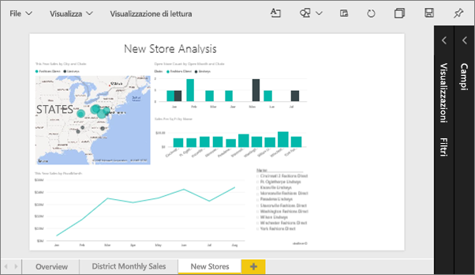
2. Assicurarsi che nell'area di disegno non sia selezionata alcuna visualizzazione. Selezionare **Visualizza** ed esaminare le opzioni di visualizzazione.

* Questo sarà l'aspetto in Visualizzazione di lettura.
  
     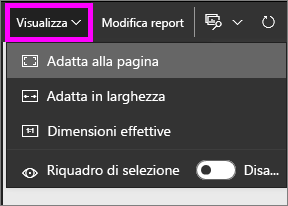
* Questo sarà l'aspetto in Visualizzazione di modifica.
  
    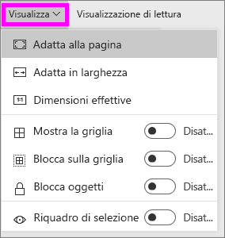

1. Si osservi l'aspetto della pagina quando si usa l'impostazione **Dimensioni effettive**.
   
   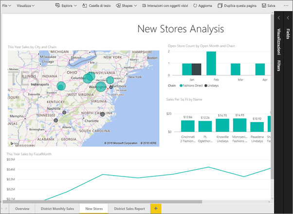
   
   Non è grande, il dashboard presenta ora due barre di scorrimento.
2. Passare a **Adatta in larghezza**.
   
   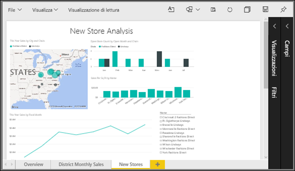
   
   Ha un aspetto migliore, e ora include le barre di scorrimento, ma è più facile leggere i dettagli.

## Modificare la visualizzazione predefinita di una pagina del report
L'opzione di visualizzazione predefinita di tutti i report di Power BI è **Adatta alla pagina**. Tuttavia, ecco come procedere per modificare la visualizzazione predefinita del report in **Dimensioni effettive**.

1. Nella pagina **Nuovi archivi** del report, tornare alla visualizzazione **Dimensioni effettive**.
   
   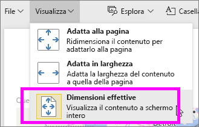
2. Salvare il report con un nome diverso selezionando **File > Salva con nome**. Si hanno ora a disposizione 2 copie del report; nel report originale, **Nuovi archivi** continuerà ad aprirsi in visualizzazione predefinita, mentre il nuovo report verrà aperto in visualizzazione **Dimensioni effettive**. Confermare la visualizzazione.
   
   
3. Per tornare all'area di lavoro corrente, selezionarne il nome nella barra di spostamento superiore.  
   
   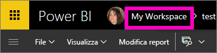
4. Selezionare la scheda **Report** e scegliere il nuovo report appena creato, contraddistinto da un asterisco giallo.
   
    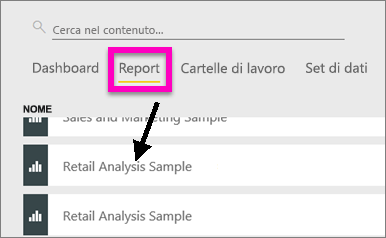
5. Il report verrà aperto nella visualizzazione in **Dimensioni effettive**.
   
   

## Informazioni sull'impostazione *Dimensioni pagina*
Le impostazioni delle dimensioni della pagina sono disponibili solo nella [Visualizzazione di modifica](service-interact-with-a-report-in-editing-view.md). Per aprire un report nella Visualizzazione di modifica, sono necessarie le autorizzazioni di proprietario per il report. Tali autorizzazioni sono già disponibili se si è effettuata la connessione a uno degli [esempi](sample-datasets.md).

1. Aprire la pagina "District monthly sales" di [Esempio di analisi delle vendite al dettaglio](sample-retail-analysis.md) in Visualizzazione di modifica.
2. Assicurarsi che nell'area di disegno non sia selezionata alcuna visualizzazione.  Nel riquadro **Visualizzazioni** selezionare l'icona del rullo .
3. Selezionare **Dimensioni pagina** &gt; **Tipo** per visualizzare le opzioni relative alle dimensioni della pagina.
   
   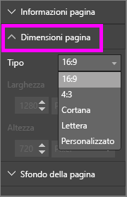
4. Selezionare **Letter**.  Solo il contenuto che rientra in 816x1056 pixel (formato Letter) rimane nella parte bianca dell'area di disegno.
   
   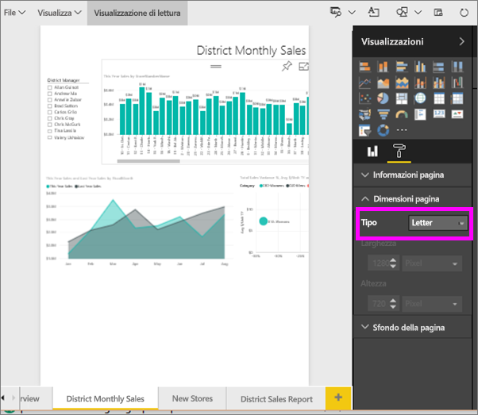
5. Impostando **Visualizza** su "Adatta in larghezza", nell'area di disegno viene visualizzato solo il contenuto della pagina che rientra nel formato Letter.
   
   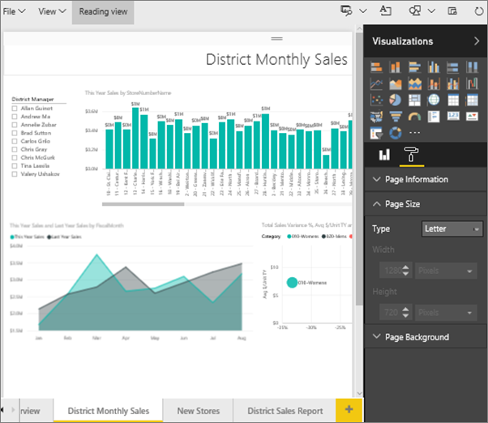
6. Selezionare **Dimensioni pagina** **16:9** .
   
   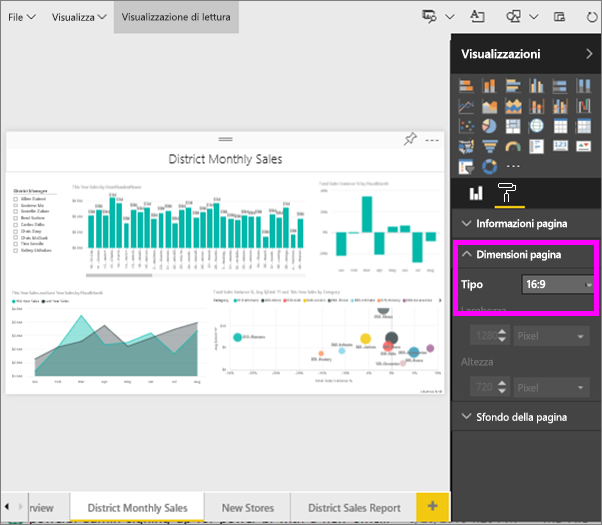
   
   La pagina del report viene visualizzata usando una proporzione di 16 in larghezza e 9 in altezza. Per visualizzare le dimensioni effettive in pixel, osservare i campi Larghezza e Altezza in grigio (1280x720). Attorno all'area di disegno report è presente molto spazio vuoto perché in precedenza l'opzione **Visualizza** era stata impostata su "Adatta in larghezza".
7. Continuare a esplorare le opzioni di **Dimensioni pagina**.

## Uso di Visualizza e Dimensioni pagina insieme
Usare Visualizza e Dimensioni pagina insieme per creare un report adatto anche a quando viene incorporato in altre applicazioni.

In questo esercizio si creerà una pagina del report che verrà visualizzata in un'applicazione con spazio per 500 pixel di larghezza e 750 pixel di altezza.

Tenere a mente che la pagina del report è attualmente visualizzata con una larghezza di 1280 pixel e un'altezza di 720. Sarà necessario apportare diverse modifiche per ridimensionare e riorganizzare la pagina se si desidera adattare ad essa tutti gli oggetti visivi.

1. Ridimensionare e spostare gli oggetti visivi in modo che rientrino in meno della metà dell'area di disegno attuale.
   
    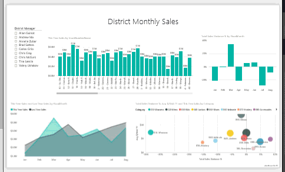
2. Selezionare **Dimensioni pagina** &gt; **Personalizzato**.
3. Impostare la Larghezza su 500 e l'Altezza su 750.
   
    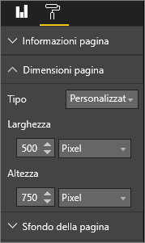
4. Modificare la pagina del report in modo che risulti ben organizzata. Usare le opzioni **Visualizza > Dimensioni effettive** e **Visualizza > Adatta alla pagina** per apportare le modifiche.
   
    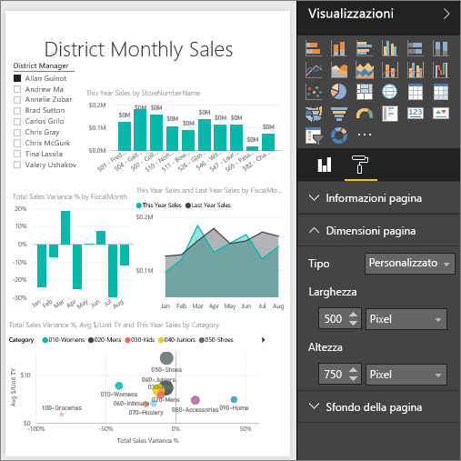

## Passaggi successivi
[Creare report per Cortana](service-cortana-answer-cards.md)

Tornare a [Impostazioni di visualizzazione della pagina in un report di Power BI](power-bi-report-display-settings.md)

Altre informazioni sui [report in Power BI](service-reports.md)

Altre domande? [Provare la community di Power BI](http://community.powerbi.com/)

