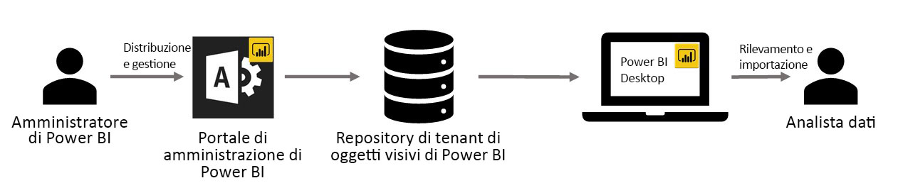

# Uso degli oggetti visivi personalizzati dell'organizzazione in Power BI

È possibile usare oggetti visivi personalizzati in Power BI per creare un tipo univoco di oggetto visivo personalizzato in base all'utente o alle informazioni che si desidera comunicare. Spesso questi oggetti visivi personalizzati vengono creati dagli sviluppatori e spesso vengono creati quando la grande varietà di oggetti visivi inclusi in Power BI non soddisfa esigenze specifiche. 

In alcune organizzazioni, gli oggetti visivi personalizzati sono ancora più importanti: potrebbero essere necessari per comunicare dati o informazioni approfondite specifici dell'organizzazione, potrebbero avere requisiti speciali per i dati oppure mettere in evidenza metodi aziendali privati. Queste organizzazioni hanno la necessità di sviluppare oggetti visivi personalizzati, condividerli in tutta l'organizzazione e accertarsi che vengono gestiti correttamente. Gli oggetti visivi personalizzati di Power BI soddisfano proprio queste esigenze delle organizzazioni.

La figura seguente illustra il processo di flusso degli oggetti visivi personalizzati dell'organizzazione in Power BI dall'amministratore allo sviluppo e alla manutenzione, fino all'analista di dati.

Gli oggetti visivi dell'organizzazione vengono distribuiti e gestiti dall'amministratore di Power BI dal portale di amministrazione. Dopo la distribuzione nel repository dell'organizzazione, gli utenti dell'organizzazione possono facilmente individuarli e importarli nei loro report direttamente da Power BI Desktop.

## Uso di oggetti visivi personalizzati dell'organizzazione

Per altre informazioni su come usare gli oggetti visivi personalizzati dell'organizzazione nei report creati, vedere [altre informazioni sull'importazione di oggetti visivi dell'organizzazione nei report](power-bi-custom-visuals.md).
 
## Amministrazione degli oggetti visivi personalizzati dell'organizzazione

Per altre informazioni su come amministrare, distribuire e gestire gli oggetti visivi personalizzati dell'organizzazione all'interno dell'organizzazione, vedere [altre informazioni sulla distribuzione e gestione degli oggetti visivi personalizzati dell'organizzazione](https://go.microsoft.com/fwlink/?linkid=866790).

> [!WARNING]
> Gli oggetti visivi personalizzati possono contenere codice che comporta rischi per la sicurezza o per la privacy. Assicurarsi che l'autore e l'origine di qualsiasi oggetto visivo personalizzato siano attendibili prima di distribuirlo nel repository dell'organizzazione. 
> 

## Considerazioni e limitazioni
 
Esistono diverse considerazioni e limitazioni di cui è necessario tenere conto.
 
Amministratore:

* Non sono supportati gli oggetti visivi personalizzati legacy (ad esempio gli oggetti visivi personalizzati non creati sulla base delle nuove API con controllo della versione)

* Se un oggetto visivo personalizzato viene eliminato dal repository, non verrà più eseguito il rendering di tutti i report esistenti che usano l'oggetto visivo eliminato. L'operazione di eliminazione dal repository non è reversibile. Per disabilitare temporaneamente un oggetto visivo personalizzato, usare la funzionalità "Disabilita".
 
Utenti finali:

* La raccolta di aree di lavoro di Power BI non è supportata per gli oggetti visivi dell'organizzazione

* Non verrà eseguito il rendering degli oggetti visivi Visio, PowerApps e GlobeMap dal Marketplace AppSource se vengono distribuiti tramite il repository dell'organizzazione
