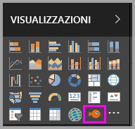
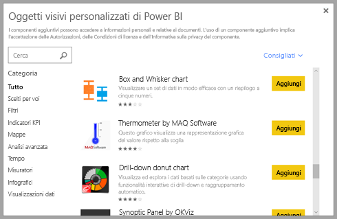

# Oggetti visivi personalizzati in Power BI

Quando si crea o modifica un report di Power BI, è possibile usare molti tipi diversi di oggetti visivi. Vengono visualizzate le icone per questi oggetti visivi nel **visualizzazioni** riquadro. Questi oggetti visivi vengono pre-forniti quando si scaricano [Power BI Desktop](https://powerbi.microsoft.com/desktop/) oppure aprire il [servizio Power BI](https://app.powerbi.com).

Tuttavia, non è limitato a questo set di oggetti visivi. Se si selezionano i puntini di sospensione (...) nella parte inferiore, un'altra origine di oggetti visivi del report diventa disponibile -*gli oggetti visivi personalizzati*.

Gli sviluppatori di creare oggetti visivi personalizzati tramite gli SDK di oggetti visivi personalizzati. Questi oggetti visivi consentono agli utenti aziendali di visualizzare i dati in modo più adatto alle loro attività aziendali. Gli autori di report possono quindi importare i file visual personalizzati in report e usarli come farebbero gli altri oggetti visivi di Power BI. Gli oggetti visivi personalizzati sono cittadini di prima classe in Power BI e possono essere filtrati, evidenziati, modificati, condivisi e così via.

Gli oggetti visivi personalizzati vengono distribuiti in tre modi:

* File di oggetti visivi personalizzati
* Oggetti visivi organizzazione
* Oggetti visivi del Marketplace

## File di oggetti visivi personalizzati

Gli oggetti visivi personalizzati sono pacchetti che includono il codice per il rendering dei dati a loro passati. Chiunque può creare un oggetto visivo personalizzato e crearne il pacchetto come singolo `.pbiviz` file, che può quindi essere importato in un report di Power BI.

> [!WARNING]
> Un oggetto visivo personalizzato può contenere codice con rischi per la privacy o sicurezza. Assicurarsi che si considera attendibile l'autore e l'origine oggetto visivo personalizzato prima di importarlo nel report.

## Oggetti visivi organizzazione

Gli amministratori di Power BI approvare e distribuire gli oggetti visivi personalizzati nella propria organizzazione, che gli autori di report possono facilmente individuare, aggiornare e utilizzare. Gli amministratori possono gestire facilmente (ad esempio, aggiornare la versione o abilitarli e disabilitarli) questi oggetti visivi.

 [Altre informazioni su oggetti visivi dell'organizzazione](power-bi-custom-visuals-organization.md).

## Oggetti visivi del Marketplace

I membri della community e Microsoft hanno contribuito gli oggetti visivi personalizzati per il vantaggio pubblico e pubblicando il [AppSource](https://appsource.microsoft.com/marketplace/apps?product=power-bi-visuals) marketplace. È possibile scaricare questi oggetti visivi aggiungerli ai report di Power BI. Microsoft ha testato e approvato questi oggetti visivi personalizzati per funzionalità e qualità.

Informazioni su [AppSource](developer/office-store.md) È il posto è possibile trovare App, componenti aggiuntivi ed estensioni per il software Microsoft. [AppSource](https://appsource.microsoft.com/) connette milioni di utenti di prodotti come Office 365, Azure, Dynamics 365, Cortana e Power BI per soluzioni che li aiutano a lavorare in modo efficiente, più intelligente e accattivante rispetto a prima.

### Oggetti visivi certificati

Gli oggetti visivi sono oggetti visivi del marketplace che hanno superato test aggiuntivi qualità rigorosi e sono supportati in ulteriori scenari, ad esempio certificati di Power BI [delle sottoscrizioni di posta elettronica](https://docs.microsoft.com/power-bi/service-report-subscribe), e [Esporta in PowerPoint](https://docs.microsoft.com/power-bi/service-publish-to-powerpoint).
Per visualizzare l'elenco di oggetti visivi personalizzati certificati o per inviare il proprio, vedere [Oggetti visivi personalizzati certificati](https://docs.microsoft.com/power-bi/power-bi-custom-visuals-certified).

Gli sviluppatori Web interessati a creare visualizzazioni personalizzate e ad aggiungerle in AppSource, possono Visualizzare [lo sviluppo di un oggetto visivo Power BI](developer/custom-visual-develop-tutorial.md) e Scopri come [pubblicare oggetti visivi personalizzati in AppSource](https://docs.microsoft.com/power-bi/developer/office-store).

### Importare un oggetto visivo personalizzato da un file

1. Selezionare i puntini di sospensione in fondo il **visualizzazioni** riquadro.

    

2. Nell'elenco a discesa selezionare **Importa da file**.

    

3. Nel menu file aperto, selezionare la `.pbiviz` file che si desidera importare e quindi selezionare **Open**. Icona dell'oggetto visivo personalizzato viene aggiunto in fondo il **visualizzazioni** riquadro ed è ora disponibile per l'uso nel report.

    

### Importare oggetti visivi dell'organizzazione

1. Selezionare i puntini di sospensione in fondo il **visualizzazioni** riquadro.

    

2. Nell'elenco a discesa selezionare **Importa dal Marketplace**.

    

3. Selezionare **ORGANIZZAZIONE PERSONALE** dal menu della scheda superiore.

    

4. Scorrere l'elenco per trovare l'oggetto visivo da importare.

    

5. Selezionare **Add** per importare l'oggetto visivo personalizzato. La relativa icona viene aggiunto in fondo il **visualizzazioni** riquadro ed è ora disponibile per l'uso nel report.

    

## Scaricare o importare oggetti visivi personalizzati da Microsoft AppSource

Sono disponibili due opzioni per il download e importazione di oggetti visivi personalizzati: dall'interno di Power BI e dal [sito Web AppSource](https://appsource.microsoft.com/).

### Importare oggetti visivi personalizzati da Power BI

1. Selezionare i puntini di sospensione in fondo il **visualizzazioni** riquadro.

    

2. Nell'elenco a discesa selezionare **Importa dal Marketplace**.

    

3. Scorrere l'elenco per trovare l'oggetto visivo da importare.

    

4. Per altre informazioni su uno degli oggetti visivi, evidenziarlo e selezionarlo.

    

5. Nella pagina dei dettagli è possibile visualizzare schermate, video, una descrizione dettagliata e altro ancora.

    

6. Scorrere verso il basso per visualizzare i commenti.

    

7. Selezionare **Add** per importare l'oggetto visivo personalizzato. La relativa icona viene aggiunto in fondo il **visualizzazioni** riquadro ed è ora disponibile per l'uso nel report.

    

### Scaricare e importare oggetti visivi personalizzati da Microsoft AppSource

1. Accedere a [Microsoft AppSource](https://appsource.microsoft.com) e selezionare la scheda **App**.

    

2. Andare alla [pagina dei risultati per le app](https://appsource.microsoft.com/marketplace/apps) in cui sono mostrate le app più popolari per ogni categoria, incluse le *app di Power BI*. Ricerca di oggetti visivi personalizzati, quindi selezionare **oggetti visivi di Power BI** nell'elenco di spostamento a sinistra per restringere i risultati.

    

3. AppSource mostra un riquadro per ogni oggetto visivo personalizzato.  Ogni riquadro presenta uno snapshot personalizzato con una breve descrizione e un collegamento di download. Per visualizzare altri dettagli, selezionare il riquadro.

    

4. Nella pagina dei dettagli è possibile visualizzare schermate, video, una descrizione dettagliata e altro ancora. Selezionare **Scarica adesso** per scaricare l'oggetto visivo personalizzato e quindi accettare le condizioni d'uso.

    

5. Selezionare il collegamento per scaricare l'oggetto visivo personalizzato.

    

    La pagina di download include anche istruzioni su come importare l'oggetto visivo personalizzato in Power BI Desktop e nel servizio Power BI.

    È possibile scaricare anche un report di esempio che include l'oggetto visivo personalizzato e ne illustra le funzionalità.

    

6. Salvare il `.pbiviz` file e quindi aprire Power BI.

7. Importazione di `.pbiviz` file nel report. Vedere la sezione [Importare un oggetto visivo personalizzato da un file](#import-a-custom-visual-from-a-file) più indietro.

## Considerazioni e limitazioni

* Un oggetto visivo personalizzato viene aggiunto a un determinato report durante l'importazione. Se si vuole usare l'oggetto visivo in un altro report, è necessario importarlo anche in tale report. Quando un report con un oggetto visivo personalizzato viene salvato usando l'opzione **Salva con nome** , una copia dell'oggetto visivo personalizzato viene salvata con il nuovo report.

* Se non viene visualizzata una **visualizzazioni** riquadro, che significa che non è rapporto le autorizzazioni di modifica.  È possibile aggiungere oggetti visivi personalizzati solo ai report che si è autorizzati a modificare e non ai report che sono stati semplicemente condivisi.

## Risoluzione dei problemi

Per risolvere i problemi, vedere [risoluzione dei problemi di oggetti visivi personalizzati di Power BI](power-bi-custom-visuals-troubleshoot.md).

## DOMANDE FREQUENTI

Per altre informazioni e risposte, vedere le [Frequently asked questions about Power BI custom visuals](power-bi-custom-visuals-faq.md#organizational-custom-visuals) (Domande frequenti sugli oggetti visivi personalizzati di Power BI).

## Passaggi successivi

* [Visualizzazioni nei report di Power BI](visuals/power-bi-report-visualizations.md)

Altre domande? [Provare la community di Power BI](http://community.powerbi.com/).
