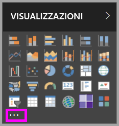
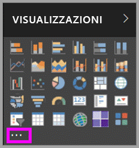
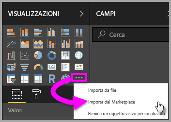
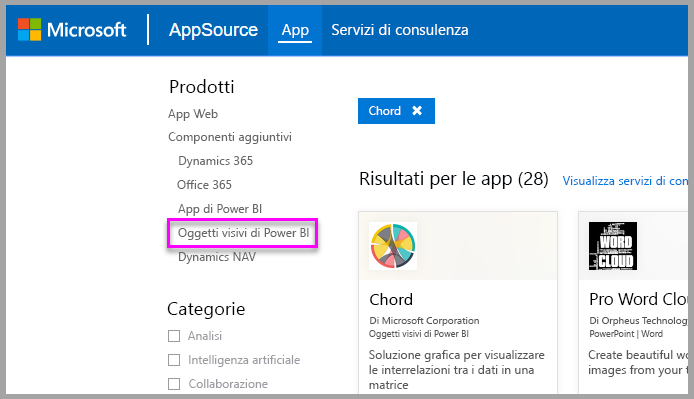

# Oggetti visivi personalizzati in Power BI
Quando si crea o si modifica un report di Power BI, sono disponibili vari tipi di oggetti visivi. Gli oggetti visivi sono visualizzati nel riquadro **Visualizzazioni**. Quando si scarica Power BI Desktop o si accede al servizio Power BI (app.powerbi.com), questo set di oggetti visivi è incluso per impostazione predefinita.

Tuttavia, le possibilità non sono limitate a questo set preconfezionato. Selezionando i puntini di sospensione è possibile aprire un'altra origine di oggetti visivi per i report, gli *oggetti visivi personalizzati*.

Gli oggetti visivi personalizzati vengono creati dagli sviluppatori tramite l'SDK corrispondente per consentire agli utenti aziendali di visualizzare i dati in modo ottimale per le esigenze dell'azienda. Gli autori di report possono quindi importare i file degli oggetti visivi personalizzati nei report e usarli come qualsiasi altro oggetto visivo di Power BI. Gli oggetti visivi personalizzati sono elementi di primaria importanza in Power BI e possono essere filtrati, evidenziati, modificati, condivisi e così via.

Gli oggetti visivi personalizzati supportano 3 tipi di canali di distribuzione:
* File di oggetti visivi personalizzati
* Oggetti visivi dell'organizzazione
* Oggetti visivi del Marketplace

## File di oggetti visivi personalizzati

Gli oggetti visivi personalizzati sono pacchetti che includono il codice per il rendering dei dati a loro passati. Chiunque può creare un oggetto visivo personalizzato e assemblarlo in un pacchetto come singolo file con estensione pbiviz, che può essere importato in un report di Power BI.

> [!WARNING]
> Un oggetto visivo personalizzato può contenere codice rischioso a livello di sicurezza o privacy. Verificare che l'autore e l'origine dell'oggetto visivo personalizzato siano attendibili prima di importarlo nel report.
> 
> 

## Oggetti visivi dell'organizzazione (anteprima)

Gli amministratori di Power BI possono distribuire oggetti visivi personalizzati nella propria organizzazione, in modo che gli autori di report possano facilmente individuare e usare gli oggetti visivi personalizzati approvati dall'amministratore per l'uso all'interno dell'organizzazione. In questo modo l'amministratore ha il controllo e può scegliere gli oggetti visivi personalizzati specifici da distribuire nell'organizzazione, oltre ad avere a disposizione un modo semplice per gestire questi oggetti, ad esempio aggiornare la versione o abilitarli e disabilitarli. Per gli autori di report questo è un modo semplice per individuare gli oggetti visivi univoci per l'organizzazione, oltre a supportare l'aggiornamento semplice di tali oggetti visivi.

Per altri dettagli sugli oggetti visivi personalizzati dell'organizzazione, [leggere altre informazioni sugli oggetti visivi dell'organizzazione](power-bi-custom-visuals-organization.md).

## Oggetti visivi del Marketplace

I membri della community, così come Microsoft, offrono il loro contributo pubblicando oggetti visivi personalizzati nel Marketplace [AppSource](https://appsource.microsoft.com/en-us/marketplace/apps?product=power-bi-visuals), da dove è possibile scaricarli e aggiungerli ai report in Power BI. Tutti questi oggetti visivi personalizzati sono stati testati e approvati da Microsoft per funzionalità e qualità.

Informazioni su AppSource In breve, è il posto in cui è possibile trovare app, componenti aggiuntivi ed estensioni per il software Microsoft. [AppSource](https://appsource.microsoft.com/en-us/) connette milioni di utenti di prodotti come Office 365, Azure, Dynamics 365, Cortana e Power BI a soluzioni che li aiutano a lavorare in modo più efficiente, più intelligente o migliore rispetto a prima.

### Oggetti visivi certificati

Gli oggetti visivi certificati di Power BI sono oggetti visivi del Marketplace che hanno superato test di qualità rigorosi e sono supportati in ulteriori scenari, quali [sottoscrizioni di messaggi di posta elettronica](https://docs.microsoft.com/en-us/power-bi/service-report-subscribe) ed [esportazione in PowerPoint](https://docs.microsoft.com/en-us/power-bi/service-publish-to-powerpoint).
Per visualizzare l'elenco di oggetti visivi personalizzati certificati o per inviare il proprio, vedere [Oggetti visivi personalizzati certificati](https://docs.microsoft.com/en-us/power-bi/power-bi-custom-visuals-certified).

Gli sviluppatori Web interessati a creare visualizzazioni personalizzate e ad aggiungerle in AppSource, possono vedere [Usare gli strumenti di sviluppo per la creazione di oggetti visivi personalizzati](https://docs.microsoft.com/en-us/power-bi/service-custom-visuals-getting-started-with-developer-tools) e le informazioni su come [Pubblicare oggetti visivi personalizzati in AppSource](https://appsource.microsoft.com/en-us/marketplace/apps?product=power-bi-visuals).

### Importare un oggetto visivo personalizzato da un file

1. Nel riquadro Visualizzazioni selezionare i puntini di sospensione.

    

2. Nell'elenco a discesa selezionare **Importa da file**.

    

3. Nel menu Apri file selezionare il file con estensione pbiviz che si vuole importare e quindi selezionare Apri. L'icona per l'oggetto visivo personalizzato viene aggiunta nella parte inferiore del riquadro Visualizzazioni e può essere usata nei report.

    

### Importare gli oggetti visivi dell'organizzazione

1. Nel riquadro Visualizzazioni selezionare i puntini di sospensione.

    

2. Nell'elenco a discesa selezionare Importa dal Marketplace.

    

3. Selezionare **ORGANIZZAZIONE PERSONALE** dal menu della scheda superiore.

    

4. Scorrere l'elenco per trovare l'oggetto visivo da importare.
    
    

5. Selezionare **Aggiungi** per importare l'oggetto visivo personalizzato. L'icona per l'oggetto visivo personalizzato viene aggiunta nella parte inferiore del riquadro Visualizzazioni e può essere usata nei report.

    
 
## Scaricare o importare oggetti visivi personalizzati da Microsoft AppSource
Sono disponibili due opzioni per scaricare e importare gli oggetti visivi personalizza, da Power BI e dal sito Web di AppSource.

### Importare oggetti visivi personalizzati da Power BI

1. Nel riquadro Visualizzazioni selezionare i puntini di sospensione.

    

2. Nell'elenco a discesa selezionare **Importa dal Marketplace**.

    

3. Scorrere l'elenco per trovare l'oggetto visivo da importare.

    

4. Per altre informazioni su uno degli oggetti visivi, evidenziarlo e selezionarlo.

    

5. Nella pagina dei dettagli è possibile visualizzare schermate, video, una descrizione dettagliata e altro ancora.

    

6. Scorrere verso il basso per visualizzare i commenti.

    

7. Selezionare Aggiungi per importare l'oggetto visivo personalizzato. L'icona per l'oggetto visivo personalizzato viene aggiunta nella parte inferiore del riquadro Visualizzazioni e può essere usata nei report.

    

### Scaricare e importare oggetti visivi personalizzati da Microsoft AppSource

1. Accedere a [Microsoft AppSource](https://appsource.microsoft.com) e selezionare la scheda **App**. 

    

2. Verrà visualizzata la [pagina dei risultati per le app](https://appsource.microsoft.com/en-us/marketplace/apps) in cui sono mostrate le app più popolari per ogni categoria, incluse le *app di Power BI*. Poiché occorre visualizzare gli oggetti visivi personalizzati, è necessario limitare i risultati selezionando **Oggetti visivi personalizzati** nell'elenco di spostamento a sinistra.

    

3. AppSource mostra un riquadro per ogni oggetto visivo personalizzato.  Ogni riquadro presenta uno snapshot dell'oggetto visivo personalizzato, una breve descrizione e un collegamento per il download. Per visualizzare altri dettagli, selezionare il riquadro. 

    

4. Nella pagina dei dettagli è possibile visualizzare schermate, video, una descrizione dettagliata e altro ancora. Per scaricare l'oggetto visivo personalizzato, selezionare **Scarica adesso** e accettare le Condizioni per l'utilizzo. 

    

5. Selezionare il collegamento per scaricare l'oggetto visivo personalizzato.

    

    La pagina di download include anche le istruzioni su come importare l'oggetto visivo personalizzato in Power BI Desktop e nel servizio Power BI.

    È possibile scaricare anche un report di esempio che include l'oggetto visivo personalizzato e ne illustra le funzionalità.

    

6. Salvare il file PBIVIZ e quindi aprire Power BI.

7. Importare il file con estensione pbiviz nel report (vedere la sezione precedente [Importare un oggetto visivo personalizzato da un file](#import-a-custom-visuals-from-a-file)).

## Considerazioni e risoluzione dei problemi

- Un oggetto visivo personalizzato viene aggiunto a un determinato report durante l'importazione. Se si vuole usare l'oggetto visivo in un altro report, è necessario importarlo anche in tale report. Quando un report con un oggetto visivo personalizzato viene salvato usando l'opzione **Salva con nome** , una copia dell'oggetto visivo personalizzato viene salvata con il nuovo report.

- Se il riquadro **Visualizzazioni** non è visualizzato, significa che l'utente non dispone delle autorizzazioni di modifica per il report.  È possibile aggiungere oggetti visivi personalizzati solo ai report che si è autorizzati a modificare e non ai report che sono stati semplicemente condivisi.

Altre domande? [Provare la community di Power BI](http://community.powerbi.com/)