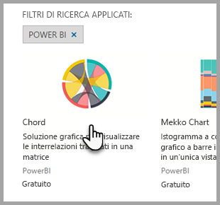

# Oggetti visivi personalizzati in Power BI
Quando si crea o si modifica un report di Power BI, sono disponibili vari tipi di oggetti visivi. Gli oggetti visivi sono visualizzati nel riquadro **Visualizzazioni**. Quando si scarica Power BI Desktop o si accede al servizio Power BI (app.powerbi.com), questo set di oggetti visivi è incluso per impostazione predefinita. 

Tuttavia, le possibilità non sono limitate a questo set preconfezionato. Selezionando i puntini di sospensione è possibile aprire un'altra origine di oggetti visivi per i report, gli *oggetti visivi personalizzati*.

Gli oggetti visivi personalizzati sono creati da Microsoft e da membri della community e sono ospitati in [AppSource](https://appsource.microsoft.com/marketplace/apps?product=power-bi-visuals), da dove è possibile scaricarli e aggiungerli ai report in Power BI. Tutti questi oggetti visivi sono stati approvati da Microsoft e si comportano in maniera simile alle visualizzazioni preconfezionate incluse in Power BI: è possibile filtrarle, evidenziarle, modificarle, condividerle e così via. 

Informazioni su AppSource In breve, è il posto in cui è possibile trovare app, componenti aggiuntivi ed estensioni per il software Microsoft. [AppSource](https://appsource.microsoft.com) connette milioni di utenti di prodotti come Office 365, Azure, Dynamics 365, Cortana e Power BI a soluzioni che li aiutano a lavorare in modo più efficiente, più intelligente o migliore rispetto a prima.

## Due tipi di oggetti visivi personalizzati

Gli oggetti visivi personalizzati di Power BI disponibili in AppSource sono suddivisi in due categorie: **approvati** e **certificati**. Gli oggetti visivi *approvati per AppSource* possono essere eseguiti in browser, report e dashboard.  Gli oggetti visivi *certificati per Power BI* hanno superato test rigorosi e sono supportati in ulteriori scenari, quali [sottoscrizioni di posta elettronica](service-report-subscribe.md), nonché per l'[esportazione in PowerPoint](service-publish-to-powerpoint.md).

Per visualizzare l'elenco di oggetti visivi personalizzati certificati o per inviare il proprio, vedere [Oggetti visivi personalizzati certificati](power-bi-custom-visuals-certified.md).

Gli sviluppatori Web interessati a creare visualizzazioni personalizzate e ad aggiungerle in AppSource, possono  vedere [Usare gli strumenti di sviluppo per la creazione di oggetti visivi personalizzati](service-custom-visuals-getting-started-with-developer-tools.md) e le informazioni su come [Pubblicare oggetti visivi personalizzati in AppSource](https://appsource.microsoft.com/marketplace/apps?product=power-bi-visuals).

## Scaricare o importare oggetti visivi personalizzati da Microsoft AppSource
Sono disponibili due opzioni per scaricare e importare gli oggetti visivi personalizza, da Power BI e dal sito Web di AppSource. 

###    Importare oggetti visivi personalizzati da Power BI
1. Nel riquadro Visualizzazioni selezionare i puntini di sospensione. 

    

2. Nell'elenco a discesa selezionare **Importa dall'archivio**.

    

3. Scorrere l'elenco per trovare l'oggetto visivo da importare. 

    

4.  Per altre informazioni su uno degli oggetti visivi, evidenziarlo e selezionarlo.

    

5.  Nella pagina dei dettagli è possibile visualizzare schermate, video, una descrizione dettagliata e altro ancora. 

    

6. Scorrere verso il basso per visualizzare i commenti.

    

7.    Selezionare **Aggiungi** per importare l'oggetto visivo personalizzato. L'icona per l'oggetto visivo personalizzato viene aggiunta nella parte inferiore del riquadro Visualizzazioni e può essere usata nei report.

       

###    Scaricare e importare oggetti visivi personalizzati da Microsoft AppSource

1. Accedere a [Microsoft AppSource](https://appsource.microsoft.com) e selezionare la scheda **App**. 

    

2. Verrà visualizzata la [pagina dei risultati per le app](https://appsource.microsoft.com/en-us/marketplace/apps) in cui sono mostrate le app più popolari per ogni categoria, incluse le *app di Power BI*. Poiché occorre visualizzare gli oggetti visivi personalizzati, è necessario limitare i risultati selezionando **Oggetti visivi personalizzati** nell'elenco di spostamento a sinistra.

    

3. AppSource mostra un riquadro per ogni oggetto visivo personalizzato.  Ogni riquadro presenta uno snapshot dell'oggetto visivo personalizzato, una breve descrizione e un collegamento per il download. Per visualizzare altri dettagli, selezionare il riquadro. 

    

4. Nella pagina dei dettagli è possibile visualizzare schermate, video, una descrizione dettagliata e altro ancora. Per scaricare l'oggetto visivo personalizzato, selezionare **Scarica adesso** e accettare le Condizioni per l'utilizzo. 

    

5. Selezionare il collegamento per scaricare l'oggetto visivo personalizzato.

    

    La pagina di download include anche le istruzioni su come importare l'oggetto visivo personalizzato in Power BI Desktop e nel servizio Power BI.

    È possibile scaricare anche un report di esempio che include l'oggetto visivo personalizzato e ne illustra le funzionalità.

    

6. Salvare il file PBIVIZ e quindi aprire Power BI.    
7. Aprire il report in cui si vuole aggiungere l'oggetto visivo personalizzato e nella parte inferiore del riquadro **Visualizzazioni** selezionare i puntini di sospensione > **Importa da file**.  

      

8. Selezionare il file dell'oggetto visivo personalizzato per aggiungere l'icona corrispondente nella parte inferiore del riquadro **Visualizzazioni**. È ora possibile usare l'oggetto visivo personalizzato nel report.

    
    
##    Considerazioni e risoluzione dei problemi

- Un oggetto visivo personalizzato viene aggiunto a un determinato report durante l'importazione. Se si vuole usare l'oggetto visivo in un altro report, è necessario importarlo anche in tale report. Quando un report con un oggetto visivo personalizzato viene salvato usando l'opzione **Salva con nome** , una copia dell'oggetto visivo personalizzato viene salvata con il nuovo report.

- Se il riquadro **Visualizzazioni** non è visualizzato, significa che l'utente non dispone delle autorizzazioni di modifica per il report.  È possibile aggiungere oggetti visivi personalizzati solo ai report che si è autorizzati a modificare e non ai report che sono stati semplicemente condivisi.

Altre domande? [Provare la community di Power BI](http://community.powerbi.com/)

