# Presentazione del riquadro Filtri del report
Questo articolo analizza in maniera approfondita il riquadro Filtri del report, Il riquadro verrà visualizzato nella [visualizzazione di modifica e nella visualizzazione di lettura del servizio Power BI](service-reading-view-and-editing-view.md) e nella [visualizzazione Report di Power BI Desktop](desktop-report-view.md).

Esistono diversi modi per filtrare i dati in Power BI, per questo è prima di tutto consigliabile leggere l'articolo [Informazioni su filtri ed evidenziazione](power-bi-reports-filters-and-highlighting.md).

## Uso del riquadro Filtri del report
In Power BI Desktop i report vengono aperti in Visualizzazione Report. Nel servizio Power BI i report possono essere aperti in [Visualizzazione di modifica o in Visualizzazione di lettura](service-reading-view-and-editing-view.md). In Visualizzazione di modifica i proprietari dei report possono [aggiungere filtri a un report](power-bi-report-add-filter.md). I filtri vengono salvati insieme al report stesso. Quando il report viene visualizzato in Visualizzazione di lettura è possibile interagire con i filtri, ma non aggiungere nuovi filtri al report.

Nel servizio Power BI i report conservano le modifiche apportate nel riquadro Filtri e tali modifiche vengono conservate anche nella versione del report per dispositivi mobili. Per ripristinare le impostazioni predefinite dell'autore nel riquadro Filtri, selezionare **Ripristina impostazioni predefinite** nella barra dei menu superiore.     

## Aprire il riquadro Filtri
Quando è aperto un report, il riquadro Filtri viene visualizzato lungo il lato destro dell'area di disegno report. Se il riquadro non è visibile, selezionare la freccia nell'angolo superiore destro per espanderlo. Nella Visualizzazione di lettura del servizio Power BI l'unico riquadro disponibile sul lato destro è il riquadro Filtri.

In questo esempio è stato scelto un oggetto visivo con 6 filtri. Anche la pagina del report dispone di filtri, elencati al titolo **Filtri a livello di pagina**. È disponibile un [Filtro di drill-through](power-bi-report-add-filter.md) e anche l'intero report ha un filtro: **FiscalYear** è 2013 o 2014.

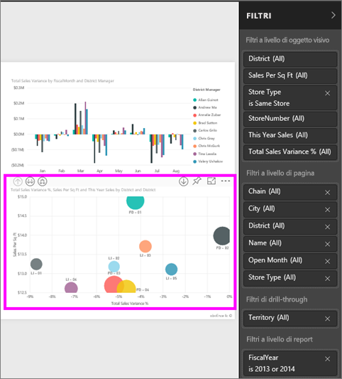

Se accanto ad alcuni filtri è presente la parola **All**, tutti i valori vengono inclusi nel filtro.  Ad esempio, **Chain(All)** nella schermata seguente indica che questa pagina del report include dati relativi a tutte le catene di negozi.  D'altra parte, il filtro a livello di report **FiscalYear è 2013 o 2014** indica che il report include solo i dati per gli anni fiscali 2013 e 2014.

Tutti gli utenti che visualizzeranno il report possono interagire con i filtri.

* Visualizzare i dettagli del filtro di passando il mouse e selezionando la freccia accanto al filtro.
  
   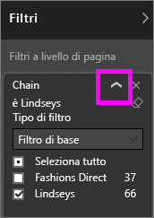
* Modificare il filtro, ad esempio cambiare **Lindseys** in **Fashions Direct**.
  
     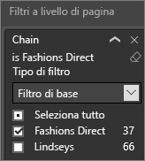

* Reimpostare lo stato originale dei filtri selezionando **Ripristina impostazioni predefinite** nella barra dei menu superiore.    
    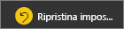
    
* Eliminare il filtro selezionando **x** accanto al nome del filtro.
  
  L'eliminazione di un filtro ne comporta la rimozione dall'elenco, ma non elimina i dati dal report.  Se ad esempio si elimina il filtro **FiscalYear è 2013 o 2014**, i dati dell'anno fiscale rimarranno nel report ma non verranno più filtrati per visualizzare solo 2013 e 2014; verranno invece visualizzati tutti gli anni fiscali presenti nei dati.  Tuttavia, dopo aver eliminato il filtro, non sarà possibile modificarlo nuovamente perché viene rimosso dall'elenco. Un'opzione migliore consiste nel cancellare il filtro selezionando l'icona della gomma .
  
  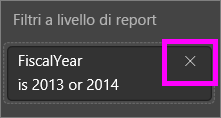

## Filtri nella Visualizzazione di modifica
Quando un report è aperto in Visualizzazione di modifica in Power BI Desktop o nel servizio Power BI, il riquadro Filtri viene visualizzato lungo il lato destro dell'area di disegno report nella metà inferiore del **riquadro Visualizzazione**. Se il riquadro non è visibile, selezionare la freccia nell'angolo superiore destro per espanderlo.

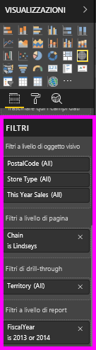.  

Se nell'area di disegno non sono selezionati oggetti visivi, nel riquadro Filtri vengono visualizzati solo i filtri applicabili all'intera pagina del report o all'intero report ed eventuali filtri di drill-through, se configurati. Nell'esempio seguente non sono selezionati oggetti visivi e non sono presenti filtri a livello di pagina o di drill-through, ma è presente un filtro a livello di report.  

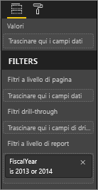  

Se nell'area di disegno viene selezionato un oggetto visivo, verranno visualizzati anche i filtri applicabili solo a tale oggetto visivo:   

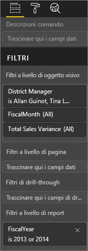

Per visualizzare le opzioni di un filtro specifico, selezionare la freccia rivolta verso il basso accanto al nome del filtro.  Nell'esempio seguente il filtro a livello di report è impostato su 2013 e 2014. Si tratta di un esempio di **filtro di base**.  Per visualizzare le opzioni avanzate, selezionare **Filtro avanzato**.

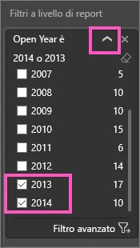

## Eliminare un filtro
 Nella modalità di filtro avanzato o di base selezionare l'icona della gomma  per cancellare il filtro. 

## Aggiungere un filtro
* Nella Visualizzazione di modifica in Power BI Desktop o nel servizio Power BI, aggiungere un filtro a un oggetto visivo, una pagina, un drill-through o un report selezionando un campo dal riquadro Campi e trascinandolo nell'area del filtro appropriato, in cui vengono visualizzate le parole **Trascinare qui i campi dati**. Dopo aver aggiunto un campo come filtro, ottimizzarlo usando i controlli Filtro di base o Filtro avanzato (descritti di seguito).

- **Il trascinamento di un nuovo campo nell'area del filtro a livello di oggetto visivo non consente di aggiungere tale campo all'oggetto visivo**, ma di filtrare l'oggetto visivo in base a questo nuovo campo. Nell'esempio seguente, **Chain** viene aggiunto come un nuovo filtro all'oggetto visivo. Si noti che aggiungendo semplicemente **Chain** come filtro non modifica l'oggetto visivo finché non si usano i controlli Filtro di base o Filtro avanzato.

    

* Tutti i campi usati per creare una visualizzazione sono disponibili anche come filtri. Prima di tutto, selezionare un oggetto visivo per attivarlo. I campi usati nell'oggetto visivo vengono elencati nel riquadro Visualizzazioni e nel riquadro Campi sotto l'intestazione **Filtri a livello di oggetto visivo**.
  
   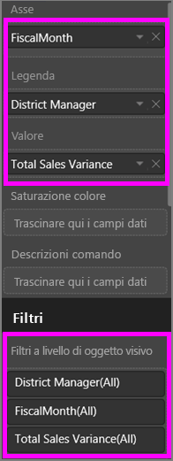  
  
   Ottimizzare qualsiasi campo usando i controlli Filtro di base o Filtro avanzato (descritti di seguito).

## Tipi di filtro: filtri dei campi di testo
### Modalità elenco
Se si seleziona una casella di controllo, il valore corrispondente viene selezionato o deselezionato. Si può usare la casella di controllo **Tutto** per selezionare o deselezionare tutte le caselle di controllo. Le caselle di controllo rappresentano tutti i valori disponibili per il campo.  Man mano che si regola il filtro, la riformulazione si aggiorna in base alle scelte effettuate. 

Si noti che a questo punto la riformulazione indica "è Amarilla o Carretera"

### Modalità avanzata
Selezionare **Filtro avanzato** per passare alla modalità avanzata. Usare i controlli a discesa e le caselle di testo per identificare i campi da includere. Specificando **And** o **Or**, è possibile creare complesse espressioni di filtro. Dopo avere impostato tutti i valori desiderati, selezionare il pulsante **Applica filtro** .  

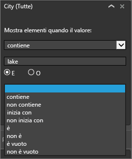

## Tipi di filtro: filtri dei campi numerici
### Modalità elenco
Se i valori sono finiti, quando si seleziona il nome del campo viene visualizzato un elenco.  Per informazioni sull'uso delle caselle di controllo, vedere la sezione **Filtri dei campi di testo**&gt;**Modalità elenco riportata sopra.**   

### Modalità avanzata
Se i valori sono finiti o rappresentano un intervallo, quando si seleziona il nome del campo viene attivata la modalità di filtro avanzato. Usare gli elenchi a discesa e le caselle di testo per specificare un intervallo di valori da visualizzare. 

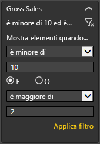

Specificando **And** o **Or**, è possibile creare complesse espressioni di filtro. Dopo avere impostato tutti i valori desiderati, selezionare il pulsante **Applica filtro** .

## Tipi di filtro: data e ora
### Modalità elenco
Se i valori sono finiti, quando si seleziona il nome del campo viene visualizzato un elenco.  Per informazioni sull'uso delle caselle di controllo, vedere la sezione **Filtri dei campi di testo**&gt;**Modalità elenco riportata sopra.**   

### Modalità avanzata
Se i valori dei campi rappresentano una data o un'ora, si può specificare un'ora di inizio/fine quando si usano i filtri Data/Ora.  

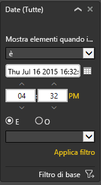

## Passaggi successivi
[Filtri ed evidenziazione nei report](power-bi-reports-filters-and-highlighting.md)  
[Interagire con i filtri e l'evidenziazione nella Visualizzazione di lettura del report](service-reading-view-and-editing-view.md)  
[Creare filtri nella Visualizzazione di modifica del report](power-bi-report-add-filter.md)  
[Modificare il filtro incrociato e l'evidenziazione incrociata tra gli oggetti visivi nel report](service-reports-visual-interactions.md)

Altre informazioni sui [report in Power BI](service-reports.md)  
[Power BI - Concetti di base](service-basic-concepts.md)

Altre domande? [Provare la community di Power BI](http://community.powerbi.com/)

