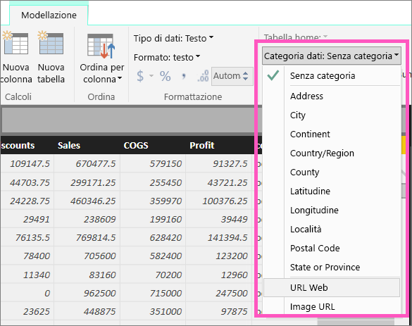
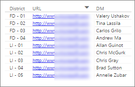
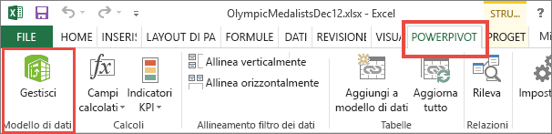
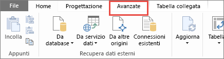
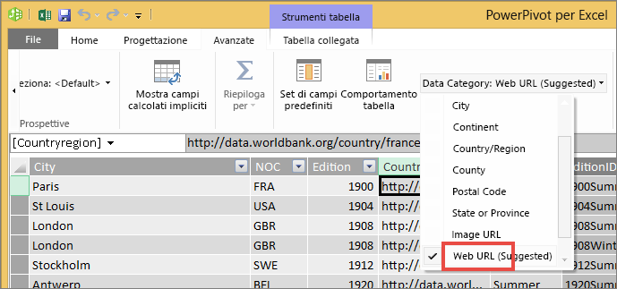
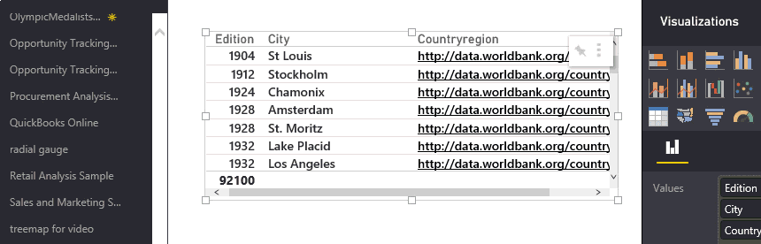

# Collegamenti ipertestuali nelle tabelle
Questo argomento illustra come usare Power BI Desktop per creare collegamenti ipertestuali. Una volta creati, usare Desktop o il servizio Power BI per aggiungere tali collegamenti ipertestuali alle tabelle e alle matrici di report. 

> **NOTA**: i collegamenti ipertestuali nei [riquadri dei dashboard](service-dashboard-edit-tile.md) e [le caselle di testo nei dashboard](service-dashboard-add-widget.md) possono essere creati in tempo reale con il servizio Power BI. I collegamenti ipertestuali nelle [caselle di testo nei report](service-add-hyperlink-to-text-box.md) può creato in volo utilizzare servizio Power BI e Power BI Desktop.
> 
> 

## Per creare un collegamento ipertestuale in una tabella o in una matrice con Power BI Desktop
È possibile creare collegamenti ipertestuali in tabelle e matrici in Power BI Desktop ma non dal servizio Power BI. I collegamenti ipertestuali possono anche essere creati in Excel Power Pivot prima dell'importazione della cartella di lavoro in Power BI. Entrambi i metodi sono descritti di seguito.

## Creare un collegamento ipertestuale alla tabella o alla matrice in Power BI Desktop
La procedura per aggiungere un collegamento ipertestuale varia a seconda che i dati siano stati importati o connessi al server con DirectQuery. Entrambi gli scenari sono descritti di seguito.

### Per i dati importati in Power BI
1. Se il collegamento ipertestuale non esiste già come campo nel set di dati, aggiungerlo come [colonna personalizzata](desktop-common-query-tasks.md) con Power BI Desktop.
2. In Vista dati selezionare la colonna e, nella scheda **Modellazione** scegliere l'elenco a discesa per **Categoria dati**.
   
    
3. Selezionare un **URL Web**.
4. Passare alla Visualizzazione Report e creare una tabella o una matrice usando il campo stato categorizzato come URL Web. I collegamenti ipertestuali saranno di colore blu e sottolineati.
   
    
5. Se non si vuole visualizzare un URL lungo in una tabella, è possibile visualizzare invece un'icona di collegamento ipertestuale . Si noti che non è possibile visualizzare le icone nelle matrici.
   
   * Selezionare il grafico per attivarlo.
   * Selezionare l'icona del rullo  per aprire la scheda Formattazione.
   * Espandere **Valori**, trovare **Icona URL** e selezionare **Sì**.
6. (Facoltativo) [Pubblicare il report dal Desktop a Servizio Power BI](guided-learning/publishingandsharing.yml#step-2) e aprire il report nel Servizio Power BI. I collegamenti ipertestuali funzioneranno anche qui.

### Per i dati connessi con DirectQuery
Non sarà possibile creare una nuova colonna in modalità DirectQuery.  Tuttavia, se i dati contengono già gli URL, è possibile attivarli nei collegamenti ipertestuali.

1. In Visualizzazione Report, creare una tabella usando un campo che contiene gli URL.
2. Selezionare la colonna e, nella scheda **Modellazione**, scegliere l'elenco a discesa per **Categoria dati**.
3. Selezionare un **URL Web**. I collegamenti ipertestuali saranno di colore blu e sottolineati.
4. (Facoltativo) [Pubblicare il report dal Desktop a Servizio Power BI](guided-learning/publishingandsharing.yml#step-2) e aprire il report nel Servizio Power BI. I collegamenti ipertestuali funzioneranno anche qui.

## Creare un collegamento ipertestuale alla tabella o alla matrice in Excel Power Pivot
Un altro modo per aggiungere collegamenti ipertestuali alle tabelle e matrici di Power BI consiste nel creare i collegamenti ipertestuali nel set di dati prima di importare o connettersi a tale set di dati da Power BI. Questo esempio usa una cartella di lavoro di Excel.

1. Aprire la cartella di lavoro in Excel.
2. Selezionare la scheda **PowerPivot** e quindi scegliere **Gestisci**.
   
   
3. Quando PowerPivot viene aperto, selezionare la scheda **Avanzate**.
   
   
4. Posizionare il cursore nella colonna che contiene gli URL da trasformare in collegamenti ipertestuali nelle tabelle di Power BI.
   
   > **NOTA**: gli URL devono iniziare con **http://, https://** o **www**.
   > 
   > 
5. Nel gruppo **Proprietà report** selezionare l'elenco a discesa **Categoria di dati** e scegliere **URL Web**. 
   
   
6. Dal servizio Power BI o da Power BI Desktop connettersi a questa cartella di lavoro o importarla.
7. Creare una visualizzazione tabella che includa il campo URL.
   
   

## Passaggi successivi
[Visualizzazioni nei report di Power BI](power-bi-report-visualizations.md)

[Power BI - Concetti di base](service-basic-concepts.md)

Altre domande? [Provare la community di Power BI](http://community.powerbi.com/)

