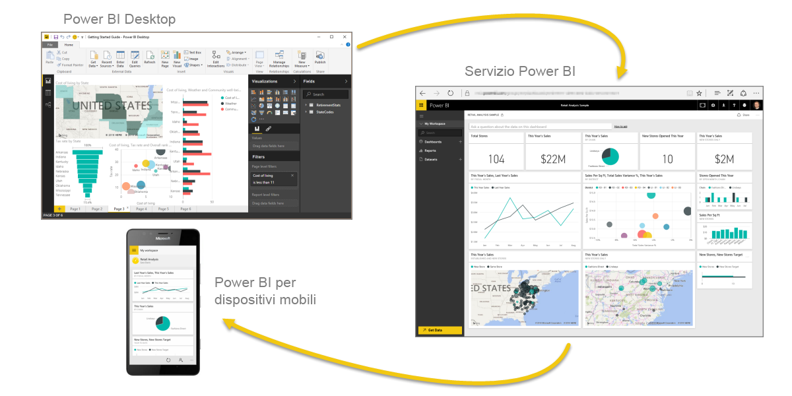
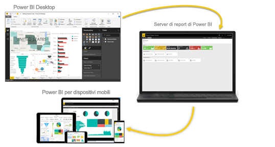

# Che cos'è Power BI?
**Power BI** è una raccolta di servizi software, app e connettori che interagiscono per trasformare le origini dei dati non correlate in un insieme di informazioni coerenti, visivamente accattivanti e interattive. Non importa se i dati provengono da un semplice foglio di calcolo di Excel o da una raccolta di data warehouse ibride basate sul cloud e locali: **Power BI** consente di connettersi facilmente alle origini dati, visualizzare o individuare gli elementi importanti e condividerli con tutti gli utenti selezionati.

**Power BI** può essere semplice e rapido, in grado di ricavare informazioni veloci da un foglio di calcolo di Excel o un database locale. Tuttavia, **Power BI** è anche un prodotto solido e di classe enterprise, pronto per la modellazione su vasta scala e l'analisi in tempo reale, nonché per lo sviluppo personalizzato. Può essere quindi usato come strumento personale per report e visualizzazioni o ricoprire la funzione di motore per le analisi e le decisioni in progetti di gruppo, reparti o intere aziende.

## Gli elementi di Power BI
Power BI è composto da un'applicazione desktop di Windows denominata **Power BI Desktop**, da un servizio SaaS (*Software as a Service*) online detto **servizio Power BI** e da **app** Power BI per dispositivi mobili disponibili per telefoni e tablet Windows, iOS e Android.

Questi tre elementi, **Desktop**, **servizio** e **dispositivi mobili**, sono progettati per consentire agli utenti di creare, condividere e sfruttare al meglio le informazioni aziendali a livello personale o professionale.

## Vantaggi di Power BI in base al ruolo
Il modo di usare Power BI può variare in base al ruolo ricoperto all'interno di un progetto o di un team. È naturale che utenti con un altro ruolo usino Power BI in modo completamente diverso.

Ad esempio, può capitare che un utente usi principalmente il **servizio Power BI** e che i suoi colleghi addetti a calcoli e report aziendali usino invece **Power BI Desktop** per pubblicare i report nel servizio che l'utente iniziale possa quindi visualizzare. Un collega che si occupa di vendite potrebbe sfruttare in misura maggiore l'app per telefoni di Power BI per monitorare l'avanzamento delle quote di vendita e approfondire nuovi dettagli importanti dal proprio dispositivo.

Gli sviluppatori possono usare le API di Power BI per eseguire il push dei dati in un set di dati oppure per incorporare dashboard e report in applicazioni personalizzate. Se si ha un'idea per un nuovo oggetto visivo, è possibile crearlo e condividerlo con altri utenti.  

Può capitare inoltre che gli elementi di **Power BI** vengano usati in momenti diversi a seconda degli obiettivi da raggiungere o del ruolo ricoperto in un determinato progetto o attività.

È possibile sfruttare il servizio per visualizzare l'inventario e l'avanzamento della produzione in un dashboard in tempo reale e usare parallelamente **Power BI Desktop** per creare report per il team sulle statistiche relative al coinvolgimento del cliente. Il modo di impiego di Power BI dipende dalle funzionalità o dai servizi che meglio si adattano alla situazione. L'accessibilità di tutti gli elementi di Power BI è l'aspetto che lo rende uno strumento flessibile ed efficace.

## Il flusso di lavoro in Power BI
Un flusso di lavoro comune in Power BI inizia con la connessione alle origini dati e la creazione di un report in **Power BI Desktop**. Il report viene quindi pubblicato da **Power BI Desktop** nel **servizio Power BI** e condiviso, in modo che gli utenti nel **servizio** e in **Power BI per dispositivi mobili** possano *usarlo* (visualizzarlo e interagire con esso).
A volte può essere utile concedere ai colleghi autorizzazioni simili alle proprie (autorizzazioni di *autore*), in modo che possano usare il **servizio** per modificare report, creare dashboard e condividere il proprio lavoro.

Non è sempre così, ma questo è uno dei flussi di lavoro più comuni e mostra come i principali elementi di Power BI sono integrati tra loro.

Se non si è pronti a passare al cloud e si vogliono mantenere i report dietro un firewall aziendale,  continuare a leggere.

## Creazione di report in locale con il server di report di Power BI
Creare, distribuire e gestire Power BI, i report per dispositivi mobili e impaginati in locale con la gamma di strumenti e servizi pronti per l'uso forniti dal server di report di Power BI.

Server di report di Power BI è una soluzione che si distribuisce dietro il firewall per poi recapitare i report agli utenti appropriati in vari modi, ad esempio per consentire di visualizzarli in un Web browser, in un dispositivo mobile o in un messaggio di posta elettronica. Poiché Server di report di Power BI è compatibile con Power BI nel cloud, quando si sarà pronti sarà possibile passare facilmente al cloud.

## Passaggi successivi
[Accedere, ottenere dati e navigare nel servizio Power BI](service-the-new-power-bi-experience.md)   
[Introduzione al servizio Power BI](service-get-started.md)
