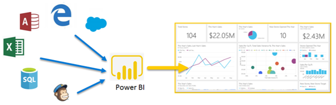

# Che cos'è Power BI?
**Power BI** è una raccolta di servizi software, app e connettori che interagiscono per trasformare le origini dei dati non correlate in un insieme di informazioni coerenti, visivamente accattivanti e interattive. I dati potrebbero essere un foglio di calcolo di Excel o una raccolta di data warehouse basati sul cloud o ibridi locali. Power BI consente facilmente connettersi alle origini dati, visualizzare e scoprire cosa è importante e condividerla con tutti gli utenti o tutti gli utenti desiderati.

Power BI può essere semplice e veloce, in grado di ricavare informazioni veloci da un foglio di calcolo di Excel o un database locale. Ma Power BI è abbastanza potente e di livello aziendale, pronto per la modellazione su vasta scala e analitica in tempo reale, nonché lo sviluppo personalizzato. Può essere personale per report e lo strumento di visualizzazione e anche essere utilizzato come il motore di analitica e delle decisioni per i progetti di gruppi, divisioni o intere aziende.

## Gli elementi di Power BI
Power BI è costituito da: 
- Un'applicazione desktop di Windows denominato **Power BI Desktop**
- Un SaaS online (*Software come servizio*) servizio chiamato il **servizio Power BI** 
- Power BI **App per dispositivi mobili** per dispositivi Android, iOS e Windows

Questi tre elementi&mdash;Power BI Desktop, il servizio e le App per dispositivi mobili&mdash;sono progettati per consentire agli utenti di creare, condividere e utilizzare informazioni aziendali dettagliate in modo che serve, o il proprio ruolo, in modo più efficace.

Un quarto elemento, **Server di report di Power BI**, consente di pubblicare report di Power BI in un server di report in locale dopo la creazione in Power BI Desktop. Altre informazioni sul [server di report Power BI](#on-premises-reporting-with-power-bi-report-server).

## Vantaggi di Power BI in base al ruolo
Il modo di usare Power BI può variare in base al ruolo ricoperto all'interno di un progetto o di un team. Gli altri utenti, in altri ruoli, potrebbero usare Power BI in modo diverso.

Ad esempio, può capitare che un utente usi principalmente il **servizio Power BI** e che i suoi colleghi addetti a calcoli e report aziendali usino invece **Power BI Desktop** per creare i report e pubblicarli nel servizio Power BI, dove l'utente iniziale può visualizzarli. Un altro collega, vendite, potrebbe essere Usa principalmente loro **app Power BI per telefoni** per monitorare lo stato di avanzamento nelle rispettive quote di vendita e approfondire nuovi dettagli di lead di vendita.

Gli sviluppatori possono usare le API di Power BI per eseguire il push dei dati in un set di dati oppure per incorporare dashboard e report in applicazioni personalizzate. Se si ha un'idea per un nuovo oggetto visivo, è possibile crearlo e condividerlo con altri utenti.  

È anche possibile usare ogni elemento di Power BI in momenti diversi, a seconda di ciò che si sta tentando di ottenere o il ruolo per un determinato progetto.

Il modo in cui si usa Power BI può essere basato sulla funzionalità o sul servizio di Power BI che rappresenta lo strumento ottimale per ogni situazione. È possibile visualizzare l'inventario e stato di avanzamento in un dashboard in tempo reale nel servizio Power BI per la produzione, ad esempio, è possibile usare Power BI Desktop per creare report per il proprio team sulle statistiche di engagement dei clienti. Tutte le parti di Power BI sono a disposizione ed è questo il motivo per cui questo strumento è così flessibile ed efficace.

Esplorare i documenti pertinenti al ruolo:
- Power BI per [***responsabili di progettazione***](desktop-what-is-desktop.md)
- Power BI per [***consumer***](consumer/end-user-consumer.md)
- Power BI per [***sviluppatori***](developer/what-can-you-do.md)
- Power BI per [***amministratori***](service-admin-administering-power-bi-in-your-organization.md)

## Il flusso di lavoro in Power BI
Un comune flusso di lavoro in Power BI inizia con la connessione a origini dati e la creazione di un report in Power BI Desktop. Quindi pubblicare il report da Power BI Desktop nel servizio Power BI e condividerlo in modo che gli utenti finali nel servizio Power BI e i dispositivi mobili possono visualizzare e interagire con il report.
Questo flusso di lavoro è comune e illustra le interazioni e la complementarietà dei tre elementi principali di Power BI.

Di seguito viene proposto un [confronto dettagliato tra Power BI Desktop e il servizio Power BI](service-service-vs-desktop.md).

Se non si è pronti a passare al cloud e si vogliono mantenere i report dietro un firewall aziendale,  continuare a leggere.

## Nella creazione di report locale con il Server di Report di Power BI
Creare, distribuire e gestire report di Power BI per dispositivi mobili e impaginati in locale con la gamma di strumenti pronti da usare e servizi forniti dal Server di Report di Power BI.

Server di report di Power BI è una soluzione che si distribuisce dietro il firewall per poi recapitare i report agli utenti appropriati in vari modi, ad esempio per consentire di visualizzarli in un Web browser, in un dispositivo mobile o in un messaggio di posta elettronica. Poiché Server di report di Power BI è compatibile con Power BI nel cloud, quando si sarà pronti sarà possibile passare facilmente al cloud. 

Altre informazioni sul [server di report Power BI](report-server/get-started.md).

## Passaggi successivi
- [Avvio rapido: Consulta la documentazione su nel servizio Power BI](service-the-new-power-bi-experience.md)   
- [Esercitazione: Iniziare a usare il servizio Power BI](service-get-started.md)
- [Avvio rapido: Connettersi ai dati in Power BI Desktop](desktop-quickstart-connect-to-data.md)
