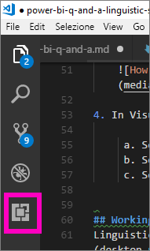
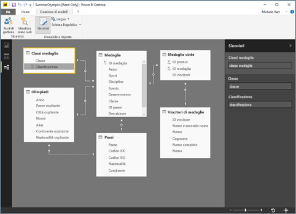
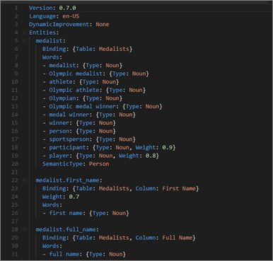

# <a name="language-modeling-and-the-linguistic-schema"></a>Modellazione del linguaggio e schema linguistico 
L'uso del linguaggio naturale e di frasi comuni per porre le domande ai dati è una funzionalità molto potente. Ed è ancora più potente quando i dati rispondono, ovvero quello che fa Domande e risposte in Power BI. Quando si formula una domanda a Domande e risposte in Power BI, il sistema fa del suo meglio per rispondere correttamente. 

Ma per perfezionare l'interazione con Domande e risposte è possibile migliorare la qualità delle risposte, risultato che si può ottenere modificando lo schema linguistico. 

Si parte dai dati aziendali.  Più il modello di dati è di qualità, più sarà facile per gli utenti ottenere risposte appropriate. Uno dei modi per migliorare il modello consiste nell'aggiungere uno schema linguistico che definisce e classifica la terminologia e le relazioni tra i nomi delle tabelle e delle colonne nel set di dati. Power BI Desktop è il luogo in cui gestire gli schemi linguistici. 

## <a name="what-is-a-linguistic-schema"></a>Che cos'è uno schema linguistico
Uno schema linguistico descrive i termini e le frasi che Domande e risposte dovrebbe essere in grado di comprendere in merito agli oggetti contenuti in un set di dati, tra cui le parti del discorso, le formulazioni e i sinonimi correlati a tale set di dati. Quando si importa un set di dati o ci si connette a esso, Power BI crea uno schema linguistico basato sulla struttura del set. Quando si pone una domanda a Domande e risposte, parte una ricerca per recuperare corrispondenze e relazioni nei dati al fine di determinare lo scopo della domanda. Ad esempio, vengono cercati sostantivi, verbi, aggettivi, formulazioni e altri elementi. E vengono cercate anche relazioni, ad esempio, quali colonne sono oggetti di un verbo. 

È probabile che l'utente sappia cosa si intende per parti del discorso (in caso contrario, vedere di seguito), ma le formulazioni potrebbero essere un termine nuovo.  Una formulazione è il modo in cui si descrivono, cioè formulano, le relazioni tra più elementi. Ad esempio, per descrivere la relazione tra clienti e prodotti, si potrebbe dire "i clienti acquistano i prodotti". Oppure, per descrivere la relazione tra clienti ed età, si potrebbe dire "l'età indica quanto sono vecchi i clienti". Oppure, per descrivere la relazione tra clienti e numeri di telefono, si potrebbe dire semplicemente "i clienti hanno numeri di telefono".

Questi formulazioni esistono in una varietà di forme e dimensioni. Alcune corrispondono direttamente alle relazioni presenti nel modello di dati. Alcune fanno riferimento alle colonne e alle tabelle che le contengono. Altre fanno riferimento a più tabelle e colonne in relazioni complesse. In tutti i casi, però, descrivono con termini semplici in che modo gli elementi sono correlati tra loro.

Gli schemi linguistici vengono salvati in formato YAML. Questo formato è correlato a un formato molto diffuso, JSON, ma offre una sintassi più flessibile e più facile da leggere. Gli schemi linguistici possono essere modificati, esportati e importati in Power BI Desktop.

## <a name="prerequisites"></a>Prerequisiti
- Se non si è già letto l'articolo su come [migliorare il modello di dati per Domande e risposte](desktop-qna-in-reports.md), è consigliabile leggere innanzitutto tale articolo. Include numerosi suggerimenti per progettare e migliorare il modello di dati e una sezione importante sull'aggiunta dei sinonimi.  

- Sono due gli aspetti da considerare per Domande e risposte.  Il primo aspetto riguarda la preparazione o "modellazione".  Il secondo aspetto riguarda la formulazione di domande e l'esplorazione dei dati cioè "l'utilizzo". In alcune aziende, c'è un gruppo di dipendenti noti come modellatori di dati o amministratori IT che assemblano i set di dati, creano i modelli di dati e pubblicano i set di dati in Power BI.  Poi c'è un secondo gruppo di dipendenti che comprende coloro che "utilizzano" i dati online.  In altre aziende questi ruoli possono essere combinati. 

    Questo argomento è destinato ai modellatori di dati. Le persone che ottimizzano un set di dati in modo che fornisca i migliori risultati possibili in un'interazione con Domande e risposte. 

- [Esempi di file con estensione yaml e pbix](https://go.microsoft.com/fwlink/?linkid=871858)    
- Come editor dei file YAML si consiglia [Visual Studio Code](https://code.visualstudio.com/)


### <a name="set-up-an-editor-for-yaml-files"></a>Impostare un editor per i file YAML
Si consiglia di usare Visual Studio Code per modificare i file YAML degli schemi linguistici. Visual Studio Code include un supporto pronto all'uso per i file YAML che può essere esteso alla convalida specifica del formato di schema linguistico usato in Power BI.
1. Installare [Visual Studio Code](https://code.visualstudio.com/).    

2. Selezionare lo schema linguistico di esempio salvato in precedenza: [file YAML](https://go.microsoft.com/fwlink/?linkid=871858) (SummerOlympics.lsdl.yaml).    
4. Selezionare **Visual Studio Code** e **Always use this app to open .yaml files** (Usa sempre questa app per aprire i file yaml).

    

4. In Visual Studio Code installare l'estensione YAML Support by Red Hat.

   

    a. Selezionare la scheda **Extensions** (ultima a sinistra) o premere CTRL+MAIUSC+X.    
        
    b. Cercare "yaml" e selezionare **YAML Support by Red Hat** nell'elenco.    
    c. Selezionare **Install > Reload**.


## <a name="working-with-linguistic-schemas"></a>Utilizzo degli schemi linguistici
Gli schemi linguistici possono essere modificati, esportati e importati nella [Visualizzazione relazioni](desktop-relationship-view.md) di Power BI Desktop. Un modo per modificare uno schema linguistico consiste nell'[aggiungere sinonimi nel riquadro **Sinonimi** ](desktop-qna-in-reports.md). Questa operazione non richiede l'apertura del file YAML.




 L'altro modo per modificare uno schema linguistico consiste nell'esportare e modificare direttamente il file YAML.  Quando si modifica un file YAML di schema linguistico, contrassegnare le colonne nella tabella come diversi elementi grammaticali e definire le parole che un collega potrebbe utilizzare per formulare una domanda. Ad esempio, si definiscono le colonne sono il soggetto e l'oggetto del verbo e si aggiungono parole alternative che i colleghi potrebbero usare per fare riferimento alle tabelle, alle colonne e alle misure nel modello. 



Prima di poter modificare uno schema linguistico, è necessario aprirlo, cioè esportarlo da Desktop. Quando si salva di nuovo il file YAML nello stesso percorso, l'operazione viene considerata un'importazione.  Ma è anche possibile importare altri file YAML.  Se, ad esempio, si dispone di un set di dati simile in cui si è lavorato molto per aggiungere parti del discorso, identificare relazioni, creare formulazioni e creare di sinonimi. 

Domande e risposte userà tutte queste informazioni combinandole con gli eventuali miglioramenti che consentono di fornire una migliore risposta, arricchire il completamento automatico e il riepilogo delle domande.


## <a name="edit-a-linguistic-schema"></a>Modifica di uno schema linguistico
Quando si esporta uno schema linguistico da Desktop per la prima volta, la maggior parte o l'intero contenuto del file verrà generato automaticamente dal motore di Domande e risposte. Queste entità, parole (sinonimi), relazioni e formulazioni generate sono contrassegnate dal tag **State: Generated** e sono incluse nel file principalmente per scopi informativi ma possono rappresentare un utile punto di partenza per le proprie modifiche. 

> [!NOTE]
> Il file YAML di esempio incluso in questa esercitazione non contiene i tag **State: Generated** e **State: Deleted** perché è stato preparato appositamente per questa esercitazione. Per visualizzare questi tag, aprire un file con estensione pbix non modificato nella visualizzazione relazioni ed esportare lo schema linguistico.


Quando si reimporta il file dello schema linguistico in Power BI Desktop, qualsiasi valore contrassegnato come **State: Generated** viene effettivamente ignorato, e in un secondo momento rigenerato, pertanto, se si desidera apportare modifiche al contenuto generato, assicurarsi di rimuovere anche il tag corrispondente **State: Generated**. Analogamente, se si desidera rimuovere del contenuto generato, sarà necessario modificare il tag **State: Generated** in **State: Deleted** in modo che non venga rigenerato quando si importa il file dello schema linguistico.

1. Aprire il set di dati in *Visualizzazione relazioni* di Power BI Desktop. 
2. Selezionare la scheda **Creazione di modelli** e scegliere **Esporta lo schema linguistico**.
3. Selezionare Visual Code (o un altro editor).
4. Apportare le modifiche desiderate e salvare il file YAML.
5. In Desktop selezionare **Visualizzazione relazioni > scheda Creazione di modelli > Schema linguistico > Importa lo schema linguistico**.
6. Passare al percorso in cui è stato salvato il file YAML modificato e selezionare il file. Un messaggio di operazione completata informa l'utente che il file dello schema linguistico YAML è stato importato correttamente.

    

### <a name="add-phrasings-to-the-linguistic-schema"></a>Aggiungere formulazioni allo schema linguistico
Una formulazione è il modo in cui si descrivono, cioè formulano, le relazioni tra più elementi. Ad esempio, per descrivere la relazione tra clienti e prodotti, si potrebbe dire "i clienti acquistano i prodotti". Oppure, per descrivere la relazione tra clienti ed età, si potrebbe dire "l'età indica quanto sono vecchi i clienti". O per descrivere la relazione tra atleti e medaglie, si potrebbe dire semplicemente "gli atleti vincono medaglie".

Questi formulazioni esistono in una varietà di forme e dimensioni. Alcune corrispondono direttamente alle relazioni presenti nel modello semantico. Alcune fanno riferimento alle colonne e alle tabelle che le contengono. Altre fanno riferimento a più tabelle e colonne in relazioni complesse. In tutti i casi, però, descrivono con termini semplici in che modo gli elementi sono correlati tra loro.

## <a name="where-do-phrasings-come-from"></a>Da dove provengono le formulazioni?
Molte formulazioni semplici vengono aggiunte automaticamente allo schema linguistico, in funzione della struttura del modello e di alcune supposizioni basate sui nomi delle colonne. ad esempio:
- La maggior parte delle colonne saranno correlate alle tabelle che le contengono con una semplice formulazione come "i prodotti hanno descrizioni".
- Le relazioni dei modelli generano formulazioni predefinite per entrambe le direzioni della relazione, come "gli ordini hanno prodotti" e "i prodotti hanno ordini".
- In base ai nomi delle colonne, alcune relazioni del modello possono ricavare formulazioni predefinite più complesse come "gli ordini sono spediti a città".

Esistono tuttavia moltissimi modi a cui ricorrono gli utenti per parlare di determinate cose che Domande e risposte non è in grado di immaginare. Per queste circostanze è possibile aggiungere manualmente delle formulazioni.


## <a name="why-should-i-add-phrasings"></a>Perché aggiungere formulazioni?
Il primo motivo per cui è utile aggiungere una formulazione è per definire un nuovo termine. Ad esempio, se si desidera poter chiedere "elenca i clienti più vecchi", è necessario innanzitutto insegnare a Domande e risposte cosa si intende per "vecchi". In questo caso si potrebbe aggiungere la formulazione "l'età indica quanto sono vecchi i clienti".

Il secondo motivo per cui è utile aggiungere una formulazione è per risolvere un'ambiguità. La ricerca di parole chiave semplici non dà risultati ottimali quando le parole hanno più di un significato. Ad esempio, "voli per Chicago" è un concetto molto diverso rispetto a "voli da Chicago", ma Domande e risposte non saprà quello che l'utente intende, a meno che non si aggiungano le formulazioni "voli da città di partenza" e "voli per città di arrivo". Analogamente, la distinzione tra "automobili che John ha venduto a Mary" e "automobili che John ha acquistato da Mary" verrà compresa solo dopo che sono state aggiunte le formulazioni "i clienti acquistano le automobili dai dipendenti" e "i dipendenti vendono le automobili ai clienti".

L'ultimo motivo per cui è utile aggiungere formulazioni è migliorare le riformulazioni. Per evitare che Domande e risposte rimandi l'affermazione "Mostra i clienti e i loro prodotti", sarebbe più chiaro dire "Mostra i clienti e i prodotti che hanno acquistato" oppure "Mostra i clienti e i prodotti che hanno guardato", a seconda del modo in cui la domanda è stata intesa. L'aggiunta di formulazioni personalizzate consente alle riformulazioni di essere più esplicite e meno ambigue.


## <a name="what-kinds-of-phrasings-are-there"></a>Che tipi di formulazioni esistono?
Per comprendere i diversi tipi di formulazioni, innanzitutto è necessario ripassare un paio di semplicissimi termini di grammatica:
- Un *sostantivo* è una persona, un luogo o un'operazione. 
    - Esempi: auto, ragazzo, Mario, flusso
- Un *verbo* è un'azione o un modo di essere. 
    - Esempi: covare, scoppiare, divorare, espellere
- Un *aggettivo* è un nome che descrive un sostantivo. 
    - Esempi: potente, magico, dorato, due
- Una *preposizione* è una parola usata prima di un sostantivo per collegarlo a un sostantivo, verbo o aggettivo 
    - Esempi: di, per, con, da
-  Un *attributo* è una qualità o una funzione di un oggetto.
-  Un *nome* è una parola o un gruppo di parole con cui ci si riferisce a una persona, a un animale o a una cosa.   


## <a name="attribute-phrasings"></a>Formulazioni con attributi
Le formulazioni con attributi sono la spina dorsale di Domande e risposte e vengono utilizzate quando un elemento agisce come un attributo di un altro elemento. Sono semplici, dirette e svolgono la maggior parte del carico di lavoro quando non è stata definita una formulazione più sottile o dettagliata. Le formulazioni con attributi vengono costruite usando il verbo di base "avere", ad esempio "i prodotti hanno categorie" e "gli stati hanno città", e consentono automaticamente di formulare delle domande usando le preposizioni "di" e "da", ad esempio "le categorie di prodotti", "ordina per prodotto", e gli aggettivi possessivi "i miei ordini". Le formulazioni con attributi vengono impiegate in domande simili alle seguenti:
- Quali clienti hanno ordini?
- Elenca le città per stato crescente
- Mostra gli ordini contenenti tè
- Elenca i clienti con ordini
- Qual è la categoria di ogni prodotto?
- Conta gli ordini di Robert King    

La grande maggioranza delle formulazioni con attributi necessarie per il modello verrà generata automaticamente in base al contenuto di tabelle e colonne e alle relazioni del modello, pertanto in genere non è necessario crearle personalmente.
Questo è un esempio dell'aspetto che ha una formulazione con attributi all'interno dello schema linguistico:

```json
product_has_category:
  Binding: {Table: Products}
  Phrasings:
  - Attribute: {Subject: product, Object: product.category}
```
 
## <a name="name-phrasings"></a>Formulazioni nominali
Le formulazioni nominali sono utili se il modello di dati prevede una tabella che contiene oggetti denominati, come i nomi di atleti o di clienti. Ad esempio, la formulazione "nomi dei prodotti è come sono chiamati i prodotti" è essenziale per poter usare nomi dei prodotti nelle domande. Mentre una formulazione nominale abilita anche la parola "chiamato" (ad esempio, "Elenca i clienti chiamati John Smith"), è molto importante quando usata in combinazione con altre formulazioni per consentire l'utilizzo di un valore nome per fare riferimento a una particolare riga di tabella. Ad esempio, per "I clienti che hanno acquistato tè", Domande e risposte può indicare che il valore "tè" fa riferimento all'intera riga della tabella di prodotti anziché semplicemente a un valore nella colonna del nome del prodotto. Le formulazioni nominali vengono impiegate in domande simili alle seguenti:    
- Quali dipendenti si chiamano Robert King
- Chi si chiama Ernst Handel
- Sport di Fernand De Montigny
- Numero di atlete chiamate Mary
- Che cosa ha acquistato Robert King?

A patto che si utilizzi una convenzione di denominazione sensata per le colonne nome del modello (ad esempio, "Nome" o "NomeProdotto" anziché "NmPrd"), la maggior parte delle formulazioni nominali necessarie per il modello verrà generata automaticamente, pertanto, in genere, non è necessario crearle personalmente.

Questo è un esempio dell'aspetto che ha una formulazione nominale all'interno dello schema linguistico:

```json
employee_has_name:
  Binding: {Table: Employees}
  Phrasings:
  - Name:
      Subject: employee
      Name: employee.name
```

 
## <a name="adjective-phrasings"></a>Formulazioni aggettivali
Le formulazioni aggettivali definiscono nuovi aggettivi utilizzati per descrivere elementi presenti nel modello. Ad esempio, la formulazione "i clienti soddisfatti sono clienti con valutazione > 6" è necessaria per porre domande quali "Elenca i clienti soddisfatti a Chicago". Esistono diversi tipi di formulazioni aggettivali utilizzabili in situazioni diverse.

Le *formulazioni aggettivali semplici* definiscono un nuovo aggettivo in base a una condizione, ad esempio "i prodotti sospesi sono prodotti con stato = S". Le formulazioni aggettivali semplici vengono impiegate in domande simili alle seguenti:
- Quali prodotti sono sospesi?
- Elenca i prodotti sospesi
- Elenca gli atleti vittoriosi
- Prodotti che sono esauriti

Questo è un esempio dell'aspetto che ha una formulazione aggettivale semplice all'interno dello schema linguistico: product_is_discontinued:

```json
Binding: {Table: Products}
  Conditions:
  - Target: product.discontinued
    Operator: Equals
    Value: true
  Phrasings:
  - Adjective:
      Subject: product
      Adjectives: [discontinued]
```

Le *formulazioni aggettivali* definiscono un nuovo aggettivo basato su un valore numerico che indica l'entità a cui l'aggettivo si riferisce, ad esempio "le lunghezze indicano quanto sono lunghi i fiumi" e "le regioni piccole hanno piccole superfici". Le formulazioni aggettivali di quantità vengono impiegate in domande simili alle seguenti:
- Elenca i fiumi lunghi
- Quali fiumi sono i più lunghi?
- Elenca le regioni più piccole che hanno vinto l'oro al basket
- Quanto è lungo il Rio Grande?

Questo è un esempio dell'aspetto che ha una formulazione aggettivale di quantità all'interno dello schema linguistico: river_has_length:

 ```json
Binding: {Table: Rivers}
  Phrasings:
  - Adjective:
      Subject: river
      Adjectives: [long]
      Antonyms: [short]
      Measurement: river.length
```

Le *formulazioni aggettivali dinamiche* definiscono un set di nuovi aggettivi basati su valori di una colonna del modello, ad esempio "i colori descrivono i prodotti". Le formulazioni aggettivali dinamiche vengono impiegate in domande simili alle seguenti:
- Elenca i prodotti rossi
- Quali prodotti sono verdi?
- Mostra eventi di pattinaggio femminili
- Conta i problemi attivi

Questo è un esempio dell'aspetto che ha una formulazione aggettivale dinamica all'interno dello schema linguistico: product_has_color:
```json
Binding: {Table: Products}
  Phrasings:
  - DynamicAdjective:
      Subject: product
      Adjective: product.color
```

 
## <a name="noun-phrasings"></a>Formulazioni sostantivali
Le formulazioni sostantivali definiscono nuovi nomi che descrivono sottogruppi di elementi nel modello. Spesso includono un qualche tipo di misura o condizione specifica al modello. Ad esempio, per il nostro modello Olimpiadi potrebbe essere opportuno aggiungere formulazioni che distinguono i campioni dai premiati, gli sport con palla dagli sport acquatici, i giochi di squadra rispetto ai giochi individuali, le categorie di età degli atleti (adolescenti, adulti, senior) e così via. Per un database di film si potrebbe aggiungere formulazioni sostantivali come "i fiaschi sono film con profitto netto < 0", in modo da poter porre domande quali "conta i fiaschi per anno". Esistono due formi di formulazioni sostantivali utilizzabili in situazioni diverse.

Le *formulazioni sostantivali semplici* definiscono un nuovo sostantivo basato su una condizione, ad esempio "il consulente è un dipendente per cui tempo pieno = false" e "il campione è un atleta con un numero di medaglie > 5". Le formulazioni sostantivali semplici vengono impiegate in domande simili alle seguenti:

- Quali dipendenti sono consulenti?
- Conta i consulenti a Portland
- Quanti campioni nel 2016

Questo è un esempio dell'aspetto che ha una formulazione sostantivale semplice all'interno dello schema linguistico: employee_is_contractor:

```json
Binding: {Table: Employees}
  Conditions:
  - Target: employee.full_time
    Operator: Equals
    Value: false
  Phrasings:
  - Noun:
      Subject: employee
      Nouns: [contractor]
```

Le *formulazioni sostantivali dinamiche* definiscono un gruppo di nuovi nomi basati su valori di una colonna del modello, ad esempio "i lavori definiscono sottogruppi di dipendenti". Le formulazioni sostantivali dinamiche vengono impiegate in domande simili alle seguenti:

- Elenca i cassieri di Chicago
- Quali dipendenti sono baristi?
- Elenca gli arbitri nel 1992

Questo è un esempio dell'aspetto che ha una formulazione sostantivale dinamica all'interno dello schema linguistico: employee_has_job:

 ```json
Binding: {Table: Employees}
  Phrasings:
  - DynamicNoun:
      Subject: employee
      Noun: employee.job
```

## <a name="preposition-phrasings"></a>Formulazioni con preposizioni
Le formulazioni con preposizioni consentono di descrivere come sono collegati tra loro gli elementi del modello tramite le preposizioni. Ad esempio, la formulazione "le città sono negli stati" migliora la comprensione della domande "conta le città in Francia". Alcune formulazioni con preposizioni sono create automaticamente quando una colonna viene riconosciuta come entità geografica. Le formulazioni con preposizioni vengono impiegate in domande simili alle seguenti:

- Conta i clienti a New York
- Elenca i libri di linguistica
- In quale città lavora John Galt?
- Quanti libri sono per Stephen Pinker?
 
Questo è un esempio dell'aspetto che ha una formulazione con preposizioni all'interno dello schema linguistico: customers_are_in_cities:

 ```json
Binding: {Table: Customers}
  Phrasings:
  - Preposition:
      Subject: customer
      Prepositions: [in]
      Object: customer.city
```

 
## <a name="verb-phrasings"></a>Formulazioni verbali
Le formulazioni verbali consentono di descrivere come sono collegati tra loro gli elementi del modello tramite i verbi. Ad esempio, la formulazione "i clienti acquistano i prodotti" migliora la comprensione delle domande del tipo "chi ha comprato formaggio?" e "che cosa ha acquistato John?" Le formulazioni verbali sono le formulazioni più flessibili, spesso mettono in relazione più di due elementi tra loro, ad esempio "i dipendenti vendono i prodotti ai clienti". Le formulazioni verbali vengono impiegate in domande simili alle seguenti:

- Chi ha venduto cosa a chi?
- Quale dipendente ha venduto tè a John?
- A quanti clienti è stato venduto il tè da Mary?
- Elenca i prodotti che Mary ha venduti a John.
- Quali prodotti sospesi sono stati venduti ai clienti di Chicago dai dipendenti di Boston?

Le formulazioni verbali possono inoltre contenere formulazioni con preposizioni diventando, di conseguenza, ancora più flessibili, ad esempio "gli atleti vincono medaglie ai concorsi" o "i clienti ricevono rimborsi per i prodotti". Le formulazioni verbali con formulazioni con preposizioni vengono impiegate in domande simili alle seguenti:

- Quanti atleti hanno vinto la medaglia d'oro ai campionati Visa?
- Quali clienti hanno ottenuto un rimborso per il formaggio?
- In quale gara Danell Leyva ha vinto la medaglia di bronzo?

Alcune formulazioni verbali sono create automaticamente quando il sistema riconosce che una colonna contiene sia un verbo che una preposizione.

Questo è un esempio dell'aspetto che ha una formulazione verbale all'interno dello schema linguistico: customers_buy_products_from_salespeople:

```json
Binding: {Table: Orders}
  Phrasings:
  - Verb:
      Subject: customer
      Verbs: [buy, purchase]
      Object: product
      PrepositionalPhrases:
      - Prepositions: [from]
        Object: salesperson
```

## <a name="relationships-with-multiple-phrasings"></a>Relazioni con più formulazioni
Spesso, una stessa relazione può essere descritta in più modi. In questo caso, una singola relazione può essere definita da più formulazioni. È piuttosto comune che la relazione tra un'entità di tabella e un'entità di colonna contenga sia una formulazione con attributi che un altro tipo di formulazione. Ad esempio, nella relazione tra cliente e nome del cliente è opportuno che sia presente sia una formulazione con attributi (ad esempio, "i clienti hanno nomi") che una formulazione nominale (ad esempio, "nomi dei clienti è come si chiamano i clienti") affinché sia possibile chiedere entrambi i tipi di domande.

Questo è un esempio dell'aspetto che ha una relazione con due formulazioni all'interno dello schema linguistico: customer_has_name:

  ```json
Binding: {Table: Customers}
  Phrasings:
    - Attribute: {Subject: customer, Object: customer.name}
    - Name:
        Subject: customer
        Object: customer.name
```

Un altro esempio sarebbe aggiungere la formulazione alternativa "i dipendenti vendono i prodotti ai clienti" alla relazione "i clienti acquistano i prodotti dai dipendenti". Si noti che non è necessario aggiungere le variazioni del tipo "i dipendenti vendono i prodotti **ai clienti**" o "i prodotti sono venduti ai clienti **dai dipendenti**", poiché le variazioni del soggetto e dell'oggetto indiretto introdotte dalle preposizione "ai" e "dai" sono dedotte automaticamente da Domande e risposte.

## <a name="considerations-and-troubleshooting"></a>Considerazioni e risoluzione dei problemi
Se si apporta una modifica a un file lsdl.yaml che non è conforme al formato dello schema linguistico, i problemi saranno indicati da una sottolineatura ondulata simile alla seguente: 

    


Altre domande? [Provare la community di Power BI](http://community.powerbi.com/)
