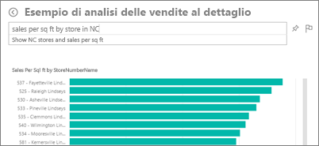
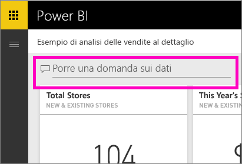
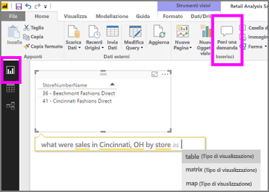

# Domande e risposte nel servizio Power BI e in Power BI Desktop
## Che cosa sono le domande e risposte?
A volte il modo più rapido per ottenere una risposta dai dati consiste nel porre una domanda usando il linguaggio naturale. ad esempio "a quanto ammontano le vendite totali dello scorso anno".  Domande e risposte consente di esplorare i dati tramite funzionalità intuitive basate sul linguaggio naturale e di ricevere le risposte sotto forma di grafici. Domande e risposte è diverso da un motore di ricerca in quanto consente di ottenere risultati relativi solo ai dati in Power BI.

Questo articolo rappresenta il punto di partenza per tutto ciò che riguarda Domande e risposte. Selezionare uno dei collegamenti seguenti per scoprire in che modo funziona Domande e risposte nel servizio Power BI (dashboard e report), in Power BI Desktop (report), in Power BI Embedded e in Power BI per dispositivi mobili.  

> [!NOTE]
> **Domande e risposte di Power BI** supporta solo le risposte alle query in linguaggio naturale espresse in inglese. È anche possibile provare una funzionalità di anteprima per le domande nella lingua spagnola. In **Power BI Desktop** scegliere **File**, **Opzioni e impostazioni**, **Opzioni** e cercare la scheda **Funzionalità di anteprima**. Selezionare la casella **Supporto della lingua spagnola per Domande e risposte di Power BI**.  
>
>

Porre la domanda è solo l'inizio.  È possibile spostarsi tra i dati perfezionando o espandendo la domanda, scoprendo nuove informazioni preziose e usando le caratteristiche di zoom avanti o indietro per visualizzare rispettivamente i dettagli o una vista più ampia. Le informazioni approfondite che si possono individuare sono di qualità eccezionale.

L'esperienza è completamente interattiva... e veloce. Basata su un sistema di archiviazione in memoria, la risposta è quasi istantanea.

##  Domande e risposte per i *consumer*
Quando un collega condivide un dashboard con l'utente corrente, la casella delle domande di Domande e risposte sarà disponibile sul dashboard nel servizio Power BI (app.powerbi.com), nella parte inferiore del dashboard in Power BI per dispositivi mobili e sopra la visualizzazione in Power BI Embedded. Se il proprietario non concede all'utente le autorizzazioni di modifica, sarà possibile usare Domande e risposte per esplorare i dati, ma non sarà possibile salvare le visualizzazioni create con Domande e risposte.

## Domande e risposte per gli *autori*
Per gli *autori* dei report di Power BI o per gli utenti con autorizzazioni di modifica per un set di dati, la casella delle domande di Domande e risposte sarà visualizzata sul dashboard nel servizio Power BI e in ogni pagina del report nel servizio Power BI e in Power BI Desktop. Le visualizzazioni create con Domande e risposte possono essere salvate in un dashboard e in un report.

Oltre a usare Domande e risposte per esplorare i dati, gli autori e i proprietari dei set di dati possono migliorare l'esperienza di Domande e risposte per i consumer [modificando i set di dati](service-prepare-data-for-q-and-a.md), aggiungendo [domande in primo piano](service-q-and-a-create-featured-questions.md) e [abilitando e disabilitando Domande e risposte](service-q-and-a-direct-query.md) per i set di dati delle connessioni in tempo reale locali. Negli [scenari di Power BI Embedded](developer/qanda.md) gli sviluppatori possono scegliere tra due modalità: **interattiva** e **solo risultato**.

## Come fa Domande e rispondere alle domande?
### Quali set di dati usa?
Per poter rispondere a domande specifiche sui dati, Domande e risposte si basa sui nomi delle tabelle, delle colonne e dei campi calcolati presenti nel set di dati sottostante. I nomi usati dall'utente o dal proprietario del set di dati sono quindi fondamentali.

Si supponga ad esempio di avere una tabella di Excel denominata “Vendite”, con le colonne “Prodotto”, “Mese”, “Unità vendute”, “Vendite lorde” e “Profitto”. Si possono porre domande su ognuna di queste entità.  Si può chiedere "mostra *vendite*", "totale *profitto* per *mese*", "ordina *prodotti* per *unità vendute*" e così via.

Domande e risposte è in grado di rispondere alle domande basate sull'organizzazione del set di dati. Come funzionerebbe per i dati in Salesforce? Quando ci si connette al proprio account salesforce.com, Power BI genera automaticamente un dashboard.  Prima di iniziare a porre domande con Domande e risposte, osservare i dati presenti nelle visualizzazioni del dashboard e anche quelli presenti nell'elenco a discesa di Domande e risposte.

* Se i valori e le etichette dell'asse delle visualizzazioni includono "vendite", "account", "mese" e "opportunità", è possibile porre domande come: "Quale *account* ha la massima *opportunità* oppure mostra *vendite* per mese come grafico a barre.
* Se l'elenco a discesa include "venditore", "stato" e "anno", è possibile porre domande come: "quale *venditore* ha realizzato meno *vendite* in *Florida* nel *2013*".

Se si hanno dati relativi alle prestazioni del sito Web in Google Analytics, è possibile chiedere a Domande e risposte di indicare il tempo trascorso su una pagina Web, il numero di visite singole in una pagina e i tassi di coinvolgimento degli utenti. Se invece si cercano dati demografici, è possibile porre domande sull'età e sul reddito familiare per luogo.

### Quali visualizzazioni usa Domande e risposte?
Domande e risposte sceglie la visualizzazione ottimale in base ai dati da visualizzare. Talvolta per i dati nei set di dati sottostanti sono specificati il tipo o la categoria e questo aiuta Domande e risposte a decidere come visualizzarli. Se ad esempio i dati sono definiti come tipo data, è più probabile che vengano visualizzati come grafico a linee. Per i dati classificati come città è invece più probabile che venga usata la visualizzazione mappa.

È anche possibile specificare quale visualizzazione si vuole usare aggiungendola alla domanda. Tenere comunque presente che non sempre Domande e risposte è in grado di visualizzare i dati usando il tipo di visualizzazione richiesto.

Per informazioni sulle parole chiave riconosciute da Domande e risposte, vedere [Suggerimenti per porre domande](service-q-and-a-tips.md).

## Per altri dettagli su Domande e risposte di Power BI
[Panoramica: Come usare Domande e risposte nei dashboard e nei report di Power BI](power-bi-tutorial-q-and-a.md): istruzioni dettagliate sull'uso di Domande e risposte e panoramica sul funzionamento generale.

[App Microsoft Power BI per dispositivi mobili](mobile-apps-ios-qna.md) Per iOS sui dispositivi iPad, iPhone e iPod Touch.

[Microsoft Power BI Embedded](developer/qanda.md) Incorporare Domande e risposte in un'applicazione.

[Suggerimenti per porre domande in Domande e risposte](service-q-and-a-tips.md): informazioni su come parlare a Domande e risposte per ottenere risultati ottimali.

[L'aggiunta di domande in primo piano ai set di dati](service-q-and-a-create-featured-questions.md) e le domande e risposte suggeriranno queste domande ai colleghi.

[Abilitare Domande e risposte per i set di dati locali](service-q-and-a-direct-query.md) Se è necessario un gateway per connettersi al set di dati, usare le impostazioni di Power BI per attivare e disattivare Domande e risposte.

[Esercitazione: Usare Domande e risposte con l'esempio sulle vendite al dettaglio nel servizio Power BI](power-bi-visualization-introduction-to-q-and-a.md): usare Domande e risposte in un'esercitazione realistica.

[Usare correttamente i dati con Domande e risposte](service-prepare-data-for-q-and-a.md): questo argomento è rivolto in particolare alle persone che creano set di dati e modelli di dati  set di dati e modelli di dati.

Altre domande? [Provare la community di Power BI](http://community.powerbi.com/)
