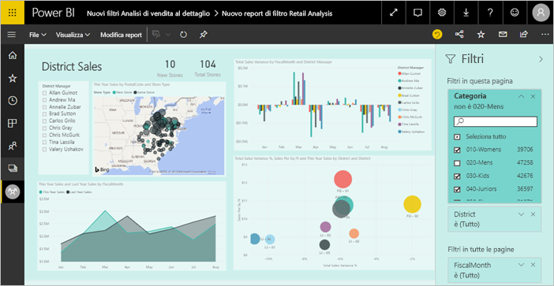

# Aggiungere un filtro a un report in Power BI

[!INCLUDE [power-bi-service-new-look-include](includes/power-bi-service-new-look-include.md)]

Questo articolo illustra come aggiungere un filtro di pagina, di visualizzazione, di report o di drill-through a un report in Power BI. Gli esempi di questo articolo si riferiscono al servizio Power BI. I passaggi sono quasi identici in Power BI Desktop.

**Non tutti lo sanno, ma** Power BI include una nuova esperienza di filtro. Per altre informazioni, vedere [Nuova esperienza di filtro nei report di Power BI](power-bi-report-filter.md).

Power BI offre diversi tipi di filtri, da quello manuale a quello automatico fino ai filtri di drill-through e pass-through. Vedere le informazioni sui [diversi tipi di filtri](power-bi-report-filter-types.md).

## Filtri nella visualizzazione di modifica o nella visualizzazione di lettura
È possibile interagire con i report in due visualizzazioni diverse, ovvero di lettura e di modifica. Le funzionalità di filtro disponibili dipendono dalla visualizzazione aperta. Per i dettagli, vedere [Informazioni su filtri ed evidenziazione nei report di Power BI](power-bi-reports-filters-and-highlighting.md).

Questo articolo descrive come creare filtri nella **visualizzazione di modifica** dei report.  Per altre informazioni sui filtri nella visualizzazione di lettura, vedere [Interagire con i filtri nella visualizzazione di lettura dei report](consumer/end-user-report-filter.md).

Poiché i filtri sono *persistenti*, quando si esce dal report Power BI mantiene il filtro, il filtro dei dati e altre modifiche apportate alla visualizzazione dei dati. Quando si riapre il report è così possibile riprendere da dove ci si era interrotti. Se non si vuole mantenere le modifiche apportate ai filtri, selezionare **Ripristina impostazioni predefinite** sulla barra dei menu superiore.

## Livelli di filtri nel riquadro Filtri
Sia in Power BI Desktop che nel servizio Power BI il riquadro Filtri è visualizzato sul lato destro dell'area di disegno report. Se il riquadro Filtri non è visibile, selezionare l'icona ">" nell'angolo superiore destro per espanderlo.

È possibile impostare i filtri a tre livelli diversi per il report: filtri a livello di oggetto visivo, a livello di pagina e a livello di report. È anche possibile impostare filtri di drill-through. Questo articolo illustra i diversi livelli.

## Aggiungere un filtro a un oggetto visivo
È possibile aggiungere un filtro a livello di oggetto visivo a un oggetto visivo specifico in due modi diversi. 

* Filtrare un campo già usato dalla visualizzazione.
* Identificare un campo non ancora usato dalla visualizzazione e aggiungerlo direttamente al bucket **Filtri a livello di oggetto visivo**.

Questa procedura usa l'esempio di analisi delle vendite al dettaglio, che è possibile scaricare per seguire i passaggi. Scaricare il pacchetto di contenuto dell'[esempio di analisi delle vendite al dettaglio](sample-retail-analysis.md#get-the-content-pack-for-this-sample).

### Filtrare i campi nell'oggetto visivo

1. Selezionare **Altre opzioni (...)**  > **Modifica report** per aprire il report nella visualizzazione di modifica.
   
   

2. Aprire il riquadro Visualizzazioni e Filtri e il riquadro Campi (se non sono già aperti).
   
   
3. Selezionare un oggetto visivo per attivarlo. Tutti i campi usati dall'oggetto visivo sono elencati nel riquadro **Campi** e anche nel riquadro **Filtri** sotto l'intestazione **Filtri a livello di oggetto visivo**.
   
   
4. A questo punto, verrà aggiunto un filtro a un campo già usato dalla visualizzazione. 
   
    Scorrere verso il basso fino all'area **Filtri a livello di oggetto visivo** e scegliere la freccia per espandere il campo da filtrare. In questo esempio il filtro verrà applicato a **StoreNumberName**.
     
     
    
    Impostare i controlli **Filtro di base**, **Filtro avanzato** o **Primi N**. In questo esempio viene eseguita una ricerca di **cha** nel filtro di base e vengono selezionati i cinque negozi trovati.
     
     
   
    L'oggetto visivo cambia per riflettere il nuovo filtro. Se si salva il report insieme al filtro, i lettori del report vedranno inizialmente l'oggetto visivo filtrato e potranno interagire con il filtro nella visualizzazione di lettura selezionando o deselezionando i valori.
     
    
    
    Quando si usa il filtro in un campo usato nell'oggetto visivo in cui il campo è aggregato (ad esempio una somma, una media o un conteggio), si filtra in base al valore *aggregato* in ogni punto dati. Se quindi si applica un filtro all'oggetto visivo in cui **This Year Sales > 500000**, nel risultato sarà presente solo il punto dati **13 - Charleston Fashion Direct**. I filtri in base alle [misure del modello](desktop-measures.md) si applicano sempre al valore aggregato del punto dati.

### Filtrare con un campo non presente nell'oggetto visivo

Aggiungere ora un nuovo campo alla visualizzazione come filtro a livello di oggetto visivo.
   
1. Nel riquadro Campi selezionare il campo da aggiungere come nuovo filtro a livello di oggetto visivo e trascinarlo nell'area **Filtri a livello di oggetto visivo**.  In questo esempio il campo **District Manager** viene trascinato nel bucket **Filtri a livello di oggetto visivo**, viene eseguita la ricerca di **an** e vengono selezionati i tre manager trovati.
     
    

    Si noti che **District Manager***non* è stato aggiunto alla visualizzazione. La visualizzazione è ancora costituita dall'asse **StoreNumberName** e dal valore **This Year Sales**.  
     
    

    La visualizzazione è ora filtrata in modo da mostrare solo le vendite di tali manager per l'anno in corso per i negozi specificati.
     
    

    Se si salva il report insieme al filtro, i lettori del report potranno interagire con il filtro **District Manager** nella visualizzazione di lettura, selezionando o deselezionando i valori.
    
    Se si trascina una *colonna numerica* nel riquadro di filtro per creare un filtro a livello di oggetto visivo, il filtro viene applicato alle *righe di dati sottostanti*. Se, ad esempio, si aggiunge un filtro nel campo **UnitCost** e si imposta **UnitCost** > 20, verranno visualizzati solo i dati per le righe dei prodotti in cui il costo unitario è maggiore di 20, indipendentemente dal costo unitario totale per i punti dati presenti nell'oggetto visivo.

## Aggiungere un filtro a un'intera pagina

È anche possibile aggiungere un filtro a livello di pagina a un'intera pagina.

1. Nel servizio Power BI aprire il report di analisi delle vendite al dettaglio e quindi passare alla pagina **District Monthly Sales**. 

2. Selezionare **...**  > **Modifica report** per aprire il report nella visualizzazione di modifica.
   
   
2. Aprire il riquadro Visualizzazioni e Filtri e il riquadro Campi (se non sono già aperti).
3. Nel riquadro Campi selezionare il campo da aggiungere come nuovo filtro a livello di pagina e trascinarlo nell'area **Filtri a livello di pagina**.  
4. Selezionare i valori da filtrare e impostare il controllo **Filtro di base** o **Filtro avanzato**.
   
   Tutte le visualizzazioni nella pagina vengono ridisegnate in modo da rispecchiare la modifica.
   
   

    Se si salva il report insieme al filtro, i lettori del report potranno interagire con il filtro nella visualizzazione di lettura, selezionando o deselezionando i valori.

## Aggiungere un filtro di drill-through
Con il drill-through nel servizio Power BI e in Power BI Desktop è possibile creare una pagina di report di *destinazione* incentrata su una specifica entità, ad esempio un fornitore, un cliente o un produttore. Dalle altre pagine del report gli utenti possono ora fare clic con il pulsante destro del mouse su un punto dati per tale entità ed eseguire il drill-through fino alla pagina con stato attivo.

### Creare un filtro di drill-through
Per seguire la procedura, scaricare l'[esempio di analisi della redditività dei clienti](sample-customer-profitability.md#get-the-content-pack-for-this-sample). Si supponga di volere una pagina incentrata sulle aree commerciali Executive.

1. Nel servizio Power BI aprire il report di analisi delle vendite al dettaglio e quindi passare alla pagina **District Monthly Sales**.

2. Selezionare **Altre opzioni (...)**  > **Modifica report** per aprire il report nella visualizzazione di modifica.
   
   

1. Aggiungere una nuova pagina al report e denominarla **Team Executive**. Questa pagina sarà la *destinazione* del drill-through.
2. Aggiungere visualizzazioni che tengono traccia delle metriche essenziali per le aree commerciali del team Executive.    
3. Dalla tabella **Executives** trascinare **Executive** all'area Filtri di drill-through.    
   
    
   
    Si noti che Power BI aggiunge una freccia indietro alla pagina del report.  La selezione della freccia indietro riporta gli utenti alla pagina di *origine* del report, ovvero la pagina attiva quando è stato scelto il drill-through. Nella visualizzazione di modifica tenere premuto il tasto CTRL per selezionare la freccia indietro
   
     

### Usare il filtro di drill-through
Di seguito viene illustrato il funzionamento del filtro di drill-through.

1. Aprire la pagina **Team Scorecard** del report.    
2. Si supponga di essere Andrew Ma e di volere visualizzare la pagina del report Team Executive con un filtro che mostra solo i propri dati.  Dal grafico ad area in alto a sinistra fare clic con il pulsante destro del mouse su qualsiasi punto dati verde per aprire l'opzione di menu Drill-through.
   
    
3. Selezionare **Drill-through > Team Executive** per eseguire il drill-through fino alla pagina del report denominata **Team Executive**. La pagina viene filtrata in modo da visualizzare informazioni sul punto dati su cui è stato fatto clic con il pulsante destro del mouse, in questo caso Andrew Ma. I filtri presenti nella pagina di origine vengono applicati alla pagina del report drill-through.  
   
    

## Aggiungere un filtro a livello di report per filtrare un intero report

1. Selezionare **Modifica report** per aprire il report in visualizzazione di modifica.
   
   

2. Aprire i riquadri Visualizzazioni e Filtri e Campi, se non sono già aperti.
3. Nel riquadro Campi selezionare il campo da aggiungere come nuovo filtro a livello di report e trascinarlo nell'area **Filtri a livello di report**.  
4. Selezionare i valori da filtrare.

    Gli oggetti visivi nella pagina attiva e in tutte le pagine del report cambiano in modo da rispecchiare il nuovo filtro. Se si salva il report insieme al filtro, i lettori del report potranno interagire con il filtro nella visualizzazione di lettura, selezionando o deselezionando i valori.

1. Selezionare la freccia indietro per tornare alla pagina precedente del report.

## Considerazioni e risoluzione dei problemi

- Se il riquadro Filtri non è visualizzato, verificare che sia attiva la [Visualizzazione di modifica](service-interact-with-a-report-in-editing-view.md) del report.    
- Se sono state apportate numerose modifiche ai filtri e si vuole ripristinare le impostazioni predefinite dell'autore del report, selezionare **Ripristina impostazioni predefinite** dalla barra dei menu superiore.

## Passaggi successivi
[Presentazione del riquadro Filtri del report](consumer/end-user-report-filter.md)

[Filtri ed evidenziazione nei report](power-bi-reports-filters-and-highlighting.md)

[Tipi diversi di filtri in Power BI](power-bi-report-filter-types.md)

Altre domande? [Provare la community di Power BI](https://community.powerbi.com/)

