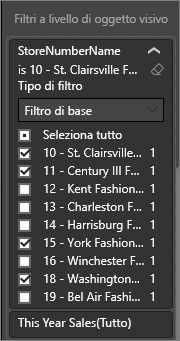
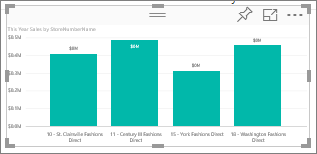
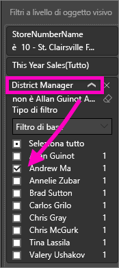
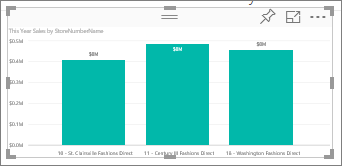

# Aggiungere un filtro a un report del servizio Power BI (in Visualizzazione di modifica)
> [!TIP]
> È consigliabile leggere prima l'articolo [Informazioni su filtri ed evidenziazione nei report di Power BI](power-bi-reports-filters-and-highlighting.md).

Gli esempi di questo articolo mostrano il servizio Power BI. I passaggi sono quasi identici in Power BI Desktop.
> 
> 

## Differenza tra i filtri dei report nella Visualizzazione di lettura e nella Visualizzazione di modifica
Per interagire con i report è possibile usare una di queste modalità: [Visualizzazione di lettura](consumer/end-user-reading-view.md) e [Visualizzazione di modifica](service-interact-with-a-report-in-editing-view.md).  Le funzionalità di filtro disponibili dipendono dalla modalità usata.

* Nella Visualizzazione di modifica è possibile aggiungere filtri a livello di report, pagina e oggetto visivo. I filtri vengono salvati insieme al report. Gli utenti che esaminano il report in Visualizzazione di lettura possono interagire con i filtri aggiunti.
* In Visualizzazione di lettura è possibile interagire con qualsiasi filtro visivo, di report, di pagina e drill-trhough già presente nel report, ma non è possibile aggiungere nuovi filtri. Tuttavia, le modifiche apportate nel riquadro Filtri vengono salvate con il report, anche se questo viene visualizzato in un'app per dispositivi mobili e se chiude il report e lo si riapre successivamente.  

> [!NOTE]
> Questo articolo descrive come creare i filtri nel report **Visualizzazione di modifica**.  Per altre informazioni sui filtri nella Visualizzazione di lettura, vedere [Visualizzazione di lettura e Visualizzazione di modifica nel servizio Power BI](consumer/end-user-reading-view.md).

## Filtri disponibili nel riquadro *Filtri* di Power BI
Sia in Power BI Desktop che nel servizio Power BI il riquadro Filtri è visualizzato sul lato destro dell'area di disegno report. Se il riquadro Filtri non è visibile, selezionare l'icona ">" nell'angolo superiore destro per espanderlo.

Sono disponibili quattro tipi di filtri.

- Il **filtro della pagina** si applica a tutti gli oggetti visivi nella pagina del report     
- Il **filtro visivo** si applica a un singolo oggetto visivo in una pagina del report    
- Il **filtro drill-through** si applica a una singola entità in un report    
- Il **filtro report** si applica a tutte le pagine del report    

    

Poiché i filtri *vengono mantenuti*, quando si esce dal report, Power BI mantiene i filtri, i filtri dei dati e altre modifiche apportate alla visualizzazione dei dati. Di conseguenza, sarà possibile selezionare l'ultimo stato quando si riapre il report. Se non vuole mantenere le modifiche apportate ai filtri, selezionare **Ripristina impostazioni predefinite** dalla barra dei menu superiore.

## Aggiungere un filtro a una visualizzazione specifica (noto anche come filtro visivo)
È possibile eseguire questa operazione in due modi diversi: 

* filtrando un campo già usato dalla visualizzazione
* identificando un campo non ancora usato dalla visualizzazione e aggiungendolo direttamente al bucket **Filtri a livello di oggetto visivo**.

### Applicazione del filtro ai campi già presenti nella visualizzazione
1. Aprire il [report in Visualizzazione di modifica](consumer/end-user-reading-view.md).
   
   
2. Aprire il riquadro Visualizzazioni e Filtri e il riquadro Campi (se non sono già aperti).
   
   
3. Selezionare un oggetto visivo per attivarlo. Tutti i campi usati dall'oggetto visivo vengono identificati ed elencati nel riquadro **Campi** ed elencati anche nel riquadro **Filtri** sotto l'intestazione **Filtri a livello di oggetto visivo**.
   
   
4. A questo punto verrà aggiunto un filtro a un campo già usato dalla visualizzazione. 
   
   * Scorrere verso il basso fino all'area **Filtri a livello di oggetto visivo** e scegliere la freccia per espandere il campo da filtrare. In questo esempio il filtro verrà applicato al campo **StoreNumberName**.
     
       
   * Impostare i controlli **Filtro di base** o **Filtro avanzato** o **Top N** (vedere [Come usare i filtri dei report](consumer/end-user-report-filter.md)). In questo esempio verrà selezionato il filtro di base e verranno aggiunti segni di spunta accanto ai numeri 10, 11, 15 e 18.
     
       
   * L'oggetto visivo cambia per riflettere il nuovo filtro. Se si salva il report insieme al filtro, i lettori del report possono interagire con il filtro nella Visualizzazione di lettura, selezionando o deselezionando i valori.
     
      
5. Alla visualizzazione verrà ora aggiunto un campo completamente nuovo come filtro a livello di oggetto visivo.
   
   * Nel riquadro Campi selezionare il campo da aggiungere come nuovo filtro a livello di oggetto visivo e trascinarlo nell'area **Filtri a livello di oggetto visivo**.  In questo esempio il campo **District Manager** verrà trascinato nel bucket **Filtri a livello di oggetto visivo** e verrà selezionato solo Andrew Ma. 
     
      
   * Si noti che **District Manager** *non* è stato aggiunto alla visualizzazione. La visualizzazione è ancora costituita dall'asse **StoreNumberName** e dal valore **This Year Sales**.  
     
      
   * La visualizzazione è inoltre filtrata in modo da visualizzare solo le vendite di Andrew per quest'anno relative ai negozi specificati.
     
     

## Aggiungere un filtro a un'intera pagina (anche noto come filtro di visualizzazione pagina)
1. Aprire il [report in Visualizzazione di modifica](consumer/end-user-reading-view.md).
2. Aprire il riquadro Visualizzazioni e Filtri e il riquadro Campi (se non sono già aperti).
3. Nel riquadro Campi selezionare il campo da aggiungere come nuovo filtro a livello di pagina e trascinarlo nell'area **Filtri a livello di pagina**.  
4. Selezionare i valori da filtrare e impostare i controlli **Filtro di base** o **Filtro avanzato** (vedere [Come usare i filtri dei report](consumer/end-user-report-filter.md)).
   
   L'intera visualizzazione nella pagina interessata da questo filtro cambia in modo da rispecchiare la modifica. 
   
   

Se si salva il report insieme al filtro, i lettori del report possono interagire con il filtro nella Visualizzazione di lettura, selezionando o deselezionando i valori.

## Aggiungere un filtro di drill-through
Con il drill-through nel servizio Power BI e in Power BI Desktop è possibile creare una pagina di report di *destinazione* incentrata su una specifica entità, ad esempio un fornitore, un cliente o un produttore. Dalle altre pagine del report gli utenti possono ora fare clic con il pulsante destro del mouse su un punto dati per tale entità ed eseguire il drill-through fino alla pagina con stato attivo.

### Creare un filtro di drill-through
Per eseguire la procedura, aprire l'esempio Redditività clienti nella visualizzazione di modifica. Si supponga di volere una pagina incentrata sulle aree commerciali Executive.   

1. Aggiungere una nuova pagina al report e denominarla **Team Executive**. Questa sarà la pagina di *destinazione* del drill-through.
2. Aggiungere visualizzazioni che tengono traccia delle metriche essenziali per le aree commerciali del team Executive.    
3. Aggiungere **Executive > Executive Name** all'area dei filtri di drill-through.    
   
    
   
    Si noti che Power BI aggiunge una freccia indietro alla pagina del report.  La selezione della freccia indietro riporta gli utenti alla pagina di *origine* del report, ovvero la pagina attiva quando è stato scelto il drill-through. La freccia indietro funziona solo nella visualizzazione di lettura.
   
     

### Usare il filtro di drill-through
Di seguito viene illustrato il funzionamento del filtro di drill-through.

1. Aprire la pagina **Team Scorecard** del report.    
2. Si supponga di essere Andrew Ma e di volere visualizzare la pagina del report Team Executive con un filtro che mostra solo i propri dati.  Dal grafico ad area in alto a sinistra fare clic con il pulsante destro del mouse su qualsiasi punto dati verde per aprire l'opzione di menu Drill-through.
   
    
3. Selezionare **Drill-through > Team Executive** per eseguire il drill-through fino alla pagina del report denominata **Team Executive**. La pagina viene filtrata in modo da visualizzare informazioni sul punto dati su cui è stato fatto clic con il pulsante destro del mouse, in questo caso Andrew Ma. Solo il campo nell'area Filtri di drill-through viene passato alla pagina del report di drill-through.  
   
    

## Aggiungere un filtro a un intero report (anche noto come filtro del report)
1. Aprire il [report in Visualizzazione di modifica](consumer/end-user-reading-view.md).
2. Aprire il riquadro Visualizzazioni e Filtri e il riquadro Campi (se non sono già aperti).
3. Nel riquadro Campi selezionare il campo da aggiungere come nuovo filtro a livello di report e trascinarlo nell'area **Filtri a livello di report**.  
4. Selezionare i valori da filtrare con i controlli (vedere [Come usare i filtri dei report](consumer/end-user-report-filter.md).

    Gli oggetti visivi nella pagina attiva e in tutte le pagine del report cambiano in modo da rispecchiare il nuovo filtro. Se si salva il report insieme al filtro, i lettori del report possono interagire con il filtro nella Visualizzazione di lettura, selezionando o deselezionando i valori.

1. Selezionare la freccia indietro per tornare alla pagina precedente del report.

## Considerazioni e risoluzione dei problemi

- In alcune situazioni il filtro a livello di oggetto visivo e il filtro a livello di pagina possono restituire risultati diversi.  Ad esempio, quando si aggiunge un filtro a livello di oggetto visivo, Power BI filtra i risultati aggregati.  L'aggregazione predefinita è Sum, ma è possibile [modificare il tipo di aggregazione](service-aggregates.md).  

    In seguito, quando si aggiunge un filtro a livello pagina, Power BI filtra senza l'aggregazione.  Ciò avviene perché una pagina può contenere numerosi oggetti visivi che possono utilizzare tipi diversi di aggregazione.  Pertanto, il filtro viene applicato su ogni riga di dati.

- Se il riquadro Filtri non è visualizzato, verificare che sia attiva la [Visualizzazione di modifica](service-interact-with-a-report-in-editing-view.md) del report.    
- Se sono state apportate numerose modifiche ai filtri e si vuole ripristinare le impostazioni predefinite dell'autore del report, selezionare **Ripristina impostazioni predefinite** dalla barra dei menu superiore.

## Passaggi successivi
 [Come usare i filtri dei report](consumer/end-user-report-filter.md)

  [Filtri ed evidenziazione nei report](power-bi-reports-filters-and-highlighting.md)

[Interagire con i filtri e l'evidenziazione nella Visualizzazione di lettura del report](consumer/end-user-reading-view.md)

[Modificare il filtro incrociato e l'evidenziazione incrociata tra gli oggetti visivi nel report](consumer/end-user-interactions.md)

Altre domande? [Provare la community di Power BI](http://community.powerbi.com/)

