# Aggiungere un filtro a un report del servizio Power BI (in Visualizzazione di modifica)

Questo articolo illustra come aggiungere un filtro di pagina, di visualizzazione, di report o di drill-through a un report in Power BI. Gli esempi di questo articolo si riferiscono al servizio Power BI. I passaggi sono quasi identici in Power BI Desktop.

## Filtri nella visualizzazione di modifica o nella visualizzazione di lettura
È possibile interagire con i report in due visualizzazioni diverse, ovvero di lettura e di modifica. Le funzionalità di filtro disponibili dipendono dalla visualizzazione aperta. Per i dettagli, vedere [Informazioni su filtri ed evidenziazione nei report di Power BI](power-bi-reports-filters-and-highlighting.md).

Questo articolo descrive come creare filtri nella **visualizzazione di modifica** dei report.  Per altre informazioni sui filtri nella visualizzazione di lettura, vedere [Interagire con i filtri nella visualizzazione di lettura dei report](consumer/end-user-reading-view.md).

## Tipi di filtri nel riquadro Filtri
Sia in Power BI Desktop che nel servizio Power BI il riquadro Filtri è visualizzato sul lato destro dell'area di disegno report. Se il riquadro Filtri non è visibile, selezionare l'icona ">" nell'angolo superiore destro per espanderlo.

Ci sono quattro tipi di filtri: **filtro di pagina**, **filtro visivo**, **filtro di drill-through** e **filtro di report**.

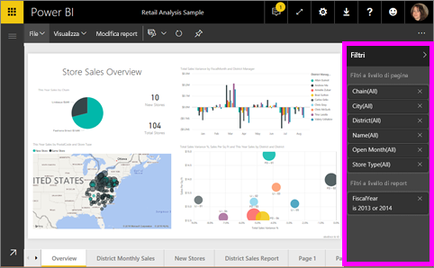

Poiché i filtri sono *persistenti*, quando si esce dal report Power BI mantiene il filtro, il filtro dei dati e altre modifiche apportate alla visualizzazione dei dati. Quando si riapre il report è così possibile riprendere da dove ci si era interrotti. Se non si vuole mantenere le modifiche apportate ai filtri, selezionare **Ripristina impostazioni predefinite** sulla barra dei menu superiore.

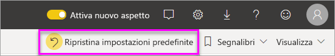

## Aggiungere un filtro a un oggetto visivo
È possibile aggiungere un filtro a un oggetto visivo specifico (noto anche come filtro visivo) in due modi diversi. 

* Filtrare un campo già usato dalla visualizzazione.
* Identificare un campo non ancora usato dalla visualizzazione e aggiungerlo direttamente al bucket **Filtri a livello di oggetto visivo**.

Questa procedura usa l'esempio di analisi delle vendite al dettaglio, che è possibile scaricare per seguire i passaggi. Scaricare l'[esempio di analisi delle vendite al dettaglio](sample-retail-analysis.md).

### Filtrare i campi nell'oggetto visivo

1. Aprire il [report in visualizzazione di modifica](service-the-report-editor-take-a-tour.md).
   
   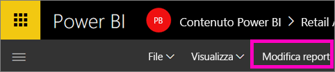
2. Aprire il riquadro Visualizzazioni e Filtri e il riquadro Campi (se non sono già aperti).
   
   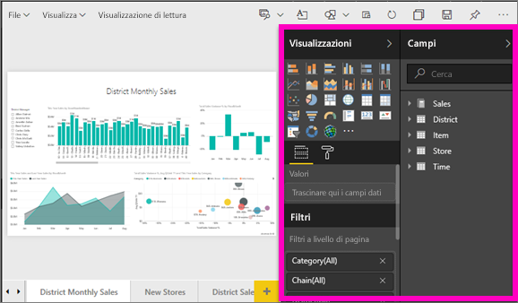
3. Selezionare un oggetto visivo per attivarlo. Tutti i campi usati dall'oggetto visivo sono elencati nel riquadro **Campi** e anche nel riquadro **Filtri** sotto l'intestazione **Filtri a livello di oggetto visivo**.
   
   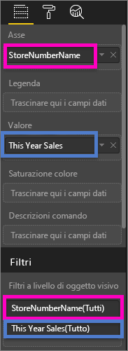
4. A questo punto verrà aggiunto un filtro a un campo già usato dalla visualizzazione. 
   
    Scorrere verso il basso fino all'area **Filtri a livello di oggetto visivo** e scegliere la freccia per espandere il campo da filtrare. In questo esempio il filtro verrà applicato a **StoreNumberName**.
     
    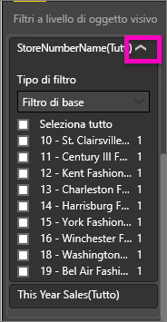 
    
    Impostare i controlli **Filtro di base**, **Filtro avanzato** o **Primi N**. In questo esempio viene eseguita una ricerca di **cha** nel filtro di base e vengono selezionati i cinque negozi trovati.
     
    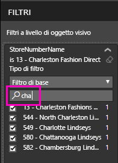 
   
    L'oggetto visivo cambia per riflettere il nuovo filtro. Se si salva il report insieme al filtro, i lettori del report vedranno inizialmente l'oggetto visivo filtrato e potranno interagire con il filtro nella visualizzazione di lettura selezionando o deselezionando i valori.
     
    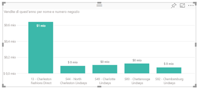

### Filtrare con un campo non presente nell'oggetto visivo

Aggiungere ora un nuovo campo alla visualizzazione come filtro a livello di oggetto visivo.
   
1. Nel riquadro Campi selezionare il campo da aggiungere come nuovo filtro a livello di oggetto visivo e trascinarlo nell'area **Filtri a livello di oggetto visivo**.  In questo esempio il campo **District Manager** viene trascinato nel bucket **Filtri a livello di oggetto visivo**, viene eseguita la ricerca di **an** e vengono selezionati i tre manager trovati. 
     
    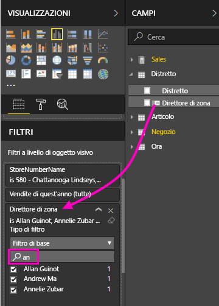

    Si noti che **District Manager** *non* è stato aggiunto alla visualizzazione. La visualizzazione è ancora costituita dall'asse **StoreNumberName** e dal valore **This Year Sales**.  
     
    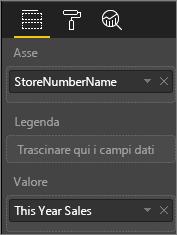

    La visualizzazione è ora filtrata in modo da mostrare solo le vendite di tali manager per l'anno in corso per i negozi specificati.
     
    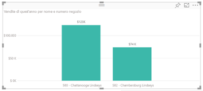

    Se si salva il report insieme al filtro, i lettori del report potranno interagire con il filtro **District Manager** nella visualizzazione di lettura, selezionando o deselezionando i valori.

## Aggiungere un filtro a un'intera pagina

È anche possibile aggiungere un filtro a un'intera pagina (filtro di visualizzazione pagina)
1. Aprire il [report in visualizzazione di modifica](service-the-report-editor-take-a-tour.md).
2. Aprire il riquadro Visualizzazioni e Filtri e il riquadro Campi (se non sono già aperti).
3. Nel riquadro Campi selezionare il campo da aggiungere come nuovo filtro a livello di pagina e trascinarlo nell'area **Filtri a livello di pagina**.  
4. Selezionare i valori da filtrare e impostare il controllo **Filtro di base** o **Filtro avanzato**.
   
   L'intera visualizzazione nella pagina interessata da questo filtro cambia in modo da rispecchiare la modifica. 
   
   

    Se si salva il report insieme al filtro, i lettori del report potranno interagire con il filtro nella visualizzazione di lettura, selezionando o deselezionando i valori.

## Aggiungere un filtro di drill-through
Con il drill-through nel servizio Power BI e in Power BI Desktop è possibile creare una pagina di report di *destinazione* incentrata su una specifica entità, ad esempio un fornitore, un cliente o un produttore. Dalle altre pagine del report gli utenti possono ora fare clic con il pulsante destro del mouse su un punto dati per tale entità ed eseguire il drill-through fino alla pagina con stato attivo.

### Creare un filtro di drill-through
Per eseguire la procedura, aprire l'esempio Redditività clienti nella visualizzazione di modifica. Si supponga di volere una pagina incentrata sulle aree commerciali Executive.   

1. Aggiungere una nuova pagina al report e denominarla **Team Executive**. Questa sarà la pagina di *destinazione* del drill-through.
2. Aggiungere visualizzazioni che tengono traccia delle metriche essenziali per le aree commerciali del team Executive.    
3. Aggiungere **Executive > Executive Name** all'area dei filtri di drill-through.    
   
    
   
    Si noti che Power BI aggiunge una freccia indietro alla pagina del report.  La selezione della freccia indietro riporta gli utenti alla pagina di *origine* del report, ovvero la pagina attiva quando è stato scelto il drill-through. La freccia indietro funziona solo nella visualizzazione di lettura.
   
     

### Usare il filtro di drill-through
Di seguito viene illustrato il funzionamento del filtro di drill-through.

1. Aprire la pagina **Team Scorecard** del report.    
2. Si supponga di essere Andrew Ma e di volere visualizzare la pagina del report Team Executive con un filtro che mostra solo i propri dati.  Dal grafico ad area in alto a sinistra fare clic con il pulsante destro del mouse su qualsiasi punto dati verde per aprire l'opzione di menu Drill-through.
   
    
3. Selezionare **Drill-through > Team Executive** per eseguire il drill-through fino alla pagina del report denominata **Team Executive**. La pagina viene filtrata in modo da visualizzare informazioni sul punto dati su cui è stato fatto clic con il pulsante destro del mouse, in questo caso Andrew Ma. Solo il campo nell'area Filtri di drill-through viene passato alla pagina del report di drill-through.  
   
    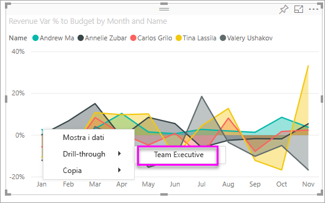

## Aggiungere un filtro a un intero report (anche noto come filtro del report)
1. Aprire il [report in visualizzazione di modifica](service-the-report-editor-take-a-tour.md).
2. Aprire il riquadro Visualizzazioni e Filtri e il riquadro Campi (se non sono già aperti).
3. Nel riquadro Campi selezionare il campo da aggiungere come nuovo filtro a livello di report e trascinarlo nell'area **Filtri a livello di report**.  
4. Selezionare i valori da filtrare.

    Gli oggetti visivi nella pagina attiva e in tutte le pagine del report cambiano in modo da rispecchiare il nuovo filtro. Se si salva il report insieme al filtro, i lettori del report potranno interagire con il filtro nella visualizzazione di lettura, selezionando o deselezionando i valori.

1. Selezionare la freccia indietro per tornare alla pagina precedente del report.

## Considerazioni e risoluzione dei problemi

- In alcune situazioni il filtro a livello di oggetto visivo e il filtro a livello di pagina possono restituire risultati diversi.  Ad esempio, quando si aggiunge un filtro a livello di oggetto visivo, Power BI filtra i risultati aggregati.  L'aggregazione predefinita è Sum, ma è possibile [modificare il tipo di aggregazione](service-aggregates.md).  

    In seguito, quando si aggiunge un filtro a livello pagina, Power BI filtra senza l'aggregazione.  Ciò avviene perché una pagina può contenere numerosi oggetti visivi che possono utilizzare tipi diversi di aggregazione.  Pertanto, il filtro viene applicato su ogni riga di dati.

- Se il riquadro Filtri non è visualizzato, verificare che sia attiva la [Visualizzazione di modifica](service-interact-with-a-report-in-editing-view.md) del report.    
- Se sono state apportate numerose modifiche ai filtri e si vuole ripristinare le impostazioni predefinite dell'autore del report, selezionare **Ripristina impostazioni predefinite** dalla barra dei menu superiore.

## Passaggi successivi
[Presentazione del riquadro Filtri del report](consumer/end-user-report-filter.md)

[Filtri ed evidenziazione nei report](power-bi-reports-filters-and-highlighting.md)

[Interagire con i filtri e l'evidenziazione nella visualizzazione di lettura del report](consumer/end-user-reading-view.md)

[Modificare il filtro incrociato e l'evidenziazione incrociata tra gli oggetti visivi nel report](consumer/end-user-interactions.md)

Altre domande? [Provare la community di Power BI](http://community.powerbi.com/)

