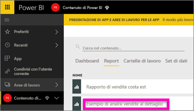
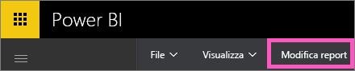
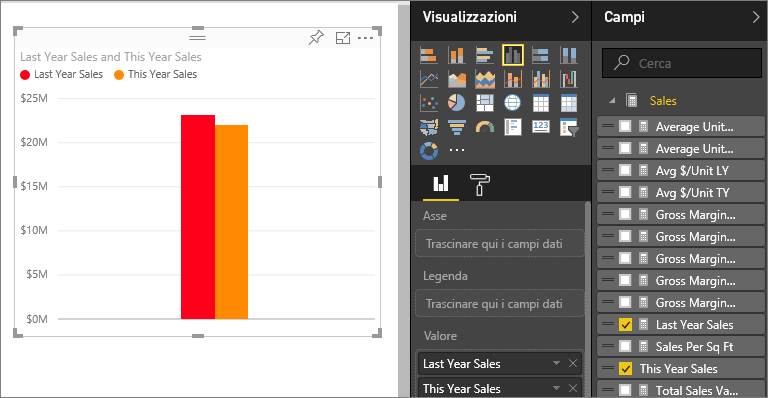
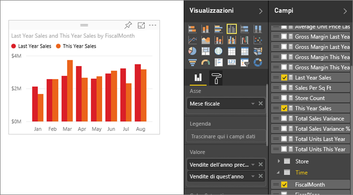
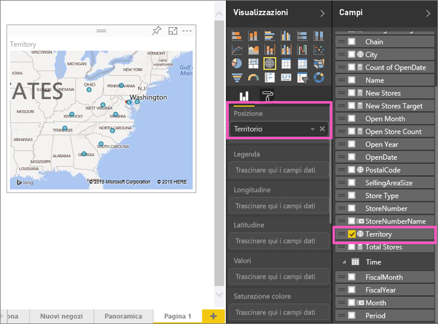
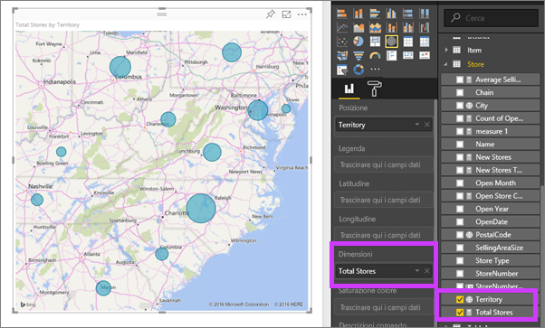
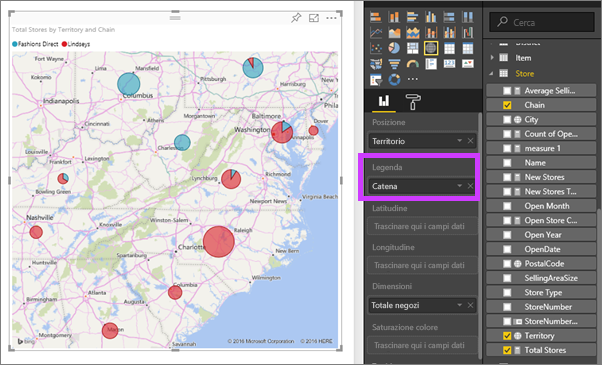

# Parte 2, Aggiungere visualizzazioni a un report di Power BI (esercitazione)
Nella[Parte 1](power-bi-report-add-visualizations-ii.md) è stata creata una visualizzazione di base tramite la selezione delle caselle di controllo accanto ai nomi dei campi.  Nella Parte 2 verrà spiegato come usare il trascinamento della selezione e le funzionalità complete dei riquadri **Campi** e **Visualizzazioni** per creare e modificare le visualizzazioni.

## Creare una nuova visualizzazione
In questa esercitazione verrà esaminato il set di dati relativo all'analisi delle vendite al dettaglio e verranno create alcune visualizzazioni chiave.

### Aprire un report e aggiungere una nuova pagina vuota.
1. Aprire l'area di lavoro in cui è stato salvato l'esempio di analisi delle vendite al dettaglio. Selezionare **Esempio di analisi delle vendite al dettaglio** per aprire il report nella Visualizzazione di lettura.
   
   
2. Selezionare **Modifica report** per aprire il report in Visualizzazione di modifica.
   
   
3. [Aggiungere una nuova pagina](power-bi-report-add-page.md) selezionando l'icona con il segno più (+) di colore giallo nella parte inferiore dell'area di disegno.
   
   

### Aggiungere una visualizzazione relativa al confronto tra le vendite dell'anno corrente e quelle dell'anno scorso.
1. Nella tabella **Sales** selezionare **This Year Sales** > **Value** e **Last Year Sales**. Power BI crea un istogramma.  I risultati sono interessanti ed è utile approfondire l'analisi. Come sono suddivise le vendite per mese?  
   
   
2. Dalla tabella Time trascinare **Month** nell'area **Asse**.  
   
3. [Modificare la visualizzazione](power-bi-report-change-visualization-type.md) in un grafico ad aree.  Sono disponibili molti tipi di visualizzazione. Per scegliere il tipo più appropriato da usare, vedere le apposite [descrizioni, procedure consigliate ed esercitazioni](power-bi-visualization-types-for-reports-and-q-and-a.md). Dal riquadro Visualizzazioni selezionare l'icona del grafico ad aree.
4. Ordinare la visualizzazione selezionando i puntini di sospensione (...) e scegliendo **Ordina per mese**.
5. [Ridimensionare la visualizzazione](power-bi-visualization-move-and-resize.md) selezionandola e trascinando uno dei cerchi sul contorno. Ingrandirla quanto basta per eliminare la barra di scorrimento, ma lasciando spazio sufficiente per aggiungere un'altra visualizzazione.
   
   
6. [Salvare il report](service-report-save.md).

### Aggiungere una visualizzazione della mappa in cui sono inclusi i dati sulle vendite per località
1. Nella tabella **Store** selezionare **Territory**. Power BI riconosce Territory come località e crea una visualizzazione della mappa.  
   
2. Trascinare **Total Stores** nell'area Dimensioni.  
   
3. Aggiungere una legenda.  Per visualizzare i dati in base al nome dell'archivio, trascinare **Chain** nell'area della legenda.  
   

## Passaggi successivi
* Per altre informazioni sul riquadro Campi, vedere [Presentazione dell'editor di report](service-the-report-editor-take-a-tour.md).   
* Per informazioni su come filtrare ed evidenziare le visualizzazioni, vedere [Filtri ed evidenziazione nei report di Power BI](power-bi-reports-filters-and-highlighting.md).  
* Per informazioni sull'uso e la modifica delle aggregazioni, vedere [Aggregati nei report](service-aggregates.md).  
* Altre informazioni sulle [visualizzazioni nei report di Power BI](power-bi-report-visualizations.md).  
* Altre domande? [Provare la community di Power BI](http://community.powerbi.com/).

