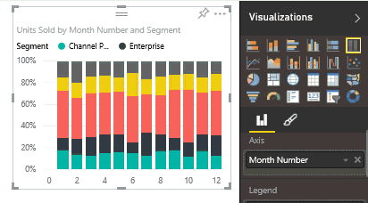

# Modificare il tipo di visualizzazione in un report di Power BI
Provare tipi diversi di visualizzazioni nel servizio Power BI e in Power BI Desktop per individuare quello che descrive meglio i dati. 

1. Aprire un report che include già almeno una visualizzazione.   
2. Nel riquadro Visualizzazioni selezionare il nuovo tipo di visualizzazione.  
   
   

> [!NOTE]
> È possibile [aggiungere la visualizzazione](service-dashboard-pin-tile-from-report.md) al dashboard come riquadro.
> 
> 

Se il tipo di visualizzazione è stato modificato nel report dopo averlo aggiunto al dashboard, il riquadro non verrà aggiornato automaticamente. Quindi, se la visualizzazione è stata aggiunta come grafico a linee ed è stata poi trasformata in un grafico a barre nel report, la versione dei dati già aggiunta resterà sotto forma di grafico a linee. Aggiungere il grafico a barre per visualizzarlo nel dashboard.

### Passaggi successivi
Altre informazioni sulle [visualizzazioni nei report di Power BI](power-bi-report-visualizations.md)

[Power BI - Concetti di base](service-basic-concepts.md)

Altre domande? [Provare la community di Power BI](http://community.powerbi.com/)

