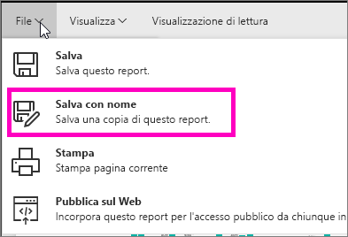
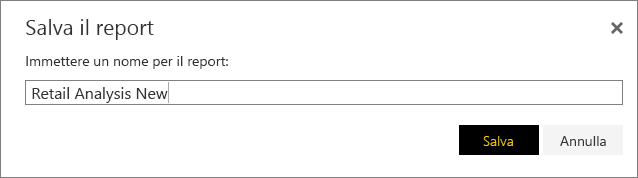
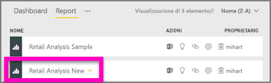

# Creare un nuovo report da un report esistente (copiare un report)
Forse è disponibile un report che si connette già al set di dati e contiene alcuni elementi visivi che si vogliono riutilizzare o modificare.  Perché non copiare semplicemente il report come base per un nuovo report?  A tale scopo:

1. [Aprire un report](consumer/end-user-report-open.md).
2. Dal menu **File** selezionare **Salva con nome**.
   
   
3. Digitare un nome per il nuovo report, quindi selezionare **Salva**.
   
   
   
   Un messaggio di operazione riuscita informa l'utente che il nuovo report è stato salvato nell'area di lavoro corrente in Power BI.
   
   
4. Aprire la scheda **Report** dell'area di lavoro e selezionare il nuovo report per aprirlo. Facoltativamente, eliminare gli elementi visivi che non si vogliono mantenere, modificare altri elementi visivi e aggiungerne di nuovi.
   
   
5. Fare pratica con l'aggiornamento e la modifica del nuovo report.

## Passaggi successivi:
[Creare nuove visualizzazioni](visuals/power-bi-report-add-visualizations-ii.md)

[Eliminare le visualizzazioni](service-delete.md) non necessarie

[Creare un report usando Power BI Desktop](desktop-report-view.md)
