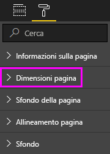

# Impostazioni di visualizzazione della pagina in un report di Power BI
E ovviamente che è fondamentale mantenere in perfetta di pixel del layout del report. In alcuni casi, può essere difficile, poiché i colleghi possono visualizzare tali report su schermi con dimensioni e proporzioni diverse. 

La visualizzazione predefinita è **Adatta alla pagina** e le dimensioni di visualizzazione predefinite sono **16:9**. Per bloccare proporzioni diverse o regolare il report in modo diverso, sono disponibili due strumenti: ***Visualizzazione pagina*** impostazioni e ***dimensioni pagina*** impostazioni.

<iframe width="560" height="315" src="https://www.youtube.com/embed/5tg-OXzxe2g" frameborder="0" allowfullscreen></iframe>

## Dove trovare le impostazioni di visualizzazione pagina nel servizio Power BI e Power BI Desktop
Impostazioni di visualizzazione pagina sono disponibili in Power BI Desktop sia il servizio Power BI, ma l'interfaccia è leggermente diverso. Le sezioni seguenti illustrano dove è possibile trovare le impostazioni di visualizzazione in ogni strumento Power BI.

### In Power BI Desktop
In visualizzazione Report selezionare la scheda **Visualizza** per aprire le impostazioni di visualizzazione pagina e le impostazioni per il layout telefono.

  

### Nel servizio Power BI (app.powerbi.com)
Nel servizio Power BI, aprire un report, quindi scegliere **vista** dalla barra dei menu superiore sinistro.

Impostazioni di visualizzazione pagina sono disponibili in entrambe [visualizzazione di lettura e visualizzazione di modifica](consumer/end-user-reading-view.md). Nella visualizzazione di modifica, il proprietario di un report può assegnare le impostazioni di visualizzazione pagina a singole pagine del report e queste impostazioni vengono salvate con il report. Quando i colleghi aprono il report nella Visualizzazione di lettura, visualizzano le pagine del report con le impostazioni scelte dal proprietario. Nella visualizzazione di lettura, i colleghi possono cambiare *alcuni* delle **visualizzazione pagina** impostazioni, ma le modifiche non vengono salvate all'uscita dal report.

## Impostazioni di Visualizzazione pagina
Il primo set di impostazioni di visualizzazione pagina determina la visualizzazione della pagina del report relativa alla finestra del browser. È possibile scegliere tra:

* **Adatta alla pagina** (impostazione predefinita): Contenuti vengono ridimensionati per adattarsi meglio alla pagina
* **Adatta in larghezza**: Contenuti vengono ridimensionati per adattarsi alla larghezza della pagina della
* **Dimensioni effettive**: Contenuto viene visualizzato a schermo intero

Nel secondo set di controlli di impostazioni di visualizzazione pagina il posizionamento degli oggetti nell'area di disegno report. È possibile scegliere tra:

* **Mostra griglia**: Attivare la griglia per posizionare gli oggetti nell'area di disegno report.
* **Blocca sulla griglia**: Usare con **Mostra griglia** per posizionare e allineare gli oggetti sull'area di disegno report. 
* **Bloccare gli oggetti**: Bloccare tutti gli oggetti nell'area di disegno in modo che non può essere spostati o ridimensionati.
* **Riquadro di selezione**: Il **selezione** riquadro Elenca tutti gli oggetti nell'area di disegno. È possibile decidere quale mostrare e quelli da nascondere.

    

## Impostazioni relative alle dimensioni di pagina

**Dimensioni pagina** impostazioni sono disponibili solo per i proprietari dei report. Nel servizio Power BI (app.powerbi.com), ciò significa la possibilità di aprire il report in [visualizzazione di modifica](consumer/end-user-reading-view.md). **Dimensioni pagina** le impostazioni vengono le **visualizzazioni** riquadro e controllo le proporzioni di visualizzazione e le dimensioni effettive, in pixel, dell'area di disegno report:   

* proporzioni 4:3
* proporzioni 16:9 (impostazione predefinita)
* Cortana
* Lettera
* Personalizzata (altezza e larghezza in pixel)

## Passaggi successivi
[Visualizzazione di report in Power BI Desktop](desktop-report-view.md)

[Modificare le impostazioni di dimensioni pagina nei report di Power BI e visualizzazione pagina](consumer/end-user-report-view.md)

Altre informazioni sui [report in Power BI](consumer/end-user-reports.md)

[Concetti di base per i consumer del servizio Power BI](consumer/end-user-basic-concepts.md)

Altre domande? [Provare la community di Power BI](http://community.powerbi.com/)

