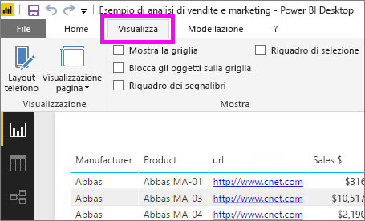
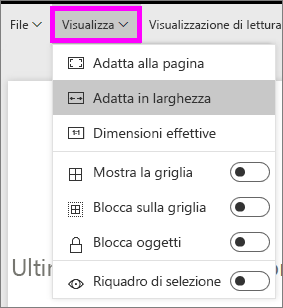
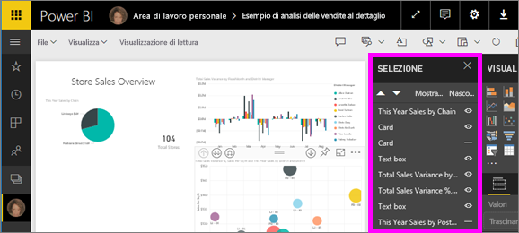
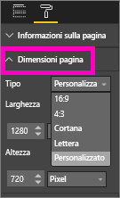

# Impostazioni di visualizzazione della pagina in un report di Power BI
È essenziale mantenere i pixel del layout del report in condizioni perfette. A volte può essere complesso perché gli utenti visualizzano i report su schemi con proporzioni e dimensioni diverse. 

La visualizzazione predefinita è **Adatta alla pagina** e le dimensioni di visualizzazione predefinite sono **16:9**. Per bloccare proporzioni diverse o regolare il report in modo diverso sono disponibili due strumenti: le impostazioni di ***Visualizzazione pagina*** e le impostazioni di ***Dimensioni pagina***.

<iframe width="560" height="315" src="https://www.youtube.com/embed/5tg-OXzxe2g" frameborder="0" allowfullscreen></iframe>

## Dove trovare le impostazioni di visualizzazione pagina nel servizio Power BI e in Power BI Desktop
Le impostazioni di visualizzazione pagina sono disponibili sia nel servizio Power BI sia in Power BI Desktop, con un'interfaccia leggermente diversa. Le due sezioni seguenti spiegano dove si trovano le impostazioni di visualizzazione in ogni strumento Power BI.

### In Power BI Desktop
In visualizzazione Report selezionare la scheda **Visualizza** per aprire le impostazioni di visualizzazione pagina e le impostazioni per il layout telefono.

  

### Nel servizio Power BI (app.powerbi.com)
Nel servizio Power BI aprire un report e selezionare **Visualizza** nella barra dei menu superiore sinistra.

Le impostazioni di Visualizzazione pagina sono disponibili in [Visualizzazione di lettura e Visualizzazione di modifica](consumer/end-user-reading-view.md). In Visualizzazione di modifica il proprietario del report può assegnare le 'impostazioni di Visualizzazione pagina a singole pagine del report e queste impostazioni vengono salvate insieme al report. Quando i colleghi aprono il report nella Visualizzazione di lettura, visualizzano le pagine del report con le impostazioni scelte dal proprietario.  In Visualizzazione di lettura i colleghi possono cambiare *alcune* impostazioni di visualizzazione pagina, ma le modifiche non vengono salvate all'uscita dal report.

##    Impostazioni di Visualizzazione pagina
Il primo set di impostazioni di *Visualizzazione pagina* consente di controllare la visualizzazione della pagina del report relativa alla finestra del browser.  È possibile scegliere tra:

* **Adatta alla pagina** (impostazione predefinita): il contenuto viene ridimensionato in modo che esso si adatti alla pagina
* **Adatta alla larghezza**: il contenuto viene ridimensionato in modo che esso si adatti alla larghezza della pagina
* **Dimensioni effettive**: il contenuto viene visualizzato a schermo intero

Il secondo set di impostazioni di *Visualizzazione pagina* consente di controllare il posizionamento degli oggetti nell'area di disegno del report

* **Mostra la griglia**: attivare la griglia per posizionare gli oggetti nell'area di disegno del report
* **Blocca sulla griglia**: usare questa opzione con **Mostra la griglia** per posizionare e allineare gli oggetti sull'area di disegno del report 
* **Blocca oggetti**: blocca tutti gli oggetti nell'area di disegno per impedirne lo spostamento o il ridimensionamento
* **Riquadro di selezione**: elenca tutti gli oggetti nell'area di disegno e consente di selezionare gli oggetti da visualizzare e quelli da nascondere

    

## Impostazioni di Dimensioni pagina

Le impostazioni di *Dimensioni pagina* sono disponibili solo per i proprietari dei report. Nel servizio Power BI (app.powerbi.com) significa quindi che sono disponibili solo se si può aprire il report in [Visualizzazione di modifica](consumer/end-user-reading-view.md). Queste impostazioni controllano le proporzioni di visualizzazione e le dimensioni effettive (in pixel) dell'area di disegno del report.   

* proporzioni 4:3
* proporzioni 16:9 (impostazione predefinita)
* Cortana
* Lettera
* Personalizzata (altezza e larghezza in pixel)

## Passaggi successivi
[Informazioni su come usare le impostazioni di Visualizzazione pagina e le impostazioni di Dimensioni pagina nei report di Power BI](consumer/end-user-report-view.md).

Altre informazioni sui [report in Power BI](consumer/end-user-reports.md)

[Power BI - Concetti di base](consumer/end-user-basic-concepts.md)

Altre domande? [Provare la community di Power BI](http://community.powerbi.com/)

