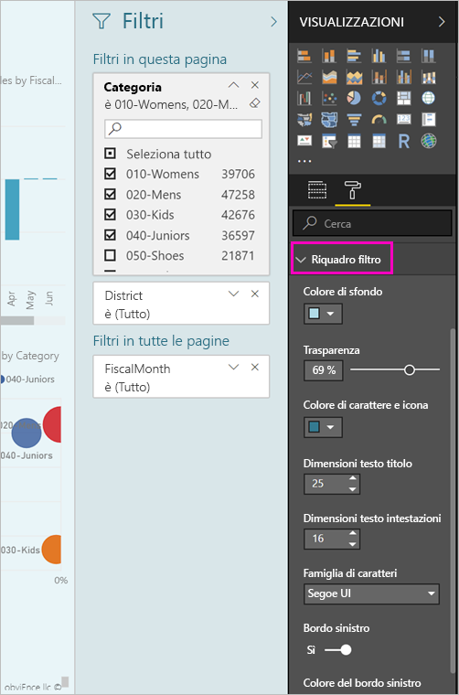
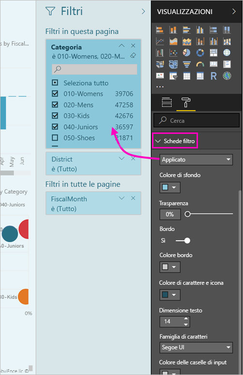

# <a name="the-new-filter-experience-in-power-bi-reports-preview"></a>Nuova esperienza di filtro nei report di Power BI (anteprima)

I filtri in Power BI hanno nuove funzionalità e una nuova progettazione. Quando si acconsente alla nuova esperienza di filtro, è possibile formattare il riquadro filtri come il resto del report. È possibile bloccare e anche nascondere i filtri. Quando si progettano report, non è più visualizzare il riquadro filtri precedente affatto nel riquadro visualizzazioni. A scopo di tutto il filtro di modifica e formattazione in un unico riquadro filtri. 


> [!NOTE]
> La nuova esperienza di filtro è disponibile in anteprima. Le nuove compilazioni possono sostituire la formattazione già impostata.

Come una finestra di progettazione di report, ecco cosa fare nel nuovo riquadro filtri singolo:

- Aggiungere e rimuovere campi da filtrare. 
- Modificare lo stato del filtro.
- Formattare e personalizzare il riquadro filtri, in modo che mi sembra parte del report.
- Determinare se il riquadro Filtri è aperto o compresso per impostazione predefinita quando un utente apre il report.
- Nasconde l'intero riquadro filtri o filtri specifici che non si desidera che gli utenti dei report vedere.
- Controllo segnalibro anche la visibilità, aprire e stato del riquadro filtri di nuovo compresso.
- Bloccare i filtri che gli utenti non devono modificare.

Con la nuova esperienza di filtro, gli utenti dei report possono anche passare il mouse su qualsiasi oggetto visivo per visualizzare un elenco di sola lettura di tutti i filtri o filtri dei dati che interessano tale oggetto visivo.


## <a name="turn-on-the-new-filter-experience"></a>Attivare la nuova esperienza di filtro 

La nuova esperienza viene abilitata in Power BI Desktop, dove è quindi possibile modificare i filtri, oltre che nel servizio Power BI (https://app.powerbi.com). Poiché questa nuova esperienza di filtro è disponibile in anteprima, prima è necessario abilitarla in Power BI Desktop. Se si inizia creando un report nel servizio Power BI, non potrà includere i nuovi filtri.

### <a name="turn-on-new-filters-for-all-new-reports"></a>Attivare i nuovi filtri per tutti i nuovi report

1. In Power BI Desktop selezionare **File** > **Opzioni e impostazioni** > **Opzioni** > **Funzionalità in anteprima** e quindi selezionare la casella di controllo **Nuova esperienza di filtro**. 
2. Riavviare Power BI Desktop per visualizzare la nuova esperienza di filtro in tutti i nuovi report.

Dopo aver riavviato Power BI Desktop, risulta abilitata per impostazione predefinita per tutti i nuovi report creati.  

### <a name="turn-on-new-filters-for-an-existing-report"></a>Attivare i nuovi filtri per un report esistente

È anche possibile abilitare i nuovi filtri per i report esistenti.

1. In Power BI Desktop in un report esistente selezionare **File** > **Opzioni e impostazioni** > **Opzioni**.
2. Nella barra di spostamento a sinistra, sotto **file corrente**, selezionare **impostazioni Report**.
3. Sotto **filtro esperienza**, selezionare **abilitare il riquadro filtro aggiornato e Mostra i filtri nell'intestazione dell'oggetto visivo per il report**.

## <a name="view-filters-for-a-visual-in-reading-mode"></a>Visualizzare i filtri per un oggetto visivo in modalità di lettura

In modalità di lettura passare il mouse sull'icona di filtro per un oggetto visivo per visualizzare un popup con tutti i filtri, i filtri dei dati e così via, che interessano tale oggetto visivo. La formattazione di finestra a comparsa è quello utilizzato per la formattazione di riquadro filtri. 


Ecco i tipi di filtri disponibili in questa visualizzazione: 
- Filtri di base
- Filtri dei dati
- Evidenziazione incrociata 
- Filtro incrociato
- Filtri avanzati
- Primi N filtri
- Filtri per data relativa
- Filtri dei dati sincronizzati
- Filtri di inclusione/esclusione
- Filtri passati tramite un URL

## <a name="build-the-new-filters-pane"></a>Creare il nuovo riquadro filtri

Dopo aver abilitato il nuovo riquadro filtri, viene visualizzata a destra della pagina del report, formattata per impostazione predefinita in base alle impostazioni di report corrente. Per configurare i filtri per includere e aggiornare i filtri esistenti nel nuovo riquadro usare il nuovo riquadro filtri. Il nuovo riquadro filtri mostra quali utenti dei report verranno visualizzato quando si pubblica il report. 

1. Per impostazione predefinita, i tuoi utenti report possono vedere il riquadro filtri. Se non si desidera per visualizzarlo, selezionare l'icona sotto controllo accanto a **filtri**.

    

2. Per iniziare a creare il nuovo riquadro filtri, trascinare i campi di interesse come pagina visual, il nuovo riquadro filtri o filtri a livello di report.

Quando si aggiunge un oggetto visivo a un'area di disegno report, Power BI aggiunge automaticamente un filtro nel riquadro filtri per ogni campo nell'oggetto visivo. 

## <a name="lock-or-hide-filters"></a>Bloccare o nascondere i filtri

È possibile bloccare o nascondere le singole schede filtro. Se si blocca un filtro, gli utenti del report possono visualizzarlo, ma non modificarlo. Se lo si nasconde, non possono nemmeno visualizzarlo. Nascondere le schede filtro è in genere utile se è necessario nascondere i filtri di pulizia dei dati che escludono i valori Null o imprevisti. 

- Nel nuovo riquadro filtri, selezionare o deselezionare i **Zamknout Filtr** oppure **Nascondi filtro** icone in una scheda di filtro.

   

Come si attiva queste impostazioni on e off nel nuovo riquadro filtri, vedrai le modifiche riflesse nel report. I filtri nascosti non vengono visualizzati nel popup dei filtri per un oggetto visivo.

È anche possibile configurare il nuovo stato del riquadro filtri in modo che scorrano con i segnalibri del report. Gli stati di apertura, chiusura e visibilità del riquadro sono tutti contrassegnabili.
 
## <a name="format-the-new-filters-pane"></a>Formattare il nuovo riquadro Filtri

Gran parte di questa nuova esperienza è che è possibile formattare il riquadro filtri in modo da corrispondere l'aspetto del report. È possibile formattare il riquadro filtri in modo diverso per ogni pagina del report. Ecco gli elementi che è possibile formattare: 

- Colore di sfondo
- Trasparenza sfondo
- Bordo attiva o disattiva
- Colore bordo
- Dimensioni del carattere, colori e testo del titolo e l'intestazione

È anche possibile formattare questi elementi per le schede filtro, a seconda che siano applicati (impostati su un valore) o disponibili (cancellati): 

- Colore di sfondo
- Trasparenza sfondo
- Bordo: attivato o disattivato
- Colore bordo
- Carattere, colore e dimensioni del testo
- Colore delle caselle di input

### <a name="format-the-filters-pane-and-cards"></a>Formattare il riquadro filtri e le schede

1. Nel report fare clic sul report stesso o sullo *sfondo*, quindi nel riquadro **Visualizzazioni** selezionare **Formato**. 
    Noterete che le opzioni di formattazione la pagina del report, sfondo e anche il riquadro filtri e le schede di filtro.

        

1. Espandere **Riquadro filtro** per impostare il colore per lo sfondo, l'icona e il bordo sinistro in modo che rispecchino la pagina del report.

    

1. Espandere **Schede filtro** per impostare il colore e il bordo **disponibili** e **applicati**. Se le schede disponibili e applicate hanno colori diversi, è facile capire quali filtri sono applicati. 
  
    

## <a name="theming-for-filter-pane"></a>Tema del riquadro filtro
È ora possibile modificare le impostazioni predefinite del riquadro del filtro con il file di tema. Ecco un frammento di tema di esempio per iniziare a usare:

 
```
"outspacePane": [{ 

"backgroundColor": {"solid": {"color": "#0000ff"}}, 

"foregroundColor": {"solid": {"color": "#00ff00"}}, 

"transparency": 50, 

"titleSize": 35, 

"headerSize": 8, 

"fontFamily": "Georgia", 

"border": true, 

"borderColor": {"solid": {"color": "#ff0000"}} 

}], 

"filterCard": [ 

{ 

"$id": "Applied", 

"transparency": 0, 

"backgroundColor": {"solid": {"color": "#ff0000"}}, 

"foregroundColor": {"solid": {"color": "#45f442"}}, 

"textSize": 30, 

"fontFamily": "Arial", 

"border": true, 

"borderColor": {"solid": {"color": "#ffffff"}}, 

"inputBoxColor": {"solid": {"color": "#C8C8C8"}} 

}, 

{ 

"$id": "Available", 

"transparency": 40, 

"backgroundColor": {"solid": {"color": "#00ff00"}}, 

"foregroundColor": {"solid": {"color": "#ffffff"}}, 

"textSize": 10, 

"fontFamily": "Times New Roman", 

"border": true, 

"borderColor": {"solid": {"color": "#123456"}}, 

"inputBoxColor": {"solid": {"color": "#777777"}} 

}] 
```

## <a name="sort-the-filter-pane"></a>Ordinare il riquadro filtri

La funzionalità di ordinamento personalizzata fa parte della nuova esperienza di riquadro filtro. Gli autori del report è possano trascinare e rilasciare i filtri per ridisporli in ordine di che hanno l'esigenza.


L'ordinamento predefinito è quello alfabetico per i filtri. Per avviare la modalità di ordinamento personalizzato, è sufficiente trascinare qualsiasi filtro in una nuova posizione. È possibile ordinare solo i filtri del livello che si applicano a: ad esempio, un filtro a livello di oggetto visivo, a livello di pagina o a livello di report.

## <a name="filters-pane-scaling"></a>Filtra riquadro scalabilità

Il nuovo riquadro filtri viene ridimensionato con la pagina del report e oggetti visivi, pertanto, la pagina del report e filtra riquadro restano in proporzione tra loro.

## <a name="improved-filters-pane-accessibility"></a>Migliorare l'accessibilità riquadro filtri

È stata migliorata la navigazione tramite tastiera per il nuovo riquadro filtri. È possibile spostarsi tra ogni parte del riquadro filtri e usare la chiave di contesto della tastiera o MAIUSC+F10 per aprire il menu di scelta rapida.


## <a name="rename-filters"></a>Rinominare i filtri
Quando si modifica il riquadro filtri, è possibile fare doppio clic sul titolo per la modifica. La ridenominazione è utile se si desidera aggiornare la scheda di filtro per rendere più utile per gli utenti finali. Tenere presente che la ridenominazione di scheda di filtro viene *non* rinominare il nome visualizzato del campo nell'elenco dei campi. Cambia semplicemente il nome visualizzato utilizzato nella scheda del filtro.


## <a name="restrict-changes-to-filter-type"></a>Limitare le modifiche per tipo di filtro

Sotto l'applicazione di filtri esperienza sezione delle impostazioni di report che disponibile un'opzione per controllare se gli utenti possono modificare il tipo di filtro.


## <a name="next-steps"></a>Passaggi successivi

Provare la nuova esperienza di filtro. Commenti e suggerimenti per questa funzionalità e come è possibile continuare a migliorarla, scegliere il [sito di Power BI Ideas](https://ideas.powerbi.com/forums/265200-power-bi). 

- [Come usare i filtri dei report](consumer/end-user-report-filter.md)
- [Filtri ed evidenziazione nei report](power-bi-reports-filters-and-highlighting.md)

Altre domande? [Provare la community di Power BI](http://community.powerbi.com/)

