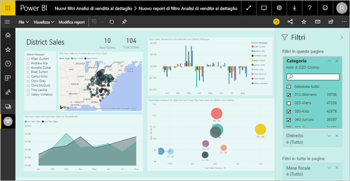
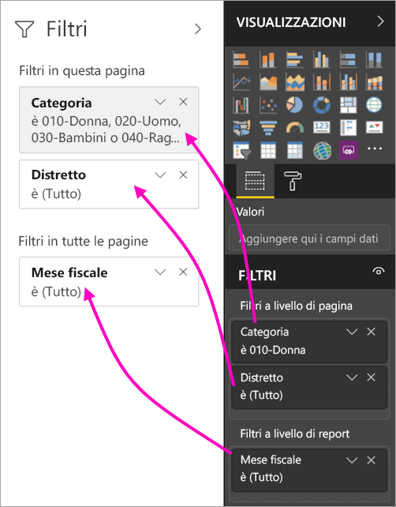
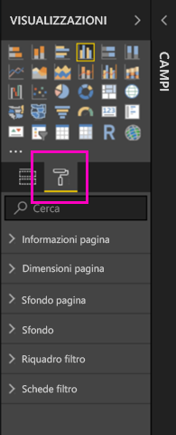
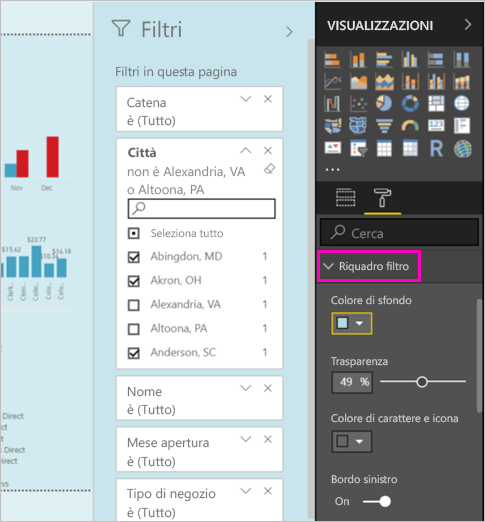
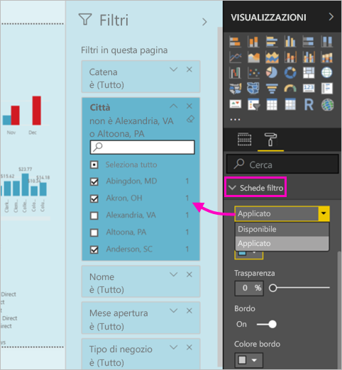

# Nuova esperienza di filtro nei report di Power BI (anteprima)

Questo articolo illustra in dettaglio la nuova esperienza di filtro: I filtri di Power BI hanno nuove funzionalità e un nuovo aspetto grafico. Quando si progettano report in Power BI Desktop o nel servizio Power BI, è possibile fare in modo che l'aspetto e il funzionamento del riquadro Filtri si integrino perfettamente con l'intero report. Nella nuova esperienza il riquadro Filtri precedente funge da riquadro di modifica dei filtri, mentre il nuovo riquadro Filtro è il solo visualizzato dagli utenti dei report. 
 

I nuovi filtri consentono ai responsabili della progettazione report di:

- Mostrare una visualizzazione di sola lettura dei filtri nell'intestazione dell'oggetto visivo, in modo che gli utenti sappiano esattamente quali filtri o filtri dei dati interessano un determinato oggetto visivo.
- Formattare e personalizzare il riquadro filtro in modo che si integri perfettamente nel report.
- Determinare se il riquadro Filtri è aperto o compresso per impostazione predefinita quando un utente apre il report.
- Nascondere l'intero riquadro filtro o filtri specifici che gli utenti dei report non devono visualizzare.
- Controllare e contrassegnare la visibilità e lo stato aperto e compresso del nuovo riquadro filtro.
- Bloccare i filtri che gli utenti non devono modificare.

## Attivare la nuova esperienza di filtro 

La nuova esperienza viene abilitata in Power BI Desktop, dove è quindi possibile modificare i filtri, oltre che nel servizio Power BI (https://app.powerbi.com). Poiché questa nuova esperienza di filtro è disponibile in anteprima, prima è necessario abilitarla in Power BI Desktop. 

### Attivare i nuovi filtri per tutti i nuovi report

1. Selezionare **File** > **Opzioni e impostazioni** > **Opzioni** > **Funzionalità in anteprima** e quindi selezionare la casella di controllo **Nuova esperienza di filtro**. 
2. Riavviare Power BI Desktop per visualizzare la nuova esperienza di filtro in tutti i nuovi report.

Dopo aver riavviato Power BI Desktop, risulta abilitata per impostazione predefinita per tutti i nuovi report creati.  

### Attivare i nuovi filtri per un report esistente

È anche possibile abilitare i nuovi filtri per i report esistenti.

1. In un report esistente selezionare **File** > **Opzioni e impostazioni** > **Opzioni**
2. In **Impostazioni del report** selezionare **Abilita il riquadro del filtro aggiornato e visualizza i filtri nell'intestazione dell'oggetto visivo per questo report**.

## Creare il nuovo riquadro filtro

Dopo essere stato abilitato, il nuovo riquadro filtro viene visualizzato a destra della pagina del report, formattato per impostazione predefinita in base alle impostazioni del report correnti. Il riquadro filtri precedente ora funziona come riquadro di modifica dei filtri. Il nuovo riquadro filtro mostra che cosa vedranno gli utenti dei report quando si pubblicherà il report. È possibile aggiornare i filtri esistenti nel nuovo riquadro, ma si usa il riquadro filtro precedente per configurare i filtri da includere.

1. Decidere prima di tutto se si vuole che gli utenti del report visualizzino il riquadro filtro. Se si decide che possono visualizzarlo, selezionare l'icona a forma di occhio  accanto a Filtri.

2. Per iniziare a creare il nuovo riquadro filtro, trascinare i campi desiderati nel riquadro di modifica dei filtri come filtri a livello di oggetto visivo, pagina o report. Verranno visualizzati nel nuovo riquadro Filtri.

    

Quando si aggiunge un oggetto visivo a un'area di disegno report, Power BI aggiunge automaticamente un filtro per ogni campo nell'oggetto visivo. Power BI non aggiungere questi filtri automatici al riquadro filtro di sola lettura. È necessario selezionare l'icona a forma di occhio per aggiungerli in modo esplicito.

 
## Bloccare o nascondere i filtri

È possibile bloccare o nascondere le singole schede filtro. Se si blocca un filtro, gli utenti del report possono visualizzarlo, ma non modificarlo. Se lo si nasconde, non possono nemmeno visualizzarlo. Nascondere le schede filtro è in genere utile se è necessario nascondere i filtri di pulizia dei dati che escludono i valori Null o imprevisti. 

- Nel riquadro di modifica dei filtri selezionare o deselezionare le icone **Blocca filtro** o **Nascondi filtro** in una scheda filtro.

   

Quando si attivano o si disattivano queste impostazioni nel riquadro di modifica dei filtri, le modifiche vengono rispecchiate nel nuovo riquadro filtro. I filtri nascosti non vengono visualizzati nel popup dei filtri per un oggetto visivo.

È anche possibile configurare lo stato del riquadro filtro in modo che segua i segnalibri del report. Gli stati di apertura, chiusura e visibilità del riquadro sono tutti contrassegnabili.
 
## Formattare il nuovo riquadro Filtri

Un aspetto interessante di questa nuova esperienza è la possibilità di formattare l'aspetto del riquadro filtro in modo che rispecchi quello del report. È possibile formattare il riquadro filtro in modo diverso per ogni pagina del report. Ecco gli elementi che è possibile formattare: 

- Colore di sfondo
- Trasparenza sfondo
- Bordo del riquadro filtro attivato o disattivato
- Colore del bordo del riquadro filtro

È anche possibile formattare questi elementi per le schede filtro, a seconda che siano applicati (impostati su un valore) o disponibili (cancellati): 

- Colore di sfondo
- Trasparenza sfondo
- Bordo: attivato o disattivato
- Colore bordo

### Impostare il formato per il riquadro Filtri e le schede

1. Nel report fare clic sul report stesso o sullo *sfondo*, quindi nel riquadro **Visualizzazioni** selezionare **Formato**. 
    Vengono visualizzate le opzioni per formattare la pagina del report, lo sfondo e anche il riquadro filtro e le schede filtro.

        

1. Espandere **Riquadro filtro** per impostare il colore per lo sfondo, l'icona e il bordo sinistro in modo che rispecchino la pagina del report.

    

1. Espandere **Schede filtro** per impostare il colore e il bordo **disponibili** e **applicati**. Se le schede disponibili e applicate hanno colori diversi, è facile capire quali filtri sono applicati. 
  
    

## Visualizzare i filtri per un oggetto visivo in modalità di lettura

In modalità di lettura è possibile passare il mouse su un oggetto visivo e visualizzare un popup con tutti i filtri, i filtri dei dati e così via, che interessano tale oggetto visivo. La formattazione del popup è la stessa usata per la formattazione del riquadro filtro. 

Ecco i tipi di filtri disponibili in questa visualizzazione: 
- Filtri di base
- Filtri dei dati
- Evidenziazione incrociata 
- Filtro incrociato
- Filtri avanzati
- Primi N filtri
- Filtri per data relativa
- Filtri dei dati sincronizzati
- Filtri di inclusione/esclusione
- Filtri passati tramite un URL

## Presto disponibile

Nei prossimi mesi verranno incorporati i miglioramenti seguenti:
- Possibilità di modificare l'ordine delle schede filtro
- Esperienza del riquadro filtro unica per i creatori di report 
- Altre opzioni di formattazione

Provare la nuova esperienza di filtro. Inviare commenti e suggerimenti su questa funzionalità e su come poter migliorare questa esperienza. 

## Passaggi successivi
[Come usare i filtri dei report](consumer/end-user-report-filter.md)

[Filtri ed evidenziazione nei report](power-bi-reports-filters-and-highlighting.md)

[Interagire con i filtri e l'evidenziazione nella Visualizzazione di lettura del report](consumer/end-user-reading-view.md)

[Modificare il filtro incrociato e l'evidenziazione incrociata tra gli oggetti visivi nel report](consumer/end-user-interactions.md)

Altre domande? [Provare la community di Power BI](http://community.powerbi.com/)

