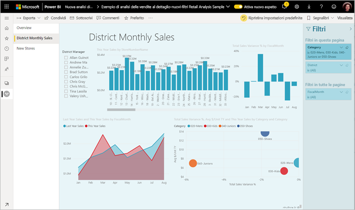
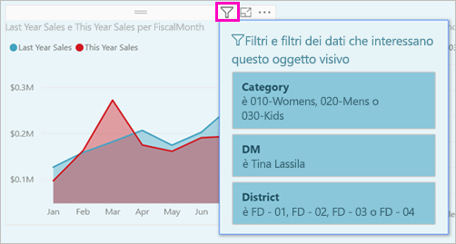
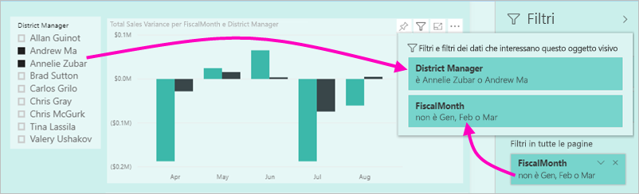
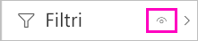
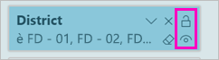
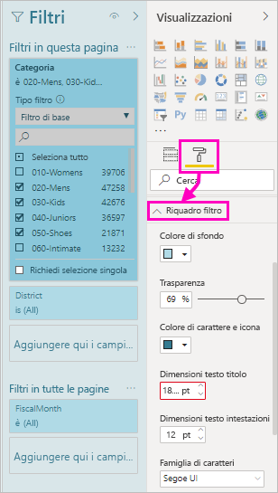
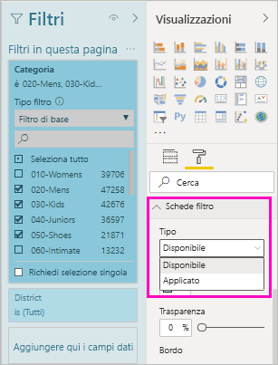
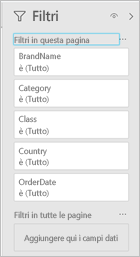
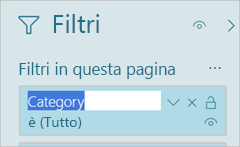
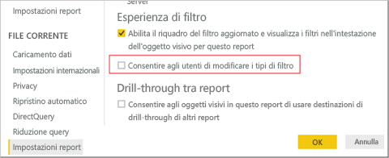

# <a name="work-with-filters-in-power-bi-reports"></a>Usare i filtri nei report di Power BI

I filtri di Power BI hanno nuove funzionalità e un nuovo aspetto grafico. Quando si sceglie di usare la nuova esperienza di filtro, è possibile formattare il riquadro Filtri in modo analogo al resto del report. È possibile bloccare i filtri e anche nasconderli. Quando si progetta un report, non viene più visualizzato il riquadro Filtri precedente nel riquadro Visualizzazioni. Tutte le operazioni di modifica e formattazione vengono eseguite in un unico riquadro Filtri. 



Di seguito sono elencate alcune delle operazioni che si possono eseguire nel nuovo riquadro unico Filtri durante la progettazione di report:

- Aggiungere e rimuovere campi da usare per il filtro. 
- Modificare lo stato del filtro.
- Formattare e personalizzare il riquadro Filtri in modo che abbia un aspetto analogo a quello del report.
- Determinare se il riquadro Filtri è aperto o compresso per impostazione predefinita quando un utente apre il report.
- Nascondere l'intero riquadro Filtri oppure filtri specifici che gli utenti dei report non devono visualizzare.
- Controllare e contrassegnare la visibilità e lo stato aperto e compresso del nuovo riquadro Filtri.
- Bloccare i filtri che gli utenti non devono modificare.

Con la nuova esperienza di filtro, gli utenti dei report possono anche passare il puntatore su qualsiasi oggetto visivo per visualizzare un elenco di sola lettura di tutti i filtri o i filtri dei dati che interessano tale oggetto visivo.



## <a name="turn-on-the-new-filter-experience"></a>Attivare la nuova esperienza di filtro 

La nuova esperienza di filtro è attivata per impostazione predefinita per i nuovi report. È possibile abilitare la nuova esperienza per i report esistenti in Power BI Desktop o nel servizio Power BI.

### <a name="turn-on-new-filters-for-an-existing-report-in-power-bi-desktop"></a>Attivare i nuovi filtri per un report esistente in Power BI Desktop

1. In Power BI Desktop in un report esistente selezionare **File** > **Opzioni e impostazioni** > **Opzioni**.
2. Nel riquadro di spostamento selezionare **Impostazioni report** in **File corrente**.
3. In **Esperienza di filtro** selezionare **Abilita il riquadro del filtro aggiornato e visualizza i filtri nell'intestazione dell'oggetto visivo per questo report**.

### <a name="turn-on-new-filters-for-an-existing-report-in-the-service"></a>Attivare i nuovi filtri per un report esistente nel servizio

Se è stato attivato il **nuovo aspetto** nel servizio Power BI , la nuova esperienza di filtro viene attivata automaticamente. Vedere altre informazioni sul [nuovo aspetto nel servizio Power BI.](service-new-look.md)

Se non è stato attivato il nuovo aspetto, è comunque possibile visualizzare la nuova esperienza di filtro seguendo questa procedura.

1. Nel servizio Power BI selezionare la scheda **Report** nell'elenco del contenuto per un'area di lavoro.
2. Individuare il report che si vuole abilitare e selezionare l'icona **Impostazioni** per il report.
3. In **Esperienza di filtro** selezionare **Abilita il riquadro del filtro aggiornato e visualizza i filtri nell'intestazione dell'oggetto visivo per questo report**.

    

## <a name="view-filters-for-a-visual-in-reading-mode"></a>Visualizzare i filtri per un oggetto visivo in modalità di lettura

In modalità di lettura passare il mouse sull'icona di filtro per un oggetto visivo per visualizzare un elenco di filtri popup con tutti i filtri, i filtri dei dati e così via, che interessano tale oggetto visivo. La formattazione dell'elenco di filtri popup è la stessa usata per la formattazione del riquadro Filtri. 



Ecco i tipi di filtri disponibili in questa visualizzazione: 
- Filtri di base
- Filtri dei dati
- Evidenziazione incrociata 
- Filtro incrociato
- Filtri avanzati
- Primi N filtri
- Filtri per data relativa
- Filtri dei dati sincronizzati
- Filtri di inclusione/esclusione
- Filtri passati tramite un URL

## <a name="build-the-new-filters-pane"></a>Creare il nuovo riquadro Filtri

Dopo essere stato abilitato, il nuovo riquadro Filtri viene visualizzato a destra della pagina del report, formattato per impostazione predefinita in base alle impostazioni del report correnti. È possibile usare il nuovo riquadro Filtri per configurare i filtri da includere e per aggiornare i filtri esistenti nel nuovo riquadro. Il nuovo riquadro Filtri mostra che cosa vedranno gli utenti quando si pubblica il report. 

1. Per impostazione predefinita, gli utenti del report possono vedere il riquadro Filtri. Se si vuole fare in modo che gli utenti non lo vedano, selezionare l'icona a forma di occhio accanto a **Filtri**.

    

2. Per iniziare a creare il nuovo riquadro Filtri, trascinare i campi desiderati nel nuovo riquadro come filtri a livello di oggetto visivo, pagina o report.

Quando si aggiunge un oggetto visivo a un'area di disegno report, Power BI aggiunge automaticamente un filtro al riquadro Filtri per ogni campo nell'oggetto visivo. 

## <a name="lock-or-hide-filters"></a>Bloccare o nascondere i filtri

È possibile bloccare o nascondere le singole schede filtro. Se si blocca un filtro, gli utenti del report possono visualizzarlo, ma non modificarlo. Se lo si nasconde, non possono nemmeno visualizzarlo. Nascondere le schede filtro è in genere utile se è necessario nascondere i filtri di pulizia dei dati che escludono i valori Null o imprevisti. 

- Nel nuovo riquadro Filtri selezionare o deselezionare le icone **Blocca filtro** o **Nascondi filtro** in una scheda filtro.

   

Quando si attivano o si disattivano queste impostazioni nel nuovo riquadro Filtri, le modifiche vengono rispecchiate nel report. I filtri nascosti non vengono visualizzati nell'elenco dei filtri popup per un oggetto visivo.

È anche possibile configurare lo stato del nuovo riquadro Filtri in modo che segua i segnalibri del report. Gli stati di apertura, chiusura e visibilità del riquadro sono tutti contrassegnabili.
 
## <a name="format-the-new-filters-pane"></a>Formattare il nuovo riquadro Filtri

Un aspetto interessante di questa nuova esperienza è la possibilità di formattare l'aspetto del riquadro Filtri in modo che rispecchi quello del report. È possibile formattare il riquadro Filtri in modo diverso per ogni pagina del report. Ecco gli elementi che è possibile formattare: 

- Colore di sfondo
- Trasparenza sfondo
- Bordo attivato o disattivato
- Colore bordo
- Titolo e carattere dell'intestazione, colore e dimensione del testo

È anche possibile formattare questi elementi per le schede filtro, a seconda che siano applicati (impostati su un valore) o disponibili (cancellati): 

- Colore di sfondo
- Trasparenza sfondo
- Bordo: attivato o disattivato
- Colore bordo
- Carattere, colore e dimensioni del testo
- Colore caselle di input

### <a name="format-the-filters-pane-and-cards"></a>Formattare il riquadro Filtri e le schede

1. Nel report fare clic sul report stesso o sullo *sfondo*, quindi nel riquadro **Visualizzazioni** selezionare **Formato**. 
    Vengono visualizzate le opzioni per formattare la pagina del report, lo sfondo e anche il riquadro Filtri e le schede filtro.

1. Espandere **Riquadro filtro** per impostare il colore per lo sfondo, l'icona e il bordo sinistro in modo che rispecchino la pagina del report.

    

1. Espandere **Schede filtro** per impostare il colore e il bordo **disponibili** e **applicati**. Se le schede disponibili e applicate hanno colori diversi, è facile capire quali filtri sono applicati. 
  
    

## <a name="theming-for-filter-pane"></a>Applicazione di un tema per il riquadro di filtro
È ora possibile modificare le impostazioni predefinite del riquadro di filtro con il file del tema. Ecco un frammento di codice relativo a un tema di esempio per provare:

 
```
"outspacePane": [{ 

"backgroundColor": {"solid": {"color": "#0000ff"}}, 

"foregroundColor": {"solid": {"color": "#00ff00"}}, 

"transparency": 50, 

"titleSize": 35, 

"headerSize": 8, 

"fontFamily": "Georgia", 

"border": true, 

"borderColor": {"solid": {"color": "#ff0000"}} 

}], 

"filterCard": [ 

{ 

"$id": "Applied", 

"transparency": 0, 

"backgroundColor": {"solid": {"color": "#ff0000"}}, 

"foregroundColor": {"solid": {"color": "#45f442"}}, 

"textSize": 30, 

"fontFamily": "Arial", 

"border": true, 

"borderColor": {"solid": {"color": "#ffffff"}}, 

"inputBoxColor": {"solid": {"color": "#C8C8C8"}} 

}, 

{ 

"$id": "Available", 

"transparency": 40, 

"backgroundColor": {"solid": {"color": "#00ff00"}}, 

"foregroundColor": {"solid": {"color": "#ffffff"}}, 

"textSize": 10, 

"fontFamily": "Times New Roman", 

"border": true, 

"borderColor": {"solid": {"color": "#123456"}}, 

"inputBoxColor": {"solid": {"color": "#777777"}} 

}] 
```

## <a name="sort-the-filter-pane"></a>Ordinare il riquadro di filtro

La funzionalità di ordinamento personalizzato fa parte della nuova esperienza del riquadro di filtro. I creatori di report possono trascinare e rilasciare i filtri per ridisporli in qualsiasi ordine.


L'ordinamento predefinito per i filtri è quello alfabetico. Per avviare la modalità di ordinamento personalizzato, è sufficiente trascinare qualsiasi filtro in una nuova posizione. È possibile ordinare i filtri solo all'interno del livello a cui si applicano, ad esempio a livello di oggetto visivo, di pagina o di report.

## <a name="improved-filters-pane-accessibility"></a>Accessibilità migliorata del riquadro Filtri

Per il nuovo riquadro Filtri è stata migliorata la navigazione da tastiera. È possibile spostarsi tra ogni parte del riquadro Filtri tramite TAB e usare il tasto per l'accesso al menu di scelta rapida o MAIUSC+F10 per aprire il menu di scelta rapida.



## <a name="rename-filters"></a>Rinominare i filtri
Quando si modifica il riquadro Filtri, è possibile fare doppio clic sul titolo per modificarlo. La ridenominazione è utile se si vuole aggiornare la scheda filtro per renderla più significativa per gli utenti finali. Tenere presente che la ridenominazione della scheda filtro *non* comporta la modifica del nome visualizzato del campo nell'elenco dei campi. Viene modificato semplicemente il nome visualizzato usato nella scheda filtro.



## <a name="restrict-changes-to-filter-type"></a>Limitare le modifiche del tipo di filtro

Nella sezione Esperienza di filtro delle impostazioni del report è disponibile un'opzione per controllare se gli utenti possono modificare il tipo di filtro.



## <a name="next-steps"></a>Passaggi successivi

Provare la nuova esperienza di filtro. Inviare commenti e suggerimenti su questa funzionalità e su come continuare a migliorarla nel [sito Power BI Ideas](https://ideas.powerbi.com/forums/265200-power-bi). 

- [Come usare i filtri dei report](consumer/end-user-report-filter.md)
- [Filtri ed evidenziazione nei report](power-bi-reports-filters-and-highlighting.md)
- [Tipi diversi di filtri in Power BI](power-bi-report-filter-types.md)

Altre domande? [Provare la community di Power BI](https://community.powerbi.com/)

