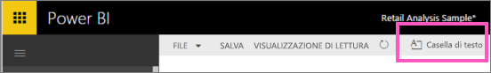
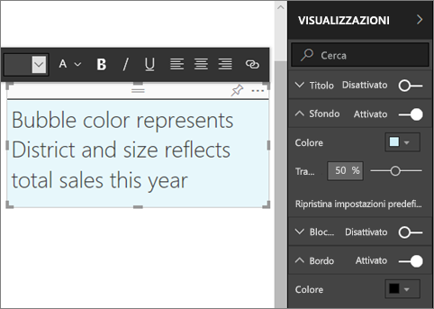
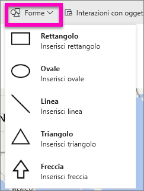
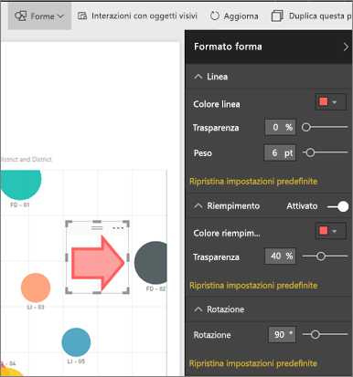

# Caselle di testo nei report di Power BI
È possibile aggiungere caselle di testo e forme ai report tramite il servizio Power BI e Power BI Desktop. In entrambi i casi, è necessario disporre di autorizzazioni di modifica per il report. Se un report è stato condiviso nel servizio Power BI, non si dispone delle autorizzazioni di modifica. 

Guardare questo video che illustra come usare Power BI Desktop per [aggiungere immagini statiche a un report](guided-learning/visualizations.yml?tutorial-step=11), quindi seguire la procedura seguente per provare usando invece il servizio Power BI.
> 
> <iframe width="560" height="315" src="https://www.youtube.com/embed/_3q6VEBhGew" frameborder="0" allowfullscreen></iframe>
> 

## Aggiungere una casella di testo a un report
1. Aprire un report in Visualizzazione di modifica.

2. Posizionare il cursore in qualsiasi area vuota dell'area di disegno report e selezionare **Casella di testo**.
   
   
2. Digitare il testo nella casella di testo e, facoltativamente, formattare il carattere, il colore e l'allineamento del testo. 
   
   
3. Per posizionare la casella di testo, selezionare l'area grigia nella parte superiore e trascinare. Per ridimensionare la casella di testo, selezionare e trascinare uno dei quadratini di ridimensionamento sul contorno. 
   
   

4. Con la casella di testo ancora selezionata, aggiungere ulteriore formattazione nel riquadro Visualizzazioni. In questo esempio sono stati formattati lo sfondo e il bordo. Si possono anche specificare dimensioni e posizione esatte per una casella di testo.  

   

5. Per chiudere la casella di testo, selezionare uno spazio vuoto nell'area di disegno del report. 

5. Selezionare l'icona della puntina  per aggiungere la casella di testo a un dashboard. 

## Aggiungere una forma a un report
1. Posizionare il cursore in un punto qualsiasi dell'area di disegno report e selezionare **Forme**.
   
   
2. Nell'elenco a discesa, selezionare una forma per aggiungerla all'area di disegno report. Verrà ora aggiunta una freccia per dirigere l'attenzione al fumetto con la varianza di vendita totale più alta. 
   
   Nel riquadro **Formato forma** personalizzare la forma. In questo esempio è stata creata una freccia rossa con un bordo rosso scuro, ruotata di 90 gradi.
   
   
3. Per posizionare la forma, selezionare l'area grigia nella parte superiore e trascinare. Per ridimensionare la forma, selezionare e trascinare uno dei quadratini di ridimensionamento sul contorno. Come con la casella di testo, è possibile creare dimensioni e posizione esatte anche per una forma.

> **NOTA**: le forme non possono essere aggiunte a un dashboard, se non come uno degli oggetti visivi quando si [aggiunge una pagina dinamica](service-dashboard-pin-live-tile-from-report.md). 
> 
> 

### Passaggi successivi
[Aggiungere un collegamento ipertestuale a una casella di testo](service-add-hyperlink-to-text-box.md)

[Power BI - Concetti di base](service-basic-concepts.md)

Altre domande? [Provare la community di Power BI](http://community.powerbi.com/)
