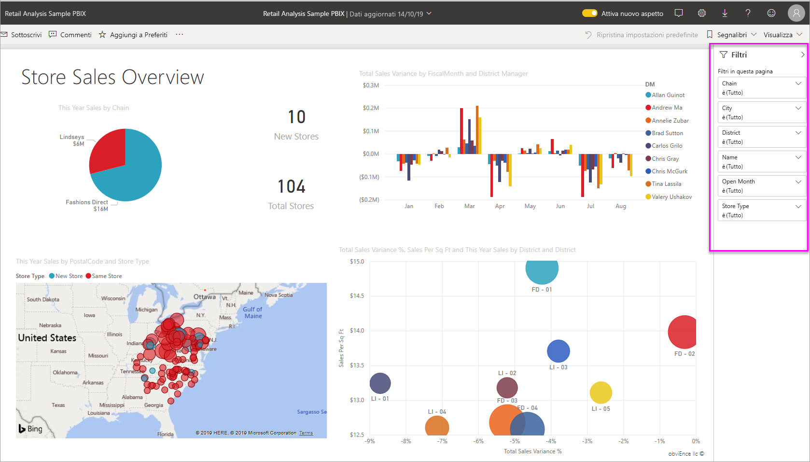
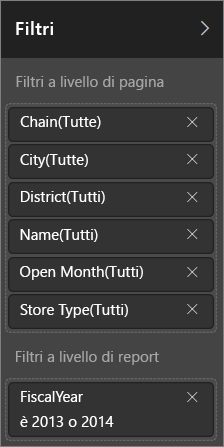
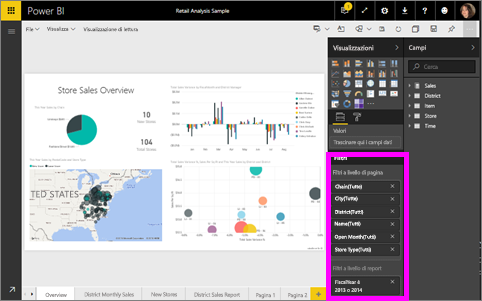
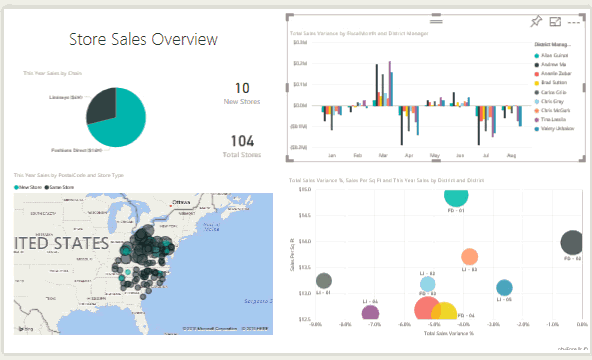

# Informazioni su filtri ed evidenziazione nei report di Power BI
Con i ***filtri*** viene rimosso tutto tranne i dati rilevanti.  L'***evidenziazione*** non filtra gli elementi perché non rimuove i dati, bensì evidenzia un subset di dati visibili. I dati non evidenziati restano visibili ma in grigio.

Esistono molti modi diversi per filtrare ed evidenziare i report in Power BI. Includere tutte le informazioni in un solo articolo potrebbe creare confusione, dunque sono state suddivise nei seguenti argomenti:

* Introduzione ai filtri e all'evidenziazione (questo articolo)
* Modi in cui è possibile [creare e usare i filtri e l'evidenziazione nella Visualizzazione di modifica e/o nei report di cui si è proprietari](power-bi-report-add-filter.md). Quando si hanno le autorizzazioni di modifica per un report, è possibile creare, modificare ed eliminare filtri ed evidenziare i dati nei report.
* Modi in cui è possibile [usare i filtri ed evidenziare i dati in un report condiviso con l'utente nella Visualizzazione di lettura del report](service-reading-view-and-editing-view.md). Le operazioni possibili sono più limitate, ma Power BI offre comunque un'ampia gamma di opzioni di filtro ed evidenziazione.  
* [Una descrizione dettagliata dei controlli di filtro ed evidenziazione disponibili nella Visualizzazione di modifica](power-bi-how-to-report-filter.md) incluso uno sguardo approfondito sui tipi di filtri (ad esempio, data e ora, numerico, testo) e sulla differenza tra le opzioni di base e avanzate.
* Ora che si è appreso come funzionano i filtri e l'evidenziazione per impostazione predefinita, è possibile [comprendere il modo in cui le visualizzazioni in una pagina si filtrano e si evidenziano reciprocamente](service-reports-visual-interactions.md)

> [!TIP]
> In che modo Power BI determina le relazioni tra i dati?  Power BI usa le relazioni tra le diverse tabelle e campi nel [modello di dati](https://support.office.com/article/Create-a-Data-Model-in-Excel-87e7a54c-87dc-488e-9410-5c75dbcb0f7b?ui=en-US&rs=en-US&ad=US) sottostante per consentire agli elementi di una pagina del report di interagire reciprocamente.
> 
> 

## Introduzione ai filtri e all'evidenziazione nei report con il riquadro Filtri
 Questo articolo illustra i filtri e l'evidenziazione nel servizio Power BI.  L'esperienza è quasi identica in Power BI Desktop.  

È possibile applicare filtri ed evidenziazione con il riquadro **Filtri** oppure effettuando le selezioni direttamente nel report stesso (ad hoc, vedere in basso nella pagina). Il riquadro Filtri mostra le tabelle e i campi usati nel report e gli eventuali filtri che sono stati applicati. I filtri sono divisi in **Filtri a livello di pagina**, **Filtri a livello di report**, **Filtri drill-through** e **Filtri a livello di oggetto visivo**.  È possibile visualizzare i filtri a livello di oggetto visivo solo se è stata selezionata una visualizzazione nell'area di disegno report.

> [!TIP]
> Se accanto al filtro è presente la parola **All**, l'intero campo verrà incluso come filtro.  Ad esempio, **Chain(All)** nella schermata seguente indica che questa pagina del report include dati relativi a tutte le catene di negozi.  D'altra parte, il filtro a livello di report **FiscalYear è 2013 o 2014** indica che il report include solo i dati per gli anni fiscali 2013 e 2014.
> 
> 

## Filtri in Visualizzazione di lettura e in Visualizzazione di modifica
Per interagire con i report è possibile usare una di queste modalità: [Visualizzazione di lettura e Visualizzazione di modifica](service-reading-view-and-editing-view.md).  Le funzionalità di filtro disponibili dipendono dalla modalità usata.

* In Visualizzazione di modifica è possibile aggiungere filtri a livello di report, pagina, oggetto visivo e filtri drill-through. Quando si salva il report i filtri vengono salvati con il report, anche se questo viene aperto in un'app per dispositivi mobili. Gli utenti che esaminano il report in Visualizzazione di lettura possono interagire con i filtri aggiunti, ma non possono aggiungere nuovi filtri.
* In Visualizzazione di lettura è possibile interagire con i filtri già esistenti nel report e salvare le selezioni effettuate.  Non è tuttavia possibile aggiungere nuovi filtri.

### Riquadro Filtri nella Visualizzazione di lettura
Se si ha accesso a un report solo nella Visualizzazione di lettura, il riquadro Filtri è simile al seguente:

Quindi a questa pagina del report sono stati applicati 6 filtri a livello di pagina e 1 filtro a livello di report.

Per verificare se esistono eventuali filtri a livello di oggetto visivo, selezionare un oggetto visivo. Nell'immagine seguente, al grafico a bolle sono stati applicati 6 filtri.

Nella Visualizzazione di lettura esplorare i dati modificando i filtri esistenti. Le modifiche apportate vengono salvate con il report, anche se questo viene aperto in un'app per dispositivi mobili. Per altre informazioni, vedere l'articolo [Visualizzazione di lettura e Visualizzazione di modifica nel servizio Power BI](service-reading-view-and-editing-view.md)

### Riquadro Filtri nella Visualizzazione di modifica
Quando si hanno le autorizzazioni di proprietario per un report e lo si apre nella Visualizzazione di modifica, si noterà che **Filtri** è solo uno dei diversi riquadri di modifica disponibili.

Come nella Visualizzazione di lettura (sopra), a questa pagina del report sono stati applicati 6 filtri a livello di pagina e 1 filtro a livello di report. Selezionando il grafico a bolle, si noterebbe che sono stati applicati 6 filtri a livello di oggetto visivo.

Tuttavia, nella Visualizzazione di modifica, è possibile eseguire molte più operazioni con i filtri e l'evidenziazione. La differenza principale è che è possibile aggiungere nuovi filtri. Altre informazioni su come eseguire questa e molte altre operazioni sono disponibili nell'articolo [Aggiungere un filtro a un report](power-bi-report-add-filter.md)

## Filtri ed evidenziazione ad hoc
Selezionare un campo nell'area di disegno report per filtrare ed evidenziare il resto della pagina. Selezionare qualsiasi spazio vuoto nello stesso oggetto visivo per rimuoverlo. Questo tipo di filtri ed evidenziazione è un modo interessante per esplorare rapidamente l'impatto sui dati. Per ottimizzare il funzionamento di questo tipo di filtro incrociato ed evidenziazione incrociata, vedere [Interazioni tra oggetti visivi](service-reports-visual-interactions.md).

Quando si esce da report le modifiche vengono salvate. Per annullare le operazioni di filtro, selezionare **Ripristina impostazioni predefinite** nella barra dei menu superiore.

## Passaggi successivi
[Interagire con i filtri e l'evidenziazione (nella Visualizzazione di lettura)](service-reading-view-and-editing-view.md)

[Aggiungere un filtro a un report (in Visualizzazione di modifica)](power-bi-report-add-filter.md)

[Presentazione dei filtri dei report](power-bi-how-to-report-filter.md)

[Modificare il filtro incrociato e l'evidenziazione incrociata tra gli oggetti visivi nel report](service-reports-visual-interactions.md)

Altre informazioni sui [report in Power BI](service-reports.md)

Altre domande? [Provare la community di Power BI](http://community.powerbi.com/)

