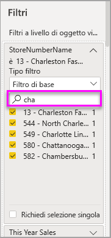

# Informazioni su filtri ed evidenziazione nei report di Power BI
 Questo articolo illustra i filtri e l'evidenziazione nel servizio Power BI. L'esperienza è quasi identica in Power BI Desktop. Con i ***filtri*** viene rimosso tutto tranne i dati rilevanti. L'***evidenziazione*** è un'operazione diversa dall'applicazione di filtri. Non vengono rimossi i dati, ma viene evidenziato un subset dei dati visibili. I dati non evidenziati rimangono visibili ma in grigio.

Esistono molti modi diversi per filtrare ed evidenziare i report in Power BI. Includere tutte le informazioni in un solo articolo potrebbe creare confusione, quindi sono state create diverse sezioni:

* Introduzione ai filtri e all'evidenziazione (questo articolo)
* Modi in cui è possibile [creare e usare i filtri nella visualizzazione di modifica](power-bi-report-add-filter.md) nei report. Quando si hanno le autorizzazioni di modifica per un report, è possibile creare, modificare ed eliminare i filtri nei report.
* Modi in cui è possibile [filtrare ed evidenziare i dati in un report condiviso](consumer/end-user-reading-view.md) nella visualizzazione di lettura del report. Le operazioni possibili sono più limitate, ma è comunque disponibile un'ampia gamma di opzioni di filtro ed evidenziazione.  
* [Presentazione dettagliata dei controlli di filtro ed evidenziazione disponibili nella visualizzazione di modifica](consumer/end-user-report-filter.md), inclusa un'analisi approfondita dei tipi di filtri (ad esempio, data e ora, tipi numerici, testo) e della differenza tra le opzioni di base e quelle avanzate.
* Dopo aver appreso come funzionano i filtri e l'evidenziazione per impostazione predefinita, è possibile scoprire come [interagiscono le visualizzazioni in una pagina per quanto riguarda i filtri e l'evidenziazione](consumer/end-user-interactions.md)

## Introduzione al riquadro Filtri

È possibile applicare filtri nel riquadro **Filtri** oppure effettuando [selezioni nei filtri dei dati](visuals/power-bi-visualization-slicers.md) direttamente nel report. Il riquadro Filtri mostra le tabelle e i campi usati nel report e gli eventuali filtri che sono stati applicati. 

Sono disponibili quattro tipi di filtri.

- Il **filtro della pagina** si applica a tutti gli oggetti visivi nella pagina del report     
- Il **filtro visivo** si applica a un singolo oggetto visivo in una pagina del report. È possibile visualizzare i filtri a livello di oggetto visivo solo se è stato selezionato un oggetto visivo nell'area di disegno del report.    
- Il **filtro report** si applica a tutte le pagine del report    
- Il **filtro drill-through** si applica a una singola entità in un report    

È possibile cercare nei filtri di pagina, visivi e di report, in visualizzazione di lettura o di modifica, per trovare e selezionare il valore desiderato. 

Se accanto al filtro è presente la parola **Tutte/Tutti**, significa che nel filtro vengono inclusi tutti i valori del campo.  Ad esempio, **Chain(Tutte)** nello screenshot seguente indica che questa pagina del report include i dati relativi a tutte le catene di negozi.  Il filtro a livello di report **FiscalYear è 2013 o 2014** indica invece che il report include solo i dati per gli anni fiscali 2013 e 2014.

## Filtri nella visualizzazione di modifica o nella visualizzazione di lettura
È possibile interagire con i report in due modi: tramite la [visualizzazione di lettura](consumer/end-user-reading-view.md) e tramite la visualizzazione di modifica. Le funzionalità di filtro disponibili dipendono dalla modalità usata.

* Nella visualizzazione di modifica è possibile aggiungere filtri di report, di pagina, di drill-through e visivi. Quando si salva il report, i filtri vengono salvati con il report, anche se questo viene aperto in un'app per dispositivi mobili. Gli utenti che guardano il report nella visualizzazione di lettura possono interagire con i filtri aggiunti, ma non possono aggiungere nuovi filtri.
* Nella visualizzazione di lettura è possibile interagire con i filtri già esistenti nel report e salvare le selezioni effettuate. Non è possibile aggiungere nuovi filtri.

### Filtri nella visualizzazione di lettura
Se si ha accesso a un report solo nella visualizzazione di lettura, il riquadro Filtri è simile al seguente:

Quindi a questa pagina del report sono applicati sei filtri a livello di pagina e un filtro a livello di report.

Ogni oggetto visivo può avere filtri per tutti i campi in esso contenuti e un autore di report può aggiungerne altri. Nell'immagine seguente al grafico a bolle sono applicati sei filtri.

Nella visualizzazione di lettura esplorare i dati modificando i filtri esistenti. Le modifiche apportate vengono salvate con il report, anche se questo viene aperto in un'app per dispositivi mobili. Per informazioni, vedere [Presentazione del riquadro Filtri del report](consumer/end-user-report-filter.md)

Quando si chiude il report, i filtri vengono salvati. Per annullare i filtri e ripristinare i filtri, i filtri dei dati, il livello e l'ordinamento predefiniti impostati dall'autore del report, selezionare **Ripristina impostazioni predefinite** sulla barra dei menu superiore.

### Filtri nella visualizzazione di modifica
Quando si hanno le autorizzazioni di proprietario per un report e lo si apre nella visualizzazione di modifica, si noterà che **Filtri** è solo uno dei diversi riquadri di modifica disponibili.

Come nella visualizzazione di lettura, a questa pagina del report sono applicati sei filtri a livello di pagina e un filtro a livello di report. Selezionando il grafico a bolle, è possibile notare che sono applicati sei filtri a livello di oggetto visivo.

Nella visualizzazione di lettura è possibile eseguire altre operazioni con i filtri e l'evidenziazione. Principalmente, è possibile aggiungere nuovi filtri. Vedere [Aggiungere un filtro a un report](power-bi-report-add-filter.md) per informazioni su come eseguire questa e molte altre operazioni.

## Evidenziazione ad hoc
Selezionare un campo nell'area di disegno del report per evidenziare gli altri oggetti visivi nella pagina. Selezionare qualsiasi spazio vuoto nello stesso oggetto visivo per rimuoverlo. Questo tipo di evidenziazione è un modo interessante per esplorare rapidamente l'impatto dei dati. Per ottimizzare il funzionamento di questo tipo di evidenziazione incrociata, vedere [Interazioni tra oggetti visivi](consumer/end-user-interactions.md).

## Passaggi successivi
[Aggiungere un filtro a un report (in visualizzazione di modifica)](power-bi-report-add-filter.md)

[Presentazione dei filtri dei report](consumer/end-user-report-filter.md)

[Modificare il filtro incrociato e l'evidenziazione incrociata tra gli oggetti visivi nel report](consumer/end-user-interactions.md)

Altre domande? [Provare la community di Power BI](http://community.powerbi.com/)

