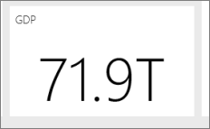

# Suggerimenti e consigli per creare report in Power BI Desktop e nel servizio Power BI
Per sfruttare al meglio i dati, talvolta è necessario un aiuto. Questo argomento raccoglie alcuni suggerimenti e consigli che è possibile usare quando si creano report in Microsoft Power BI Desktop, nel servizio Power BI *e* nelle edizioni di Microsoft Excel 2016 o Excel 2013 Pro-Plus con il componente aggiuntivo Power Pivot abilitato e Power Query installato e abilitato.

## Power BI Desktop

### Informazioni sull'uso dell'Editor di query
L'Editor di query in Power BI Desktop è molto simile alla funzionalità del componente aggiuntivo Power Query in Excel 2013. Anche se sono disponibili numerosi articoli utili nella sezione di supporto di Power BI, per le informazioni iniziali può essere utile vedere anche la documentazione di Power Query in support.office.com.

Altre informazioni sono disponibili nel [Centro risorse di Power Query](https://support.office.com/article/Microsoft-Power-Query-for-Excel-Help-2b433a85-ddfb-420b-9cda-fe0e60b82a94).

È anche possibile visualizzare le [informazioni sulle formule](https://support.office.com/Article/Learn-about-Power-Query-formulas-6bc50988-022b-4799-a709-f8aafdee2b2f).

### Tipi di dati nell'Editor di query
Quando si usa l'Editor di query in Power BI Desktop per caricare i dati, il tipo di dati viene rilevato in base all'ipotesi più probabile.  Quando si usano formule, a volte le impostazioni del tipo di dati nelle colonne non vengono mantenute. Controllare che il tipo di dati delle colonne sia corretto dopo le operazioni seguenti:  Caricamento iniziale dei dati nella scheda di query, prima riga come intestazione, aggiunta di una colonna, raggruppamento, unione e accodamento, nonché prima del caricamento dei dati per la prima volta.

Un aspetto importante da ricordare è che il corsivo nella griglia dei dati non significa che il tipo sia impostato correttamente, ma solo che i dati non vengono considerati come testo.

### Query di riferimento nell'Editor di query
Nello strumento di navigazione dell'Editor di query in Power BI Desktop, quando si fa clic con il pulsante destro del mouse su una delle query, è disponibile l'opzione "Riferimento".  Questa opzione è utile per il motivo seguente:

* Quando si usano file come origine dati per una query, il percorso assoluto del file è archiviato nella query. Quando si condivide o si sposta un file di Power BI Desktop o una cartella di lavoro di Excel, è possibile risparmiare tempo nell'aggiornamento dei percorsi eseguendo un solo aggiornamento anziché dover aggiornare tutti i percorsi.

Per impostazione predefinita, tutte le query vengono caricate in un foglio di lavoro di Excel o nel modello di dati (o in entrambe le posizioni). Alcune query sono passaggi intermedi non destinati all'uso da parte degli utenti finali.  Quando si fa riferimento alle query come indicato in precedenza, questo è spesso vero.  È possibile controllare il comportamento di caricamento delle query facendo clic con il pulsante destro del mouse sulla query nello strumento di navigazione e attivando o disattivando l'opzione "Abilita caricamento".  Quando accanto all'opzione "Abilita caricamento" non è presente un segno di spunta, la query è comunque disponibile nella scheda della query ed è possibile usarla con altre query.  Ciò è particolarmente utile in combinazione con trasformazioni di merge, accodamento e riferimento.  Tuttavia, poiché i risultati della query non vengono caricati nel modello di dati, la query non crea confusione nell'elenco di campi del report o nel modello di dati.

### Necessità di un identificatore di punto nei grafici a dispersione
Si prenda come esempio una semplice tabella con valori delle temperature e dell'ora in cui è stata eseguita la misurazione. Se si tracciano questi valori direttamente in un grafico a dispersione, Power BI aggrega tutti i valori in un singolo punto. Per mostrare i singoli punti dati, sarà necessario aggiungere un campo al bucket Dettagli nel contenitore di campi.   Per eseguire in modo semplice questa operazione in Power BI Desktop, nella scheda della query usare l'opzione "Aggiungi colonna indice" della scheda "Aggiungi colonna" sulla barra multifunzione.

### Linee di riferimento nel report
È possibile usare una colonna calcolata in Power BI Desktop per definire una linea di riferimento.  Identificare la tabella e la colonna in cui si vuole creare una linea di riferimento.  Selezionare "Nuova colonna" sulla barra multifunzione e nella barra della formula digitare la formula seguente:

    Target Value = 100

Questa colonna calcolata restituirà il valore 100 indipendentemente da dove viene usata.  La nuova colonna verrà visualizzata nell'elenco dei campi.  Aggiungere la colonna calcolata Valore di destinazione in un grafico a linee per mostrare la relazione tra le serie e la linea di riferimento specifica.  

### Ordinamento in base a un'altra colonna
Quando si usa un valore di categoria (stringa) in Power BI per gli assi del grafico oppure in un filtro dei dati o in un filtro, l'ordine predefinito è quello alfabetico. Se è necessario applicare un ordine diverso, ad esempio per elementi come i giorni della settimana o i mesi, è possibile impostare Power BI Desktop in modo da eseguire l'ordinamento in base a una colonna diversa. Per altre informazioni, vedere [Ordinare per colonna in Power BI Desktop](desktop-sort-by-column.md).

### Creazione più semplice di mappe con hint a Bing
Power BI si integra con Bing per fornire coordinate della mappa predefinite (un processo denominato geocodifica) in modo da semplificare la creazione di mappe.  Bing usa alcuni algoritmi e hint per cercare di ottenere la posizione corretta, ma si tratta di una stima. Per aumentare la probabilità di esecuzione di operazioni di geocodifica corrette, usare i suggerimenti seguenti:

Quando si crea una mappa, si cerca spesso di tracciare paesi, stati e città.  In Power BI Desktop, se si assegnano nomi alle colonne dopo la designazione geografica, Bing potrà stimare con più precisione cosa si sta cercando di visualizzare. Ad esempio, se è presente un campo con i nomi degli stati degli Stati Uniti, come "California" e "Washington", per la parola "Washington" Bing potrebbe restituire la posizione della città, Washington, DC, anziché quella dello stato di Washington.  Assegnando alla colonna il nome "Stato", sarà possibile migliorare la geocodifica.  Lo stesso vale per le colonne denominate "Paese" e "Città".   

Alcune designazioni sono ambigue se considerate nel contesto di più paesi.  In alcuni casi quello che in un paese viene considerato uno "stato" in un altro viene considerato una "provincia" o una "regione" o viene usata un'altra designazione.  È possibile aumentare l'accuratezza della geocodifica creando colonne che consentono di accodare più campi e usandole per tracciare le posizioni dei dati.  Ad esempio, invece di indicare solo "Wiltshire", è possibile indicare "Wiltshire, Inghilterra" per ottenere un risultato di geocodifica più accurato.

È sempre possibile fornire informazioni specifiche su latitudine e longitudine per le posizioni nel servizio Power BI o in Power BI Desktop.  In tal caso, sarà necessario passare anche un campo relativo alla posizione, altrimenti i dati vengono aggregati per impostazione predefinita e la posizione corrispondente a latitudine e longitudine indicate potrebbe non corrispondere a quella prevista.

### Categorizzazione di campi geografici come hint per la geocodifica di Bing
Un altro modo per verificare che la geocodifica dei campi venga eseguita correttamente consiste nell'impostare la categoria di dati per i campi dati.   In Power BI Desktop selezionare la tabella desiderata, passare alla scheda Avanzate della barra multifunzione e quindi impostare la categoria di dati su Indirizzo, Città, Continente, Paese/area geografica, Paese, Codice postale, Stato o Provincia.  Queste categorie di dati consentono a Bing di codificare i dati correttamente. Per altre informazioni, vedere [Categorizzazione dei dati in Power BI Desktop](desktop-data-categorization.md).

### Geocodifica migliore con posizioni più specifiche
In alcuni casi, l'impostazione delle categorie di dati per la creazione di mappe non è sufficiente.  Creare una posizione più specifica, come un indirizzo stradale, usando l'Editor di query di Power BI Desktop.  Usare la funzionalità Aggiungi colonna per creare una colonna personalizzata.  Creare quindi la posizione desiderata come indicato di seguito:

    = [Field1] & " " & [Field2]

Usare quindi il campo risultante nelle visualizzazioni della mappa. Questa operazione è molto utile per creare indirizzi stradali da campi relativi all'indirizzo di spedizione, che sono comuni nei set di dati.  Tenere presente che la concatenazione funziona solo con i campi di testo.  Se necessario, convertire il numero civico in un tipo di dati di testo prima di usarlo per creare un indirizzo.

### Istogrammi in fase di query
In Power BI Desktop esistono diversi modi per creare istogrammi, che verranno qui descritti a partire dal più semplice:

Istogrammi più semplici: determinare la query contenente il campo in base a cui si vuole creare un istogramma.  Usare l'opzione "Riferimento" per la query per creare una nuova query e assegnarvi il nome "Istogramma FieldName". Usare l'opzione "Raggruppa per" nella scheda "Trasforma" della barra multifunzione e selezionare la funzione di aggregazione "Conteggio righe".  Verificare che il tipo di dati sia un numero per la colonna aggregata risultante. Visualizzare quindi i dati nella pagina del report.  Questo metodo è rapido e semplice, ma non è appropriato in presenza di numerosi punti dati e non consente il collegamento di oggetti visivi.

Definizione di bucket per la creazione di un istogramma: determinare la query contenente il campo in base a cui si vuole creare un istogramma.  Usare l'opzione "Riferimento" per la query per creare una nuova query e assegnarvi il nome "FieldName".  Definire ora i bucket con una regola.  Usare l'opzione Aggiungi colonna personalizzata nella scheda Aggiungi colonna della barra multifunzione e creare una regola personalizzata.  Una semplice regola per la creazione di bucket può essere simile alla seguente:

    if([FieldName] \< 2) then "\<2 min" else
    if([FieldName] \< 5) then "\<5 min" else
    if([FieldName] \< 10) then "\<10 min" else
    if([FieldName] \< 30) then "\<30 min" else
    "longer")

Verificare che il tipo di dati sia un numero per la colonna aggregata risultante. A questo punto è possibile usare la tecnica di raggruppamento descritta per l'istogramma più semplice per ottenere l'istogramma.  Questa opzione consente di gestire più punti dati ma non consente comunque il collegamento di oggetti visivi.

Definizione di un istogramma che supporta il collegamento di oggetti visivi: il collegamento di oggetti visivi fa in modo che, quando un utente seleziona un punto dati in un oggetto visivo, vengono evidenziati altri oggetti visivi nella pagina del report oppure vengono filtrati i punti dati correlati al punto dati selezionato.  Poiché i dati vengono modificati in fase di query, è necessario creare una relazione tra tabelle e assicurarsi di sapere quale elemento dei dettagli è correlato al bucket nell'istogramma e viceversa.

Iniziare il processo usando l'opzione "Riferimento" nella query contenente il campo in base a cui si vuole creare un istogramma.  Assegnare alla nuova query il nome "Bucket".  Per questo esempio la query originale verrà denominata "Dettagli".  Rimuovere quindi tutte le colonne ad eccezione di quella da usare come bucket per l'istogramma.  Usare poi la funzionalità "Rimuovi duplicati" nella query. Questa opzione è disponibile nel menu di scelta rapida quando si seleziona una colonna e consente di lasciare solo valori univoci nella colonna.   Se sono presenti numeri decimali, è prima possibile applicare il suggerimento per la definizione di bucket per la creazione di un istogramma, in modo da ottenere un set gestibile di bucket.  Controllare ora i dati visualizzati nell'anteprima della query.  Se sono presenti valori vuoti o null, è necessario correggerli prima di creare una relazione.  Vedere "Creazione di relazioni quando i dati contengono valori null o vuoti".   Questo approccio può essere problematico a causa della necessità di eseguire l'ordinamento.  Per ordinare i bucket in modo corretto, vedere l'argomento relativo a ordinamento e visualizzazione delle categorie nell'ordine desiderato.  

>[!NOTE]
>È utile pensare all'ordinamento prima di creare oggetti visivi.   

Il passaggio successivo del processo consiste nel definire una relazione tra le query "Bucket" e "Dettagli" nella colonna dei bucket.  In Power BI Desktop fare clic su **Gestisci relazioni** sulla barra multifunzione.  Creare una relazione con Bucket nella tabella di sinistra e Dettagli nella tabella di destra e selezionare il campo da usare per l'istogramma.

L'ultimo passaggio consiste nel creare l'istogramma.  Trascinare il campo Bucket dalla tabella "Bucket".  Rimuovere il campo predefinito dall'istogramma risultante.  Dalla tabella "Dettagli" trascinare quindi il campo dell'istogramma nello stesso oggetto visivo.  Nel contenitore di campi modificare l'aggregazione predefinita in Conteggio.  Il risultato è l'istogramma. Se si crea un altro oggetto visivo come una mappa ad albero dalla tabella Dettagli, selezionare un punto dati nella mappa ad albero per visualizzare l'istogramma con un'evidenziazione e il punto dati selezionato rispetto alla tendenza per l'intero set di dati.

### Istogrammi
In Power BI Desktop è possibile usare un campo calcolato per definire un istogramma.  Identificare la tabella e la colonna in base a cui si vuole creare un istogramma.  Nell'area calcoli digitare la formula seguente:

> Frequency:=COUNTROWS(\<nome colonna\>)
>
>

Salvare le modifiche e tornare al report.  Aggiungere \<Nome colonna\> e Frequenza a una tabella e quindi eseguire la conversione in un grafico a barre.  Assicurarsi che \<Nome colonna\> sia sull'asse x e il campo calcolato Frequenza sia sull'asse y.

### Suggerimenti e consigli per creare relazioni in Power BI Desktop
Spesso quando si caricano set di dati dettagliati da più origini, problemi come valori null, valori vuoti o valori duplicati impediscono la creazione di relazioni.

Ecco un esempio:

Si caricano i set di dati relativi a richieste di assistenza clienti attive e un altro set di dati di elementi di lavoro con lo schema seguente:

> RichiesteClienti: {IDRichiesta, NomeCliente, NomeProblema, DataApertura, Stato} ElementiLavoro: {IDElementoLavoro, IDRichiesta, NomeElementoLavoro, DataApertura, Stato, NomeCliente}
>
>

Quando si vuole tenere traccia di tutte le richieste e di tutti gli elementi di lavoro correlati a un NomeCliente specifico, non è sufficiente creare una relazione tra questi due set di dati.  Alcuni ElementiLavoro potrebbero non essere correlati a un NomeCliente e quindi il campo sarebbe vuoto o NULL.  Potrebbero esserci più record di ElementiLavoro e RichiesteClienti per un NomeCliente specifico.  

#### Creazione di relazioni in Power BI Desktop quando i dati contengono valori null o vuoti
Spesso i set di dati contengono colonne con valori null o vuoti.  Ciò può provocare problemi quando si cerca di usare le relazioni.  Sono disponibili essenzialmente due opzioni per risolvere questi problemi.  È possibile rimuovere le righe con valori null o vuoti.  A tale scopo, è possibile usare la funzionalità di filtro nella scheda della query oppure, se si effettua il merge di query, selezionare l'opzione per mantenere solo le righe corrispondenti. In alternativa, è possibile sostituire i valori null o vuoti con valori appropriati per le relazioni, in genere stringhe come "NULL" e "(Vuoto)".   Non esiste un unico approccio corretto. L'esclusione di stringhe con un filtro in fase di query comporta la rimozione delle righe e può influire su calcoli e statistiche di riepilogo.  Il secondo approccio mantiene le righe di dati, ma può far apparire nel modello come correlate righe che invece non lo sono, portando a errori di calcolo.  Se si adotta quest'ultima soluzione, accertarsi di usare i filtri nella vista o nel grafico dove appropriato, in modo da ottenere risultati accurati.  È anche importante valutare quali righe vengono mantenute o rimosse e comprendere l'impatto globale sull'analisi.  

#### Creazione di relazioni in Power BI Desktop quando i dati contengono valori duplicati
Spesso quando si caricano set di dati dettagliati da più origini, i valori duplicati nei dati impediscono la creazione di relazioni.  È possibile ovviare a questo problema creando una tabella delle dimensioni con i valori univoci di entrambi i set di dati.

Ecco un esempio:

Si caricano i set di dati relativi a richieste di assistenza clienti attive e un altro set di dati di elementi di lavoro con lo schema seguente:

> RichiesteClienti: {IDRichiesta, NomeCliente, NomeProblema, DataApertura, Stato} ElementiLavoro: {IDElementoLavoro, IDRichiesta, NomeElementoLavoro, DataApertura, Stato, NomeCliente}
>
>

Quando si vuole tenere traccia di tutte le richieste e di tutti gli elementi di lavoro correlati a un NomeCliente specifico, non è sufficiente creare una relazione tra questi due set di dati.  Alcuni ElementiLavoro potrebbero non essere correlati a un NomeCliente e quindi il campo sarebbe vuoto o NULL.  Se è presente un valore vuoto o null nella tabella relativa ai nomi dei clienti, potrebbe essere comunque possibile creare una relazione. Vedere Creazione di relazioni quando i dati contengono valori null o vuoti.  Potrebbero essere presenti più ElementiLavoro e RichiesteClienti per un singolo NomeCliente.  

Per creare una relazione in questo caso, è necessario creare un set di dati logico di tutti i record NomiClienti tra i due set di dati.  Nella scheda della query è possibile usare la sequenza seguente per creare il set di dati logico:

1. Duplicare entrambe le query, assegnando alla prima il nome **Temp** e alla seconda il nome **NomiCliente**.
2. In ogni query rimuovere tutte le colonne *ad eccezione* della colonna NomeCliente.
3. In ogni query usare il comando  **Rimuovi duplicati**.
4. Nella query **NomiClienti** selezionare l'opzione **Accoda** sulla barra multifunzione e quindi selezionare la query **Temp**.
5. Nella query **NomiClienti** selezionare **Rimuovi duplicati**.

È ora disponibile una tabella delle dimensioni che è possibile usare per mettere in relazione RichiesteClienti ed ElementiLavoro e che contiene tutti i valori di ognuno dei record.  

### Modelli per iniziare rapidamente a usare l'Editor di query
L'Editor di query è uno strumento molto potente per la modifica dei dati tramite operazioni di data shaping e pulizia, in modo da preparare i dati per la visualizzazione o la modellazione. Ci sono alcuni modelli che è importante conoscere.

#### Le colonne temporanee possono essere eliminate dopo aver calcolato un risultato.
Spesso è necessario creare un calcolo in Power BI Desktop che trasforma i dati da più colonne in una singola colonna nuova.  Questa operazione può essere complessa.  Un semplice metodo per risolvere il problema consiste nello scomporre l'operazione in passaggi.  Iniziare duplicando le colonne iniziali. Creare quindi i passaggi come colonne temporanee. Creare poi la colonna per il risultato finale.  Sarà quindi possibile eliminare le colonne temporanee in modo che il set di dati finale non appaia disordinato. Questo è possibile perché la scheda della query esegue i passaggi in ordine.

#### Query duplicate o di riferimento seguite da un merge alla query originale
Talvolta è utile calcolare le statistiche di riepilogo per un set di dati.  Il modo più semplice per eseguire questa operazione consiste nel creare query duplicate o di riferimento nella scheda della query. Usare quindi il comando **Raggruppa per** per calcolare le statistiche di riepilogo.  Le statistiche di riepilogo consentono di normalizzare i dati nei set di dati originali in modo che siano più facilmente confrontabili.  Ciò è particolarmente utile per confrontare singoli valori con tutto l'insieme.  A tale scopo, passare alla query originale e selezionare l'opzione di merge.  Eseguire quindi il merge dei dati dalla query delle statistiche di riepilogo mettendo in corrispondenza gli identificatori appropriati.  A questo punto si è pronti per normalizzare i dati come necessario per l'analisi.

### Uso di DAX per la prima volta
DAX è il linguaggio delle formule di calcolo in Power BI Desktop,  ottimizzato per le analisi di business intelligence.  È leggermente diverso rispetto a ciò che già si potrebbe conoscere se è stato usato solo un linguaggio di query simile a SQL. Sono disponibili efficaci risorse online e cartacee per apprendere DAX.

[Nozioni di DAX in Power BI Desktop](desktop-quickstart-learn-dax-basics.md)

[Informazioni di riferimento su DAX (Data Analysis Expressions)](https://msdn.microsoft.com/library/gg413422.aspx)

[Centro risorse DAX](http://social.technet.microsoft.com/wiki/contents/articles/1088.dax-resource-center.aspx)

## Servizio Power BI *e* Power BI Desktop

### Leggere il white paper: [Principi della progettazione di report di Power BI](visuals/power-bi-visualization-best-practices.md)
Questo documento illustra le procedure consigliate per la progettazione di report in Power BI. Partendo dalla pianificazione, vengono presentati i principi di progettazione applicabili ai report, così come alle pagine e ai singoli oggetti visivi che compongono un report. Molte di queste procedure consigliate sono valide anche per la progettazione di dashboard.

### Leggere e/o guardare "How to design visually stunning reports (and dashboards) in Power BI" (Come progettare report e dashboard di grande impatto visivo in Power BI)
Il membro della community Miguel Myers è un Data Scientist oltre che un progettista grafico.

* [Leggi il blog](https://powerbi.microsoft.com/blog/how-to-design-visually-stunning-reports/)
* [Guarda il webinar](https://info.microsoft.com/CO-PowerBI-WBNR-FY16-04Apr-19-Design-Reports-in-PowerBI-Registration.html)

### Considerare i destinatari
Quali sono le metriche chiave che agevoleranno il processo decisionale? Come verrà usato il report? Quali presupposti specialistici o culturali possono incidere sulle scelte di progettazione? Di quali informazioni hanno bisogno i destinatari per ottenere buoni risultati?

Dove verrà visualizzato il report? Se verrà visualizzato su un monitor di grandi dimensioni, è possibile inserirvi più contenuti. Se invece verrà visualizzato su un tablet, è preferibile usare meno visualizzazioni per migliorare la leggibilità.

### Creare una storia e racchiuderla in una schermata
Ogni pagina del report dovrebbe illustrare una storia a colpo d'occhio. Si possono evitare le barre di scorrimento nelle pagine? Il report risulta troppo disordinato o poco chiaro?  Rimuovere tutto ciò che non rappresenta informazioni essenziali facili da leggere e interpretare.

### Fare in modo che le informazioni più importanti siano più grandi
Se il testo e le visualizzazioni nella pagina del report hanno tutti la stessa dimensione, sarà difficile per il lettore distinguere cosa è più importante. Ad esempio, le visualizzazioni a scheda sono un ottimo modo per mettere in evidenza un numero importante:  

### Specificare il contesto  

Usare funzionalità, ad esempio caselle di testo e descrizioni comandi, per aggiungere contesto alle visualizzazioni.

### Posizionare in alto le informazioni più importanti
La maggior parte delle persone legge dall'alto verso il basso, quindi posizionare il livello di massimo dettaglio in alto e aggiungere dettagli procedendo nella direzione seguita dai destinatari per la lettura (da sinistra a destra o da destra a sinistra).

### Usare la visualizzazione corretta per i dati e formattarla per facilitare la lettura
Evitare di usare visualizzazioni diverse per il puro gusto di variare.  Le visualizzazioni devono essere rappresentative e facili da "leggere" e interpretare.  Per alcuni dati e alcune visualizzazioni, è sufficiente una semplice visualizzazione grafica. Altri dati, invece, possono richiedere una visualizzazione più complessa. Usare titoli ed etichette e altre personalizzazioni per agevolare il lettore.  

* Prestare attenzione ai grafici che tendono a distorcere la realtà, ad esempio i grafici 3D e quelli che non iniziano da zero. Tenere presente che il cervello umano fa più fatica a interpretare le forme circolari. I grafici a torta, i grafici ad anello e altri tipi di grafico circolari possono avere un aspetto gradevole ma può essere opportuno scegliere un oggetto visivo diverso.    
* Le scale dei grafici sugli assi, l'ordinamento delle dimensioni dei grafici e anche i colori usati per i valori delle dimensioni all'interno dei grafici devono essere coerenti.    
* Codificare i dati quantitativi in modo leggibile. Non usare più di tre o quattro numerali per visualizzare i numeri. Visualizzare le misure con uno o due numerali a sinistra del separatore decimale e usare la scala per le migliaia o i milioni, ad esempio indicare 3,4 milioni anziché 3.400.000.    
* Provare a evitare di mescolare livelli di precisione e tempo. Fare in modo che gli intervalli di tempo siano ben chiari.  Non affiancare un grafico del mese scorso ad altri grafici filtrati di un determinato mese dell'anno.    
* Provare anche a evitare di mescolare misure grandi e piccole sulla stessa scala, ad esempio su un grafico a linee o un grafico a barre.  Ad esempio, una misura può essere in milioni e l'altra in migliaia.  Con una scala così ampia, sarebbe difficile vedere le differenze della misura in migliaia.  Se è necessario mescolarle, scegliere una visualizzazione, ad esempio un grafico combinato, che consenta di usare un secondo asse.    
* Evitare di riempire i grafici con etichette dati superflue. I valori nei grafici a barre, ***se sufficientemente grandi***, sono in genere comprensibili anche senza visualizzare il numero effettivo.   
* Prestare attenzione all’[ordinamento dei grafici](consumer/end-user-change-sort.md).  Se si vuole attirare l'attenzione sul numero più alto o più basso, ordinare in base alla misura.  Per agevolare la ricerca di una determinata categoria all'interno di molte altre, ordinare in base all'asse.  
* I grafici a torta sono ideali in presenza di meno di otto categorie. Data l'impossibilità di confrontare i valori affiancati, il confronto tra valori è più difficile in un grafico a torta rispetto ai grafici a barre o agli istogrammi. I grafici a torta possono essere una buona soluzione per visualizzare le relazioni tra una parte e l'insieme anziché tra parti diverse. I grafici a misuratore sono ottimi per visualizzare lo stato corrente nell'ambito di un obiettivo.    

Per altre indicazioni specifiche sulle visualizzazioni, vedere [Tipi di visualizzazione in Power BI](visuals/power-bi-visualization-types-for-reports-and-q-and-a.md).  

### Approfondimento sulle procedure consigliate per la progettazione dei dashboard
Ecco alcune pubblicazioni che possono essere utili:

* *Storytelling with Data* di Cole Nussbaumer Knafic
* *Data points* di Nathan Yau
* *The truthful Art* di Alberto Cairo
* *Now You See It* di Stephen Few  
* *Envisioning Information* di Edward Tufte  
* *Advanced Presentations Design* di Andrew Abela   

## Passaggi successivi
[Power BI - Concetti di base](consumer/end-user-basic-concepts.md)

[Report in Power BI](consumer/end-user-reports.md)

Altre domande? [Provare la community di Power BI](http://community.powerbi.com/)
