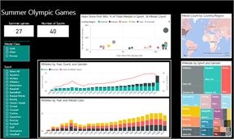
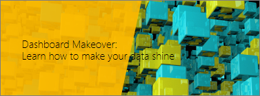

# Suggerimenti per la creazione di report straordinari
La creazione e l'utilizzo dei report nel servizio Power BI e in Power BI Desktop sono molto simili, quindi parte di questi collegamenti è applicabile a entrambi gli ambienti.

## Leggere il white paper: [Principi della progettazione di report di Power BI](power-bi-visualization-best-practices.md)
Questo documento illustra le procedure consigliate per la progettazione di report in Power BI. Partendo dalla pianificazione, vengono presentati i principi di progettazione applicabili ai report, così come alle pagine e ai singoli oggetti visivi che compongono un report. Molte di queste procedure consigliate sono valide anche per la progettazione di dashboard.

## Guardare il [webinar sulla trasformazione del dashboard](https://info.microsoft.com/CO-PowerBI-WBNR-FY16-05May-12-Dashboard-Makeover-Registration.html)
Marc Reguera, Microsoft Principal Program Manager ed esperto di dashboard di Power BI illustra come [trasformare i dashboard](https://info.microsoft.com/CO-PowerBI-WBNR-FY16-05May-12-Dashboard-Makeover-Registration.html).

## Leggere e/o guardare "How to design visually stunning reports (and dashboards) in Power BI" (Come progettare report e dashboard di grande impatto visivo in Power BI)
Il membro della community Miguel Myers è un Data Scientist oltre che un progettista grafico.

* [Leggi il blog](https://powerbi.microsoft.com/blog/how-to-design-visually-stunning-reports/)
* [Guarda il webinar](https://info.microsoft.com/CO-PowerBI-WBNR-FY16-04Apr-19-Design-Reports-in-PowerBI-Registration.html)

## Passaggi successivi
[Power BI - Concetti di base](service-basic-concepts.md)

[Report in Power BI](service-reports.md)

Altre domande? [Provare la community di Power BI](http://community.powerbi.com/)

