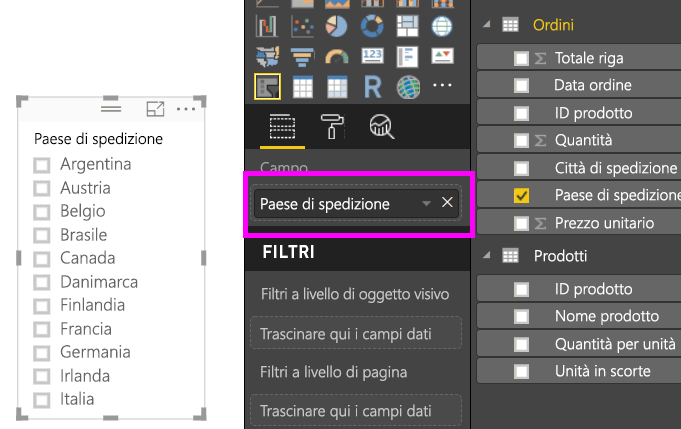
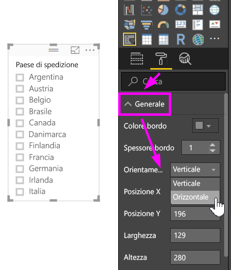
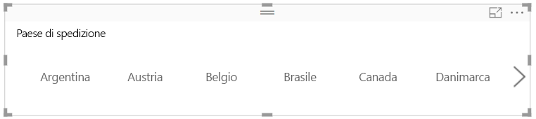
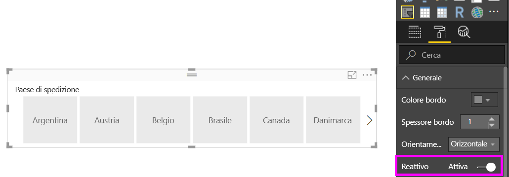
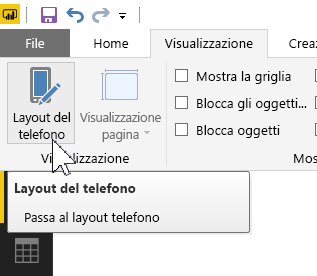
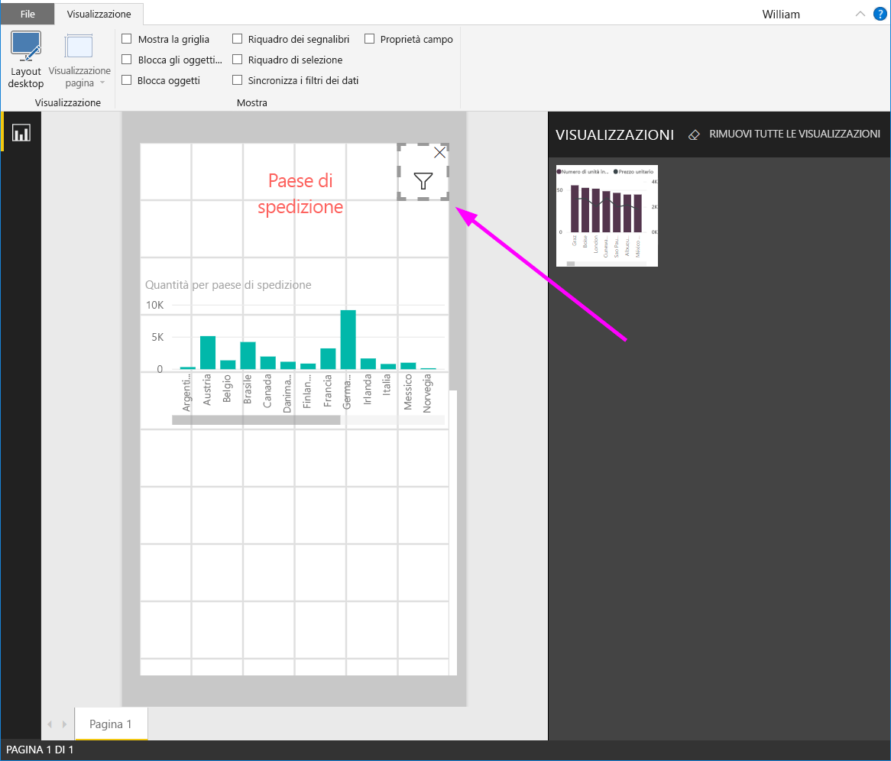

# Creare un filtro dei dati reattivo e ridimensionabile in Power BI

I filtri dei dati reattivi possono essere ridimensionati per adattarsi a qualunque spazio nel report. Ridimensionando i filtri dei dati reattivi in base a dimensioni e forme diverse, ad esempio orizzontale, quadrata o verticale, i valori del filtro dei dati verranno automaticamente ridisposti. In Power BI Desktop e nel servizio Power BI, è possibile rendere reattivi i filtri dei dati orizzontali e i filtri dei dati data/intervallo. I filtri dei dati data/intervallo offrono anche aree di tocco migliorate per modificarli più facilmente con la punta del dito. È possibile creare filtri dei dati reattivi di piccole o grandi dimensioni. Verranno ridimensionati automaticamente per adattarsi ai report nel servizio Power BI e alle app Power BI per dispositivi mobili. 

## Creare un filtro dei dati

Il primo passaggio per creare un filtro dei dati dinamico prevede la creazione di un filtro dei dati di base. 

1. Selezionare l'icona del **filtro dei dati**  nel riquadro **Visualizzazioni**.
2. Trascinare il campo da filtrare su **Campo**.

    

## Convertire un filtro dei dati in filtro dei dati orizzontale

1. Con il filtro dei dati selezionato, nel riquadro **Visualizzazioni** selezionare la scheda **Formato**.
2. Espandere la sezione **Generale**, quindi in **Orientamento** selezionare **Orizzontale**.

     

1.  Sarà probabilmente necessario allargarlo per visualizzare un maggior numero di valori.

     

## Renderlo reattivo e provare a usarlo

Questo passaggio è facile. 

1. In **Orientamento**, nella sezione **Generale** della scheda **Formato**, impostare **Reattivo** su **Sì**.  

    

1. ed è possibile provarlo. Trascinare gli angoli per abbassarlo, allungarlo, allargarlo o restringerlo. Se lo si imposta molto piccolo, diventa un'icona di filtro.

    

## Aggiungerlo al layout del report per il telefono

In Power BI Desktop è possibile creare un layout telefono per ogni pagina di un report. Se una pagina ha un layout telefono, in un telefono cellulare verrà visualizzata con l'orientamento verticale. In caso contrario, sarà necessario visualizzarla con l'orientamento orizzontale. 

1. Nel menu **Visualizza** selezionare **Layout telefono**.

     
    
1. Trascinare tutti gli oggetti visivi desiderati nel report per il telefono sulla griglia. Quando si trascina il filtro dei dati reattivo, impostare le dimensioni desiderate. In questo caso, semplicemente un'icona di filtro.

    

Altre informazioni su come creare [report ottimizzati per l'app Power BI per dispositivi mobili](desktop-create-phone-report.md).

## Impostare un filtro dei dati temporale o di intervallo su reattivo

Per impostare un filtro dei dati temporale o di intervallo come reattivo, è possibile seguire la stessa procedura. Dopo aver impostato l'opzione **Reattivo** su **Sì**, osservare quanto segue:

- Gli oggetti visivi ottimizzano l'ordine delle caselle di input a seconda delle dimensioni consentite nell'area di disegno. 
- La visualizzazione dell'elemento dati è ottimizzata per aumentare al massimo l'usabilità del filtro dei dati, a seconda delle dimensioni consentite nell'area di disegno. 
- Le nuove barre di controllo arrotondate su filtri dei dati ottimizzano le interazioni tramite tocco. 
- Quando un oggetto visivo diventa troppo piccolo per essere utile, assume la forma di un'icona che rappresenta il tipo di oggetto visivo sottostante. Toccare due volte l'icona per aprire l'oggetto visivo in modalità messa a fuoco e interagire con esso. Questo permette di risparmiare spazio prezioso nella pagina del report senza alcuna perdita di funzionalità.

## Passaggi successivi

- [Filtri dei dati nel servizio Power BI](power-bi-visualization-slicers.md)
- Altre domande? [Provare a rivolgersi alla community di Power BI](http://community.powerbi.com/)