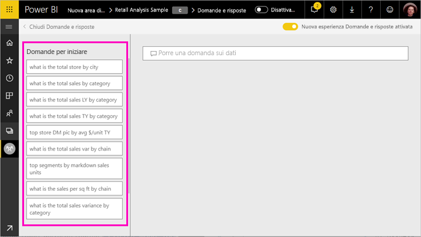
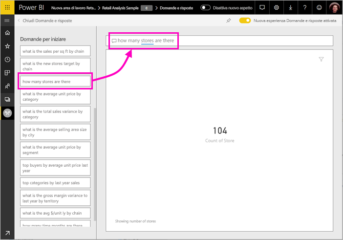
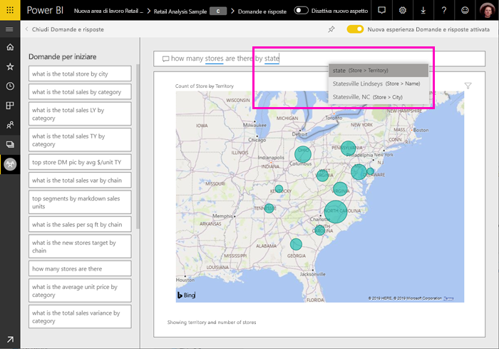
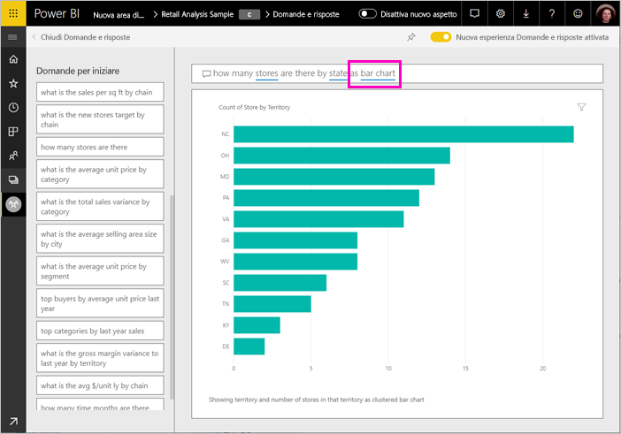
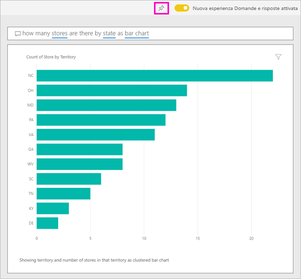

# Usare Power BI domande e risposte per esplorare i dati e creare oggetti visivi

A volte il modo più rapido per ottenere una risposta dai dati consiste nel porre una domanda usando il linguaggio naturale. La funzionalità domande e risposte in Power BI consente di esplorare i dati usando termini personalizzati.  La prima parte di questo articolo illustra come usare domande e risposte nei dashboard nel servizio Power BI. Nella seconda parte viene possibile operazioni con domande e risposte durante la creazione di report nel servizio Power BI o Power BI Desktop. Per altre informazioni, vedere la [domande e risposte per i consumer](consumer/end-user-q-and-a.md) articolo. 

[Domande e risposte nelle App per dispositivi mobili di Power BI](consumer/mobile/mobile-apps-ios-qna.md) e [domande e risposte con Power BI Embedded](developer/qanda.md) sono trattati in articoli separati. 

Domande e risposte è interattiva, persino divertente. Una domanda spesso ad altri utenti che le visualizzazioni rivelano spunti interessanti percorsi. Il video seguente mostra come usare Domande e risposte per creare visualizzazioni, analizzare questi oggetti visivi e aggiungerli ai dashboard.

<iframe width="560" height="315" src="https://www.youtube.com/embed/qMf7OLJfCz8?list=PL1N57mwBHtN0JFoKSR0n-tBkUJHeMP2cP" frameborder="0" allowfullscreen></iframe>

## Parte 1: Usare domande e risposte in un dashboard nel servizio Power BI

Nel servizio Power BI (app.powerbi.com), un dashboard contiene riquadri aggiunti da uno o più set di dati, pertanto è possibile porre domande sui set di dati contenuti in uno di questi set di dati. Per visualizzare i report e set di dati sono stati usati per creare il dashboard, selezionare **Visualizza elementi correlati** dalla barra dei menu.

La casella domande e risposte si trova nell'angolo superiore sinistro del dashboard, in cui si digita la domanda usando il linguaggio naturale. Non è visualizzata una casella di domande e risposte? Visualizzare [considerazioni e risoluzione dei problemi](consumer/end-user-q-and-a.md#considerations-and-troubleshooting) nel **domande e risposte per i consumer** articolo.  Domande e risposte riconosce le parole digitate e determina dove (in quale set di dati) per trovare la risposta. Domande e risposte consente anche di formulare la domanda con il completamento automatico, la riformulazione e altri ausili testuali e visivi.

La risposta alla domanda viene mostrata come visualizzazione interattiva e si aggiorna man mano che si modifica la domanda.

1. Aprire un dashboard e posizionare il cursore nella casella delle domande. Nell'angolo superiore destro, selezionare **esperienza di nuove domande e risposte**.

    

1. Ancora prima di iniziare a digitare, Domande e risposte mostra una nuova schermata con suggerimenti utili a formulare la domanda. Possibile visualizzare le frasi e domande complete contenente i nomi delle tabelle nel set di dati sottostanti e riscontrare addirittura completo alle domande elencate se il proprietario del set di dati ha creato [domande in primo piano](service-q-and-a-create-featured-questions.md),

   

   È possibile scegliere una di queste domande come punto di partenza e continuare a perfezionare la domanda per trovare una risposta specifica. Oppure usare un nome di tabella per agevolare l'inserimento di una nuova domanda.

2. Selezionare dall'elenco di domande, oppure iniziare a digitare una domanda e selezionare l'elenco a discesa suggerimenti.

   

3. Mentre si digita una domanda, domande e risposte sceglie la visualizzazione più adatta per fornire una risposta.

   

4. La visualizzazione cambia dinamicamente mentre si modifica la domanda.

   

1. Quando si digita una domanda, Power BI cerca la migliore risposta in qualsiasi set di dati per cui è presente un riquadro nel dashboard.  Se tutti i riquadri si riferiscono al *set di dati A*, la risposta proverrà dal *set di dati A*.  Se sono presenti riquadri del *set di dati a* e *set di dati b*, quindi domande e risposte Cerca la risposta migliore in questi set di 2 dati.

   > [!TIP]
   > Prestare attenzione se è presente un solo riquadro del *set di dati A* perché, se viene rimosso dal dashboard, Domande e risposte non avrà più accesso al *set di dati A*.
   >

5. Quando si è soddisfatti del risultato, aggiungere la visualizzazione a un dashboard selezionando l'icona della puntina nell'angolo superiore destro. Se il dashboard è stato condiviso con l'utente corrente o fa parte di un'app, non sarà possibile aggiungere la visualizzazione.

   

## Parte 2: Usare Domande e risposte in un report del servizio Power BI o di Power BI Desktop

Usare Domande e risposte per esplorare il set di dati e aggiungere visualizzazioni al report e ai dashboard. Un report è basato su un singolo set di dati e potrebbe risultare completamente vuoto o contenere pagine piene di visualizzazioni. Tuttavia, se un report è vuoto, non significa che non sono presenti dati da esplorare. Il set di dati è collegato al report e attende che gli utenti esplorino i dati e creino le visualizzazioni.  Per visualizzare il set di dati usato per creare un report, aprire il report nella Visualizzazione di lettura nel servizio Power BI e selezionare **Visualizza elementi correlati** dalla barra dei menu.

Per usare domande e risposte nei report, è necessario disporre delle autorizzazioni di modifica per il report e set di dati sottostante. Nel [domande e risposte per i consumatori](consumer/end-user-q-and-a.md) articolo, si fa riferimento a questo elemento come una *creatore* scenario. Se invece si *consuming* un report in cui è stato condiviso con l'utente, domande e risposte non è disponibile.

1. Aprire un report in visualizzazione di modifica (servizio Power BI) o visualizzazione di Report (Power BI Desktop) e selezionare **porre una domanda** dalla barra dei menu.

    **Power BI Desktop**    
    

    **Servizio**    
    

2. Nell'area di disegno del report verrà visualizzata la casella delle domande di Domande e risposte. Nell'esempio seguente la casella delle domande viene visualizzata sopra un'altra visualizzazione. In questo caso, è consigliabile aggiungere una pagina vuota al report prima di porre una domanda.

    

3. Posizionare il cursore nella casella della domanda. Mentre si digita, Domande e risposte visualizza suggerimenti per formulare la domanda.

   

4. Mentre si digita una domanda, Domande e risposte seleziona la [visualizzazione](visuals/power-bi-visualization-types-for-reports-and-q-and-a.md) più adatta per la risposta. La visualizzazione cambia dinamicamente via via che si modifica la domanda.

   

5. Quando si ottiene la visualizzazione desiderata, premere il tasto INVIO. Per salvare la visualizzazione con il report, fare clic su **File > Salva**.

6. Interagire con la nuova visualizzazione. Non è importante il modo in cui è stata creata la visualizzazione, perché l'interattività, la formattazione e le funzionalità saranno le stesse.

   

   Se la visualizzazione è stata creata nel servizio Power BI, sarà possibile [aggiungerla a un dashboard](service-dashboard-pin-tile-from-q-and-a.md).

## Indicare a Domande e risposte quali visualizzazioni usare
Con Domande e risposte non solo è possibile chiedere ai dati di parlare da sé, ma è anche possibile specificare in che modo visualizzarli. È sufficiente aggiungere "come <visualization type>" alla fine della domanda.  ad esempio "mostra volume inventario per stabilimento come mappa" e "mostra inventario totale come scheda".  Provare in prima persona.

## Considerazioni e risoluzione dei problemi
- Se la connessione al set di dati è stata effettuata tramite una connessione in tempo reale o un gateway, è necessario che la funzionalità Domande e risposte sia [abilitata per il set di dati](service-q-and-a-direct-query.md) in questione.

- È stato aperto un report ma l'opzione Domande e risposte non è visualizzata. Se si usa il servizio Power BI, assicurarsi di aprire il report nella Visualizzazione di modifica. Se non è possibile aprire la visualizzazione di modifica significa che non hai le autorizzazioni di modifica per il report ed è possibile usare domande e risposte con tale report specifico.

## Passaggi successivi

- [Domande e risposte per i consumer](consumer/end-user-q-and-a.md)   
- [Suggerimenti per porre domande in Domande e risposte](consumer/end-user-q-and-a-tips.md)   
- [Preparare una cartella di lavoro per Domande e risposte](service-prepare-data-for-q-and-a.md)  
- [Preparare un set di dati in locale per domande e risposte](service-q-and-a-direct-query.md)   
- [Aggiungere un riquadro a un dashboard da Domande e risposte](service-dashboard-pin-tile-from-q-and-a.md)
