# Esercitazione: Come usare Domande e risposte per creare visualizzazioni e report
Nella [panoramica di Domande e risposte](consumer/end-user-q-and-a.md) è stata illustrata la funzionalità Domande e risposte di Power BI e la differenza tra *consumer* (utenti con cui sono stati condivisi dashboard e report) e *autori* (proprietari dei report e dei set di dati sottostanti). La prima parte di questa esercitazione è destinata principalmente agli utenti (consumer) che accedono ai dashboard tramite il servizio Power BI. La seconda parte è invece destinata a coloro che creano i report tramite il servizio Power BI o Power BI Desktop. Gli argomenti relativi a [Domande e risposte e Power BI per dispositivi mobili](consumer/mobile/mobile-apps-ios-qna.md) e [Domande e risposte con Power BI Embedded](developer/qanda.md) vengono illustrati in articoli separati.

La funzionalità Domande e risposte è interattiva e persino divertente e non è raro che una domanda ne faccia sorgere molte altre via via che le visualizzazioni rivelano spunti interessanti. Il video seguente mostra come usare Domande e risposte per creare visualizzazioni, analizzare questi oggetti visivi e aggiungerli ai dashboard.

<iframe width="560" height="315" src="https://www.youtube.com/embed/qMf7OLJfCz8?list=PL1N57mwBHtN0JFoKSR0n-tBkUJHeMP2cP" frameborder="0" allowfullscreen></iframe>

## Parte 1: Usare Domande e risposte in un dashboard nel servizio Power BI (app.powerbi.com)
Un dashboard contiene riquadri aggiunti da uno o più set di dati ed è quindi possibile porre domande su tutti i dati inclusi in questi set di dati. Per visualizzare i report e i set di dati usati per creare il dashboard, selezionare **Visualizza elementi correlati** dalla barra dei menu.

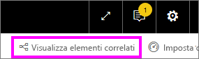

La casella delle domande di Domande e risposte si trova nell'angolo superiore sinistro del dashboard e consente di digitare le domande usando il linguaggio naturale. Domande e risposte riconosce le parole digitate e determina dove (in quale set di dati) trovare la risposta. Domande e risposte consente anche di formulare la domanda con il completamento automatico, la riformulazione e altri ausili testuali e visivi.

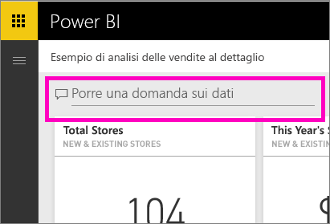

La risposta alla domanda viene mostrata come visualizzazione interattiva e si aggiorna man mano che si modifica la domanda.

1. Aprire un dashboard e posizionare il cursore nella casella delle domande. Ancora prima di iniziare a digitare, Domande e risposte mostra una nuova schermata con suggerimenti utili a formulare la domanda. Verranno visualizzati i nomi delle tabelle nei [set di dati sottostanti](service-get-data.md) e, in alcuni casi, un elenco contenente domande complete se il proprietario del set di dati ha creato [domande in primo piano](service-q-and-a-create-featured-questions.md).

   

   Si può sempre scegliere una di queste domande come punto di partenza e quindi perfezionare la domanda per trovare la risposta specifica che si sta cercando. In alternativa, usare un nome di tabella per agevolare l'inserimento di una nuova domanda.

2. Effettuare una selezione dalle opzioni del set di dati oppure iniziare a digitare la domanda desiderata e selezionare una voce nell'elenco a discesa dei suggerimenti.

   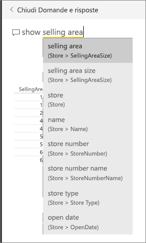

3. Mentre si digita una domanda, Domande e risposte seleziona la [visualizzazione](visuals/power-bi-visualization-types-for-reports-and-q-and-a.md) più adatta per la risposta. La visualizzazione cambia dinamicamente via via che si modifica la domanda.

   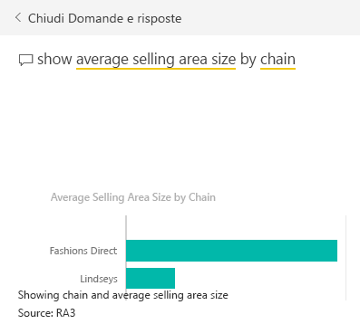

4. Quando si digita una domanda, Power BI cerca la migliore risposta in qualsiasi set di dati per cui è presente un riquadro nel dashboard.  Se tutti i riquadri si riferiscono al *set di dati A*, la risposta proverrà dal *set di dati A*.  Se invece sono presenti riquadri del *set di dati A* e del *set di dati B*, Domande e risposte cerca la risposta migliore in questi due set di dati.

   > [!TIP]
   > Prestare attenzione se è presente un solo riquadro del *set di dati A* perché, se viene rimosso dal dashboard, Domande e risposte non avrà più accesso al *set di dati A*.
   >
   >
5. Quando il risultato è soddisfacente, [aggiungere la visualizzazione a un dashboard](service-dashboard-pin-tile-from-q-and-a.md) selezionando l'icona di aggiunta nell'angolo in alto a destra. Se il dashboard è stato condiviso con l'utente corrente o fa parte di un'app, non sarà possibile aggiungere la visualizzazione.

   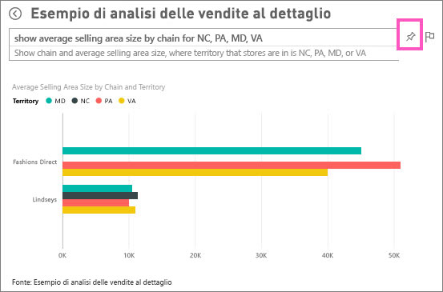

##    Parte 2: Usare Domande e risposte in un report del servizio Power BI o di Power BI Desktop

Usare Domande e risposte per esplorare il set di dati e aggiungere visualizzazioni al report e ai dashboard. Un report è basato su un singolo set di dati e potrebbe risultare completamente vuoto o contenere pagine piene di visualizzazioni. Tuttavia, se un report è vuoto, non significa che non sono presenti dati da esplorare. Il set di dati è collegato al report e attende che gli utenti esplorino i dati e creino le visualizzazioni.  Per visualizzare il set di dati usato per creare un report, aprire il report nella Visualizzazione di lettura nel servizio Power BI e selezionare **Visualizza elementi correlati** dalla barra dei menu.

Per usare Domande e risposte nei report, è necessario disporre delle autorizzazioni di modifica per il report e per i set di dati sottostanti. Nell'argomento relativo alla [panoramica di Domande e risposte](consumer/end-user-q-and-a.md) questo è stato descritto come uno scenario *autore*. Per gli utenti *consumer*, ovvero coloro con i quali è stato condiviso il report, Domande e risposte non sarà disponibile.

1. Aprire un report in Visualizzazione di modifica (servizio Power BI) o Visualizzazione report (Power BI Desktop) e selezionare **Invia una domanda** dalla barra dei menu.

    **Desktop**    
    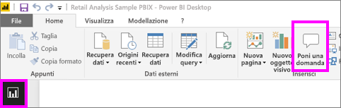

    **Servizio**    
    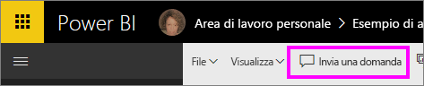

2. Nell'area di disegno del report verrà visualizzata la casella delle domande di Domande e risposte. Nell'esempio seguente la casella delle domande viene visualizzata sopra un'altra visualizzazione. In questo caso, è consigliabile [aggiungere una pagina vuota al report](power-bi-report-add-page.md) prima di porre una domanda.

    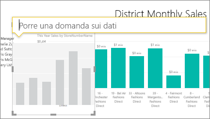

3. Posizionare il cursore nella casella della domanda. Mentre si digita, Domande e risposte visualizza suggerimenti per formulare la domanda.

   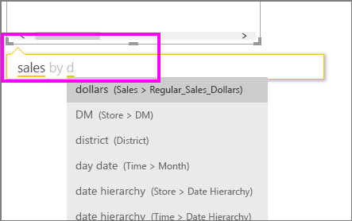

4. Mentre si digita una domanda, Domande e risposte seleziona la [visualizzazione](visuals/power-bi-visualization-types-for-reports-and-q-and-a.md) più adatta per la risposta. La visualizzazione cambia dinamicamente via via che si modifica la domanda.

   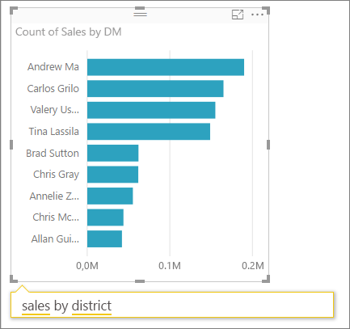

5. Quando si ottiene la visualizzazione desiderata, premere il tasto INVIO. Per salvare la visualizzazione con il report, fare clic su **File > Salva**.

6. Interagire con la nuova visualizzazione. Non è importante il modo in cui è stata creata la visualizzazione, perché l'interattività, la formattazione e le funzionalità saranno le stesse.

   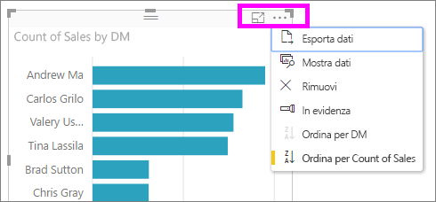

   Se la visualizzazione è stata creata nel servizio Power BI, sarà possibile [aggiungerla a un dashboard](service-dashboard-pin-tile-from-q-and-a.md).

## Indicare a Domande e risposte quale visualizzazione usare.
Con Domande e risposte non solo è possibile chiedere ai dati di parlare da sé, ma è anche possibile specificare in che modo visualizzarli. È sufficiente aggiungere "come <visualization type>" alla fine della domanda.  ad esempio "mostra volume inventario per stabilimento come mappa" e "mostra inventario totale come scheda".  Provare in prima persona.

##  Considerazioni e risoluzione dei problemi
- Se la connessione al set di dati è stata effettuata tramite una connessione in tempo reale o un gateway, è necessario che la funzionalità Domande e risposte sia [abilitata per il set di dati](consumer/end-user-q-and-a-direct-query.md) in questione.

- È stato aperto un report ma l'opzione Domande e risposte non è visualizzata. Se si usa il servizio Power BI, assicurarsi di aprire il report nella Visualizzazione di modifica. Se non è possibile aprire la Visualizzazione di modifica, significa che non si dispone delle autorizzazioni di modifica per il report e che non sarà quindi possibile usare Domande e risposte per il report specifico.

## Passaggi successivi
Tornare a [Domande e risposte in Power BI](consumer/end-user-q-and-a.md)   
[Esercitazione: Usare Domande e risposte con l'esempio sulle vendite al dettaglio](power-bi-visualization-introduction-to-q-and-a.md)   
[Suggerimenti per porre domande in Domande e risposte](consumer/end-user-q-and-a-tips.md)   
[Preparare una cartella di lavoro per Domande e risposte](service-prepare-data-for-q-and-a.md)  
[Preparare un set di dati locale per Domande e risposte](consumer/end-user-q-and-a-direct-query.md)
[Aggiungere un riquadro a un dashboard da Domande e risposte](service-dashboard-pin-tile-from-q-and-a.md)
