# Mappe ArcGIS di Esri nel servizio Power BI e in Power BI Desktop
Questa esercitazione è stata scritta dal punto di vista di una persona che crea una mappa ArcGIS. Quando l'autore condivide una mappa ArcGIS con un collega, questi potrà vederla e interagire con essa, ma non salvare le modifiche. +Per altre informazioni sulla visualizzazione di una mappa ArcGIS, vedere [Interacting with ArcGIS maps](visuals/power-bi-visualizations-arcgis.md) (Interazione con le mappe ArcGIS).

Dalla combinazione tra le mappe ArcGIS e Power BI nasce una soluzione di mapping di livello superiore, che non si limita alla presentazione di punti su una mappa. È possibile scegliere tra mappe di base, tipi di posizione, temi, stili per i simboli e livelli di riferimento per creare visualizzazioni mappa ricche di dettagli e di grande impatto visivo. La combinazione di livelli di dati autorevoli su una mappa con l'analisi spaziale consente di ottenere informazioni più approfondite sui dati nella visualizzazione.

 Sebbene in un dispositivo mobile non sia possibile creare mappe ArcGIS, è possibile visualizzarle e interagire con esse. Vedere [Interacting with ArcGIS maps](visuals/power-bi-visualizations-arcgis.md) (Interazione con le mappe ArcGIS).

> [!TIP]
> GIS è l'acronimo per Geographic Information Science (Scienza delle informazioni geografiche).

L'esempio seguente usa un'area di disegno di colore grigio scuro per mostrare le vendite per area geografica come mappa termica su un livello demografico relativo al reddito medio netto 2016. Come si spiegherà più avanti, le mappe ArcGIS offrono funzionalità avanzate di mapping praticamente illimitate, dati demografici e visualizzazioni mappa ancora più interessanti per poter ottenere i migliori risultati.

> [!TIP]
> Visitare la [pagina di Esri su Power BI](https://www.esri.com/powerbi) per trovare molti esempi e leggere testimonianze. Vedere quindi l'[introduzione a Mappe ArcGIS per Power BI](https://doc.arcgis.com/en/maps-for-powerbi/get-started/about-maps-for-power-bi.htm) fornita da Esri.

## Consenso dell'utente
ArcGIS Maps for Power BI è fornito da Esri (www.esri.com). L'uso di Mappe ArcGIS per Power BI è soggetto alle condizioni e all'informativa sulla privacy di Esri. Gli utenti di Power BI che vogliono usare le mappe di ArcGIS per gli oggetti visivi di Power BI devono confermare il proprio consenso nell'apposita finestra.

**Risorse**

[Condizioni](https://go.microsoft.com/fwlink/?LinkID=826322)

[Informativa sulla privacy](https://go.microsoft.com/fwlink/?LinkID=826323)

[Pagina del prodotto Mappe ArcGIS per Power BI](https://www.esri.com/powerbi)

 

## Abilitare una mappa ArcGIS
Le mappe ArcGIS sono attualmente disponibili nel servizio Power BI, in Power BI Desktop e in Power BI per dispositivi mobili. Questo articolo fornisce istruzioni per il servizio Power BI e Power BI Desktop.

### Abilitare la mappa ArcGIS ***nel servizio Power BI (app.powerbi.com)***
Questa esercitazione usa l'[esempio di analisi delle vendite al dettaglio](sample-retail-analysis.md). Per abilitare **Mappe ArcGIS per Power BI**:

1. Nella sezione superiore destra della barra dei menu selezionare l'icona della ruota dentata e aprire **Impostazioni**
   
    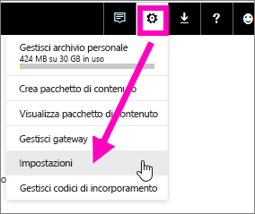
2. Selezionare la casella di controllo **Mappe ArcGIS per Power BI**. Dopo aver effettuato la selezione è necessario riavviare Power BI.
   
    
3. Aprire un report in [Visualizzazione di modifica](consumer/end-user-reading-view.md) e selezionare l'icona Mappe ArcGIS per Power BI nel riquadro Visualizzazioni.
   
    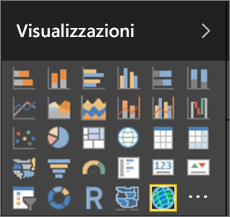
4. Power BI aggiunge un modello di mappa ArcGIS vuoto all'area di disegno report.
   
   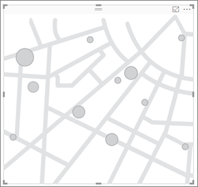

 

## Creare un oggetto visivo mappa ArcGIS
Osservare come vengono create alcune visualizzazioni di mappe ArcGIS e quindi usare la procedura seguente per provare usando l'[esempio di analisi delle vendite al dettaglio](sample-datasets.md).

<iframe width="560" height="315" src="https://www.youtube.com/embed/EKVvOZmxg9s" frameborder="0" allowfullscreen></iframe>

1. Dal riquadro **Campi** trascinare un campo di dati nei bucket **Località** o **Latitudine** e/o **Longitudine**. In questo esempio viene usato **Store > City**.
   
   > [!NOTE]
   > Mappe ArcGIS per Power BI rileva automaticamente se i campi selezionati saranno meglio visualizzati come forma o come punto su una mappa. È possibile modificare il valore predefinito nelle impostazioni (vedere sotto).
   > 
   > 
   
    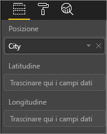
2. Convertire la visualizzazione in una mappa di ArcGIS selezionando il modello nel riquadro Visualizzazioni .
3. Dal riquadro **Campi** trascinare una misura sui bucket **Dimensione** per regolare la modalità di visualizzazione dei dati. In questo esempio viene usato **Sales > Last Year Sales**.
   
    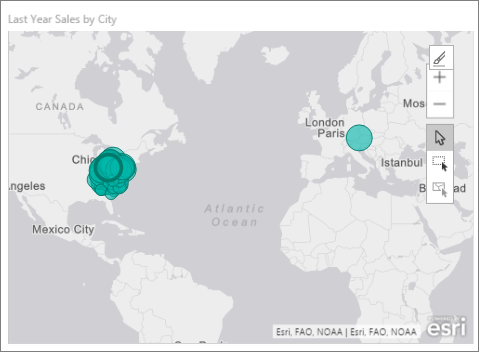

## Impostazioni e formattazione per le mappe ArcGIS
Per accedere alle caratteristiche di formattazione di **Mappe ArcGIS per Power BI**:

1. Accedere a funzionalità aggiuntive selezionando i puntini di sospensione nell'angolo in alto a destra della visualizzazione e scegliendo **Modifica**.
   
   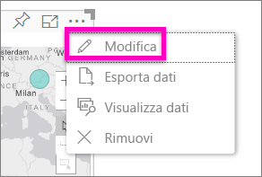
   
   Le funzionalità disponibili vengono mostrate nella parte superiore della visualizzazione. Ogni funzionalità, se selezionata, apre un riquadro attività che fornisce opzioni dettagliate. 
   
   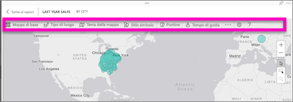
   
   > [!NOTE]
   > Per altre informazioni sulle funzionalità e sulle impostazioni, vedere **Documentazione dettagliata** di seguito.
   > 
   > 
2. Per tornare al report, selezionare **Torna al report** dall'angolo superiore sinistro dell'area di disegno del report.

 

## Documentazione dettagliata
**Esri** fornisce una [documentazione completa](https://go.microsoft.com/fwlink/?LinkID=828772) nel set di funzionalità di **Mappe ArcGIS per Power BI**.

## Panoramica delle funzionalità
### Mappe di base
Vengono fornite quattro mappe di base: Canvas grigio scuro, Tela grigio chiaro, OpenStreetMap e Vie.  Vie è la mappa di base standard di ArcGIS.

Per applicare una mappa di base selezionarla nel riquadro attività.

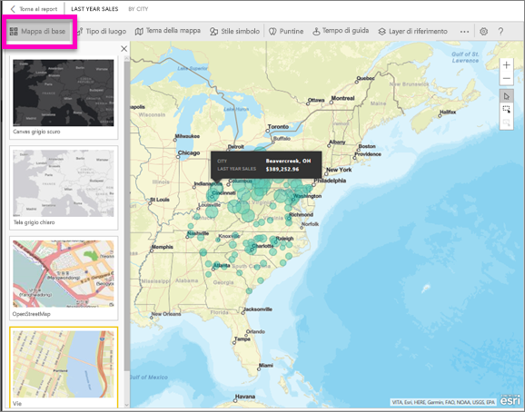

### Tipo di luogo
Mappe ArgGIS per Power BI rileva automaticamente il modo migliore per visualizzare i dati sulla mappa, selezionando da Punti o Confini. Le opzioni Tipo di luogo consentono di ottimizzare queste selezioni.

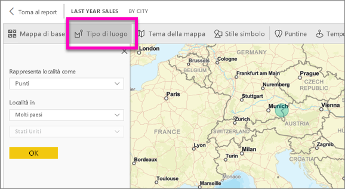

**Confini** funziona solo se i dati contengono valori geografici standard. Esri determina automaticamente la forma da visualizzare sulla mappa. I valori geografici standard includono paesi, province, codici di avviamento postale e così via. Tuttavia, proprio come con la geocodifica, Power BI potrebbe non rilevare che il campo deve essere un limite per impostazione predefinita, o potrebbe non avere un limite per i dati.  

### Tema della mappa
Vengono forniti quattro temi di mappa. I temi Solo luogo e Dimensioni vengono scelti automaticamente in base ai campi associati alla posizione e aggiunti al bucket **Dimensioni** nel riquadro Campi di Power BI. In questo caso si usa **Dimensioni**, perciò si può passare a **Mappa termica**.  

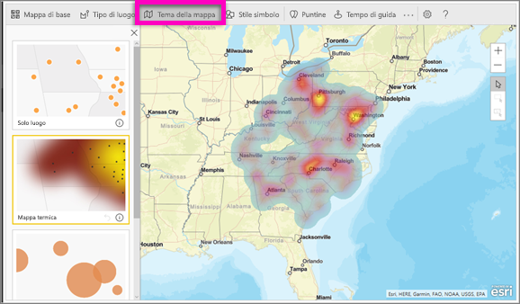

<table>
<tr><th>Tema</th><th>Descrizione</th>
<tr>
<td>Solo luogo</td>
<td>Traccia punti dati o confini riempiti sulla mappa in base alle impostazioni in Tipo di località.</td>
</tr>
<tr>
<td>Mappa termica</td>
<td>Disegna un tracciato di intensità dei dati della mappa.</td>
</tr>
<tr>
<td>Dimensioni</td>
<td>Traccia punti dati sulla mappa in base alle dimensioni del valore nel bucket dimensioni nel riquadro campi.</td>
</tr>
<tr>
<td>Clustering</td>
<td>Traccia il numero di punti dati nelle aree sulla mappa. </td>
</tr>
</table>

### Stile simbolo
Gli stili di simboli consentono di ottimizzare la modalità di presentazione dei dati sulla mappa. Gli stili di simboli sono sensibili al contesto in base al tipo di località selezionato e al tema della mappa. L'esempio seguente mostra il tipo di località impostato su **Dimensioni** e diverse modifiche apportate a trasparenza, stile e dimensioni.

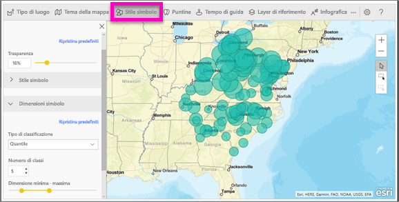

### Puntine
Per attirare l'attenzione su specifici punti della mappa è possibile aggiungere puntine.  

1. Selezionare la scheda **Puntine**.
2. Digitare le parole chiave (ad esempio indirizzi, posti e punti di interesse), nella casella di ricerca e selezionare dall'elenco a discesa. Verrà visualizzato un simbolo sulla mappa e sarà ingrandita automaticamente la località. I risultati della ricerca vengono salvati come schede località nel riquadro Puntine. È possibile salvare fino a 10 schede località.
   
   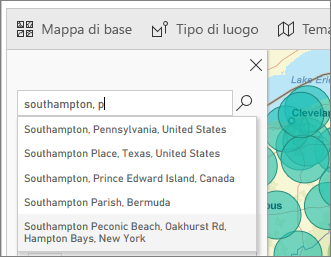
3. Alla posizione selezionata viene aggiunta una puntina, di cui è possibile cambiare il colore.
   
   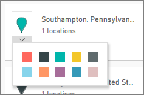
4. Aggiungere ed eliminare puntine.
   
   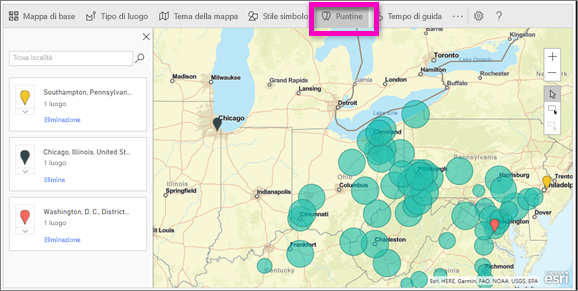

### Tempo di guida
Il riquadro Drive time (Tempo di guida) consente di selezionare una località e quindi determinare quali altre funzionalità della mappa sono comprese entro un raggio o un tempo di guida specificato.  
    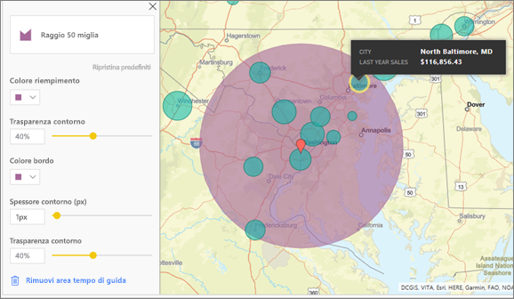

1. Selezionare la scheda **Drive time** e scegliere lo strumento di selezione singola o multipla. Selezionare la puntina per Washington D.C.
    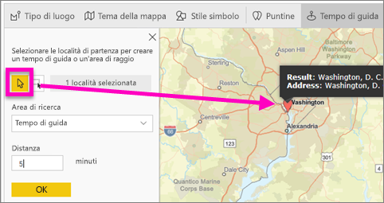
   
   > [!TIP]
   > Risulta più semplice selezionare una località se si esegue lo zoom avanti sulla mappa (usando l'icona +).
   > 
   > 
2. Si supponga di dovere andare a Washington D.C. per alcuni giorni e che si voglia capire quali negozi si trovano a una distanza ragionevole in auto. Modificare l'area di ricerca in **Radius** (Raggio) e Distance (Distanza) in **50** miglia, quindi selezionare OK.    
   
    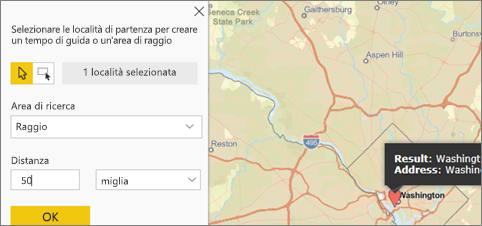
3. Il raggio è indicato in viola. Selezionare qualsiasi località per visualizzarne i dettagli. Facoltativamente, cambiare il formato del raggio modificandone colore e profilo.
   
    

### Layer di riferimento
#### Layer di riferimento - dati demografici
Mappe ArcGIS per Power BI fornisce una selezione di livelli demografici che consentono di contestualizzare i dati da Power BI.

1. Selezionare la scheda **Layer di riferimento** e quindi scegliere **Dati demografici**.
2. Ogni livello (o layer) elencato ha una casella di controllo. Aggiungere un segno di spunta per aggiungere tale livello alla mappa.  In questo esempio è stato aggiunto reddito medio del nucleo familiare. 
   
    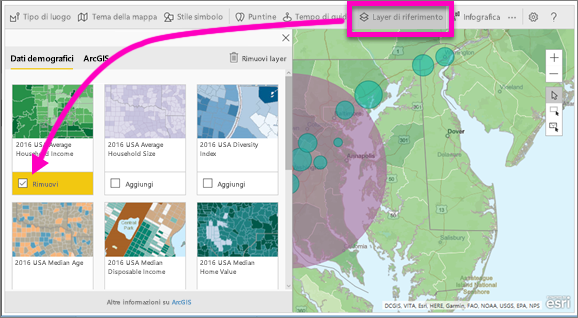
3. Ogni livello è interattivo. Così come è possibile passare il mouse su una bolla per visualizzare i dettagli, è anche possibile fare clic su un'area ombreggiata sulla mappa per visualizzare i dettagli. 
   
    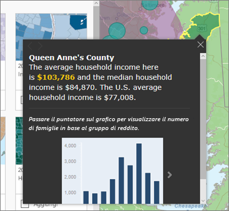

#### Layer di riferimento - ArcGIS
ArcGIS Online consente alle organizzazioni di pubblicare mappe Web pubbliche. Inoltre, Esri fornisce un set predefinito di mappe Web grazie a Living Atlas. Nella scheda ArcGIS, è possibile cercare tutte le mappe Web pubbliche o la cartografia di Living Atlas e aggiungerle alla mappa come layer di riferimento.

1. Selezionare la scheda **Layer di riferimento** e quindi scegliere **ArcGIS**.
2. Immettere i termini di ricerca e quindi selezionare un livello di mappa. In questo esempio sono stati scelti i quartieri del Congresso negli Stati Uniti.
   
    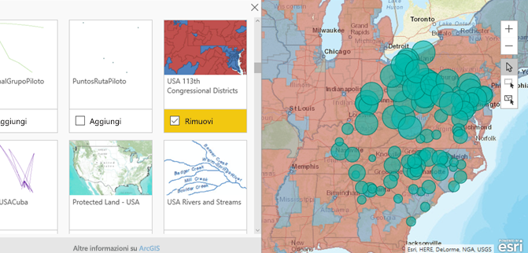
3. Per visualizzare i dettagli, selezionare un'area ombreggiata per aprire *Selezionare dal layer di riferimento*. Usare lo strumento di selezione layer di riferimento agli oggetti o ai confini di selezione sul layer di riferimento.

 

## Selezione dei punti dati
Mappe ArcGIS per Power BI consente tre modalità di selezione.

Cambiare la modalità di selezione con il commutatore:

 Selezionare singoli punti dati.

 Disegna un rettangolo sulla mappa e seleziona i punti dati in essi contenuti.

 Consente di usare i limiti o i poligoni all'interno dei layer di riferimento per selezionare i punti dati in essi contenuti.

> [!NOTE]
> È possibile selezionare un massimo di 250 punti dati alla volta.
> 
> 

 

## Chiedere assistenza
**Esri** fornisce una [documentazione completa](https://go.microsoft.com/fwlink/?LinkID=828772) nel set di funzionalità di **Mappe ArcGIS per Power BI**.

È possibile porre domande, ottenere informazioni aggiornate, segnalare problemi e trovare risposte nel [thread della community di Power BI correlato a **Mappe ArcGIS per Power BI**](https://go.microsoft.com/fwlink/?LinkID=828771).

Se si vuole proporre un miglioramento, inviare il suggerimento all'[elenco di idee di Power BI](https://ideas.powerbi.com).

 

## Gestione dell'uso di Mappe ArcGIS per Power BI all'interno dell'organizzazione
Power BI offre la possibilità a utenti, amministratori tenant e amministratori IT di scegliere se usare Mappe ArcGIS per Power BI.

**Opzioni utente** In Power BI Desktop gli utenti possono interrompere l'uso di Mappe ArcGIS per Power BI disabilitandolo nella scheda Sicurezza in **Opzioni**. Se disabilitato, Mappe ArcGIS non verrà caricato per impostazione predefinita.

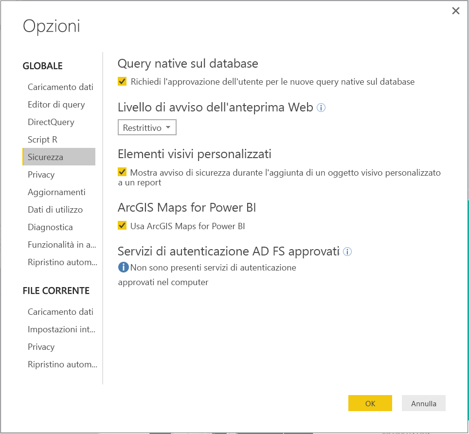

Nel servizio Power BI, gli utenti possono smettere di usare Mappe ArcGIS per Power BI disabilitandolo nelle impostazioni utente della scheda Mappe ArcGIS per Power BI. Se disabilitato, Mappe ArcGIS non verrà caricato per impostazione predefinita.

**Opzioni amministrazione tenant** In PowerBI.com, gli amministratori tenant possono impedire a tutti gli utenti tenant di usare Mappe ArcGIS per Power BI disabilitandolo. In questo caso, Power BI non potrà più visualizzare l'icona di Mappe ArcGIS per Power BI nel riquadro Visualizzazioni.

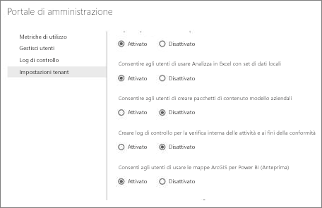

**Opzioni amministratore IT** Power BI Desktop supporta l'uso di **criteri di gruppo** per disattivare Mappe ArcGIS per Power BI in tutti i computer distribuiti in un'organizzazione.

<table>
<tr><th>Attributo</th><th>Valore</th>
</tr>
<tr>
<td>chiave</td>
<td>Software\Policies\Microsoft\Power BI Desktop&lt;/td&gt;
</tr>
<tr>
<td>valueName</td>
<td>EnableArcGISMaps</td>
</tr>
</table>

Il valore 1 (decimale) abilita Mappe ArcGIS per Power BI.

Il valore 0 (decimale) disabilita Mappe ArcGIS per Power BI.

## Considerazioni e limitazioni
Mappe ArcGIS per Power BI è disponibile nei seguenti servizi e applicazioni:

<table>
<tr><th>Servizio/App</th><th>Disponibilità</th></tr>
<tr>
<td>Power BI Desktop</td>
<td>Sì</td>
</tr>
<tr>
<td>Servizio Power BI (PowerBI.com)</td>
<td>Sì</td>
</tr>
<tr>
<td>App Power BI per dispositivi mobili</td>
<td>Sì</td>
</tr>
<tr>
<td>Pubblica sul Web di Power BI</td>
<td>No</td>
</tr>
<tr>
<td>Power BI Embedded</td>
<td>No</td>
</tr>
<tr>
<td>Incorporamento del servizio Power BI (PowerBI.com)</td>
<td>No</td>
</tr>
</table>

In servizi o applicazioni in cui Mappe ArcGIS per Power BI non è disponibile, la visualizzazione verrà mostrata come oggetto visivo vuoto con il logo di Power BI.

Quando si esegue la geocodifica, l'operazione viene eseguita solo per i primi 1500 indirizzi stradali. La geocodifica dei nomi o dei paesi non è soggetta al limite di 1500 indirizzi.

 

**Come funziona ArcGIS Maps for Power BI?**
ArcGIS Maps for Power BI è fornito da Esri (www.esri.com). L'uso di ArcGIS Maps for Power BI è soggetto alle [condizioni](https://go.microsoft.com/fwlink/?LinkID=8263222) e all'[informativa sulla privacy](https://go.microsoft.com/fwlink/?LinkID=826323) di Esri. Gli utenti di Power BI che vogliono usare le mappe di ArcGIS per gli oggetti visivi di Power BI devono confermare il proprio consenso nell'apposita finestra. Per informazioni dettagliate, vedere Consenso dell'utente.  L'uso di ArcGIS Maps for Power BI di Esri è soggetti alle condizioni e all'informativa sulla privacy di Esri a cui è possibile accedere anche dal collegamento presente nella finestra di dialogo del consenso. Ogni utente deve confermare il proprio consenso prima di usare ArcGIS Maps for Power BI per la prima volta. Dopo che l'utente ha confermato il proprio consenso, i dati associati all'oggetto visivo vengono inviati ai servizi di Esri almeno per la geocodifica, ovvero la trasformazione delle informazioni sulla località in informazioni su latitudine e longitudine che possono essere rappresentate in una mappa. È probabile che i dati associati alla visualizzazione possano essere inviati ai servizi di Esri. Esri fornisce servizi come mappe di base, analisi spaziale, geocodifica e così via. L'oggetto visivo ArcGIS Maps for Power BI interagisce con questi servizi usando una connessione SSL protetta da un certificato fornito e gestito da Esri. Per altre informazioni su ArcGIS Maps for Power BI, vedere la [pagina del prodotto ArcGIS Maps for Power BI](https://www.esri.com/powerbi) di Esri.

Quando un utente si iscrive a una sottoscrizione Plus offerta da Esri tramite ArcGIS Maps for Power BI, entra in relazione diretta con Esri. Power BI non invia informazioni personali sull'utente a Esri. L'utente accede e considera attendibile un'applicazione AAD fornita da Esri usando la propria identità AAD. In questo modo, l'utente condivide le informazioni personali direttamente con Esri. Dopo che l'utente ha aggiunto il contenuto Plus a un oggetto visivo ArcGIS Maps for Power BI, anche gli altri utenti di Power BI hanno bisogno di una sottoscrizione Plus di Esri per visualizzare o modificare tale contenuto. 

Per domande tecniche dettagliate sul funzionamento di ArcGIS Maps for Power BI di Esri, contattare Esri tramite il sito del supporto.

**È previsto un addebito per l'uso di Mappe ArcGIS per Power BI?**

Mappe ArcGIS per Power BI è disponibile per tutti gli utenti di Power BI senza alcun costo aggiuntivo. È un componente fornito da **Esri** e l'uso è soggetto alle condizioni e informativa sulla privacy fornite da **Esri** come indicato in precedenza in questo articolo.

**Viene visualizzato un messaggio di errore in Power BI Desktop che indica che la cache è piena**

Si tratta di un bug in corso di risoluzione.  Nel frattempo, per cancellare la cache, provare a eliminare i file in questo percorso: C:\Utenti\\AppData\Local\Microsoft\Power BI Desktop\CEF e quindi riavviare Power BI.

**Mappe ArcGIS per Power BI supporta i file di forma di Esri?**

Mappe ArcGIS per Power BI rileva automaticamente i limiti standard come paesi, stati o province e codici di avviamento postale. Se è necessario fornire forme personalizzate è possibile farlo usando il [Shape Maps per Power BI Desktop (anteprima)](visuals/desktop-shape-map.md).

**È possibile visualizzare le proprie mappe ArcGIS offline?**

No, Power BI richiede la connettività di rete per visualizzare le mappe.

**È possibile collegarsi all'account ArcGIS online da Power BI?**

Non ancora. [Votando per questa idea](https://ideas.powerbi.com/forums/265200-power-bi-ideas/suggestions/9154765-arcgis-geodatabases) si riceverà un messaggio di posta elettronica quando si comincerà a lavorare su questa funzionalità.  

## Passaggi successivi
[Interazione con una mappa ArcGIS condivisa con l'utente](visuals/power-bi-visualizations-arcgis.md)

[Post di blog che annuncia la disponibilità di Mappe ArcGIS per Power BI](https://powerbi.microsoft.com/blog/announcing-arcgis-maps-for-power-bi-by-esri-preview/)

Altre domande? [Provare a rivolgersi alla community di Power BI](http://community.powerbi.com/)

