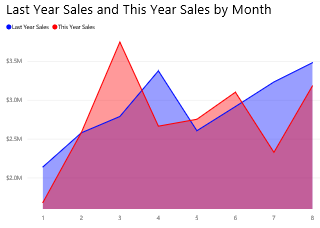

# Grafico ad aree di base (esercitazione)
Il grafico ad aree di base, detto anche grafico ad aree su più livelli, è basato sul grafico a linee. L'area compresa tra l'asse e la linea viene riempita con colori per indicare un volume. 

I grafici ad aree enfatizzano l'entità del cambiamento nel tempo e possono essere usati per attirare l'attenzione sul valore totale in una tendenza. Ad esempio, i dati che rappresentano il profitto nel tempo possono essere tracciati in un grafico ad aree per enfatizzare il profitto totale.

## Quando usare un grafico ad aree di base
I grafici ad aree di base rappresentano un'ottima scelta nelle seguenti situazioni:

* per vedere e confrontare la tendenza del volume su diverse serie temporali 
* per singole serie che rappresentano un set fisicamente numerabile

## Creare un grafico ad aree di base
Per seguire la procedura, accedere a Power BI e selezionare **Recupera dati \> Esempi \> Esempio di analisi delle vendite al dettaglio**. 

1. Dal dashboard "Esempio di analisi delle vendite al dettaglio" selezionare il riquadro **Total Stores** per aprire il report "Esempio di analisi delle vendite al dettaglio".
2. Selezionare **Modifica report** per aprire il report in Visualizzazione di modifica.
3. Aggiungere una nuova pagina del report.
4. Creare un grafico ad aree che visualizzi le vendite dell'anno e le vendite dell'anno precedente per mese.
   
   a.  Nel riquadro **Campi** selezionare **Sales \> Last Year Sales** e **This Year Sales > Value**.
   
   b.  Convertire il grafico in un grafico ad aree di base.    
   
   
   c.  Selezionare **Ora \> Mese** per aggiungerlo all'area **Asse**.   
   
   
   d.  Per visualizzare il grafico in base al mese, selezionare i puntini di sospensione (in alto a destra dell'oggetto visivo) e scegliere **Ordina per mese**.

## Evidenziazione e filtro incrociato
Per informazioni sull'uso del riquadro Filtri, vedere [Aggiungere un filtro a un report](power-bi-report-add-filter.md).

Per selezionare un'area, fare clic all'interno di tale area o sulla linea superiore.  I grafici ad aree di base non applicano il filtro incrociato nelle altre visualizzazioni della pagina del report. Sono comunque una destinazione per i filtri incrociati applicati da altre visualizzazioni nella pagina del report.

## Considerazioni e risoluzione dei problemi
* I grafici ad aree di base non sono efficaci per il confronto di valori a causa dell'occlusione sulle aree su più livelli. Power BI usa la trasparenza per indicare la sovrapposizione di aree. Questo, tuttavia, risulta efficace solo in presenza di due o tre aree diverse. Quando si deve confrontare la tendenza con più di tre misure, provare a usare i grafici a linee. Quando si deve confrontare il volume con più di tre misure, provare a usare la mappa ad albero.

## Passaggi successivi
[Report in Power BI](service-reports.md)  
[Visualizzazioni nei report di Power BI](power-bi-report-visualizations.md)  
[Power BI - Concetti di base](service-basic-concepts.md)  
Altre domande? [Provare la community di Power BI](http://community.powerbi.com/)

