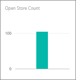
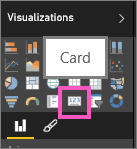

# Creare un riquadro per numeri elevati da un report di Power BI
A volte è di vitale importanza individuare uno specifico numero nel dashboard di Power BI, ad esempio le vendite totali, la quota di mercato anno per anno o le opportunità totali. È possibile creare un riquadro per numeri elevati [inserendo una domanda nella casella Domande e risposte](power-bi-visualization-big-number.md) o in un report di Power BI. Questo articolo spiega come crearne uno in un report.

1. Creare un [dashboard](service-dashboards.md) e [recuperare i dati](service-get-data.md).
   
   [Scaricare l'esempio di analisi delle vendite al dettaglio](sample-retail-analysis.md) per avere dei dati su cui fare pratica. 
2. Aprire il report in [visualizzazione di modifica](service-reading-view-and-editing-view.md).
3. Nel report trovare una pagina con dello spazio vuoto oppure [aggiungere una nuova pagina al report](power-bi-report-add-page.md).
4. Nell'elenco dei campi selezionare il campo numerico da visualizzare.
   
   In questo esempio **Open Store count** nella tabella **Store** . Power BI crea un istogramma con un numero.
   
   
5. Nel riquadro Visualizzazioni selezionare l'icona Scheda.
   
   
6. Passare il puntatore del mouse sulla scheda e selezionare l'icona a forma di puntina  per aggiungere il riquadro al dashboard. 
   
   
7. Aggiungere il riquadro a un dashboard esistente o a un nuovo dashboard. 
   
   * Dashboard esistente: selezionare il nome del dashboard nell'elenco a discesa.
   * Nuovo dashboard: digitare il nome del nuovo dashboard.
8. Selezionare **Aggiungi**.
   
   Un messaggio di operazione completata (nell'angolo superiore destro) informa l'utente che è stata aggiunta la visualizzazione, come riquadro, al dashboard.
   
   
9. Selezionare **Vai al dashboard**. In quel punto è possibile [modificare e spostare](service-dashboard-edit-tile.md) la visualizzazione aggiunta.

## Passaggi successivi
[Riquadri del dashboard in Power BI](service-dashboard-tiles.md)

[Dashboard in Power BI](service-dashboards.md)

[Power BI - Concetti di base](service-basic-concepts.md)

Altre domande? [Provare la community di Power BI](http://community.powerbi.com/)

