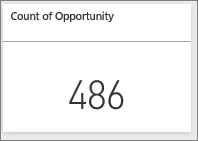
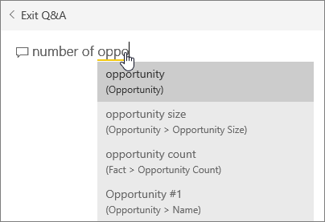
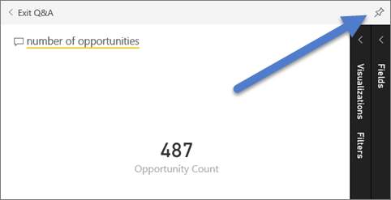
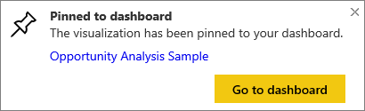
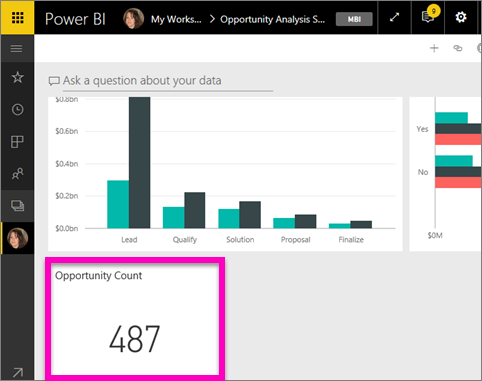

# Creare un riquadro con un numero di grandi dimensioni da Domande e risposte
A volte è di vitale importanza individuare uno specifico numero nel dashboard di Power BI, ad esempio le vendite totali, la quota di mercato anno per anno o le opportunità totali. È possibile [creare un riquadro per numeri elevati in un report di Power BI](power-bi-visualization-big-number-report.md) o inserendo una domanda nella casella Domande e risposte. Questo articolo spiega come crearne uno nelle Domande e risposte.

La casella delle domande rappresenta il modo più semplice per creare un riquadro per numeri come quello illustrato.

1. Creare un [dashboard](service-dashboards.md) e [recuperare i dati](service-get-data.md). In questa procedura viene usato l'[esempio di analisi delle opportunità](sample-opportunity-analysis.md).
2. Nella casella della domanda nella parte superiore del dashboard iniziare a digitare una domanda relativa ai dati. In questa procedura viene usato l'esempio di analisi delle opportunità.
   
   
3. Ad esempio, digitare "number of opportunities" nella casella della domanda.
   
   
   
   La casella delle domande suggerisce e riformula come **Showing opportunity count**, quindi mostra il numero totale.  
4. Selezionare l'icona Aggiungi  nell'angolo in alto a destra per aggiungere il riquadro per numeri al dashboard. 
   
   
5. Aggiungere il riquadro a un dashboard esistente o a un nuovo dashboard. 
   
   * Dashboard esistente: selezionare il nome del dashboard nell'elenco a discesa. I dashboard selezionabili sono solo quelli presenti nell'area di lavoro corrente.
   * Nuovo dashboard: digitare il nome del nuovo dashboard per aggiungerlo all'area di lavoro corrente.
6. Selezionare **Aggiungi**.
   
   Un messaggio di operazione completata (nell'angolo superiore destro) informa l'utente che è stata aggiunta la visualizzazione, come riquadro, al dashboard.  
   
   
7. Selezionare **Vai al dashboard** per visualizzare il nuovo riquadro. È quindi possibile [rinominare, ridimensionare, aggiungere un collegamento ipertestuale, riposizionare il riquadro e molto altro](service-dashboard-edit-tile.md) nel dashboard. 
   
   

## Considerazioni e risoluzione dei problemi
Se la casella delle domande non viene visualizzata, contattare l'amministratore tenant o di sistema.

## Passaggi successivi
[Riquadri del dashboard in Power BI](service-dashboard-tiles.md)  
[Dashboard in Power BI](service-dashboards.md)  
Altre domande? [Provare la community di Power BI](http://community.powerbi.com/)

