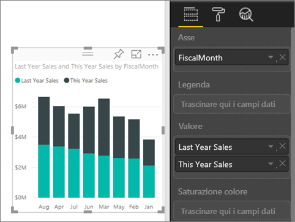
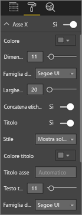
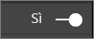
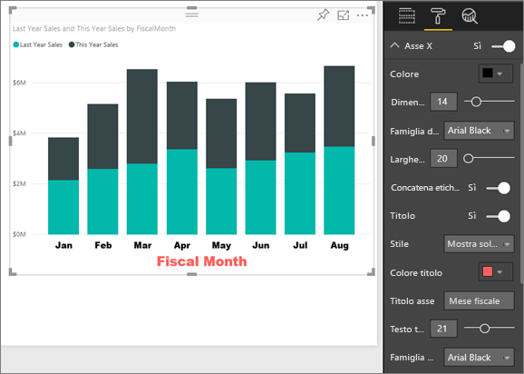
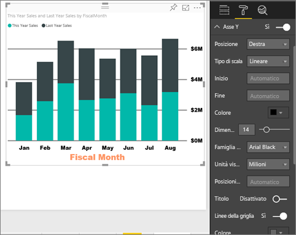
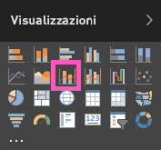
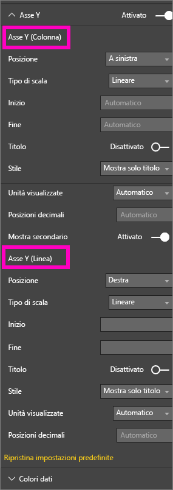
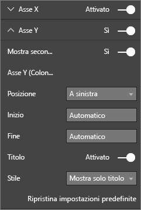

# Personalizzare le proprietà degli assi X e Y
Questa esercitazione illustra i diversi modi disponibili per personalizzare gli assi X e Y degli oggetti visivi. Non tutti gli oggetti visivi contengono assi o sono personalizzabili. I grafici a torta, ad esempio, non contengono assi. Le opzioni di personalizzazione variano da un oggetto visivo all'altro; sono quindi disponibili troppe opzioni per descriverle tutte in un solo articolo. Verranno quindi descritte alcune delle personalizzazioni degli assi usate più di frequente e verrà illustrato l'uso della scheda di formattazione visiva dell'area di disegno report di Power BI.  

> [!NOTE]
> Questa pagina si applica al servizio Power BI e a Power BI Desktop. Queste personalizzazioni, disponibili quando si seleziona **Formato** (icona del rullo ), sono presenti anche in Power BI Desktop.  
>
>

Il video seguente illustra come personalizzare le assi X e Y e dimostra i vari modi per controllare la concatenazione quando si usano il drill-up e il drill-down. Seguire quindi tutte le istruzioni riportate sotto il video per provare a farlo da soli usando l'Esempio di analisi delle vendite al dettaglio.

<iframe width="560" height="315" src="https://www.youtube.com/embed/9DeAKM4SNJM" frameborder="0" allowfullscreen></iframe>

## Personalizzazione degli assi X delle visualizzazioni nei report
## Creare una visualizzazione grafico a barre in pila
Accedere al servizio Power BI e aprire il report **Esempio di analisi delle vendite al dettaglio** in [Visualizzazione di modifica](service-interact-with-a-report-in-editing-view.md). Per seguire la procedura, [connettersi all'esempio di analisi delle vendite al dettaglio](sample-datasets.md).

1. Creare un nuovo istogramma che mostri il valore delle vendite dell'anno corrente e delle vendite dell'anno precedente per mese fiscale.
2. Eseguirne la conversione a un istogramma a colonne in pila.

    

## Personalizzare l'asse X
1. Nel riquadro Visualizzazioni e Filtri selezionare **Formato** (icona del rullo ) per visualizzare le opzioni di personalizzazione.
2. Espandere le opzioni di Asse X.

   
3. Per attivare e disattivare l'asse X, selezionare il dispositivo di scorrimento Sì (o No). Per il momento lasciarlo impostato su **Sì**.  Talvolta, potrebbe essere preferibile disattivare l'asse X per visualizzare una maggiore quantità di dati.

    
4. Formattare il colore, le dimensioni e il tipo di carattere del testo. In questo esempio il **Colore** del testo è stato impostato sul nero, **Dimensione testo** su 14 e il **Tipo di carattere** su Arial Black.  
5. Impostare il titolo dell'asse X su **Sì** e visualizzarne il nome, in questo caso **FiscalMonth**.  
6. Formattare il colore, le dimensioni e il tipo di carattere del testo del titolo.  In questo esempio **Colore titolo** è stato impostato su arancione, **Titolo asse** è stato modificato in **Mese fiscale** e le **Dimensioni testo titolo** sono state impostate su 21.
7. Per ordinare in base a FiscalMonth, selezionare i puntini di sospensione (...) nell'angolo in alto a destra del grafico e selezionare **Ordina per FiscalMonth**.

    Dopo tutte queste personalizzazioni, l'aspetto dell'istogramma dovrebbe essere simile al seguente:

     

Per annullare tutte le personalizzazioni apportate all'asse X fino a questo momento, selezionare **Ripristina impostazioni predefinite** nella parte inferiore del riquadro di personalizzazione **Asse X**.

## Personalizzare l'asse Y
1. Espandere le opzioni di Asse Y.

   

2. Per attivare e disattivare l'asse Y, selezionare il dispositivo di scorrimento Sì (o No). Per il momento lasciarlo impostato su **Sì**.  Talvolta, potrebbe essere preferibile disattivare l'asse Y per visualizzare una maggiore quantità di dati.
   
    
3. Spostare la **Posizione** dell'asse Y verso destra.
4. Formattare il colore, le dimensioni e il tipo di carattere del testo. In questo esempio il **Colore** del testo è stato impostato sul nero, **Dimensione testo** su 14 e il **Tipo di carattere** su Arial Black.  
5. Mantenere **Unità visualizzate** impostate su Milioni e **Posizioni decimali valore** impostate su zero.
6. Per questa visualizzazione, un titolo dell'asse Y non migliorerebbe l'aspetto visivo, quindi lasciare il **Titolo** impostato su No.  
7. È ora possibile evidenziare le linee della griglia impostando il **Colore** su grigio scuro e aumentando lo spessore del **Tratto** impostandolo su 2.

    Dopo tutte queste personalizzazioni, l'aspetto dell'istogramma dovrebbe essere simile al seguente:

     

## Personalizzazione di visualizzazioni con due assi Y
Per questo esempio verrà creato un grafico combinato che esamina l'impatto del numero di negozi sulle vendite.  Si tratta dello stesso grafico creato nell'[esercitazione sulla creazione di un grafico combinato](power-bi-visualization-combo-chart.md). Si continuerà quindi formattando i due assi Y.

### Creare un grafico con due assi Y
1. Creare un nuovo grafico a linee che tenga traccia della % del margine lordo dello scorso anno sulle vendite per mese (**Sales > Gross Margin last year %** per **Time > FiscalMonth**).
2. Ordinare l'oggetto visivo in base al mese selezionando i puntini di sospensione (...) e scegliendo **Ordina per mese**

    

> [NOTE]: For help sorting by month, see [sorting by other criteria](power-bi-report-change-sort.md#other)
> 1. La % di margine lordo nel mese di gennaio ammontava al 35%, in aprile al 45%, per poi diminuire nel mese di luglio e aumentare nuovamente in agosto. Si vedrà un modello simile per le vendite dell’anno scorso e di quest'anno?
> 2. Aggiungere **This Year Sales > Value** e **Last Year Sales** al grafico a linee. La scala della **% del margine lordo dello scorso anno** (linea blu lungo la linea della griglia in corrispondenza dello 0%) è notevolmente ridotta rispetto a quella di **Sales**, di conseguenza risulta difficile confrontarle. Inoltre, le percentuali delle etichette dell'asse Y non sono ottimali.      

   
5. Per facilitare la lettura e l'interpretazione dell'oggetto visivo, convertire il grafico a linee in un grafico a linee e istogramma a colonne in pila.

   

6. Trascinare **% di margine lordo dello scorso anno** dai **Valori colonna** nei **Valori riga**. A questo punto, è visualizzato l'istogramma a colonne in pila creato in precedenza, ***più*** un grafico a linee.  Facoltativamente, ripetere le procedure apprese sopra per formattare il colore e le dimensioni del tipo di carattere degli assi.
   

   Power BI crea due assi, consentendo in tal modo di ridimensionare i set di dati in modo diverso: quello di sinistra misura i dollari, mentre quello di destra la percentuale.

   

### Formattare l'asse Y secondario
1. Nel riquadro **Visualizzazioni** selezionare l'icona del rullo per visualizzare le opzioni di formattazione.
2. Selezionare la freccia verso il basso per espandere le opzioni di Asse Y.
3. Scorrere l'elenco fino a trovare le opzioni per **Mostra secondario**. Impostare **Mostra secondario** da **No** a **Sì**.

   

   
4. (Facoltativo) Personalizzare le due assi. Se si cambia **Posizione** per l'asse delle colonne o l'asse di riga, le due assi si scambiano di posto.

   

### Aggiungere titoli a entrambi gli assi
Con una visualizzazione così complicata può risultare utile aggiungere titoli agli assi.  I titoli consentono ai colleghi di comprendere il senso della visualizzazione.

1. Impostare **Titolo** su **Sì** per **Asse Y (colonna)** e **Asse Y (riga)**.
2. Impostare **Stile** su **Mostra solo titolo**.

   
3. Il grafico combinato visualizzato include ora due assi, entrambi con titoli.

   

Per altre informazioni, vedere [Suggerimenti e consigli per la formattazione dei colori in Power BI](service-tips-and-tricks-for-color-formatting.md).

## Considerazioni e risoluzione dei problemi
Se l'asse X è stato categorizzato dal proprietario del report come tipo di data, verrà visualizzata l'opzione **Tipo** e sarà possibile selezionare tra continuo o categorico.

## Passaggi successivi
Altre informazioni sulle [visualizzazioni nei report di Power BI](power-bi-report-visualizations.md)

[Personalizzare ](power-bi-visualization-customize-title-background-and-legend.md)[titoli, sfondi e legende](power-bi-visualization-customize-title-background-and-legend.md)

[Personalizzare le proprietà di colori e assi](service-getting-started-with-color-formatting-and-axis-properties.md)

[Power BI - Concetti di base](service-basic-concepts.md)

Altre domande? [Provare la community di Power BI](http://community.powerbi.com/)
