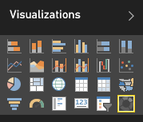
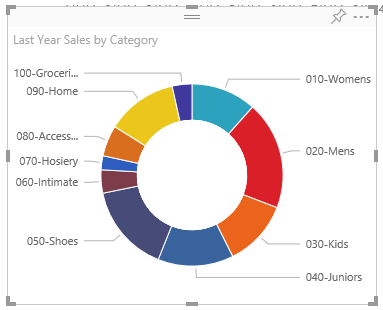

# Grafici ad anello in Power BI (esercitazione)
Un grafico ad anello è simile a un grafico a torta perché mostra la relazione delle parti rispetto a un intero. L'unica differenza è data dal fatto che il centro è vuoto e consente di inserire un'etichetta o un'icona.

## Creare un grafico ad anello
Per seguire la procedura, accedere a Power BI e selezionare **Recupera dati** \> **Esempi** \> **Esempio di analisi delle vendite al dettaglio** \> **Connetti**. 

1. Dal dashboard selezionare il riquadro **Total Stores** per aprire il report "Esempio di analisi delle vendite al dettaglio".
2. Selezionare **Modifica report** per aprire il report in Visualizzazione di modifica.
3. [Aggiungere una nuova pagina del report](power-bi-report-add-page.md).
4. Creare un grafico ad anello che visualizzi le vendite dell'anno per categoria.
   
   * Dal riquadro **Campi** selezionare **Vendite**\>**Vendite dello scorso anno**.
   * Convertire in un grafico ad anello. Se Last Year Sales non è nell'area **Valori** , trascinarlo in tale area.
     
       
   * Selezionare **Elemento** \> **Categoria** per aggiungerlo all'area **Legenda**. 
     
       

## Considerazioni e risoluzione dei problemi
* La somma dei valori del grafico ad anello deve essere pari al 100%.
* Un eccessivo numero di categorie ne rende difficile la lettura e l'interpretazione.
* I grafici ad anello sono particolarmente indicati per confrontare una specifica sezione con l'intero, invece di confrontare singole sezioni reciprocamente. 

## Passaggi successivi
[Report in Power BI](service-reports.md)

[Tipi di visualizzazione in Power BI](power-bi-visualization-types-for-reports-and-q-and-a.md)

[Visualizzazioni nei report di Power BI](power-bi-report-visualizations.md)

[Power BI - Concetti di base](service-basic-concepts.md)

Altre domande? [Provare la community di Power BI](http://community.powerbi.com/)

