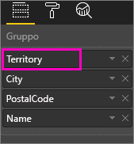
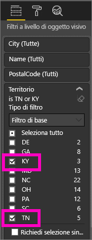
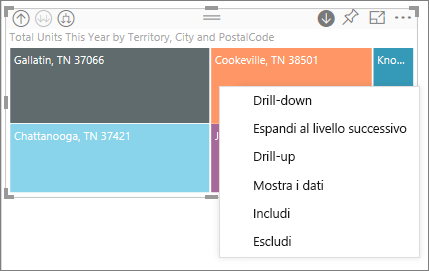
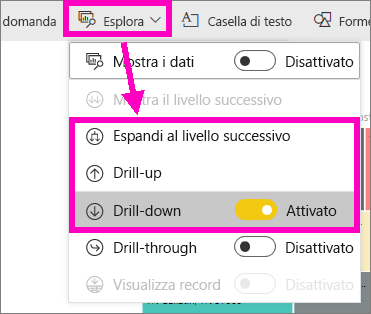
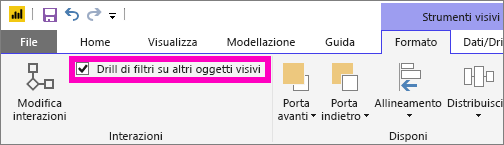
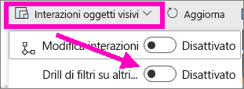
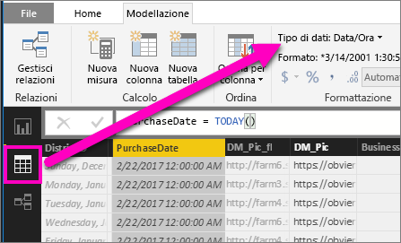

# Modalità di espansione in una visualizzazione in Power BI

## L'espansione richiede una gerarchia
Quando un oggetto visivo ha una gerarchia, è possibile eseguire il drill-down per rivelare dettagli aggiuntivi. Ad esempio, potrebbe esserci una visualizzazione che calcola il numero di medaglie olimpiche in base a una gerarchia composta da sport, disciplina ed eventi. Per impostazione predefinita, la visualizzazione indicherà il numero di medaglie per sport: ginnastica, sci, sport acquatici e così via, ma, poiché contiene una gerarchia, selezionando uno degli oggetti visivi (ad esempio una barra, una riga o una bolla), potrebbe essere visualizzata un'immagine sempre più dettagliata. Selezionare l'elemento **acquatici** per visualizzare dati relativi a nuoto, tuffi e pallanuoto.  Selezionare l'elemento **tuffi** per visualizzare dettagli relativi a trampolino, piattaforma e tuffi sincronizzati.

È possibile aggiungere gerarchie ai report di cui si è proprietari, ma non a quelli condivisi.
Se non si è certi di quali visualizzazioni di Power BI contengano una gerarchia,  passare il mouse sopra una visualizzazione: se vengono visualizzati i controlli di drill-down negli angoli superiori, la visualizzazione contiene una gerarchia.

    
   

Le date sono un tipo univoco di gerarchia. Quando si aggiunge un campo data a una visualizzazione, Power BI aggiunge automaticamente una gerarchia temporale che contiene anno, trimestre, mese e giorno. Per altre informazioni, vedere [Gerarchie e comportamento di esplorazione degli oggetti visivi](guided-learning/visualizations.yml?tutorial-step=18) o guardare il video seguente.

  <iframe width="560" height="315" src="https://www.youtube.com/embed/MNAaHw4PxzE?list=PL1N57mwBHtN0JFoKSR0n-tBkUJHeMP2cP" frameborder="0" allowfullscreen></iframe>

> [!NOTE]
> Per informazioni sulla creazione di gerarchie tramite Power BI Desktop, guardare il video su [come creare e aggiungere le gerarchie](https://youtu.be/q8WDUAiTGeU)
> 

## Prerequisiti

1. Nel servizio Power BI o in Power BI Desktop il drill-down richiede una visualizzazione con una gerarchia. 
   
2. Per proseguire, [aprire l'esempio di analisi di vendita al dettaglio](sample-datasets.md) e creare una mappa ad albero che esamini **Total Units This Year** (Values) per **Territory**, **City**, **PostalCode** e **Name** (Group).  La mappa ad albero presenta una gerarchia composta da territorio, città, codice postale e nome città. Ogni territorio include una o più città, ogni città include uno o più codici di avviamento postale e così via. Per impostazione predefinita, la visualizzazione mostra solo i dati del territorio, perché *Territory* viene visualizzato per primo nell'elenco.
   
   

2. Poiché l'uso contemporaneo delle diverse icone di drill-down può generare confusione, filtrare la mappa ad albero in modo da visualizzare solo 2 dei territori più piccoli: **KY** e **TN**. Selezionare la mappa ad albero e in **Filtri a livello di oggetto visivo** espandere **Territory** e selezionare **KY** e **TN**.

        

   Nella mappa sono ora visibili solo due territori.

   

## Tre metodi per accedere alle funzionalità di drill-down
Sono disponibili diverse opzioni per l'accesso alle funzionalità di drill-down, drill-up ed espansione per le visualizzazioni con gerarchie. Questo articolo descrive come usare la prima opzione riportata di seguito. Dopo aver acquisito le nozioni di base sul drill-down e l'espansione, provare a usare tutti e tre i metodi descritti che eseguono le medesime operazioni e scegliere il metodo preferito.

- Passare il mouse su una visualizzazione per visualizzare e usare le icone.  

    

- Fare clic con il pulsante destro del mouse su una visualizzazione per visualizzare e usare il menu.
    
    

- Nella barra dei menu di Power BI scegliere il pulsante **Esplora**.

   

## Percorsi di drill-down
### Drill-down
Sono disponibili diversi metodi per eseguire il drill-down nella visualizzazione. Poiché il ***drill-down*** consente di passare al livello successivo della gerarchia, dal livello **Territory** è possibile eseguire il drill-down al livello città, quindi al livello codice postale e infine al livello nome. Ogni passaggio del percorso visualizza nuove informazioni.

### Espandi

***Espandi*** aggiunge un altro livello della gerarchia alla visualizzazione corrente. Di conseguenza, dal livello **Territory** è possibile espandere e aggiungere città, codice postale e nome alla mappa ad albero. Ogni passaggio nel percorso visualizza le stesse informazioni e aggiunge un livello di nuove informazioni.

È anche possibile scegliere se eseguire il drill-down o espandere un campo alla volta o tutti i campi contemporaneamente. 

## Drill-down di tutti i campi

1. Iniziare dal livello superiore della mappa ad albero contenente i dati per KY e TN. Allargare la mappa ad albero selezionando uno dei quadratini di ridimensionamento e trascinandolo verso destra. 

     .

2. Per eseguire il drill-down di ***tutti i campi contemporaneamente***, selezionare la doppia freccia nell'angolo superiore sinistro della visualizzazione  . La mappa ad albero visualizza i dati di città per Kentucky e Tennessee. 

    
   
5. Eseguire nuovamente il drill-down per il livello di codice postale della gerarchia.

    

3. Per eseguire il drill-up, selezionare la freccia rivolta verso l'alto nell'angolo superiore sinistro della visualizzazione .

## Drill-down di un campo
Questo metodo usa l'icona di drill-down visualizzata nell'angolo superiore destro della visualizzazione. 

1. Selezionare l'icona di drill-down per attivarlo . È ora possibile eseguire il drill-down di ***un campo alla volta***. 
   
   

   Se non si attiva il drill-down, la selezione di un oggetto visivo, ad esempio una barra, una bolla o una foglia, non esegue il drill-down ma filtra in modo incrociato gli altri grafici nella pagina del report.

2. Selezionare la *foglia* per **TN**. La mappa ad albero visualizza ora tutte le città del Tennessee con un negozio. 

    

2. A questo punto è possibile continuare a eseguire il drill-down per il Tennesee oppure eseguire il drill-down per una specifica città del Tennesee o espandere (vedere **Espandere tutti i campi** più avanti). Continuare a eseguire il drill-down di un campo alla volta.  Selezionare **Knoxville, TN**. La mappa ad albero visualizza ora il codice postale del negozio di Knoxville. 

   

    Si noti che il titolo viene modificato durante il drill-down e il drill-up.  

## Espandere tutti i campi ed espandere un campo alla volta
La visualizzazione di una mappa ad albero che mostra solo un codice postale non offre molte informazioni utili.  Espandere di un livello verso il basso nella gerarchia.  

1. Con la mappa ad albero attiva, selezionare l'icona di *espansione verso il basso*  . La mappa ad albero mostra ora 2 livelli della gerarchia: codice postale e nome negozio. 

    

2. Per visualizzare tutti e quattro i livelli di dati per Tennesee, selezionare la freccia di drill-up fino a raggiungere il secondo livello, **Total units this year by territory and city** della mappa ad albero. 

    

3. Assicurarsi che il drill-down sia attivato  e selezionare l'icona di *espansione verso il basso* . La mappa ad albero mostra ora alcuni dettagli aggiuntivi; anziché mostrare solo città e stato, la mappa mostra anche il codice postale. 

    

4. Selezionare l'icona di *espansione verso il basso* ancora una volta per visualizzare tutti e quattro i livelli di gerarchia per Tennesee nella mappa ad albero. Passare il mouse su una foglia per visualizzare altri dettagli.

   

## Filtri su altri oggetti visivi
Con la modalità di drill-down attiva è necessario decidere in che modo il drill-down e l'espansione ha effetto sulle altre visualizzazioni nella pagina. 

Per impostazione predefinita, il drill-down non filtra altri oggetti visivi in un report. Questa funzionalità può essere tuttavia abilitata in Power BI Desktop e nel servizio Power BI. 

1. In Desktop selezionare la scheda **Formato** e selezionare la casella di controllo **Drill di filtri su altri oggetti visivi**.

    

2. Quando si eseguirà il drill-down o il drill-up o si espanderà un oggetto visivo con gerarchia, verranno filtrati gli altri oggetti visivi nella pagina. 

    

    

> [!NOTE]
> Per abilitare questa funzionalità nel servizio Power BI, dalla barra dei menu superiore selezionare **Interazioni con oggetti visivi > Drill di filtri su altri oggetti visivi**.
>
> 

## Informazioni sull'asse della gerarchia e sul gruppo della gerarchia
L'asse della gerarchia e il gruppo della gerarchia possono essere considerati come i meccanismi che è possibile usare per aumentare e diminuire la granularità dei dati che si vuole visualizzare. Tutti i dati che possono essere organizzati in categorie e sottocategorie possono avere una gerarchia. Ciò, naturalmente, include date e ore.

È possibile creare una visualizzazione in Power BI in modo che abbia una gerarchia selezionando uno o più campi dati da aggiungere all'area **Asse** o all'area **Gruppo**, con i dati che si vuole esaminare come campi dati nell'area **Valori**. Per sapere se i dati sono gerarchici, verificare la presenza delle icone della *modalità di espansione* negli angoli in alto a sinistra e a destra della visualizzazione. 

In pratica, è utile considerare due tipi di dati gerarchici:
- Dati di data e ora: se si ha un campo dati con un tipo di dati DateTime, sono già presenti dati gerarchici. Power BI crea automaticamente una gerarchia per i campi dati i cui valori possono essere analizzati in una struttura [DateTime](https://msdn.microsoft.com/library/system.datetime.aspx). È sufficiente aggiungere un campo DateTime all'area **Asse** o **Gruppo**.
- Dati categorici: se i dati derivano da raccolte che includono sottoraccolte oppure contengono righe di dati che condividono valori comuni, sono presenti dati gerarchici.

Power BI consente di espandere uno o tutti i subset. È possibile eseguire il drill-down dei dati per visualizzare un singolo subset a ogni livello o per visualizzare tutti i subset contemporaneamente a ogni livello. È ad esempio possibile eseguire il drill-down fino a visualizzare un anno specifico oppure visualizzare tutti i risultati per ogni anno man mano che si scende nella gerarchia. Al contrario, è possibile eseguire il drill-up nello stesso modo.

Le sezioni seguenti descrivono il drill-down dalla visualizzazione superiore a quella centrale e infine a quella inferiore.

### Dati gerarchici di data e ora
Per questo esempio, seguire l'[Esempio di analisi delle vendite al dettaglio](sample-datasets.md) e creare una visualizzazione istogramma in pila che esamini il **mese** (asse) in base alle **vendite totali** (valori).  

Anche se il campo dati Asse è **Mese**, viene tuttavia creata una categoria **Anno** nell'area **Asse**, perché Power BI fornisce la struttura DateTime completa per tutti i valori letti. Nella parte superiore della gerarchia vengono visualizzati i dati per l'anno.

Con la modalità drill-down attiva, fare clic sulla bar nel grafico per scendere di un livello nella gerarchia. Verranno visualizzate tre barre per i dati dei trimestri disponibili. Dalle icone in alto a sinistra scegliere quindi **Expand all down one level of the hierarchy** (Espandi tutto di un livello verso il basso nella gerarchia), quindi ripetere l'operazione per visualizzare il livello più basso della gerarchia, che mostra i risultati per ogni mese.

Oltre che nella visualizzazione, la gerarchia è visibile nei dati restituiti per ogni report. La tabella seguente illustra i risultati di **Mostra dati** in seguito al drill-down in un report da un singolo mese o da tutti i mesi. 

Si noti che i dati sono gli stessi per i report dell'anno e del trimestre, ma, dopo avere eseguito il drill-down fino al livello di dettaglio specificato per **Valori**, è possibile osservare che il report singolo è più specifico e che il report relativo a tutti i mesi include più dati.

|Modalità di espansione|Anno|Trimestre|Mese|Giorno|
| ---|:---:|:---:|:---:|---|
|Singola|||||
|Tutti|||||

### Dati di categorie gerarchici
I dati modellati da raccolte e sottoraccolte sono gerarchici. Un esempio valido sono i dati località. Si consideri una tabella in un'origine dati le cui colonne sono Paese, Stato, Città e CAP. I dati che condivide lo stesso paese, stato e città sono gerarchici.

Per questo esempio, seguire l'[esempio di analisi delle vendite al dettaglio](sample-datasets.md). Creare una visualizzazione istogramma in pila che esamini le **unità totali di quest'anno** (valori) per **territorio**, **città**, **codice postale** e **nome** (gruppo).  

Con la modalità drill-down attivata, dalle icone in alto a sinistra scegliere quindi **Expand all down one level of the hierarchy** (Espandi tutto di un livello verso il basso nella gerarchia) tre volte.
Verrà visualizzato il livello più basso della gerarchia, che mostra i risultati per territorio, città e codice postale.

Oltre che nella visualizzazione, la gerarchia è visibile nei dati restituiti per ogni report. La tabella seguente illustra i risultati di **Mostra dati** in seguito al drill-down in un report per un singolo mese o per tutti i territori. Quando si esegue il drill-down, è possibile osservare che il report singolo è più specifico e che il report relativo a tutti i territori include più dati.

| Modalità di espansione|Territorio|Città|Codice postale|Nome|
| ---|:---:|:---:|:---:|---|
|Singola|||||
|Tutti|||||

## Considerazioni e limitazioni
* Se l'aggiunta di un campo data a una visualizzazione non crea una gerarchia, è possibile che il campo"data" non sia stato effettivamente salvato come data. Se si è proprietari del set di dati, aprirlo nella visualizzazione *Dati* in Power BI Desktop, selezionare la colonna che contiene la data e nella scheda Modellazione cambiare il **Tipo di dati** in **Data** o **Data/ora**. Se il report è stato condiviso con l'utente, contattare il proprietario per richiedere la modifica.  
  
  

## Passaggi successivi
[Visualizzazioni nei report di Power BI](power-bi-report-visualizations.md)

[Report di Power BI](service-reports.md)

[Power BI - Concetti di base](service-basic-concepts.md)

Altre domande? [Provare la community di Power BI](http://community.powerbi.com/)

