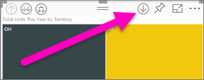
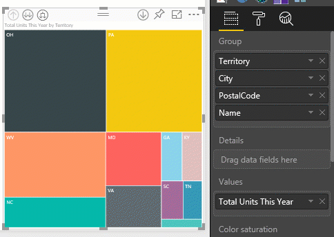
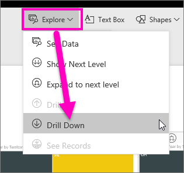
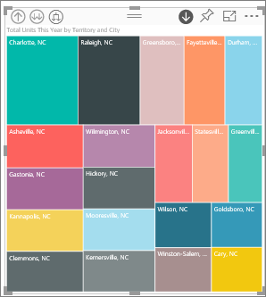
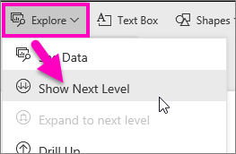
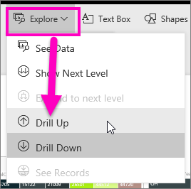

# Eseguire il drill-down in una visualizzazione in Power BI
## Il drill-down richiede una gerarchia
Quando un oggetto visivo ha una gerarchia, è possibile eseguire il drill-down per rivelare dettagli aggiuntivi. Ad esempio, potrebbe esserci una visualizzazione che calcola il numero di medaglie olimpiche in base a una gerarchia composta da sport, disciplina ed eventi. Per impostazione predefinita, la visualizzazione indicherà il numero di medaglie per sport: ginnastica, sci, sport acquatici e così via. Ma perché contiene una gerarchia, selezionando uno degli oggetti visivi (ad esempio una barra, una riga o una bolla), potrebbe essere visualizzata un'immagine sempre più dettagliata. Selezionare l'elemento **acquatici** per visualizzare dati relativi a nuoto, tuffi e pallanuoto.  Selezionare l'elemento **tuffi** per visualizzare dettagli relativi a trampolino, piattaforma e tuffi sincronizzati.

È possibile aggiungere delle gerarchie ai report di cui si è proprietari, ma non a quelli condivisi.
Se non si è certi di quali visualizzazioni di Power BI contengano una gerarchia,  passare il mouse sopra una visualizzazione: se vengono visualizzati i controlli di drill-down negli angoli superiori, la visualizzazione contiene una gerarchia.

    
   

Le date sono un tipo univoco di gerarchia. Quando si aggiunge un campo data a una visualizzazione, Power BI aggiunge automaticamente una gerarchia temporale che contiene anno, trimestre, mese e giorno. Per altre informazioni, vedere [Gerarchie e comportamento di esplorazione degli oggetti visivi](guided-learning/visualizations.yml#step-18) o guardare il video seguente.

  <iframe width="560" height="315" src="https://www.youtube.com/embed/MNAaHw4PxzE?list=PL1N57mwBHtN0JFoKSR0n-tBkUJHeMP2cP" frameborder="0" allowfullscreen></iframe>

> [!NOTE]
> Per informazioni sulla creazione di gerarchie tramite Power BI Desktop, guardare il video su [come creare e aggiungere le gerarchie](https://youtu.be/q8WDUAiTGeU)
> 
> 

## Due metodi per eseguire il drill-down
Esistono due diversi modi per eseguire il drill-down e il drill-up in una visualizzazione.  entrambi descritti in questo articolo. Poiché eseguono la stessa operazione, usare quella che si preferisce.

> [!NOTE]
> Per proseguire, [aprire l'esempio di analisi di vendita al dettaglio](sample-datasets.md) nel servizio Power BI e creare una mappa ad albero che esamini **Total Units This Year** (Values) per **Territory**, **City**, **PostalCode** e **Name** (Group).  
> 
> 

## Metodo 1 per eseguire il drill-down
Questo metodo usa le icone di drill-down visualizzate negli angoli superiori della visualizzazione stessa.

1. Aprire un report in [Visualizzazione di lettura o Visualizzazione di modifica](service-reading-view-and-editing-view.md) in Power BI. Il drill-down richiede una visualizzazione con una gerarchia. 
   
   Nell'animazione seguente è visualizzata una gerarchia.  La visualizzazione presenta una gerarchia composta da territorio, città, codice postale e nome città. Ogni territorio include una o più città, ogni città include uno o più codici di avviamento postale e così via. Per impostazione predefinita, la visualizzazione mostra solo i dati del territorio, perché *Territory* viene visualizzato per primo nell'elenco.
   
   
2. Per abilitare il drill down, selezionare l'icona a forma di freccia nell'angolo in alto a destra della visualizzazione. Quando l'icona è scura, il drill-down è abilitato. Se non si attiva il drill-down, selezionando un elemento visivo (ad esempio una barra o una bolla) verranno filtrati in modo incrociato gli altri grafici nella pagina del report.    
   
   
3. Per eseguire il drill-down di ***un campo alla volta***, fare clic su uno degli elementi nella visualizzazione (in un grafico a barre, fare clic su una delle barre e in una mappa ad albero fare clic su una delle *foglie*). Si noti che il titolo viene modificato durante il drill-down e il drill-up. In questa animazione, il titolo cambia da "Total Units This Year by Territory" in "Total Units This Year by Territory and City" a "Total Units This Year by Territory, City and PostalCode" a "Total Units This Year by Territory, City, PostalCode, and Name". Per eseguire il drill-up, selezionare l'icona **Drill-up**  nell'angolo in alto a sinistra della visualizzazione, come mostrato di seguito.
   
   
4. Per eseguire il drill-down di ***tutti i campi contemporaneamente***, selezionare la doppia freccia nell'angolo in alto a sinistra della visualizzazione.
   
   
5. Per rieseguire il drill-up, selezionare la freccia rivolta verso l'alto nell'angolo in alto a sinistra della visualizzazione.
   
   

## Metodo 2 per eseguire il drill-down
Questo metodo usa l'elenco a discesa **Esplora** dalla barra dei menu superiore di Power BI.

1. Aprire un report in [Visualizzazione di lettura o Visualizzazione di modifica](service-reading-view-and-editing-view.md) in Power BI. Il drill-down richiede una visualizzazione con una gerarchia. 
   
   Nell'immagine seguente è visualizzata una gerarchia.  La visualizzazione presenta una gerarchia composta da territorio, città, codice postale e nome città. Ogni territorio include una o più città, ogni città include uno o più codici di avviamento postale e così via. Per impostazione predefinita, la visualizzazione mostra solo i dati del territorio, perché *Territory* viene visualizzato per primo nell'elenco.
   
   
2. Per abilitare il drill-down, selezionare una visualizzazione per renderla attivo e dalla barra dei menu di Power BI in alto selezionare **Esplora** > **Drill-down**. L'icona di drill-down nell'angolo in alto a destra della visualizzazione diventa un sfondo nero.   
   
   
3. Dopo l’abilitazione, eseguire il drill-down di un campo alla volta selezionando una delle foglie della mappa ad albero. In questo esempio, è stato selezionato il territorio denominato **NC** per visualizzare il totale delle unità vendute quest'anno nella Carolina del Nord in base alla città.
   
   
4. Per eseguire il drill down di tutti i campi contemporaneamente, selezionare **Esplora** > **Mostra il livello successivo**.
   
   
5. Per eseguire il drill-up, selezionare **Esplora** > **Drill-up**.
   
   
6. Per visualizzare i dati usati per creare l'oggetto visivo, selezionare **Visualizza dati**. I dati vengono visualizzati in un riquadro sotto l’oggetto visivo. Questo riquadro rimane presente mentre si continua il drill-through dell’oggetto visivo. Per altre informazioni, vedere [Visualizzare i dati usati per creare l’oggetto visivo](service-reports-show-data.md).

## Considerazioni e limitazioni
* Se l'aggiunta di un campo data a una visualizzazione non crea una gerarchia, è possibile che il campo"data" non sia stato effettivamente salvato come data. Se si è proprietari del set di dati, aprirlo nella visualizzazione *Dati* in Power BI Desktop, selezionare la colonna che contiene la data e nella scheda Modellazione cambiare il **Tipo di dati** in **Data** o **Data/ora**. Se il report è stato condiviso con l'utente, contattare il proprietario per richiedere la modifica.  
  
  

## Passaggi successivi
[Visualizzazioni nei report di Power BI](power-bi-report-visualizations.md)

[Report di Power BI](service-reports.md)

[Power BI - Concetti di base](service-basic-concepts.md)

Altre domande? [Provare la community di Power BI](http://community.powerbi.com/)

