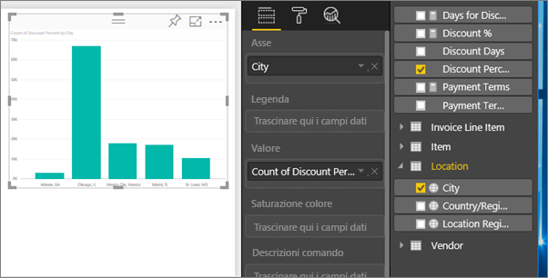
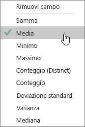
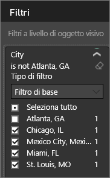
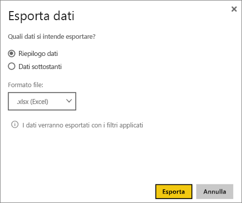
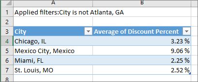
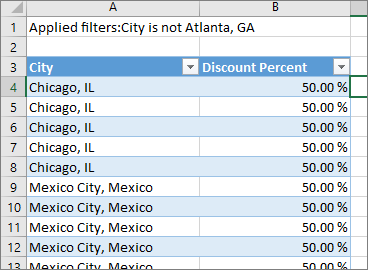

# Esportare dati dalle visualizzazioni
È possibile [visualizzare in Power BI i dati](service-reports-show-data.md) usati per creare una visualizzazione o esportarli in Excel come file con estensione xlsx o csv.   

Osservare in che modo i dati vengono esportati da una delle visualizzazioni nel report, salvati come file XLSX e aperti in Excel. Seguire quindi le istruzioni successive per sotto il video per fare una prova in prima persona.

<iframe width="560" height="315" src="https://www.youtube.com/embed/KjheMTGjDXw" frameborder="0" allowfullscreen></iframe>

## Da una visualizzazione in un dashboard di Power BI
1. Selezionare i puntini di sospensione nell'angolo in alto a destra della visualizzazione.

    
2. Scegliere l’icona  **Esporta dati** .

    
3. I dati vengono esportati in un file CSV. Se l'oggetto visivo è filtrato, verranno filtrati anche i dati scaricati.    
4. Il browser richiederà di salvare il file.  Una volta salvato, aprire il file con estensione csv in Excel.

    

## Da una visualizzazione in un report
Per iniziare, aprire il [report dell'esempio di analisi dell'approvvigionamento](sample-procurement.md) in [Visualizzazione di modifica](service-reading-view-and-editing-view.md). [Aggiungere una nuova pagina del report vuota](power-bi-report-add-page.md). Seguire quindi questa procedura per aggiungere un'aggregazione e un filtro a livello di visualizzazione.

1. Creare un nuovo grafico a colonne.  Nel riquadro Campi, selezionare **Location > City** e **Invoice > Discount Percent**.  Potrebbe essere necessario spostare **Discount Percent** nell'area Value. 

    
2. Modificare l'aggregazione per **Discount Percent** da **Count** a **Average**. Nell'area Value, selezionare la freccia a destra di **Discount Percent** (o altrimenti **Count of Discount Percent**) e scegliere **Average**.

    
3. Aggiungere un filtro a **City** per rimuovere **Atlanta**.

   

   È ora possibile provare a usare entrambe le opzioni di esportazione dei dati. 

4. Selezionare i puntini di sospensione nell'angolo in alto a destra della visualizzazione. Scegliere  **Esporta dati**.

   
5. In Power BI online se la visualizzazione contiene un'aggregazione (ad esempio se si modifica **Count** in *average*, **sum** o *minimum*), si avranno due opzioni: **Riepilogo dati** e **Dati sottostanti**. In Power BI Desktop è disponibile solo l'opzione **Riepilogo dati**. Per altre informazioni sulle aggregazioni, vedere [Aggregazioni in Power BI](service-aggregates.md).

    
6. Selezionare **Riepilogo dati** > **Esporta** e scegliere xlsx o csv. Power BI esporta i dati.  Se sono stati applicati i filtri per la visualizzazione, i dati verranno esportati come filtrati. Quando si seleziona **Esporta**, il browser richiede di salvare il file. Una volta salvato, aprire il file in Excel.

   **Riepilogo dati**: selezionare questa opzione se si vogliono esportare i dati di ciò che viene visualizzato nell'oggetto visivo.  Questo tipo di esportazione consente di visualizzare solo i dati (colonne e misure) scelti per creare l'oggetto visivo.  Se l'oggetto visivo contiene un'aggregazione, è necessario esportare i dati aggregati. Ad esempio, se è presente un grafico a barre che mostra quattro barre, si otterranno quattro righe di dati. Il riepilogo dati è disponibile in formato XLSX e CSV.

   In questo esempio, l'esportazione di Excel mostra un totale per ogni città. Poiché è stata filtrata Atlanta, non è inclusa nei risultati.  La prima riga il foglio del calcolo illustra i filtri che sono stati usati durante l'estrazione dei dati da Power BI.

   
7. Ora provare a selezionare **Dati sottostanti** > **Esporta** e scegliere xlsx. Power BI esporta i dati. Se sono stati applicati i filtri per la visualizzazione, i dati verranno esportati come filtrati. Quando si seleziona **Esporta**, il browser richiede di salvare il file. Una volta salvato, aprire il file in Excel.

   >[!WARNING]
   >L'esportazione dei dati sottostanti consente agli utenti di visualizzare tutti i dati dettagliati, cioè ogni colonna nei dati. Gli amministratori del servizio Power BI possono disattivare questa funzionalità per l'organizzazione. Se dispone di un set di dati, è possibile impostare le colonne proprietarie su "nascosto" in modo che non vengono visualizzate nell'elenco Campi nel servizio Power BI o Desktop.

   **Dati sottostanti**: selezionare questa opzione se si vogliono visualizzare i dati nell'oggetto visivo ***e*** i dati aggiuntivi del modello. Per altre informazioni, vedere il grafico riportato di seguito.  Se la visualizzazione contiene un'aggregazione, se si seleziona *Dati sottostanti* l'aggregazione viene rimossa. Quando si seleziona **Esporta**, i dati vengono esportati in un file con estensione xlsx e il browser richiede di salvare il file. Una volta salvato, aprire il file in Excel.

   In questo esempio, l'esportazione Excel mostra una riga per ogni singola riga City nel set di dati e la percentuale di sconto per quella voce singola. In altre parole, i dati sono in formato flat e non aggregati. La prima riga il foglio del calcolo illustra i filtri che sono stati usati durante l'estrazione dei dati da Power BI.  

   

## Esportare i dettagli dei dati sottostanti
I dati visualizzati quando si seleziona **Dati sottostanti** possono variare. Per comprendere questi dettagli può essere necessario richiedere l'aiuto dell'amministratore o del reparto IT. In Power BI Desktop o nel servizio Power BI nella visualizzazione report, viene visualizzata una *misura* nell'elenco dei campi con un'icona a forma di calcolatrice . Le misure vengono create in Power BI Desktop, non nel servizio Power BI.

| L'oggetto visivo contiene |                                                                              Cosa viene visualizzato nell'esportazione                                                                              |
|-----------------|-------------------------------------------------------------------------------------------------------------------------------------------------------------------------------------|
|   Aggregazioni    |                                                 la *prima* aggregazione e i dati non nascosti dell'intera tabella per tale aggregazione                                                  |
|   Aggregazioni    | dati correlati: se l'oggetto visivo usa dati da altre tabelle di dati che sono *\*\*correlate*\* alla tabella di dati che contiene l'aggregazione (purché tale relazione sia \*: 1 o 1:1) |
|    Misure     |                                      Tutte le misure dell'oggetto visivo *e* tutte le misure di qualsiasi tabella di dati che contenga una misura usata nell'oggetto visivo                                      |
|    Misure     |                                       Tutti i dati non nascosti delle tabelle contenenti la misura (purché la relazione sia \*:1 o 1:1)                                       |
|    Misure     |                                      Tutti i dati di tutte le tabelle correlate alla tabella contenente le misure tramite una catena di \*:1 di 1:1                                      |
|  Solo misure  |                                                   Tutte le colonne non nascoste di tutte le tabelle correlate (per espandere la misura)                                                   |
|  Solo misure  |                                                             Dati di riepilogo per tutte le righe duplicate per le misure del modello.                                                              |

## Limitazioni e considerazioni
* Il numero massimo di righe che possono essere esportate da **Power BI Desktop** e dal **servizio Power BI** a un file con estensione csv è 30.000.
* Il numero massimo di righe che possono essere esportati in formato XLSX è 150.000.
* L'esportazione tramite *Dati sottostanti* non funzionerà se l'origine dati è una connessione di Analysis Services in tempo reale con una versione precedente alla versione 2016 e se le tabelle nel modello non hanno una chiave univoca.  
* L'esportazione tramite *Dati sottostanti* non funzionerà se l'opzione *Mostra elementi senza dati* è abilitata per la visualizzazione esportata.
* Quando si usa DirectQuery, è possibile esportare al massimo 16 MB di dati. È quindi possibile che venga esportata una quantità di dati inferiore al numero massimo di righe, in particolare se sono presenti molte colonne, se i dati sono difficili da comprimere o se sono presenti altri fattori che incrementano le dimensioni del file e riducono il numero di righe esportate.
* Se l'oggetto visivo usa dati da più di una tabella di dati e non esiste alcuna relazione per le tabelle nel modello di dati, vengono esportati solo i dati per la prima tabella. 
* Gli oggetti visivi personalizzati e gli oggetti visivi R non sono attualmente supportati.
* L'esportazione dei dati non è disponibile per utenti esterni all'organizzazione che usano un dashboard non condiviso con tali utenti. 
* In Power BI è possibile rinominare un campo (colonna) facendo doppio clic sul campo e digitando un nuovo nome.  Il nuovo nome viene definito come *alias*. Sebbene sia possibile che un report di Power BI contenga nomi di campi duplicati, Excel non consente i duplicati.  Pertanto, quando i dati vengono esportati in Excel, gli alias dei campi vengono reimpostati sui nomi di campo (colonna) originali.  
* Se nel file con estensione CSV è presente il carattere unicode, il testo in Excel potrebbe non essere visualizzato correttamente, ma aprendolo in Blocco note apparirà correttamente. Esempi di carattere unicode sono i simboli di valuta e parole straniere. La soluzione alternativa consiste nell'importare il file con estensione CSV in Excel, invece di aprirlo direttamente. A tale scopo:

  1. Apri Excel
  2. Dalla scheda **Dati** selezionare **Carica dati esterni** > **da testo**.
* Gli amministratori di Power BI hanno la possibilità di disabilitare l'esportazione dei dati.

## Passaggi successivi
[Dashboard in Power BI](service-dashboards.md)  
[Report in Power BI](service-reports.md)  
[Power BI - Concetti di base](service-basic-concepts.md)

Altre domande? [Provare a rivolgersi alla community di Power BI](http://community.powerbi.com/)

