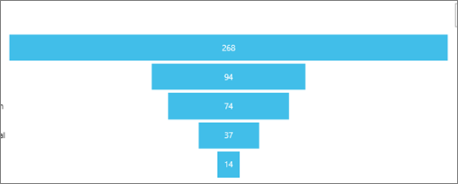
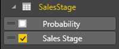
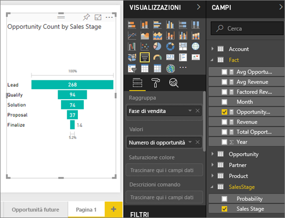
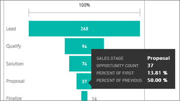
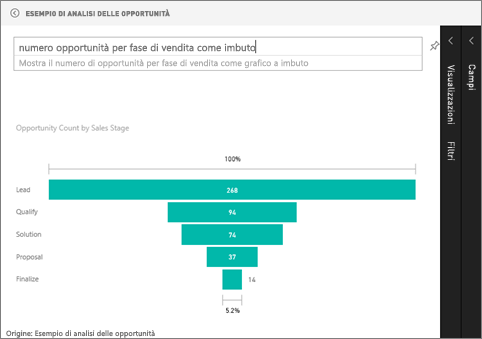

# Grafici a imbuto
Un grafico a imbuto consente di visualizzare un processo lineare caratterizzato da fasi connesse in sequenza, ad esempio un imbuto di vendita che tiene traccia dei clienti nelle fasi Lead \> Lead qualificato \> Cliente potenziale \> Contratto \> Chiusura.  La forma dell'imbuto indica a colpo d'occhio lo stato del processo di cui si sta tenendo traccia.

Ogni fase dell'imbuto rappresenta una percentuale del totale. Quindi, nella maggior parte dei casi un grafico a imbuto ha proprio la forma di un imbuto, con la prima fase nella parte più larga e ogni fase successiva più piccola rispetto alla precedente.  È utile anche un grafico a imbuto a forma di pera, che consente di identificare un problema nel processo.  Generalmente, la prima fase, ovvero la fase di "imbocco" è la più grande.

## Quando usare un grafico a imbuto
I grafici a imbuto rappresentano un'ottima scelta nelle seguenti situazioni:

* quando i dati sono in sequenza e attraversano almeno 4 fasi.
* quando è previsto che il numero di "elementi" nella prima fase sia maggiore rispetto al numero nella fasi finale.
* per calcolare una potenzialità, ad esempio fatturato/vendite/trattative e così via, per fasi.
* per calcolare tassi di conversione e conservazione e tenerne traccia.
* per individuare colli di bottiglia in un processo lineare.
* per tenere traccia del flusso di lavoro di un carrello.
* per tenere traccia dello stato di avanzamento e del successo delle campagne di marketing/pubblicità click-through.

## Uso dei grafici a imbuto
Grafici a imbuto:

* Possono essere aggiunti dai report e da Domande e risposte.
* Possono essere ordinati.
* Supportano i multipli.
* Possono essere evidenziati e filtrati in modo incrociato da altre visualizzazioni nella stessa pagina del report.
* Possono essere usati per evidenziare e filtrare in modo incrociato altre visualizzazioni nella stessa pagina del report.

## Creare un grafico a imbuto di base
Questo video mostra come creare un grafico a imbuto usando l’esempio di analisi di vendite e marketing.

<iframe width="560" height="315" src="https://www.youtube.com/embed/qKRZPBnaUXM" frameborder="0" allow="autoplay; encrypted-media" allowfullscreen></iframe>

Creare ora un grafico a imbuto che mostri il numero di opportunità presenti nelle fasi di vendita.

Per queste istruzioni si usa l'esempio di analisi delle opportunità. Per seguire le istruzioni, [scaricare l'esempio](sample-datasets.md) per il servizio Power BI (app.powerbi.com) o Power BI Desktop.   

1. Iniziare in una [pagina di report vuota ](power-bi-report-add-page.md) e selezionare il campo **SalesStage** \> **Sales Stage**. Se si usa il servizio Power BI, assicurarsi di aprire il report nella [Visualizzazione di modifica](service-interact-with-a-report-in-editing-view.md).
   
    
2. [Convertire il grafico](power-bi-report-change-visualization-type.md) in un imbuto. Si noti che **Fase vendite** è anche nel **gruppo** . 
3. Dal riquadro **Campi**, selezionare **Fact** \> **Opportunity Count**.
   
    
4. Quando si passa il puntatore del mouse su una barra, vengono visualizzate molte informazioni.
   
   * Il nome della fase
   * Il numero di opportunità attualmente presenti nella fase
   * Il tasso di conversione complessivo (% di lead) 
   * Il tasso di avanzamento da fase a fase, che corrisponde alla percentuale rispetto alla fase precedente (in questo caso fase di proposta/fase della soluzione)
     
     
5. [Aggiungere il grafico a imbuto come riquadro del dashboard](service-dashboard-tiles.md). 
6. [Salvare il report](service-report-save.md).

## Evidenziazione e filtro incrociato
Per informazioni sull'uso del riquadro Filtri, vedere [Aggiungere un filtro a un report](power-bi-report-add-filter.md).

Evidenziando una barra in un grafico a imbuto viene applicato il filtro incrociato nelle altre visualizzazioni della pagina del report e viceversa. Proseguire aggiungendo altri oggetti visivi alla pagina del report che contiene il grafico a imbuto.

1. Nel grafico a imbuto selezionare la barra **Proposta**. per evidenziare in modo incrociato le altre visualizzazioni nella pagina. Per selezionare più elementi, premere CTRL.
   
   
2. Per impostare le preferenze di evidenziazione incrociata e filtro incrociato degli oggetti visivi, vedere [Interazioni con oggetti visivi in Power BI](service-reports-visual-interactions.md).

## Creare un grafico a imbuto in Domande e risposte
Aprire il dashboard dell'Esempio di analisi delle opportunità o qualsiasi altro dashboard a cui è stata aggiunta almeno una visualizzazione dal set di dati dell'Esempio di analisi delle opportunità.  Quando si digita una domanda in Domande e risposte, Power BI cercare le risposte in tutti i set di dati associati (o con riquadri aggiunti) al dashboard selezionato. Per altre informazioni, vedere [Power BI - Concetti di base](service-basic-concepts.md).

1. Nel dashboard dell'Esempio di analisi delle opportunità iniziare a digitare la domanda nella casella Domande e risposte.
   
   
   
2. Aggiungere "come imbuto" per indicare a Power BI quale tipo di visualizzazione si preferisce.

## Passaggi successivi
[Tipi di visualizzazione in Power BI](power-bi-visualization-types-for-reports-and-q-and-a.md)

[Aggiungere una visualizzazione a un dashboard](service-dashboard-pin-tile-from-report.md)

[Power BI - Concetti di base](service-basic-concepts.md)

Altre domande? [Provare la community di Power BI](http://community.powerbi.com/)

