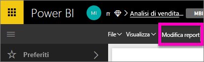
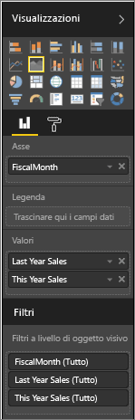
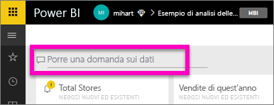
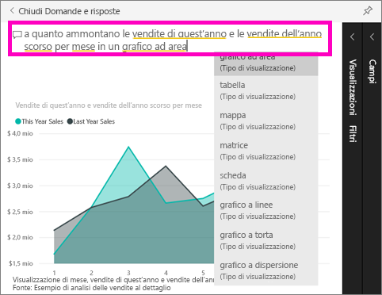

# Introduzione a Domande e risposte di Power BI (esercitazione)
## Esercitazione: Usare Domande e risposte di Power BI con l'esempio di analisi delle vendite al dettaglio
A volte il modo più rapido per ottenere una risposta dai dati consiste nel porre una domanda usando il linguaggio naturale.  In questa esercitazione si esamineranno 2 modi diversi per creare la stessa visualizzazione, ovvero creandola in un report e ponendo una domanda con Domande e risposte.  

## Metodo 1: uso dell'editor di report
1. Nell'area di lavoro di Power BI selezionare **Recupera dati** \> **Esempi** \> **Esempio di analisi delle vendite al dettaglio** > **Connetti**.
   
    
2. Il dashboard contiene un riquadro con un grafico ad aree per le vendite dell'anno precedente e le vendite per l'anno in corso.  Selezionare questo riquadro. 
   
   * Se il riquadro è stato creato con Domande e risposte, verrà aperto in Domande e risposte. 
   * In questo caso, invece, siccome il riquadro è stato creato in un report, viene aperto il report e viene visualizzata la pagina che contiene la visualizzazione.
3. Aprire il report in Visualizzazione di modifica selezionando **Modifica report**.  Se non si è proprietari di un report, non sarà possibile aprire il report in Visualizzazione di modifica.
   
    
4. Selezionare il grafico ad aree ed esaminare le impostazioni nel riquadro **Campi**.  L'autore del report ha creato questo grafico selezionando questi 3 valori (**Time > FiscalMonth**, **Sales > This Year Sales**, **Sales > Last Year Sales**) e organizzandoli nelle aree **Asse** e **Valori**.
   
    

## Metodo 2: uso di domande e risposte
In che modo si potrebbe creare questo stesso grafico a linee mediante Domande e risposte?

1. Tornare al dashboard Esempio di analisi delle vendite al dettaglio.
2. Usando il linguaggio naturale, digitare una domanda simile alla seguente nella casella della domanda:
   
   **a quanto ammontano le vendite di quest'anno e le vendite dell'anno scorso per mese in un grafico ad area**
   
   Durante la digitazione di una domanda, Domande e risposte seleziona la visualizzazione più adatta per fornire una risposta. La visualizzazione cambia dinamicamente via via che si modifica la domanda. Domande e risposte consente anche di formulare una domanda con i suggerimenti, il completamento automatico e le correzioni ortografiche.
   
   Terminato l'inserimento della domanda, si ottiene lo stesso identico grafico presente nel report,  ma in modo molto più rapido.
   
   
3. Analogamente all'elaborazione dei report, in Domande e risposte si ha accesso ai riquadri Visualizzazioni, Filtri e Campi.  Aprire questi riquadri per esplorare e modificare ulteriormente l'oggetto visivo.
4. Per aggiungere il grafico al dashboard, selezionare l'icona della puntina .

## Passaggi successivi
[Che tipo di domande si possono porre in Domande e risposte?](service-q-and-a.md)

[Domande e risposte in Power BI](service-q-and-a.md)

[Usare correttamente i dati con Domande e risposte di Power BI](service-prepare-data-for-q-and-a.md)

[Preparazione di una cartella di lavoro per Domande e risposte](service-prepare-data-for-q-and-a.md)

Altre domande? [Provare la community di Power BI](http://community.powerbi.com/)

