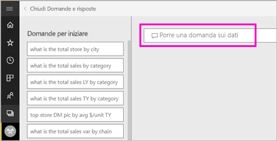
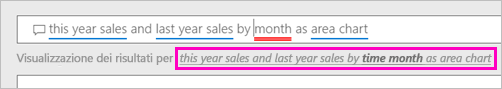
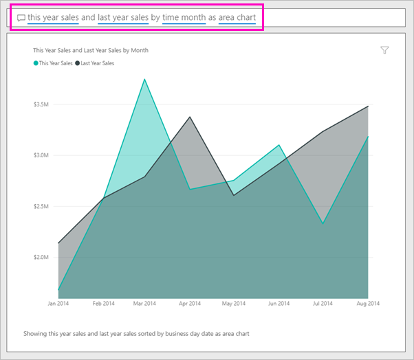

# Creare un oggetto visivo con Domande e risposte di Power BI

A volte il modo più rapido per ottenere una risposta dai dati consiste nel porre una domanda usando il linguaggio naturale.  In questo articolo verranno esaminati due modi diversi per creare la stessa visualizzazione, ovvero ponendo una domanda con Domande e risposte oppure creandola in un report. Per creare l'oggetto visivo nel report verrà usato il servizio Power BI, ma il processo per Power BI Desktop è quasi identico.

Per seguire la procedura serve un report che si possa modificare e quindi verrà usato uno degli esempi disponibili per Power BI.

## Creare un oggetto visivo con Domande e risposte

Ecco come fare per creare questo grafico a linee con Domande e risposte.

1. Nell'area di lavoro di Power BI selezionare **Recupera dati** \> **Esempi**  \> **Esempio di analisi delle vendite al dettaglio** > **Connetti**.

1. Aprire il dashboard dell'esempio di analisi delle vendite e posizionare il cursore nella casella **Porre una domanda sui dati** di Domande e risposte.

    

2. Nella casella di Domande e risposte digitare una domanda simile alla seguente:
   
    **this year sales and last year sales by month as area chart**
   
    Durante la digitazione di una domanda, Domande e risposte seleziona la visualizzazione più adatta per fornire una risposta. La visualizzazione cambia dinamicamente via via che si modifica la domanda. Domande e risposte consente anche di formulare una domanda con i suggerimenti, il completamento automatico e le correzioni ortografiche. Domande e risposte consiglia di riformulare leggermente il testo: "this year sales and last year sales by *time month* as area chart".  

    

4. Selezionare la frase per accettare il suggerimento. 
   
   Dopo aver digitato la domanda, si otterrà lo stesso identico grafico visualizzato nel dashboard.
   
   

4. Per aggiungere il grafico al dashboard, selezionare l'icona della puntina  nell'angolo in alto a destra.

## Creare un oggetto visivo nell'editor del report

1. Tornare al dashboard Esempio di analisi delle vendite al dettaglio.
   
2. Il dashboard contiene un riquadro con lo stesso grafico ad area relativo a "Last Year Sales and This Year Sales".  Selezionare questo riquadro. Non selezionare il riquadro creato con Domande e risposte. Se si seleziona questo riquadro, viene infatti aperto Domande e risposte. Dal momento, invece, che il riquadro del grafico ad area originale è stato creato in un report, viene aperto il report e viene visualizzata la pagina che contiene questa visualizzazione.

    

1. Aprire il report in Visualizzazione di modifica selezionando **Modifica report**.  Se non si è proprietari di un report, non sarà possibile aprire il report in Visualizzazione di modifica.
   
    
4. Selezionare il grafico ad aree ed esaminare le impostazioni nel riquadro **Campi**.  L'autore del report ha creato questo grafico selezionando questi tre valori (**Last Year Sales** e **This Year Sales > Value** della tabella **Sales** e **FiscalMonth** della tabella **Time**) e organizzandoli nelle aree **Asse** e **Valori**.
   
    

    Si noterà che l'oggetto visivo ottenuto è lo stesso. Crearlo in questo modo non è stato troppo complicato, ma crearlo con Domande e risposte è stato decisamente più semplice.

## Passaggi successivi

- [Usare Domande e risposte in dashboard e report](power-bi-tutorial-q-and-a.md)  
- [Domande e risposte per i consumer](consumer/end-user-q-and-a.md)
- [Usare correttamente i dati con Domande e risposte di Power BI](service-prepare-data-for-q-and-a.md)

Altre domande? [Provare la community di Power BI](https://community.powerbi.com/)

