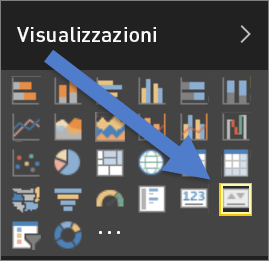
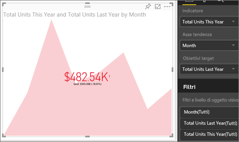

# Oggetti visivi degli indicatori KPI
Un indicatore di prestazioni chiave (KPI) è un segnale visivo che comunica lo stato di avanzamento verso un obiettivo misurabile. Per altre informazioni sugli indicatori KPI, vedere [Microsoft Developer Network](https://msdn.microsoft.com/library/hh272050).

## Quando usare un indicatore KPI
Gli indicatori KPI rappresentano un'ottima scelta nelle seguenti situazioni:

* per misurare lo stato di avanzamento, in modo da stabilire se si è avanti o indietro
* per misurare la distanza da un obiettivo, e stabilire quindi quanto manca alla fine   

## Requisiti per la visualizzazione degli indicatori KPI
Un indicatore di prestazioni chiave (KPI) si basa su una misura specifica e consente di valutare il valore corrente e lo stato di una metrica rispetto a un target definito. Pertanto, gli indicatori KPI richiedono una misura *di base* che restituisca un valore e una misura o un valore *di destinazione*, una soglia o un obiettivo.

> [!NOTE]
> Attualmente, i set di dati degli indicatori KPI devono contenere valori obiettivo per i KPI. Se il set di dati non ne contiene uno, è possibile creare obiettivi aggiungendo un foglio di Excel con obiettivi al modello di dati o al file PBIX.
> 
> 

## Come creare un indicatore KPI
Per seguire la procedura, accedere al servizio Power BI e selezionare **Recupera dati > Esempi > Esempio di analisi delle vendite al dettaglio**. Verrà creato un indicatore KPI che misura lo stato di avanzamento verso un obiettivo di vendita.

In alternativa, il video seguente mostra come creare singoli oggetti visivi di metrica: misuratori, schede e indicatori KPI.

<iframe width="560" height="315" src="https://www.youtube.com/embed/xmja6EpqaO0?list=PL1N57mwBHtN0JFoKSR0n-tBkUJHeMP2cP" frameborder="0" allowfullscreen></iframe>

1. Aprire il report in [Visualizzazione di modifica](service-reading-view-and-editing-view.md) e [aggiungere una nuova pagina](power-bi-report-add-page.md).    
2. Selezionare **Sales > Total Units This Year**.  Questo sarà l'indicatore.
3. Aggiungere **Time > Month**.  Questi rappresenteranno la tendenza.
4. IMPORTANTE: ordinare il grafico in base a **Month**. Dopo la conversione della visualizzazione in un indicatore KPI, non sono disponibili opzioni di ordinamento.

    
5. Convertire l'oggetto visivo in un indicatore KPI selezionando l'icona dell'indicatore KPI nel riquadro di visualizzazione.
   
    
6. Aggiungere un obiettivo. Aggiungere le vendite dell'ultimo anno come obiettivo. Trascinare **Total Units Last Year** nel campo **Obiettivi target**.
   
    
7. È facoltativamente possibile formattare l'indicatore KPI selezionando l'icona del rullo per aprire il riquadro formattazione.
   
   * **Indicatore**: controlla l'unità di visualizzazione dell'indicatore e i decimali.
   * **Asse tendenza**: se impostato su **On**, l'asse di tendenza viene visualizzato come sfondo dell'oggetto visivo degli indicatori KPI.  
   * **Obiettivi**: se impostato su **On**, l'oggetto visivo visualizza l'obiettivo e la distanza dall'obiettivo in percentuale.
   * **Codifica a colori > Direzione**: alcuni indicatori KPI sono considerati *migliori* per i valori superiori, altri sono considerati *migliori* per i valori più bassi. Ad esempio, gli utili piuttosto che i tempi di attesa. In genere un valore di utili più elevato è migliore rispetto a un valore maggiore del tempo di attesa. Selezionare **un valore elevato è migliore** e facoltativamente modificare le impostazioni dei colori.

1. Quando si dispone dell'indicatore KPI così come lo si desidera, [aggiungerlo a un dashboard](service-dashboard-pin-tile-from-report.md).

Gli indicatori KPI sono disponibili anche nei dispositivi mobili, in modo che sia possibile essere sempre connessi al cuore della propria attività.

## Considerazioni e risoluzione dei problemi
* Se l'indicatore KPI non è simile al precedente, è possibile che sia necessario ordinare in base al mese. Poiché gli indicatori KPI non includono alcuna opzione di ordinamento, sarà necessario ordinare in base al mese *prima* di convertire la visualizzazione in un indicatore KPI.

## Passaggi successivi

[Visualizzazioni nei report di Power BI](power-bi-report-visualizations.md)

Altre domande? [Provare la community di Power BI](http://community.powerbi.com/)

