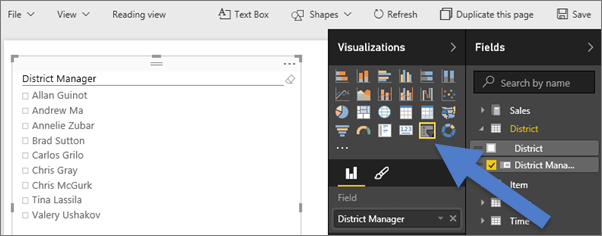
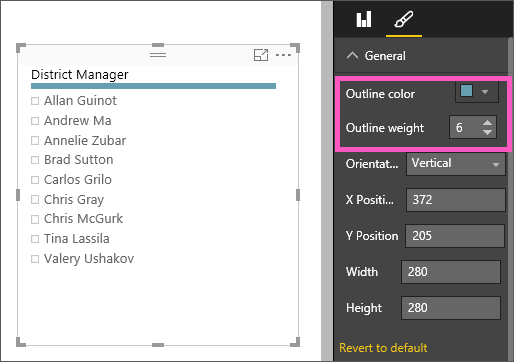
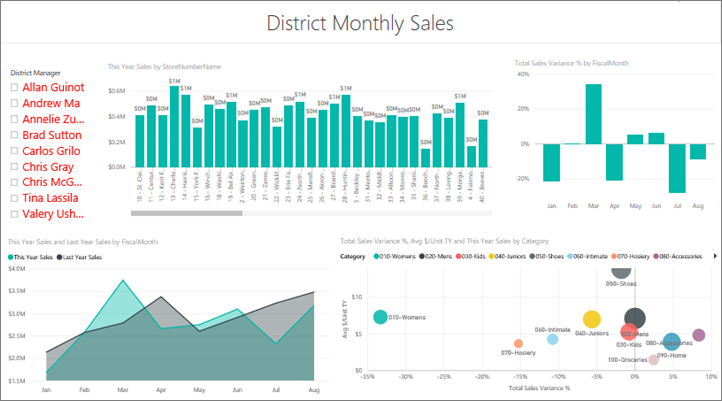
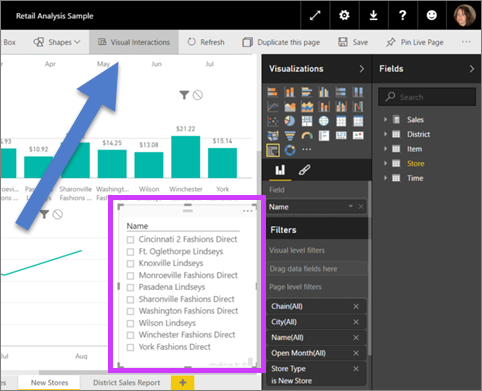

# Filtri dei dati nel servizio Power BI (esercitazione)
La Vicepresidente del reparto vendite vuole poter esaminare una serie di metriche per l'intera divisione e per ogni singolo direttore di zona. A tale scopo, potrebbe creare una pagina del report separata per ogni direttore oppure potrebbe usare un filtro dei dati. Un filtro dei dati riduce la quantità di set di dati visualizzati in altre visualizzazioni all'interno della pagina.  I filtri dei dati rappresentano una modalità alternativa di filtro.

## Quando usare un filtro dei dati
I filtri dei dati rappresentano la scelta ideale nelle situazioni seguenti.

* Per visualizzare filtri importanti o di uso comune nell'area di disegno in modo da facilitare l'accesso.
* Per facilitare la visualizzazione dello stato filtrato corrente senza dover aprire un elenco a discesa per trovare i dettagli di filtro.
* Quando si vogliono nascondere le colonne non necessarie, ma si vuole continuare a poterle usare per operazioni di filtro, in modo da avere tabelle più delimitate e pulite.
* Per creare report più mirati, dal momento che i filtri dei dati sono oggetti variabili che è possibile inserire accanto alla parte interessante del report su cui si vuole far concentrare gli utenti.

## Creare un filtro dei dati
<iframe width="560" height="315" src="https://www.youtube.com/embed/zIZPA0UrJyA" frameborder="0" allowfullscreen></iframe>

1. Aprire l'[esempio di analisi delle vendite al dettaglio](sample-retail-analysis.md) in [Visualizzazione di modifica](service-interact-with-a-report-in-editing-view.md) e [aggiungere una nuova pagina di report](power-bi-report-add-page.md).
2. Selezionare **District > District Manager** dal riquadro Campi.
   
    
3. Convertire la visualizzazione in un filtro dei dati. Selezionare l'icona del filtro dei dati nel riquadro Visualizzazioni.
   
    

## Formattare il filtro dei dati
1. Con il filtri dei dati selezionato nel riquadro Visualizzazioni selezionare l'icona del rullo  per visualizzare le opzioni di formattazione.
2. Selezionare **Generale > Colore bordo**, quindi scegliere blu scuro e **6** per lo **spessore**.
   
    
3. In **Comandi di selezione**per impostazione predefinita **Seleziona tutto** è **Disattivato** e **Selezione singola** è **Attivato**. Ciò significa che devo usare il tasto CTRL per selezionare uno o più nomi alla volta. Selezionare **Attivato** per **Seleziona tutto** e **Disattivato** per **Selezione singola**.
   
    
   
   * Si noti che il filtro dei dati ora presenta un'opzione **Seleziona tutto** nella parte superiore dell'elenco. Attivare/Disattivare **Seleziona tutto** per selezionare tutti i nomi o per non selezionarne nessuno.
   * È ora possibile selezionare più nomi senza dover usare il tasto CTRL.
4. In **Elementi**impostare la dimensione del testo su 14pt.  Si vuole essere sicuri che i colleghi notino il filtro dei dati.
5. Infine, impostare **Colore carattere** su un rosso scuro.  In tal modo sarà possibile distinguere i nomi selezionati da quelli non selezionati nel nostro filtro dei dati.
   
    
6. Fare pratica esplorando le altre opzioni disponibili per i filtri dei dati.

## Usare il filtro dei dati in un report
1. Aggiungere alcune visualizzazioni alla pagina del report o aprire il [report dell'esempio di analisi delle vendite al dettaglio](sample-retail-analysis.md) e selezionare la scheda **District Monthly Sales**.
   
    
2. Filtrare i dati nella pagina del report in base a Carlos. Si noti come le altre visualizzazioni vengono aggiornate per riflettere queste selezioni.
   
    
3. Ordinare il filtro dei dati in ordine alfabetico in base al cognome del direttore di zona.  Selezionare i puntini di sospensione (...) nell'angolo in alto a destra del filtro dei dati e scegliere **Direttore di zona**.
   
    
   
    

## Controllare l'effetto del filtro dei dati sugli altri oggetti visivi nella pagina
Si vuole applicare il filtro dei dati per filtrare solo alcuni degli oggetti visivi nella pagina del report?  Usare il controllo **Interazioni con oggetti visivi** a questo scopo.

**Nota**: se non viene visualizzata l'opzione **Interazioni con oggetti visivi**, cercare l'icona corrispondente . Se non è presente neanche l'icona, verificare che sia attiva la [Visualizzazione di modifica](service-reading-view-and-editing-view.md) del report.

1. Selezionare il filtro dei dati per attivarlo e, dalla barra del menu, scegliere **Interazioni con oggetti visivi**.
   
    
2. I controlli del filtro verranno visualizzati sopra tutti gli altri elementi visivi della pagina. Se il filtro dei dati deve filtrare un oggetto visivo, selezionare l'icona **Filtro**.  Se il filtro dei dati non deve avere alcun effetto sull'oggetto visivo, selezionare l'icona **Nessuno**.
   
    

Per altre informazioni, vedere [Interazioni tra le visualizzazioni in un report di Power BI](service-reports-visual-interactions.md).

## Considerazioni e risoluzione dei problemi relativi ai filtri dei dati in Power BI
Esistono alcune limitazioni per l'uso dei filtri di dati in Power BI, che sono le seguenti:

1. I filtri dei dati non supportano i campi di input.
2. Un singolo filtro dei dati non può essere usato in un intero report. Un filtro dei dati influisce solo sulla pagina corrente.
3. I filtri dei dati non possono essere aggiunti a un dashboard.
4. Il drill-down non è supportato per i filtri dei dati.    
5. I filtri dei dati non supportano i filtri a livello di oggetto visivo.

Idee su come migliorare Power BI? [Inviare un'idea](https://ideas.powerbi.com/forums/265200-power-bi-ideas).

## Passaggi successivi
 [Aggiungere una visualizzazione a un report](power-bi-report-add-visualizations-i.md)

 [Tipi di visualizzazione in Power BI](power-bi-visualization-types-for-reports-and-q-and-a.md)

 [Power BI - Concetti di base](service-basic-concepts.md)

[Provalo gratuitamente](https://powerbi.com/)

Altre domande? [Provare la community di Power BI](http://community.powerbi.com/)

