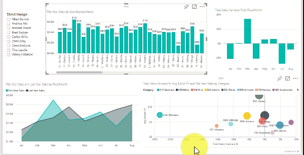

# Filtri dei dati in Power BI (esercitazione)
La VP vendite vuole poter esaminare una serie di metriche per l'intera divisione e per ogni singolo direttore di zona. A tale scopo, può creare un report separato per ogni direttore oppure usare un filtro dei dati. Un filtro dei dati riduce la quantità di set di dati visualizzati in altre visualizzazioni all'interno del report. I filtri dei dati rappresentano una modalità alternativa di filtro.

In questa esercitazione viene usato l'[Esempio di analisi delle vendite al dettaglio](sample-retail-analysis.md) disponibile gratuitamente che offre una procedura dettagliata per creare e formattare un filtro dei dati da usare per filtrare un report. Si noterà che vi sono molti modi per formattare e usare i filtri dei dati. 

## Quando usare un filtro dei dati
I filtri dei dati rappresentano un'ottima scelta quando si vuole eseguire quanto segue:

* Visualizzare filtri importanti o di uso comune nell'area di disegno del report in modo da facilitare l'accesso.
* Facilitare la visualizzazione dello stato filtrato corrente senza dover aprire un elenco a discesa. 
* Filtrare per colonne non necessarie e nascoste nelle tabelle di dati.
* Creare più report mirati inserendo i filtri dei dati in corrispondenza di oggetti visivi importanti.

I filtri dei dati di Power BI presentano le limitazioni seguenti:

- I filtri dei dati non supportano i campi di input.
- I filtri dei dati non possono essere aggiunti a un dashboard.
- Il drill-down non è supportato per i filtri dei dati.
- I filtri dei dati non supportano i filtri a livello di oggetto visivo.

## Creare un filtro dei dati

In questa esercitazione viene usato un filtro dei dati di elenco. I tipi di dati data e ora possono avere filtri dei dati di intervallo. Vedere [Usare il filtro dei dati di intervallo numerico in Power BI Desktop](desktop-slicer-numeric-range.md) o il video seguente per altre informazioni sulla creazione e l'uso di filtri dei dati di intervallo.
<iframe width="560" height="315" src="https://www.youtube.com/embed/zIZPA0UrJyA" frameborder="0" allowfullscreen></iframe>

1. In Power BI Desktop o nel servizio Power BI aprire l'[Esempio di analisi delle vendite al dettaglio](sample-retail-analysis.md) nella [visualizzazione di modifica](service-interact-with-a-report-in-editing-view.md) e [aggiungere una nuova pagina di report](power-bi-report-add-page.md).
2. Dal riquadro Campi in Zona selezionare **District Manager** (direttore di zona) per creare una nuova visualizzazione.
    
    
    
3. Selezionare l'icona **Filtro dei dati**  nel riquadro Visualizzazioni per convertire la nuova visualizzazione in un filtro dei dati. 
    
    

È anche possibile selezionare l'icona del filtro dei dati per creare un nuovo filtro dei dati e quindi selezionare o trascinare un campo dati nella casella dei campi per compilarlo.

>[!TIP]
>È possibile ordinare gli elementi del filtro dei dati di elenco per valori dati. Per ordinare gli elementi del filtro dei dati in ordine alfabetico inverso, selezionare i puntini di sospensione (...) nell'angolo superiore destro del filtro dei dati e scegliere **Sort by District Manager** (Ordina per direttore di zona). Per impostazione predefinita, l'ordine alfabetico è in ordine crescente, ma è possibile passare alternativamente dall'ordine crescente a quello decrescente. 

## Formattare il filtro dei dati
Applicare la formattazione visiva al filtro dei dati District Manager.
1. Una volta selezionato il filtro dei dati, nel riquadro Visualizzazioni selezionare l'icona Formatta  per visualizzare i controlli di formattazione. 
    
    
    
2. Fare clic sulla freccia a discesa accanto a ogni categoria per visualizzare e modificare le opzioni. 

### Opzioni generali
1. Selezionare il rosso in **Colore bordo** e modificare **Spessore bordo** impostandolo su "2". In questo modo vengono impostati il colore e lo spessore dei bordi e delle sottolineature degli elementi e delle intestazioni, se abilitati. 
2. In Orientamento l'impostazione predefinita è Verticale. In questo modo viene creato un filtro dei dati di elenco verticale con le caselle di selezione prima degli elementi. Selezionare **Orizzontale** per produrre un filtro dei dati con elementi disposti orizzontalmente. L'orientamento orizzontale può produrre varie disposizioni di testo, pulsanti o riquadri, a seconda della dimensione del filtro dei dati e della formattazione di elementi e forme. 
    
    
    
3. Attivare il layout **Reattivo**, che modifica le dimensioni e la disposizione degli elementi del filtro dei dati orizzontali in modo che corrisponda alle dimensioni e alla forma del filtro dei dati. In dimensioni molto piccole, il filtro dei dati diventa un'icona di filtro. 
    
    
    
    >[!NOTE]
    >Le modifiche del layout reattivo possono sostituire formattazioni specifiche di intestazioni o elementi impostate precedentemente. 
    
4. Impostare le dimensioni e la posizione del filtro dei dati con precisione numerica in **Posizione X**, **Posizione Y**, **Larghezza**, e **Altezza** o spostare e ridimensionare il filtro dei dati direttamente nell'area di disegno, per produrre dimensioni e disposizioni diverse degli elementi, come ad esempio una riga orizzontale di pulsanti. 

    

Vedere [Creare un filtro dei dati reattivo e ridimensionabile in Power BI](power-bi-slicer-filter-responsive.md) per altre informazioni sull'orientamento orizzontale e la formattazione reattiva.

### Opzioni di Comandi di selezione
1. L'opzione Show Select All (Mostra Seleziona tutto) è disattivata per impostazione predefinita. Impostarla su **On** per aggiungere un elemento Seleziona tutto per selezionare o deselezionare tutti gli elementi. Quando sono stati selezionati tutti gli elementi, fare clic su un elemento per deselezionarlo, consentendo un filtro di tipo "is-not". 
    
    
    
2. L'opzione Selezione singola è attivata per impostazione predefinita. Per selezionare ogni singolo elemento è necessario fare clic sull'elemento stesso, mentre tenendo premuto CTRL mentre si fa clic è possibile selezionare più elementi. Impostare Selezione singola su **Off** per consentire la selezione di più elementi senza tenere premuto CTRL. Fare clic nuovamente su un elemento per deselezionarlo. 

### Opzioni delle intestazioni
L'intestazione è attivata per impostazione predefinita e visualizza il nome del campo dati nella parte superiore del filtro dei dati. 
1. Formattare il testo dell'intestazione per rendere il **Colore carattere** rosso, le **Dimensioni testo** pari a 14 pt, e la **Famiglia di caratteri** Arial Black. 
2. In Bordo scegliere **Solo inferiore** per produrre un carattere di sottolineatura con le dimensioni e il colore impostati nelle opzioni generali. 

### Opzioni degli elementi
1. Formattare il testo e lo sfondo degli elementi in modo che il **Colore carattere** sia nero, lo **Sfondo** rosso chiaro, le **Dimensioni testo** pari a 10 pt e la **Famiglia di caratteri** Arial. 
2. In Bordo scegliere **Frame** per disegnare un bordo intorno a ogni elemento con le dimensioni e il colore impostati nelle opzioni generali. 
    
    
    
    >[!TIP]
    >- Con l'orientamento orizzontale, gli elementi deselezionati vengono visualizzati con i colori del testo e dello sfondo selezionati, mentre gli elementi selezionati usano l'impostazione predefinita, in genere sfondi neri con testo bianco. 
    >- Con l'orientamento verticale, gli elementi vengono visualizzati sempre con i colori impostati e le caselle di selezione sono sempre nere quando vengono selezionate. 

### Altre opzioni di formattazione
Le altre opzioni di formattazione sono disattivate per impostazione predefinita. Quando vengono impostate su **On**: 
- **Titolo:** consente di aggiungere e formattare un titolo, in aggiunta e oltre all'intestazione, nella parte superiore del filtro dei dati. 
- **Sfondo:** consente di aggiungere un colore di sfondo per tutto il filtro dei dati e ne imposta la trasparenza.
- **Bloccare proporzioni:** mantiene la forma del filtro dei dati se viene ridimensionato.
- **Bordo:** consente di aggiungere un bordo di 1 pixel intorno al filtro dei dati e ne imposta il colore. Il bordo del filtro dei dati è indipendente dall'impostazione Bordo nelle impostazioni generali e non ne viene influenzato. 

## Eseguire la sincronizzazione e usare il filtro dei dati in altre pagine
A partire dall'aggiornamento di febbraio 2018 di Power BI, è possibile sincronizzare un filtro dei dati e usarlo in una pagina qualsiasi o in tutte le pagine di un report. 
1. Con il filtro dei dati District Manager selezionato, dal menu Visualizza selezionare **Sincronizza filtri dei dati** in Power BI Desktop oppure attivare **Riquadro Sincronizza filtri dei dati** nel servizio Power BI. Viene visualizzato il riquadro Sincronizza filtri dei dati. 
    
    
    
2. Nella prima colonna selezionare **Panoramica** e tutte le altre pagine con cui si vuole sincronizzare il filtro dei dati oppure fare clic su **Aggiungi a tutti** per eseguire la sincronizzazione del filtro dei dati con tutte le pagine del report.  
3. Nella colonna successiva selezionare **Panoramica** e tutte le altre pagine in cui si vuole che il filtro dei dati venga visualizzato. 
4. Passare alla pagina **Panoramica** e verificare la presenza del filtro dei dati e i relativi effetti su altri oggetti visivi della pagina. 
    - Eseguire e rimuovere varie selezioni di elementi e verificare come gli altri oggetti visivi della pagina cambiano di conseguenza. La selezione di elementi in una pagina si riflette in tutte le pagine sincronizzate.
    - Modificare dimensioni, forma, posizione e/o formattazione del filtro dei dati nella pagina Panoramica. La formattazione del filtro dei dati nelle altre pagine sincronizzate non cambia. 

### Controllare su quali oggetti visivi della pagina ha effetto il filtro dei dati
Per impostazione predefinita, il filtro dei dati in una pagina del report influisce su tutte le altre visualizzazioni nella pagina. Usare **Interazioni oggetti visivi** per impedire che il filtro dei dati influisca su alcune visualizzazioni.

1. Nella pagina **Panoramica** con il filtro dei dati selezionato:
    - In Power BI Desktop fare clic sul menu Formatta in Strumenti visivi e selezionare **Modifica interazioni**.
    - Nel servizio Power BI dalla barra dei menu selezionare **Interazioni oggetti visivi** e attivare **Modifica interazioni**. 
    
    I controlli del filtro vengono visualizzati sopra tutti gli altri oggetti visivi della pagina. 
    
2. Selezionare l'icona **Nessuno** sopra un oggetto visivo per arrestare l'applicazione del filtro dei dati per l'oggetto. Selezionare l'icona **Filtro** icona per riattivare l'applicazione del filtro dei dati. 

Per altre informazioni sulla modifica delle interazioni, vedere [Interazioni tra le visualizzazioni in un report di Power BI](service-reports-visual-interactions.md).

## Passaggi successivi
[Provalo gratuitamente](https://powerbi.com/)

Idee su come migliorare Power BI? [Inviare un'idea](https://ideas.powerbi.com/forums/265200-power-bi-ideas).

Altre domande? [Provare la community di Power BI](http://community.powerbi.com/)

[Aggiungere una visualizzazione a un report](power-bi-report-add-visualizations-i.md)

[Tipi di visualizzazione in Power BI](power-bi-visualization-types-for-reports-and-q-and-a.md)

[Power BI - Concetti di base](service-basic-concepts.md)

