# Tipi di visualizzazione in Power BI
## Visualizzazioni di Power BI
Verranno presto aggiunte nuove visualizzazioni.

Visitare [Microsoft AppSource](https://appsource.microsoft.com/marketplace/apps?product=power-bi-visuals), dove è possibile trovare un elenco costantemente aggiornato di [oggetti visivi personalizzati](power-bi-custom-visuals.md) da scaricare e usare nei propri dashboard e report. Approccio creativo [Informazioni su come creare oggetti visivi personalizzati e aggiungerli al sito della community](developer/office-store.md).  

## Elenco delle visualizzazioni disponibili in Power BI
Tutte queste visualizzazioni possono essere aggiunte ai report di Power BI, specificate in domande e risposte e aggiunte al dashboard.

### Grafici ad area: di base (su più livelli) e in pila
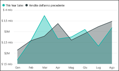

>[!TIP]
>Il grafico ad area di base si basa sul grafico a linee, in cui l'area compresa tra l'asse e la linea viene riempita.

Per altre informazioni, vedere [Esercitazione: Grafico ad aree di base](power-bi-visualization-basic-area-chart.md).

### Grafici a barre e istogrammi
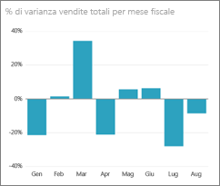 

 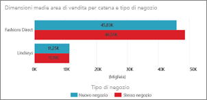

>[!TIP]
>I grafici a barre sono l'impostazione standard per esaminare un valore specifico in categorie diverse.

### Schede: con più righe

### Schede: con numero singolo
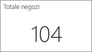

Per altre informazioni [Creare una scheda (riquadro per numeri elevati)](power-bi-visualization-card.md).

### Grafici combinati
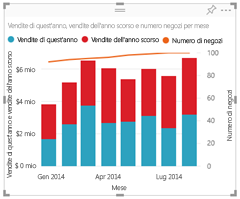

>[!TIP]
>Un grafico combinato combina un istogramma e un grafico a linee. Scegliere *Grafico a linee e istogramma a colonne in pila* o *Grafico a linee e istogramma a colonne raggruppate*.

Per altre informazioni, vedere [Esercitazione: Grafici combinati in Power BI](power-bi-visualization-combo-chart.md).

### Grafici ad anello
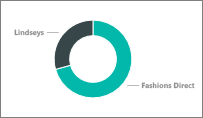

>[!TIP]
>I grafici ad anello sono simili ai grafici a torta.  Indicano la relazione delle parti a un intero.

Per altre informazioni, vedere [Esercitazione: Grafici ad anello in Power BI](power-bi-visualization-doughnut-charts.md).

### Grafici a imbuto
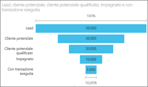

>[!TIP]
>I grafici a imbuto aiutano a visualizzare un processo caratterizzato da fasi e da un flusso sequenziale di elementi da una fase a quella successiva.  Usare un grafico a imbuto quando esiste un flusso sequenziale tra fasi, ad esempio un processo di vendita che inizia con i lead e termina con l'evasione dell'ordine di acquisto.

Per altre informazioni, vedere [Esercitazione: Grafici a imbuto in Power BI](power-bi-visualization-funnel-charts.md).

### Grafici di misuratore
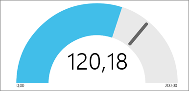

>[!TIP]
>Visualizza lo stato corrente nel contesto di un obiettivo.

Per altre informazioni, vedere [Esercitazione: Grafici a misuratore in Power BI](power-bi-visualization-radial-gauge-charts.md).

### KPI
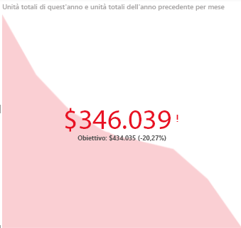

>[!TIP]
>Visualizza lo stato di avanzamento verso un obiettivo misurabile.

Per altre informazioni, vedere l'esercitazione [Indicatori KPI in Power BI](power-bi-visualization-kpi.md).

### Grafici a linee
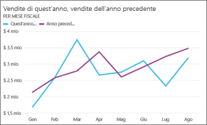

>[!TIP]
>Evidenziano la forma complessiva di un'intera serie di valori, in genere nel tempo.

### Mappe: mappe di base
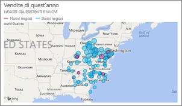

>[!TIP]
>Vengono usate per associare informazioni categoriche e quantitative a posizioni nello spazio.

Per altre informazioni, vedere l'articolo relativo a [suggerimenti e consigli per le visualizzazioni mappa](power-bi-map-tips-and-tricks.md).

### Mappe: mappe di ArcGIS
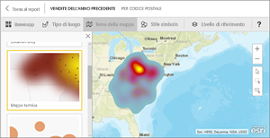

Per altre informazioni, vedere [Esercitazione: Mappe ArcGIS in Power BI](power-bi-visualization-arcgis.md).

### Mappe: mappe colorate (Choropleth)
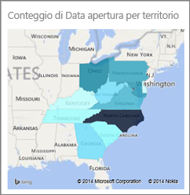

>[!TIP]
>Più intenso è il colore, maggiore è il valore.

Per altre informazioni, vedere [Esercitazione: Mappe colorate in Power BI](power-bi-visualization-filled-maps-choropleths.md).

### Matrice
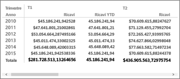

### Grafici a torta
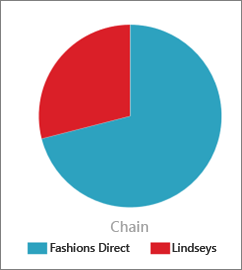

### Grafici a dispersione e a bolle
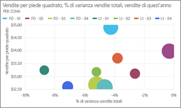

>[!TIP]
>Visualizzare le relazioni tra 2 (a dispersione) o 3 (bolla) misure quantitative, come si verificano, in quale ordine e così via.

Per altre informazioni, vedere [Esercitazione: Grafici a dispersione in Power BI](power-bi-visualization-scatter.md).

### Filtri dei dati
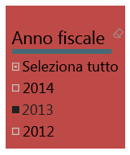

Per altre informazioni, vedere [Esercitazione: Filtri dei dati in Power BI](power-bi-visualization-slicers.md).

### Immagini autonome

Per altre informazioni, vedere [Aggiungere un widget di immagine a un dashboard](service-dashboard-add-widget.md).

### Tabelle
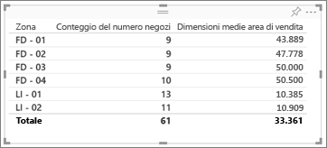

>[!TIP]
>Funzionano correttamente con confronti quantitativi tra elementi in cui sono presenti molte categorie.

Per altre informazioni, vedere [Utilizzare le tabelle in Power BI](power-bi-visualization-tables.md).

### Mappe ad albero
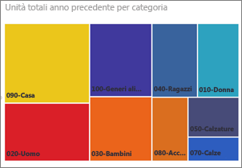

Per altre informazioni, vedere [Esercitazione: Mappe ad albero in Power BI](power-bi-visualization-treemaps.md).

>[!TIP]
>Sono grafici di rettangoli colorati, con dimensione che rappresenta valore.  Possono essere gerarchici, con rettangoli nidificati all'interno di rettangoli principali.

### Grafici a cascata

>[!TIP]
>I grafici a cascata mostrano il totale aggiornato ogni volta che si aggiungono o sottraggono valori.

Per altre informazioni, vedere [Esercitazione: Grafici a cascata in Power BI](power-bi-visualization-waterfall-charts.md).

## Indicare a Domande e risposte quali visualizzazioni usare 
Quando si digitano query in linguaggio naturale con le Domande e risposte di Power BI, è possibile specificare il tipo di visualizzazione;  ad esempio:

“***sales by state as a treemap***“

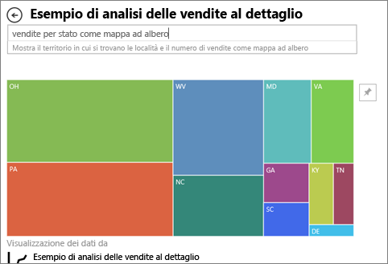

## Passaggi successivi
[Visualizzazioni nei report di Power BI](power-bi-report-visualizations.md)    
[Riferimento all'oggetto visivo a destra da sqlbi.com](http://www.sqlbi.com/wp-content/uploads/videotrainings/dashboarddesign/visuals-reference-may2017-A3.pdf)

[Report in Power BI](service-reports.md)

[Power BI - Concetti di base](service-basic-concepts.md)

Altre domande? [Provare la community di Power BI](http://community.powerbi.com/)

