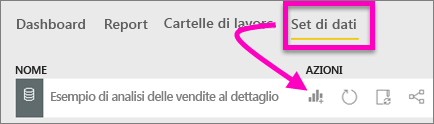
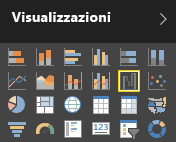
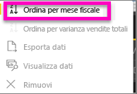
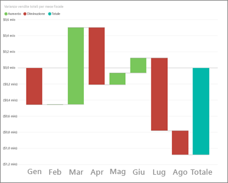
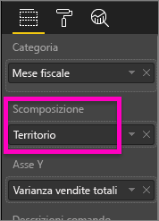
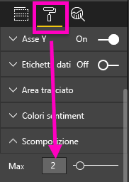
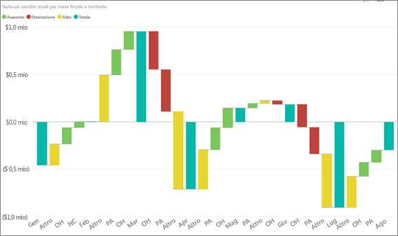

# Grafici a cascata in Power BI (esercitazione)
Un grafico a cascata mostra il totale aggiornato ogni volta che si aggiungono o si sottraggono valori. È utile per comprendere in che modo un valore iniziale (ad esempio, il reddito netto) è interessato da una serie di modifiche positive e negative.

Le colonne sono contraddistinte dal colore per poter vedere rapidamente gli aumenti e le diminuzioni. Le colonne del valore iniziale e del valore finale spesso [iniziano sull'asse orizzontale](https://support.office.com/article/Create-a-waterfall-chart-in-Office-2016-for-Windows-8de1ece4-ff21-4d37-acd7-546f5527f185#BKMK_Float "iniziano sull’asse orizzontale"), mentre i valori intermedi sono colonne mobili. In virtù di questo aspetto, i grafici a cascata sono spesso denominati grafici a ponte.

<iframe width="560" height="315" src="https://www.youtube.com/embed/maTzOJSRB3g?list=PL1N57mwBHtN0JFoKSR0n-tBkUJHeMP2cP" frameborder="0" allowfullscreen></iframe>

## Quando usare un grafico a cascata
I grafici a cascata rappresentano un'ottima scelta nelle seguenti situazioni:

* quando è necessario modificare la misura in serie temporali o categorie diverse;
* per controllare le principali modifiche che contribuiscono a determinare il valore totale;
* per rappresentare graficamente il profitto annuo di un'azienda mostrando le varie fonti di ricavi e calcolare il profitto (o la perdita) totale;
* per illustrare il numero di dipendenti iniziale e finale dell'azienda in un anno;
* per visualizzare la quantità di denaro incassata e spesa ogni mese e il saldo corrente per il proprio conto. 

## Creare un grafico a cascata
Verrà creato un grafico a cascata che visualizza la varianza delle vendite (confronto tra vendite stimate ed effettive) per mese. Per seguire la procedura, accedere a Power BI e selezionare **Recupera dati \> Esempi \> Esempio di analisi delle vendite al dettaglio**. 

1. Selezionare la scheda **Set di dati** e scorrere fino al nuovo set di dati "Esempio di analisi delle vendite al dettaglio".  Selezionare l'icona **Crea report** per aprire il set di dati in modalità di visualizzazione report. 
   
    
2. Dal riquadro **Campi** selezionare **Sales \> Total Sales Variance**. Se **Total Sales Variance** non è presente nell'area **Asse Y** , trascinarlo in quell'area.
3. Convertire il grafico in un **grafico a cascata**. 
   
    
4. Selezionare **Time** \> **FiscalMonth** per aggiungerlo all'area **Categoria**. 
   
    
5. Ordinare il grafico a cascata in ordine cronologico. Nell'angolo in alto a destra del grafico selezionare i puntini di sospensione (...) e scegliere **FiscalMonth**.
   
    
   
    
6. Approfondire ulteriormente per scoprire qual è il fattore che contribuisce maggiormente ai cambiamenti da un mese all'altro. Trascinare **Store** > **Territory** sul bucket **Breakdown**.
   
    
7. Per impostazione predefinita, Power BI aggiunge i primi 5 territori che contribuiscono agli aumenti o ai cali ogni mese, ma in questo caso servono solo i primi 2.  Nel riquadro di formattazione, selezionare **Breakdown** e impostare **Maximum** su 2.
   
    
   
    Una rapida analisi rivela che i territori di Ohio e Pennsylvania sono i maggiori contributori allo spostamento, negativo e positivo, nel grafico a cascata. 
   
    
8. È una scoperta interessante: Ohio e Pennsylvania hanno un notevole impatto perché le vendite in questi 2 territori sono molto più elevate rispetto agli altri territori?  Lo scopriremo ben presto. Creare una mappa che esamini le vendite per territorio.  
   
    
   
    La mappa supporta la teoria,  perché mostra che questi 2 territori hanno avuto il valore di vendite più alto lo scorso anno (dimensioni bolla) e quest'anno (ombreggiatura bolla).

## Evidenziazione e filtro incrociato
Per informazioni sull'uso del riquadro Filtri, vedere [Aggiungere un filtro a un report](power-bi-report-add-filter.md).

Evidenziando una colonna in un grafico a cascata viene applicato il filtro incrociato nelle altre visualizzazioni nella pagina del report e viceversa. Tuttavia, la colonna Totale non attiva l'evidenziazione e non risponde al filtro incrociato.

## Passaggi successivi
[Report in Power BI](service-reports.md)

[Tipi di visualizzazione in Power BI](power-bi-visualization-types-for-reports-and-q-and-a.md)

[Visualizzazioni nei report di Power BI](power-bi-report-visualizations.md)

[Power BI - Concetti di base](service-basic-concepts.md)

Altre domande? [Provare la community di Power BI](http://community.powerbi.com/)

